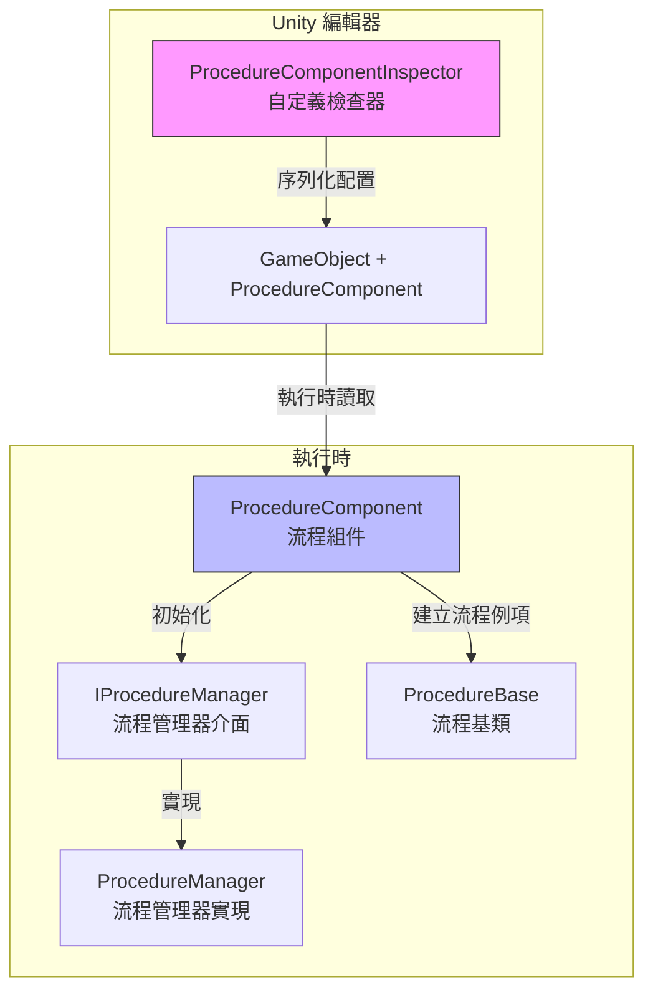
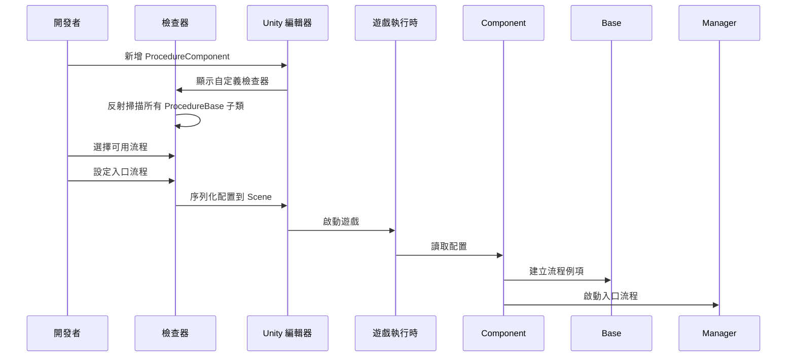

# 編輯器使用

本文件介紹如何在 Unity 編輯器中配置和使用 Procedure 流程管理組件。

## 概述

`ProcedureComponentInspector` 是 GameFrameX Procedure 流程管理系統的編輯器擴充套件，提供了視覺化的流程配置介面。透過該檢查器，開發者可以：

- 自動發現專案中所有繼承自 `ProcedureBase` 的流程類
- 視覺化選擇遊戲可用的流程
- 配置遊戲啟動時的入口流程
- 在執行時檢視當前執行的流程

## 架構



### 工作流程



## 在場景中新增流程組件

### 步驟 1：新增組件

在 Unity 場景中建立一個空物體或選擇現有物體，然後新增 `Procedure` 組件：

1. 在 Hierarchy 面板中選擇目標 GameObject
2. 在 Inspector 面板中點選 **Add Component** 按鈕
3. 搜尋 **Game Framework / Procedure** 並新增

> Source: [ProcedureComponent.cs](https://github.com/GameFrameX/com.gameframex.unity.procedure/blob/main/Runtime/Procedure/ProcedureComponent.cs#L20-L21)

```csharp
[DisallowMultipleComponent]
[AddComponentMenu("Game Framework/Procedure")]
public sealed class ProcedureComponent : GameFrameworkComponent
```

**注意：** 該組件使用了 `[DisallowMultipleComponent]` 屬性，意味著每個 GameObject 只能新增一個 `ProcedureComponent`。

### 步驟 2：配置組件

新增組件後，檢查器介面會自動顯示以下內容：

| 區域 | 說明 |
|------|------|
| **Available Procedures** | 列出所有可用的流程型別（自動發現） |
| **Entrance Procedure** | 設定遊戲啟動時的第一個流程 |

## 檢查器介面詳解

### 執行時資訊顯示

在遊戲執行時（Play 模式下），檢查器會額外顯示：

- **Current Procedure**: 當前正在執行的流程型別名稱

```csharp
if (EditorApplication.isPlaying)
{
    EditorGUILayout.LabelField("Current Procedure", t.CurrentProcedure == null ? "None" : t.CurrentProcedure.GetType().ToString());
}
```
> Source: [ProcedureComponentInspector.cs](https://github.com/GameFrameX/com.gameframex.unity.procedure/blob/main/Editor/Inspector/ProcedureComponentInspector.cs#L39-L42)

### 可用流程列表

檢查器會自動掃描所有繼承自 `ProcedureBase` 的型別：

```csharp
m_ProcedureTypeNames = Type.GetRuntimeTypeNames(typeof(ProcedureBase));
```
> Source: [ProcedureComponentInspector.cs](https://github.com/GameFrameX/com.gameframex.unity.procedure/blob/main/Editor/Inspector/ProcedureComponentInspector.cs#L121)

開發者可以透過核取方塊選擇需要包含在遊戲中的流程。

### 入口流程配置

入口流程是遊戲啟動時首先執行的流程，必須從已選擇的可用流程中選擇：

```csharp
int selectedIndex = EditorGUILayout.Popup("Entrance Procedure", m_EntranceProcedureIndex, m_CurrentAvailableProcedureTypeNames.ToArray());
```
> Source: [ProcedureComponentInspector.cs](https://github.com/GameFrameX/com.gameframex.unity.procedure/blob/main/Editor/Inspector/ProcedureComponentInspector.cs#L80)

## 配置示例

### 基本配置流程

1. **建立自定義流程類**

   首先，建立繼承自 `ProcedureBase` 的流程類：

   ```csharp
   public class ProcedureLaunch : ProcedureBase
   {
       protected override void OnEnter(IFsm<IProcedureManager> procedureOwner)
       {
           base.OnEnter(procedureOwner);
           // 初始化操作
       }

       protected override void OnUpdate(IFsm<IProcedureManager> procedureOwner, float elapseSeconds, float realElapseSeconds)
       {
           base.OnUpdate(procedureOwner, elapseSeconds, realElapseSeconds);
           // 切換到下一個流程
       }
   }
   ```

   > Source: [ProcedureBase.cs](https://github.com/GameFrameX/com.gameframex.unity.procedure/blob/main/Runtime/Procedure/ProcedureBase.cs#L16)

2. **在場景中配置 ProcedureComponent**

   - 新增 ProcedureComponent 到場景
   - 在檢查器中勾選 `ProcedureLaunch` 作為可用流程
   - 將 `ProcedureLaunch` 設定為入口流程

3. **執行遊戲**

   遊戲啟動後會自動執行 `ProcedureLaunch` 流程。

### 流程切換

在自定義流程中，可以使用 `IProcedureManager` 切換到其他流程：

```csharp
// 獲取流程管理器
var procedureManager = Owner.GetComponent<ProcedureComponent>().Procedure;

// 切換到下一個流程
procedureManager.StartProcedure<ProcedureMenu>();
```

## 組件屬性說明

| 屬性 | 型別 | 說明 |
|------|------|------|
| m_AvailableProcedureTypeNames | string[] | 可用的流程型別名稱陣列 |
| m_EntranceProcedureTypeName | string | 入口流程的型別名稱 |

> Source: [ProcedureComponent.cs](https://github.com/GameFrameX/com.gameframex.unity.procedure/blob/main/Runtime/Procedure/ProcedureComponent.cs#L27-L29)

## 常見問題

### 檢查器顯示"沒有可用流程"

**原因**：專案中沒有繼承自 `ProcedureBase` 的類

**解決方法**：確保已建立至少一個繼承自 `ProcedureBase` 的流程類，並且該類編譯無誤。

### 入口流程顯示無效

**原因**：入口流程未設定或設定的流程不在可用流程列表中

**解決方法**：在檢查器中先選擇可用流程，然後從下拉選單中選擇入口流程。

### 執行時不顯示當前流程

**原因**：遊戲未正確啟動或 ProcedureComponent 未正確初始化

**解決方法**：確保 ProcedureComponent 已新增到場景中，且在 Start() 方法中已正確初始化。

## 相關連結

- [外掛簡介](./1-overview.introduction)
- [功能特性](./1-overview.features)
- [安裝指南](./2-installation)
- [ProcedureComponent 核心概念](./3-core-concepts.procedure-component)
- [ProcedureBase 核心概念](./3-core-concepts.procedure-base)
- [IProcedureManager 核心概念](./3-core-concepts.iprocedure-manager)
- [ProcedureManager 核心概念](./3-core-concepts.procedure-manager)
- [自定義流程](./4-custom-procedures)
- [常見問題](./6-troubleshooting)
