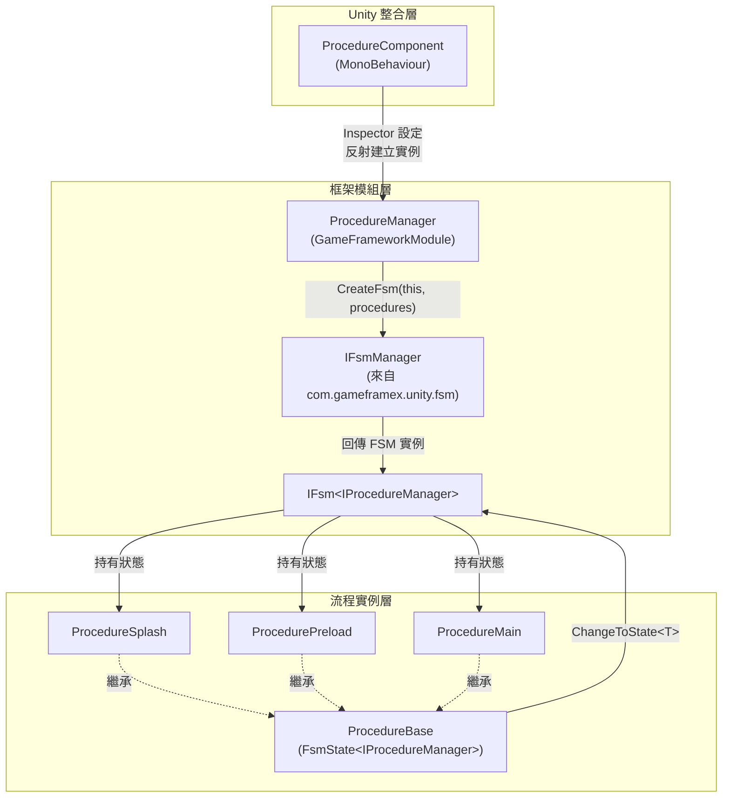

# 運作原理一覽

GameFrameX Procedure 是一個基於有限狀態機(FSM)的 Unity 遊戲流程管理套件。它透過可切換的「流程狀態」驅動遊戲生命週期各階段(啟動畫面、預載入、登入、主選單等)，並在每個階段提供完整的生命週期回呼。其底層依賴為 [com.gameframex.unity.fsm](https://github.com/GameFrameX/com.gameframex.unity.fsm);本套件僅負責將 FSM 封裝為「流程」語意，並整合進 GameFrameX 框架。

## 快速開始

一個最小可用的流程包含三個步驟：

1. **繼承 `ProcedureBase` 撰寫流程類別**，將業務邏輯放在生命週期回呼中。

   ```csharp
   using GameFrameX.Fsm.Runtime;
   using GameFrameX.Procedure.Runtime;

   public class ProcedurePreload : ProcedureBase
   {
       protected internal override void OnEnter(IFsm<IProcedureManager> procedureOwner)
       {
           // 載入資源、設定等
       }

       protected internal override void OnUpdate(IFsm<IProcedureManager> procedureOwner, float elapseSeconds, float realElapseSeconds)
       {
           // 檢查載入進度,完成後切換到下一個流程
           ChangeToState<ProcedureMain>(procedureOwner);
       }
   }

   public class ProcedureMain : ProcedureBase
   {
       protected internal override void OnEnter(IFsm<IProcedureManager> procedureOwner)
       {
           // 顯示主選單
       }
   }
   ```

   來源:[README.zh-CN.md](https://github.com/GameFrameX/com.gameframex.unity.procedure/blob/main/README.zh-CN.md#L88-L110)

2. **掛載 `ProcedureComponent`**:將 `GameFrameX/Procedure` 元件新增到 GameObject 上(透過選單 `GameFrameX > Procedure`)。來源:[ProcedureComponent.cs](https://github.com/GameFrameX/com.gameframex.unity.procedure/blob/main/Runtime/Procedure/ProcedureComponent.cs#L43-L46)

3. **在 Inspector 中設定 `Available Procedures`(可用流程型別名稱陣列)與 `Entrance Procedure`(進入流程)**。執行遊戲後，會從進入流程開始自動推進。來源:[ProcedureComponent.cs](https://github.com/GameFrameX/com.gameframex.unity.procedure/blob/main/Runtime/Procedure/ProcedureComponent.cs#L51-L53)

## 運作原理一覽

整個機制由三層組成:`ProcedureComponent`(Unity 整合層)→ `ProcedureManager`(框架模組層)→ `ProcedureBase`(流程實例層)。元件從 Inspector 讀取流程型別清單後，以反射方式建立實例並交給管理器初始化；管理器內部透過 FSM 管理器建立狀態機，每個流程對應一個 FSM 狀態，狀態轉換由 `ChangeToState<T>` 觸發。



關鍵要點：

- **整合進入點**:`ProcedureComponent` 標註了 `[GameFrameXAutoComponent(-1000)]` 特性，會由框架依優先順序自動掛載。來源:[ProcedureComponent.cs](https://github.com/GameFrameX/com.gameframex.unity.procedure/blob/main/Runtime/Procedure/ProcedureComponent.cs#L43-L46)
- **管理器實例**:`ProcedureManager` 是一個 `Priority` 為 `-2` 的 `GameFrameworkModule`;它會在所有一般業務模組之前被輪詢，並最後才被關閉。來源:[ProcedureManager.cs](https://github.com/GameFrameX/com.gameframex.unity.procedure/blob/main/Runtime/Procedure/ProcedureManager.cs#L59-L62)
- **狀態機建立**:`Initialize` 會將所有流程作為狀態傳入 `IFsmManager.CreateFsm`,產生一個由 `IProcedureManager` 所擁有的 FSM。來源:[ProcedureManager.cs](https://github.com/GameFrameX/com.gameframex.unity.procedure/blob/main/Runtime/Procedure/ProcedureManager.cs#L130-L141)
- **流程基底類別**:`ProcedureBase : FsmState<IProcedureManager>` 直接重用了 FSM 的六個生命週期回呼:`OnInit` / `OnEnter` / `OnUpdate` / `OnFixedUpdate` / `OnLeave` / `OnDestroy`。來源:[ProcedureBase.cs](https://github.com/GameFrameX/com.gameframex.unity.procedure/blob/main/Runtime/Procedure/ProcedureBase.cs#L38-L79)
- **狀態轉換進入點**:`ProcedureBase` 公開 `ChangeToState<T>(procedureOwner)`,用於在同一個 FSM 內觸發狀態遷移；FSM 會自動在舊狀態上呼叫 `OnLeave`,在新狀態上呼叫 `OnEnter`。來源:[ProcedureManager.cs](https://github.com/GameFrameX/com.gameframex.unity.procedure/blob/main/Runtime/Procedure/ProcedureManager.cs#L130-L156)

## 啟動與執行流程

1. 在元件的 `Awake`/`Start` 階段，會讀取 `m_AvailableProcedureTypeNames` 與 `m_EntranceProcedureTypeName`,並以反射方式取得 `ProcedureBase` 陣列。來源:[ProcedureComponent.cs](https://github.com/GameFrameX/com.gameframex.unity.procedure/blob/main/Runtime/Procedure/ProcedureComponent.cs#L51-L53)
2. 框架內部會從 `GameEntry` 取得 `IFsmManager`,並呼叫 `ProcedureManager.Initialize(fsmManager, procedures)`。來源:[ProcedureManager.cs](https://github.com/GameFrameX/com.gameframex.unity.procedure/blob/main/Runtime/Procedure/ProcedureManager.cs#L130-L141)
3. 呼叫 `StartProcedure<T>()` 後，FSM 會將目前狀態切換至進入流程，觸發第一次的 `OnEnter`。來源:[ProcedureManager.cs](https://github.com/GameFrameX/com.gameframex.unity.procedure/blob/main/Runtime/Procedure/ProcedureManager.cs#L148-L156)
4. 在執行期間，FSM 每一幀都會輪詢目前流程的 `OnUpdate` / `OnFixedUpdate`,而各流程會在條件滿足時呼叫 `ChangeToState<T>` 來驅動狀態遷移。
5. 在關閉時，`ProcedureManager.Shutdown` 會銷毀 FSM 並釋放參考。來源:[ProcedureManager.cs](https://github.com/GameFrameX/com.gameframex.unity.procedure/blob/main/Runtime/Procedure/ProcedureManager.cs#L110-L122)

### `UseStartup Runner` 模式

預設情況下(`m_UseStartup Runner = false`),`ProcedureComponent.Start` 會讀取 Inspector 設定並自行啟動流程。勾選後：

- 元件只會在 `Awake` 中註冊 `IProcedureManager`,並**不再自動初始化或啟動**流程。
- 啟動流程改由 `ApplicationStartupEntry` 透過 `StartupRunner.Run` 接管，適用於統一的多模組啟動順序，或是需要在流程啟動前先完成其他初始化的場景。來源:[ProcedureComponent.cs](https://github.com/GameFrameX/com.gameframex.unity.procedure/blob/main/Runtime/Procedure/ProcedureComponent.cs#L56-L66)

## 下一步

- 若想撰寫自己的流程並進行整合：請從定義 `ProcedureBase` 子類別開始，並參考 README 的「使用範例」章節。
- 若想了解各個生命週期回呼的細節：請參考 `ProcedureBase` 六個回呼的語意(`OnInit` → `OnEnter` → `OnUpdate` / `OnFixedUpdate` → `OnLeave` → `OnDestroy`)。
- 若要疑難排解「FSM 已存在/重複啟動」等問題：請檢查是否同時使用了 `UseStartup Runner` 模式與預設模式。
- 若想了解底層 FSM 的行為：請參考依賴套件 [com.gameframex.unity.fsm](https://github.com/GameFrameX/com.gameframex.unity.fsm)。