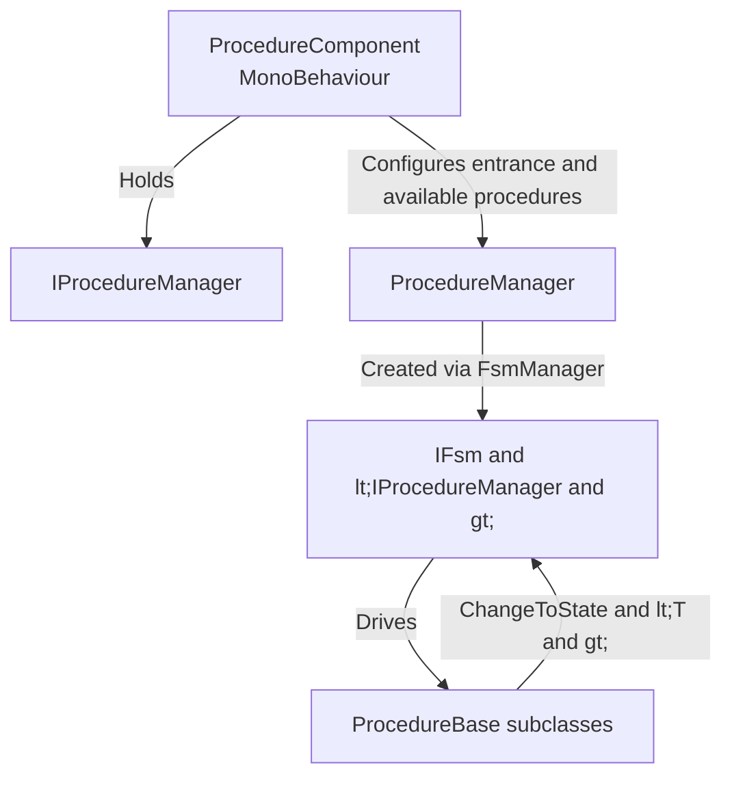

# 什麼是 Procedure

Procedure 是 GameFrameX 為 Unity 提供的基於有限狀態機（FSM）的遊戲流程管理解決方案。它將遊戲生命週期拆分為一組可切換的「流程狀態」（啟動畫面、預載入、登入、主選單等），由 `ProcedureComponent` 驅動——它會控制 `ProcedureManager` 內部的 FSM，在狀態之間自動轉換。這使得啟動順序、資源載入和場景切換都能由程式碼控制，而不是分散在各處的 `MonoBehaviour` 腳本。

## 快速開始

1. 將相依套件加入 Unity 專案的 `Packages/manifest.json`（二選一）：
   - 透過 scoped registry：`https://gameframex.upm.alianblank.uk`，scope 為 `com.gameframex`，相依套件為 `com.gameframex.unity.procedure`。
   - 直接使用 Git URL：`https://github.com/gameframex/com.gameframex.unity.procedure.git`。
2. 建立自己的流程類別，繼承自 [ProcedureBase.cs](https://github.com/GameFrameX/com.gameframex.unity.procedure/blob/main/Runtime/Procedure/ProcedureBase.cs#L38-L99) 並覆寫生命週期回呼。
3. 透過 `GameFrameX/Procedure` 選單將 `ProcedureComponent` 加入場景，在 Inspector 中將流程類別名稱填入 *Available Procedures*，並指定 *Entrance Procedure*（入口流程）。
4. 執行遊戲；框架會從入口流程開始，並在 `OnUpdate` 中透過 `ChangeToState<T>` 切換到下一個階段。

以下是一個最小的三階段「Splash → Preload → Main Menu」流程範例：

```csharp
using GameFrameX.Procedure.Runtime;
using GameFrameX.Fsm.Runtime;

public class ProcedureSplash : ProcedureBase
{
    protected internal override void OnEnter(IFsm<IProcedureManager> procedureOwner)
    {
        // 顯示啟動畫面
    }

    protected internal override void OnUpdate(IFsm<IProcedureManager> procedureOwner, float elapseSeconds, float realElapseSeconds)
    {
        ChangeToState<ProcedurePreload>(procedureOwner);
    }
}

public class ProcedurePreload : ProcedureBase
{
    protected internal override void OnEnter(IFsm<IProcedureManager> procedureOwner)
    {
        // 載入遊戲資源
    }

    protected internal override void OnUpdate(IFsm<IProcedureManager> procedureOwner, float elapseSeconds, float realElapseSeconds)
    {
        ChangeToState<ProcedureMain>(procedureOwner);
    }
}

public class ProcedureMain : ProcedureBase
{
    protected internal override void OnEnter(IFsm<IProcedureManager> procedureOwner)
    {
        // 顯示主選單
    }
}
```

來源：[README.zh-CN.md](https://github.com/GameFrameX/com.gameframex.unity.procedure/blob/main/README.zh-CN.md#L86-L110)

## 運作原理

Procedure 套件圍繞三個核心類型的協作運轉：



- **ProcedureComponent** — 掛載在 GameObject 上的進入點，負責註冊 `IProcedureManager`、讀取 Inspector 設定並觸發啟動；詳見 [ProcedureComponent.cs](https://github.com/GameFrameX/com.gameframex.unity.procedure/blob/main/Runtime/Procedure/ProcedureComponent.cs#L46-L99)。
- **ProcedureManager** — FSM 的實際擁有者，管理所有流程實例與狀態轉換。
- **ProcedureBase** — 繼承自 `FsmState<IProcedureManager>`，提供六個生命週期回呼：`OnInit / OnEnter / OnUpdate / OnFixedUpdate / OnLeave / OnDestroy`。

每個流程類別使用 `ChangeToState<T>(procedureOwner)` 主動宣告「條件滿足後要跳轉到哪裡」，將轉換邏輯集中在流程本身，避免轉換邏輯分散在各個 UI／資源腳本之中。

## 後續步驟

- 若想了解完整的生命週期回呼清單與典型用法，請參閱「Procedure 生命週期」。
- 若想在初始化階段插入自訂邏輯或避免 `Already exist FSM` 衝突，請參閱「UseStartupRunner 模式」。
- 若想瀏覽所有公開 API（屬性、方法簽名），請參閱「API 參考」。
- 遇到 `Procedure not found` 或流程無法切換的問題時，請參閱「常見錯誤與疑難排解」。