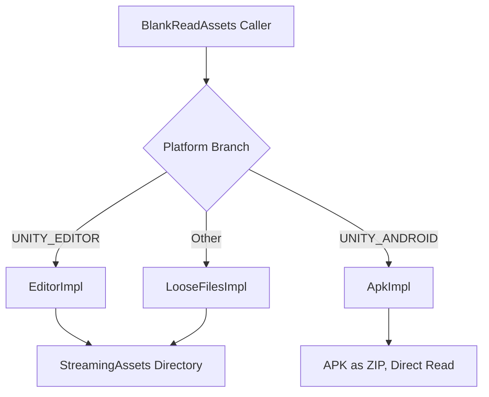

# 運作原理：StreamingAssets 與 APK 統一存取

GameFrameX.ReadAssets 提供了統一的 `System.IO` 風格 API，同時支援兩種情境：「在一般平台上讀取 StreamingAssets 目錄」以及「在 Android 上直接讀取 APK 內部的 `assets/`」。實作會在執行階段根據平台自動切換，並在第一次呼叫 API 時自動初始化。

## 快速開始

1. 透過 UPM 安裝：
   ```json
   {
     "scopedRegistries": [
       {
         "name": "GameFrameX",
         "url": "https://gameframex.upm.alianblank.uk",
         "scopes": ["com.gameframex"]
       }
     ],
     "dependencies": {
       "com.gameframex.unity.readassets": "1.2.0"
     }
   }
   ```
2. 在程式碼中直接呼叫靜態 API，無需手動呼叫 `Initialize`（首次存取時會自動初始化）：
   ```csharp
   using GameFrameX.ReadAssets.Runtime;
   using System.IO;

   // 讀取文字
   string text = BlankReadAssets.ReadAllText("config/game.json");

   // 透過串流讀取
   using (Stream s = BlankReadAssets.OpenRead("data/level1.bin"))
   {
       // ...
   }

   // 直接載入 AssetBundle（無需先解壓縮 APK）
   var ab = BlankReadAssets.LoadAssetBundle("bundles/ui.ab");
   ```

> 所有公開 API 皆標記了 `[Preserve]`，因此在 IL2CPP / AOT 建置中可安全使用。

## 運作原理

進入點 `BlankReadAssets` 是一個 `partial class`，它使用 `using` 別名根據平台選擇內部實作類別，從而在編譯時期決定要呼叫哪一套邏輯：

```csharp
#if UNITY_EDITOR
using BlankReadAssetsImpl = GameFrameX.ReadAssets.Runtime.BlankReadAssets.EditorImpl;
#elif UNITY_ANDROID
using BlankReadAssetsImpl = GameFrameX.ReadAssets.Runtime.BlankReadAssets.ApkImpl;
#else
using BlankReadAssetsImpl = GameFrameX.ReadAssets.Runtime.BlankReadAssets.LooseFilesImpl;
#endif
```

來源：[BlankReadAssets.cs](https://github.com/GameFrameX/com.gameframex.unity.readassets/blob/main/Runtime/BlankReadAssets.cs#L11-L17)

三種實作分別負責：

| 實作 | 平台 | 讀取方式 |
|--------|------|----------|
| `EditorImpl` | Unity Editor | 存取真實的 `StreamingAssets` 目錄 |
| `ApkImpl` | Android（以及在 Editor 中偵錯 APK 時） | 直接開啟 APK 檔案，透過 ZIP 區域檔案標頭定位 `assets/` 下的項目並讀取 |
| `LooseFilesImpl` | 其他平台（PC、iOS、WebGL 等） | 透過檔案系統讀取 |



### 讀取 Android APK 的關鍵做法

在 Android 上，`StreamingAssets` 實際上位於 APK 內部的 `assets/` 路徑。`ApkImpl` 會在初始化時解析 APK 的 ZIP 中央目錄，將 `assets/` 下的所有項目依路徑排序，並快取到兩個陣列：`s_paths` 與 `s_streamingAssets`：

```csharp
public static void Initialize(string dataPath, string streamingAssetsPath)
{
    s_root = dataPath;
    // ...
    GetStreamingAssetsInfoFromJar(s_root, paths, parts);
    s_paths = paths.ToArray();
    s_streamingAssets = parts.ToArray();
}
```

來源：[BlankReadAssets.ApkImpl.cs](https://github.com/GameFrameX/com.gameframex.unity.readassets/blob/main/Runtime/BlankReadAssets.ApkImpl.cs#L27-L56)

讀取時，`TryGetInfo` 會使用二分搜尋定位項目，取得檔案的 `offset` / `size` / `crc32`。接著透過 `File.OpenRead` 開啟 APK 檔案，並使用 `SubReadOnlyStream` 將 `offset` / `size` 範圍以唯讀子串流的形式公開：

```csharp
public static Stream OpenRead(string path)
{
    ReadInfo info;
    if (!TryGetInfo(path, out info))
    {
        ThrowFileNotFound(path);
    }

    Stream fileStream = File.OpenRead(info.readPath);
    try
    {
        return new SubReadOnlyStream(fileStream, info.offset, info.size, leaveOpen: false);
    }
    catch (System.Exception)
    {
        fileStream.Dispose();
        throw;
    }
}
```

來源：[BlankReadAssets.ApkImpl.cs](https://github.com/GameFrameX/com.gameframex.unity.readassets/blob/main/Runtime/BlankReadAssets.ApkImpl.cs#L208-L226)

> 這就是 `AssetBundle.LoadFromFileAsync` 能在 Android 上運作的原因：它只需要「可讀取 + 已知偏移量」，而 `ApkImpl` 已透過 ZIP 中央目錄事先取得偏移量，因此無需解壓縮整個 APK。

### 延遲初始化與執行緒安全

`BlankReadAssets` 使用 `s_initialized` 旗標確保 `Initialize` 只會執行一次：

```csharp
private static void EnsureInitialized()
{
    if (!s_initialized)
    {
        Initialize();
        s_initialized = true;
    }
}
```

來源：[BlankReadAssets.cs](https://github.com/GameFrameX/com.gameframex.unity.readassets/blob/main/Runtime/BlankReadAssets.cs#L37-L44)

所有與讀取相關的 API（`FileExists` / `OpenRead` / `ReadAllBytes` / `GetFiles` 等）都會先呼叫 `EnsureInitialized()`，再委派給 `BlankReadAssetsImpl`，因此在大多數情境下，呼叫端不需要擔心初始化時機。

## 後續步驟

- 若要直接讀取檔案或文字，請參閱「如何讀取 StreamingAssets 的文字與二進位檔案」
- 若要直接載入 AssetBundle，請參閱「如何從 StreamingAssets 載入 AssetBundle」
- 若遇到「找不到檔案」或「無法讀取壓縮資源」等問題，請參閱「常見問題與疑難排解」