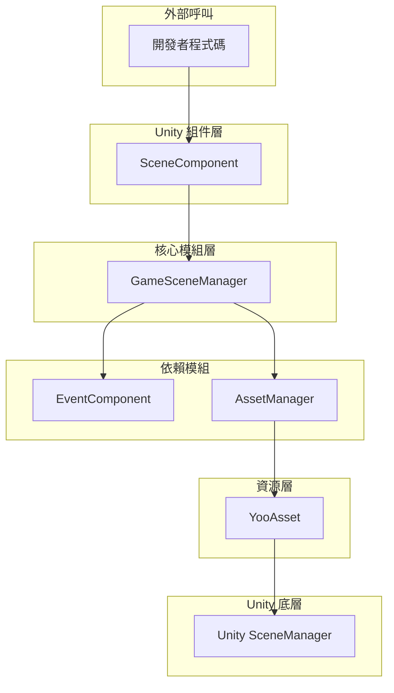
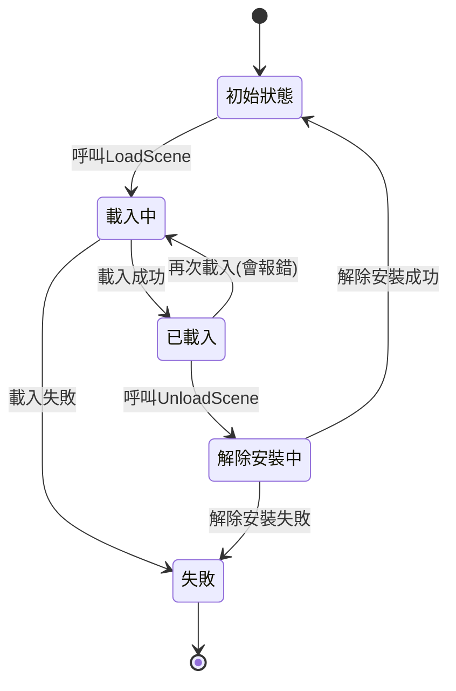
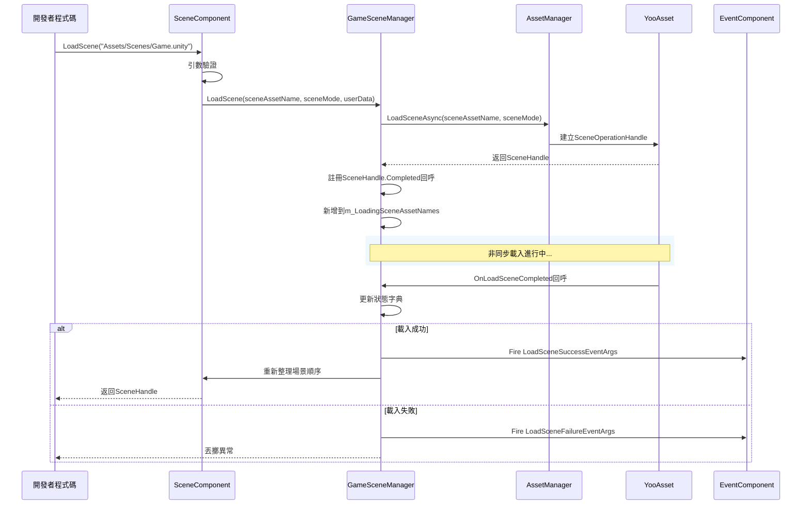

# 概述

GameFrameX Scene 場景管理組件是 GameFrameX 遊戲框架的核心模組之一，提供了一套完整的 Unity 場景管理解決方案。該組件支援非同步場景載入與解除安裝、載入進度跟蹤、場景狀態查詢以及事件回呼等功能。

## 概述

Scene 場景管理組件是 GameFrameX 框架中專門負責處理 Unity 場景載入與解除安裝的模組。它封裝了底層的資源載入機制，透過 YooAsset 資源管理系統實現高效的非同步場景載入，同時提供了完善的事件機制用於監聽場景狀態變化。

### 核心職責

Scene 組件的主要職責包括：

- **非同步場景載入**：支援非同步載入 Unity 場景，不阻塞主執行緒
- **場景解除安裝管理**：安全解除安裝已載入的場景資源
- **狀態追蹤**：維護所有場景的載入狀態（已載入、載入中、解除安裝中）
- **事件通知**：透過事件系統通知場景狀態變化
- **主攝像機管理**：自動追蹤和管理主攝像機
- **場景順序控制**：支援設定場景啟用順序

### 設計意圖

該組件採用分層架構設計，將場景管理的核心邏輯與 Unity 組件進行分離。`GameSceneManager` 作為核心模組處理所有場景操作，而 `SceneComponent` 作為 Unity 組件提供面向開發者的便捷介面。這種設計使得核心邏輯更加清晰，便於單元測試和模組複用。

組件使用 YooAsset 作為底層資源載入系統，這保證了場景載入的高效性和可靠性。同時，透過事件系統與其他 GameFrameX 組件（如 EventComponent、AssetComponent）進行解耦，實現了良好的模組化設計。

## 架構



### 組件層級說明

**Unity 組件層（SceneComponent）**

`SceneComponent` 是繼承自 `GameFrameworkComponent` 的 Unity 組件，掛在到 GameObject 上即可使用。它負責初始化 `GameSceneManager` 模組，並將場景事件轉發給 `EventComponent`。

> Source: [SceneComponent.cs](https://github.com/GameFrameX/com.gameframex.unity.scene/blob/main/Runtime/Scene/SceneComponent.cs#L49-L50)

**核心模組層（GameSceneManager）**

`GameSceneManager` 是繼承自 `GameFrameworkModule` 的核心模組，實現了 `IGameSceneManager` 介面。它負責所有場景管理相關的核心邏輯，包括場景載入、解除安裝、狀態追蹤等。

> Source: [GameSceneManager.cs](https://github.com/GameFrameX/com.gameframex.unity.scene/blob/main/Runtime/Scene/Scene/GameSceneManager.cs#L47-L47)

**依賴模組**

- **EventComponent**：負責事件的傳送和接收
- **AssetManager（IAssetManager）**：資源管理介面，由 YooAsset 實現

## 核心概念

### 場景載入模式

組件支援兩種 Unity 場景載入模式：

| 模式 | 說明 | 使用場景 |
|------|------|----------|
| `LoadSceneMode.Single` | 單一模式，載入新場景時自動解除安裝當前場景 | 主場景切換 |
| `LoadSceneMode.Additive` | 疊加模式，新場景與現有場景共存 | 多人遊戲子場景、UI 層疊 |

### 場景狀態

組件透過三個字典維護場景狀態：



### 事件系統

組件定義了五個核心事件用於監聽場景狀態變化：

| 事件 | 說明 | 觸發時機 |
|------|------|----------|
| `LoadSceneSuccess` | 載入成功事件 | 場景成功載入完成後 |
| `LoadSceneFailure` | 載入失敗事件 | 場景載入失敗時 |
| `LoadSceneUpdate` | 載入進度更新事件 | 場景載入過程中 |
| `UnloadSceneSuccess` | 解除安裝成功事件 | 場景成功解除安裝後 |
| `UnloadSceneFailure` | 解除安裝失敗事件 | 場景解除安裝失敗時 |

## 場景載入流程



## 核心功能特性

### 1. 非同步場景載入

組件完全基於非同步設計，所有場景載入操作都返回 `Task<SceneHandle>`，不會阻塞主執行緒。這對於需要展示載入介面的遊戲尤為重要。

```csharp
// 非同步載入場景
var handle = await sceneComponent.LoadScene("Assets/Scenes/Main.unity");
```
> Source: [SceneComponent.cs#L280-L283](https://github.com/GameFrameX/com.gameframex.unity.scene/blob/main/Runtime/Scene/SceneComponent.cs#L280-L283)

### 2. 場景狀態查詢

開發者可以隨時查詢場景的當前狀態：

```csharp
// 檢查場景是否已載入
if (sceneComponent.SceneIsLoaded("Assets/Scenes/Main.unity"))
{
    // 場景已載入
}

// 檢查場景是否正在載入
if (sceneComponent.SceneIsLoading("Assets/Scenes/Main.unity"))
{
    // 場景正在載入
}

// 獲取所有已載入場景
var loadedScenes = sceneComponent.GetLoadedSceneAssetNames();
```
> Source: [SceneComponent.cs#L174-L186](https://github.com/GameFrameX/com.gameframex.unity.scene/blob/main/Runtime/Scene/SceneComponent.cs#L174-L186)

### 3. 場景順序管理

組件支援設定場景的啟用順序，確保多個疊加場景按照正確的順序啟用：

```csharp
// 設定場景順序，數值越大越優先啟用
sceneComponent.SetSceneOrder("Assets/Scenes/Game.unity", 100);
```
> Source: [SceneComponent.cs#L338-L367](https://github.com/GameFrameX/com.gameframex.unity.scene/blob/main/Runtime/Scene/SceneComponent.cs#L338-L367)

### 4. 主攝像機管理

組件自動追蹤當前啟用場景中的主攝像機：

```csharp
// 重新整理主攝像機引用
sceneComponent.RefreshMainCamera();

// 獲取當前主攝像機
var mainCamera = sceneComponent.MainCamera;
```
> Source: [SceneComponent.cs#L369-L375](https://github.com/GameFrameX/com.gameframex.unity.scene/blob/main/Runtime/Scene/SceneComponent.cs#L369-L375)

### 5. 事件監聽

開發者可以訂閱場景事件來響應狀態變化：

```csharp
// 訂閱場景載入成功事件
sceneComponent.LoadSceneSuccess += OnLoadSceneSuccess;

private void OnLoadSceneSuccess(object sender, LoadSceneSuccessEventArgs e)
{
    Debug.Log($"場景 {e.SceneAssetName} 載入成功，耗時 {e.Duration} 秒");
}
```
> Source: [SceneComponent.cs#L89-L95](https://github.com/GameFrameX/com.gameframex.unity.scene/blob/main/Runtime/Scene/SceneComponent.cs#L89-L95)

## 依賴關係

Scene 組件依賴於以下 GameFrameX 模組：

| 依賴模組 | 說明 | 依賴型別 |
|----------|------|----------|
| GameFrameX.Runtime | 框架核心執行時 | 強依賴 |
| GameFrameX.Event.Runtime | 事件系統 | 強依賴 |
| GameFrameX.Asset.Runtime | 資源管理系統 | 強依賴 |
| YooAsset | 資源載入底層實現 | 強依賴 |

> Source: [GameFrameX.Scene.Runtime.asmdef](https://github.com/GameFrameX/com.gameframex.unity.scene/blob/main/Runtime/GameFrameX.Scene.Runtime.asmdef#L3-L8)

## 版本資訊

| 版本 | 釋出日期 | 主要變更 |
|------|----------|----------|
| 2.1.2 | 2026-03-16 | 修復載入成功回呼引數 |
| 2.1.1 | 2026-03-13 | 修復場景載入狀態判斷 |
| 2.1.0 | 2025-12-23 | 更新場景管理器 |
| 2.0.0 | 2025-10-25 | 架構重大升級 |

> Source: [CHANGELOG.md](https://github.com/GameFrameX/com.gameframex.unity.scene/blob/main/CHANGELOG.md)

## 相關連結

- [安裝指南](./02.installation)
- [快速入門](./03.getting-started)
- [核心功能](./04.core-features)
- [API 參考](./05.api-reference)
- [事件系統](./06.events)
<!-- - [常見問題](./07.troubleshooting) -->
- [GitHub 倉庫](https://github.com/GameFrameX/com.gameframex.unity.scene.git)
- [官方文件](https://gameframex.doc.alianblank.com/)
