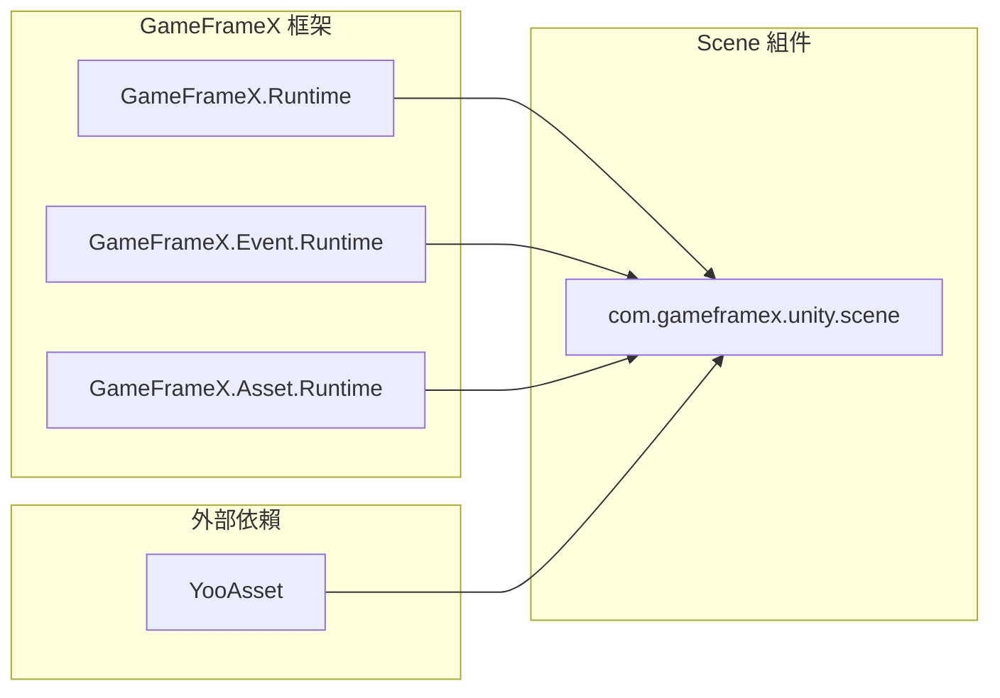
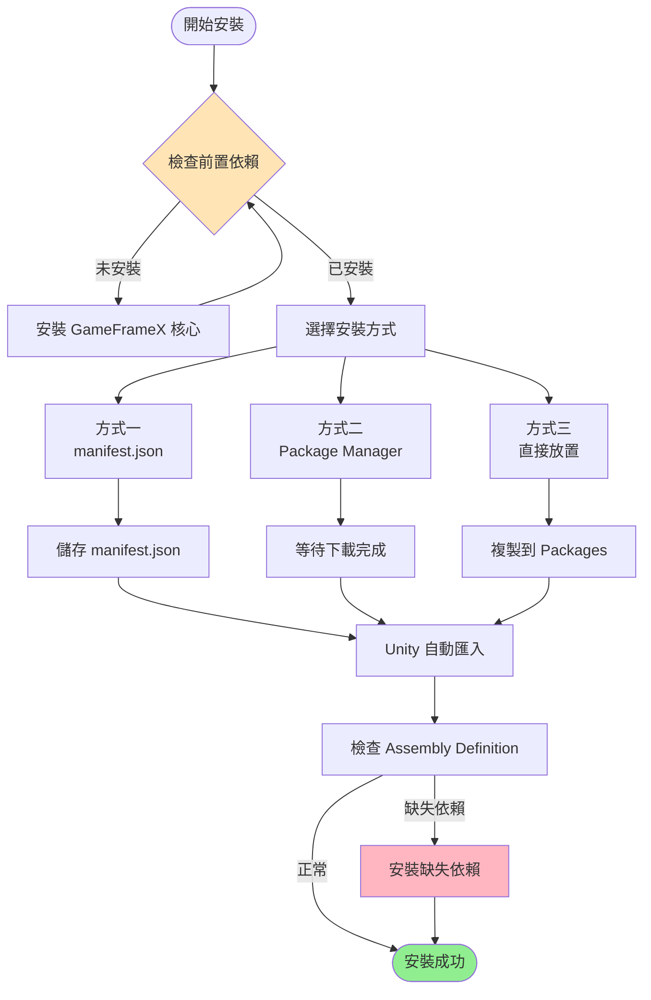

# 安裝

GameFrameX Scene 場景管理組件的安裝指南。

## 概述

GameFrameX Scene 是 GameFrameX 框架的場景管理組件，提供統一的場景載入、解除安裝和管理功能。在使用本組件前，需要先完成安裝配置。本文件將介紹三種推薦的安裝方式以及依賴項配置。

> 當前版本：2.1.2
> 最低 Unity 版本：2017.1

## 前置要求

在安裝 Scene 組件前，請確保您的專案滿足以下要求：

| 要求 | 說明 |
|------|------|
| Unity 版本 | 2017.1 或更高版本 |
| GameFrameX 核心 | 需要先安裝 GameFrameX.Runtime |
| YooAsset | 需要安裝 YooAsset 資源管理系統 |

### 依賴項說明

Scene 組件依賴於以下核心模組：



**核心依賴**：
- **GameFrameX.Runtime**: 框架核心執行時
- **GameFrameX.Event.Runtime**: 事件系統執行時
- **GameFrameX.Asset.Runtime**: 資源管理執行時
- **YooAsset**: 資源打包和管理解決方案

## 安裝方式

### 方式一：透過 manifest.json 安裝（推薦）

這是最推薦的安裝方式，方便版本管理和更新。

1. 開啟 Unity 專案中的 `Packages/manifest.json` 檔案
2. 在 `dependencies` 節點下新增以下內容：

```json
{
  "dependencies": {
    "com.gameframex.unity.scene": "https://github.com/GameFrameX/com.gameframex.unity.scene.git"
  }
}
```

3. 儲存檔案後，Unity 會自動下載並匯入包

> Source: [README.md](https://github.com/GameFrameX/com.gameframex.unity.scene/blob/main/README.md#L11-L14)

### 方式二：透過 Unity Package Manager 安裝

1. 開啟 Unity 編輯器
2. 選擇 **Window > Package Manager** 開啟包管理器
3. 點選左上角的 **+** 按鈕
4. 選擇 **Add package from git URL**
5. 輸入以下 Git URL：
   ```
   https://github.com/GameFrameX/com.gameframex.unity.scene.git
   ```
6. 點選 **Add** 按鈕等待安裝完成

> Source: [README.md](https://github.com/GameFrameX/com.gameframex.unity.scene/blob/main/README.md#L15-L15)

### 方式三：直接放置到 Packages 資料夾

1. 克隆或下載本倉庫：
   ```
   https://github.com/GameFrameX/com.gameframex.unity.scene.git
   ```
2. 將整個倉庫資料夾複製到您 Unity 專案的 `Packages` 目錄下
3. Unity 會自動識別並載入包

> Source: [README.md](https://github.com/GameFrameX/com.gameframex.unity.scene/blob/main/README.md#L16-L16)

## 安裝流程



## 驗證安裝

安裝完成後，可以透過以下方式驗證：

1. **檢查 Package Manager**：在 Package Manager 中確認 `com.gameframex.unity.scene` 已顯示
2. **檢查程式集**：確認 `GameFrameX.Scene.Runtime` 和 `GameFrameX.Scene.Editor` 程式集已生成
3. **檢查選單**：確認 Unity 選單中出現了 Scene 相關的功能選單

## 依賴項安裝

Scene 組件需要預先安裝以下依賴包，請按順序安裝：

1. **GameFrameX.Runtime** - 核心執行時
2. **GameFrameX.Event.Runtime** - 事件系統
3. **GameFrameX.Asset.Runtime** - 資源管理
4. **YooAsset** - 資源打包系統

這些依賴項可以透過相同的方式安裝：

```json
{
  "dependencies": {
    "com.gameframex.unity.core": "https://github.com/GameFrameX/com.gameframex.unity.core.git",
    "com.gameframex.unity.event": "https://github.com/GameFrameX/com.gameframex.unity.event.git",
    "com.gameframex.unity.asset": "https://github.com/GameFrameX/com.gameframex.unity.asset.git",
    "com.yooasset.rm": "https://github.com/yoopackage/yoosee.git"
  }
}
```

## 包資訊

| 屬性 | 值 |
|------|------|
| 包名 | com.gameframex.unity.scene |
| 顯示名稱 | Game Frame X Scene |
| 版本 | 2.1.2 |
| 分類 | Game Framework X |
| 倉庫 | https://github.com/GameFrameX/com.gameframex.unity.scene.git |

> Source: [package.json](https://github.com/GameFrameX/com.gameframex.unity.scene/blob/main/package.json#L2-L8)

## 相關連結

- [概述](./1-overview) - 瞭解 Scene 組件的核心功能
- [快速入門](./3-getting-started) - 開始使用 Scene 組件
- [核心功能](./4-core-features) - 瞭解更多功能特性
- [API 參考](./5-api-reference) - 完整的 API 文件
- [GitHub 倉庫](https://github.com/GameFrameX/com.gameframex.unity.scene.git) - 原始碼和更新日誌
