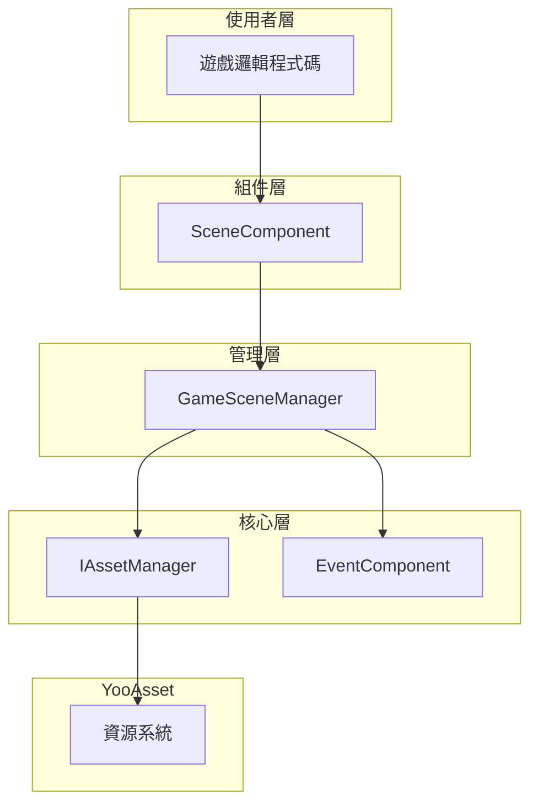
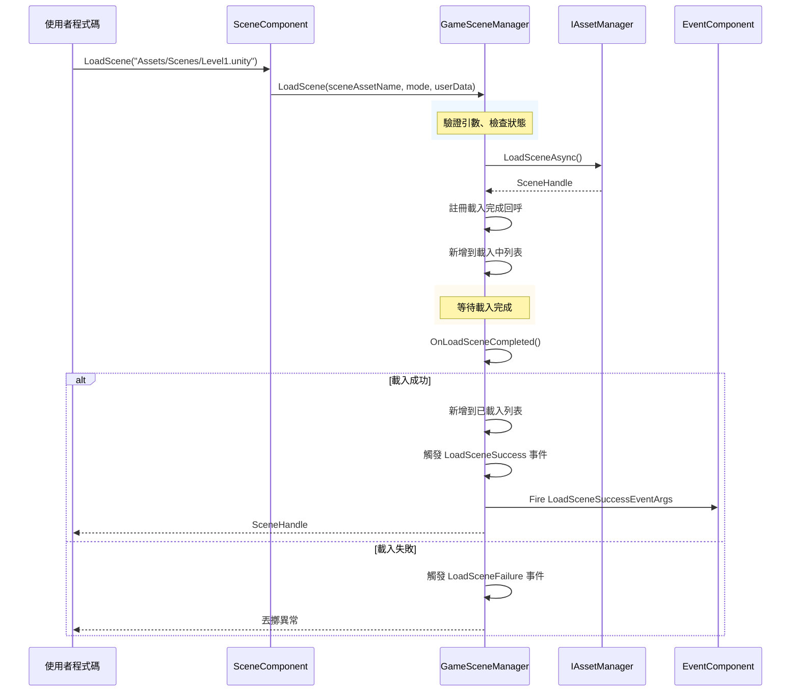

# 快速入門

本指南將幫助您快速上手 GameFrameX Scene 場景管理組件。透過本文件，您將瞭解如何在自己的 Unity 專案中配置和使用場景管理系統。

## 概述

GameFrameX Scene 組件是 GameFrameX 遊戲框架的核心模組之一，提供統一的場景管理功能。該組件基於 YooAsset 資源管理系統構建，支援非同步場景載入、解除安裝、狀態追蹤以及場景事件回呼。核心功能由 `SceneComponent` 統一封裝對外提供服務，透過事件系統實現場景狀態變化的響應。

## 架構概覽



上圖展示了 Scene 組件的層次結構。使用者透過 `SceneComponent` 組件進行場景操作，該組件內部呼叫 `GameSceneManager` 進行實際的管理工作，而 `GameSceneManager` 則依賴 `IAssetManager` 與 YooAsset 資源系統進行互動。`EventComponent` 負責觸發各類場景事件，供遊戲邏輯響應。

## 前置條件

在使用 Scene 組件之前，請確保專案滿足以下條件：

1. 已安裝 Unity 2020.3 或更高版本
2. 專案中已正確配置 YooAsset 資源管理系統
3. 已將 GameFrameX 框架其他依賴模組新增到專案中（EventComponent、Asset 模組等）

## 基本使用流程

### 步驟一：新增 Scene 組件

在 Unity 場景中建立一個空物體或使用現有的 GameEntry 物體，然後新增 `SceneComponent` 組件。該組件會自動註冊到 GameFrameX 框架中。

```csharp
// SceneComponent 是一個 MonoBehaviour，需要掛載到 GameObject 上
// 在 Unity 編輯器中：右鍵 -> GameFrameX -> Scene
// 或者直接新增以下指令碼到場景物體上
```
> Source: [SceneComponent.cs](https://github.com/GameFrameX/com.gameframex.unity.scene/blob/main/Runtime/Scene/SceneComponent.cs#L47-L49)

組件屬性說明：
- `Enable LoadScene Update Event`：啟用場景載入進度更新事件
- `Enable LoadScene Dependency Asset Event`：啟用場景依賴資源載入事件

### 步驟二：獲取組件例項

在遊戲程式碼中可以透過 `GameEntry` 獲取 SceneComponent 例項：

```csharp
// 獲取場景組件例項
var sceneComponent = GameEntry.GetComponent<SceneComponent>();
if (sceneComponent == null)
{
    Debug.LogError("Scene component is not found.");
    return;
}
```
> Source: [SceneComponent.cs](https://github.com/GameFrameX/com.gameframex.unity.scene/blob/main/Runtime/Scene/SceneComponent.cs#L77-L87)

### 步驟三：載入場景

Scene 組件支援兩種載入模式：

**單例模式 (LoadSceneMode.Single)**
載入新場景時會先解除安裝所有已載入的場景，適用於遊戲主選單、關卡切換等場景。

**累加模式 (LoadSceneMode.Additive)**
在現有場景基礎上疊加載入新場景，適用於開放世界、動態關卡載入等場景。

```csharp
// 載入單個場景（單例模式，預設）
// 注意：場景名稱必須以 "Assets/" 開頭，以 ".unity" 結尾
string sceneAssetName = "Assets/Scenes/MainMenu.unity";
var handle = await sceneComponent.LoadScene(sceneAssetName, LoadSceneMode.Single);

// 載入場景並傳遞自定義資料
string gameScene = "Assets/Scenes/GameLevel1.unity";
var handle2 = await sceneComponent.LoadScene(gameScene, LoadSceneMode.Single, "myUserData");
```
> Source: [SceneComponent.cs](https://github.com/GameFrameX/com.gameframex.unity.scene/blob/main/Runtime/Scene/SceneComponent.cs#L276-L307)

### 步驟四：解除安裝場景

當不再需要某個場景時，可以將其解除安裝釋放記憶體：

```csharp
// 解除安裝指定場景
string sceneAssetName = "Assets/Scenes/OldLevel.unity";
sceneComponent.UnloadScene(sceneAssetName);

// 解除安裝場景並傳遞自定義資料
sceneComponent.UnloadScene(sceneAssetName, "cleanupData");
```
> Source: [SceneComponent.cs](https://github.com/GameFrameX/com.gameframex.unity.scene/blob/main/Runtime/Scene/SceneComponent.cs#L309-L331)

### 步驟五：監聽場景事件

Scene 組件提供了完善的事件系統，用於響應場景狀態變化：

```csharp
// 訂閱場景載入成功事件
sceneComponent.LoadSceneSuccess += OnLoadSceneSuccess;

// 訂閱場景載入失敗事件
sceneComponent.LoadSceneFailure += OnLoadSceneFailure;

// 訂閱場景載入進度更新事件（需要啟用 EnableLoadSceneUpdateEvent）
sceneComponent.LoadSceneUpdate += OnLoadSceneUpdate;

// 訂閱場景解除安裝成功事件
sceneComponent.UnloadSceneSuccess += OnUnloadSceneSuccess;

// 訂閱場景解除安裝失敗事件
sceneComponent.UnloadSceneFailure += OnUnloadSceneFailure;

// 場景載入成功回呼
private void OnLoadSceneSuccess(object sender, LoadSceneSuccessEventArgs e)
{
    Debug.Log($"Scene loaded successfully: {e.SceneAssetName}, duration: {e.Duration}");
}

// 場景載入失敗回呼
private void OnLoadSceneFailure(object sender, LoadSceneFailureEventArgs e)
{
    Debug.LogError($"Scene load failed: {e.SceneAssetName}, error: {e.ErrorMessage}");
}

// 場景載入進度更新回呼
private void OnLoadSceneUpdate(object sender, LoadSceneUpdateEventArgs e)
{
    Debug.Log($"Loading progress: {e.Progress * 100}%");
}

// 場景解除安裝成功回呼
private void OnUnloadSceneSuccess(object sender, UnloadSceneSuccessEventArgs e)
{
    Debug.Log($"Scene unloaded: {e.SceneAssetName}");
}
```
> Source: [IGameSceneManager.cs](https://github.com/GameFrameX/com.gameframex.unity.scene/blob/main/Runtime/Scene/Scene/IGameSceneManager.cs#L44-L69)

## 場景狀態查詢

Scene 組件提供了多種方法用於查詢場景狀態：

```csharp
// 檢查場景是否已載入
bool isLoaded = sceneComponent.SceneIsLoaded("Assets/Scenes/MainMenu.unity");

// 檢查場景是否正在載入
bool isLoading = sceneComponent.SceneIsLoading("Assets/Scenes/MainMenu.unity");

// 檢查場景是否正在解除安裝
bool isUnloading = sceneComponent.SceneIsUnloading("Assets/Scenes/MainMenu.unity");

// 獲取所有已載入場景的名稱
string[] loadedScenes = sceneComponent.GetLoadedSceneAssetNames();

// 獲取所有正在載入場景的名稱
string[] loadingScenes = sceneComponent.GetLoadingSceneAssetNames();

// 檢查場景資源是否存在
bool exists = sceneComponent.HasScene("Assets/Scenes/MainMenu.unity");
```
> Source: [SceneComponent.cs](https://github.com/GameFrameX/com.gameframex.unity.scene/blob/main/Runtime/Scene/SceneComponent.cs#L169-L274)

## 場景順序管理

SceneComponent 支援設定場景的顯示順序，確保主攝像機正確指向當前啟用的場景：

```csharp
// 設定場景的顯示順序（數值越大越優先顯示）
sceneComponent.SetSceneOrder("Assets/Scenes/GameLevel1.unity", 10);
sceneComponent.SetSceneOrder("Assets/Scenes/GameUI.unity", 20);

// 重新整理主攝像機
sceneComponent.RefreshMainCamera();
```
> Source: [SceneComponent.cs](https://github.com/GameFrameX/com.gameframex.unity.scene/blob/main/Runtime/Scene/SceneComponent.cs#L333-L376)

## 場景載入流程



上圖展示了場景載入的完整流程。從使用者呼叫 LoadScene 開始，經過引數驗證、資源載入、狀態管理，最終觸發相應事件通知使用者程式碼。

## 完整使用示例

以下是一個完整的場景管理使用示例：

```csharp
using System;
using System.Threading.Tasks;
using UnityEngine;
using GameFrameX.Scene.Runtime;
using GameFrameX.Event.Runtime;

public class SceneManagerExample : MonoBehaviour
{
    private SceneComponent _sceneComponent;
    
    private void Start()
    {
        // 獲取場景組件
        _sceneComponent = GameEntry.GetComponent<SceneComponent>();
        if (_sceneComponent == null)
        {
            Debug.LogError("Scene component not found!");
            return;
        }
        
        // 訂閱事件
        _sceneComponent.LoadSceneSuccess += OnLoadSceneSuccess;
        _sceneComponent.LoadSceneFailure += OnLoadSceneFailure;
        _sceneComponent.UnloadSceneSuccess += OnUnloadSceneSuccess;
    }
    
    private void OnDestroy()
    {
        // 取消訂閱事件
        if (_sceneComponent != null)
        {
            _sceneComponent.LoadSceneSuccess -= OnLoadSceneSuccess;
            _sceneComponent.LoadSceneFailure -= OnLoadSceneFailure;
            _sceneComponent.UnloadSceneSuccess -= OnUnloadSceneSuccess;
        }
    }
    
    // 切換到遊戲場景
    public async void LoadGameScene(string sceneName)
    {
        string sceneAssetName = $"Assets/Scenes/{sceneName}.unity";
        
        try
        {
            Debug.Log($"Start loading scene: {sceneAssetName}");
            var handle = await _sceneComponent.LoadScene(sceneAssetName, LoadSceneMode.Single);
            Debug.Log($"Scene handle: {handle}");
        }
        catch (Exception ex)
        {
            Debug.LogError($"Failed to load scene: {ex.Message}");
        }
    }
    
    // 載入附加場景
    public async void LoadAdditiveScene(string sceneName)
    {
        string sceneAssetName = $"Assets/Scenes/{sceneName}.unity";
        
        try
        {
            var handle = await _sceneComponent.LoadScene(sceneAssetName, LoadSceneMode.Additive);
        }
        catch (Exception ex)
        {
            Debug.LogError($"Failed to load additive scene: {ex.Message}");
        }
    }
    
    // 解除安裝場景
    public void UnloadScene(string sceneName)
    {
        string sceneAssetName = $"Assets/Scenes/{sceneName}.unity";
        _sceneComponent.UnloadScene(sceneAssetName);
    }
    
    // 事件回呼
    private void OnLoadSceneSuccess(object sender, LoadSceneSuccessEventArgs e)
    {
        Debug.Log($"Scene loaded: {e.SceneAssetName}, duration: {e.Duration:F2}s");
    }
    
    private void OnLoadSceneFailure(object sender, LoadSceneFailureEventArgs e)
    {
        Debug.LogError($"Scene load failed: {e.SceneAssetName}, error: {e.ErrorMessage}");
    }
    
    private void OnUnloadSceneSuccess(object sender, UnloadSceneSuccessEventArgs e)
    {
        Debug.Log($"Scene unloaded: {e.SceneAssetName}");
    }
}
```

## 注意事項

1. **場景路徑格式**：場景資源名稱必須以 `Assets/` 開頭，以 `.unity` 結尾，例如：`Assets/Scenes/MainMenu.unity`

2. **狀態檢查**：在載入新場景之前，建議先檢查場景是否已在載入中或已載入，避免重複載入導致異常

3. **資源依賴**：確保 YooAsset 已正確配置場景的 AssetBundle 打包規則

4. **事件訂閱時機**：建議在 Start 或更早的生命週期中訂閱事件，在 OnDestroy 中取消訂閱，避免記憶體洩漏

5. **非同步操作**：LoadScene 是非同步方法，需要使用 await 等待載入完成

## 相關連結

- [核心功能](./4-core-features) - 瞭解更多場景管理的高階功能
- [API 參考](./5-api-reference) - 檢視完整的 API 文件
- [事件系統](./6-events) - 瞭解場景事件系統的詳細資訊
- [常見問題](./7-troubleshooting) - 排查常見問題
- [安裝指南](./2-installation) - 檢視安裝配置說明
