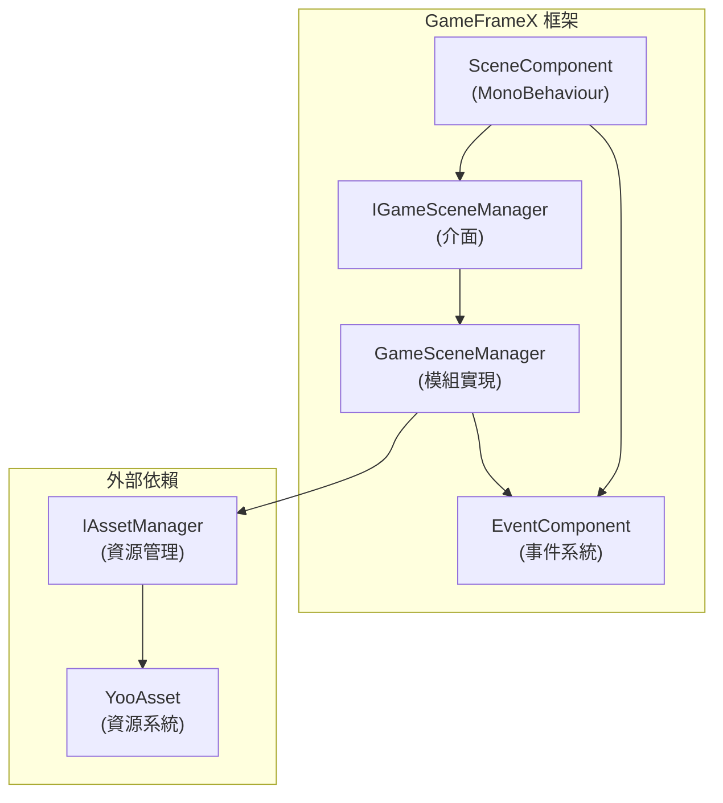
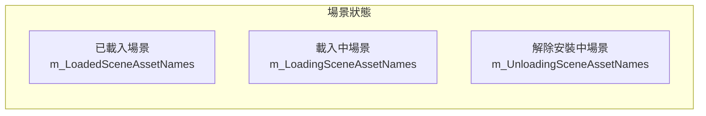
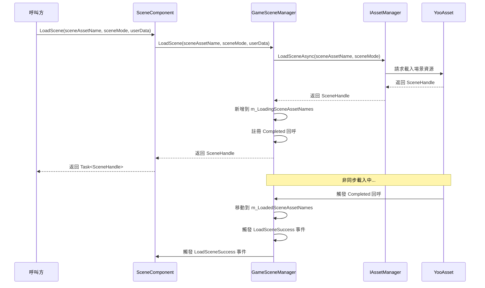
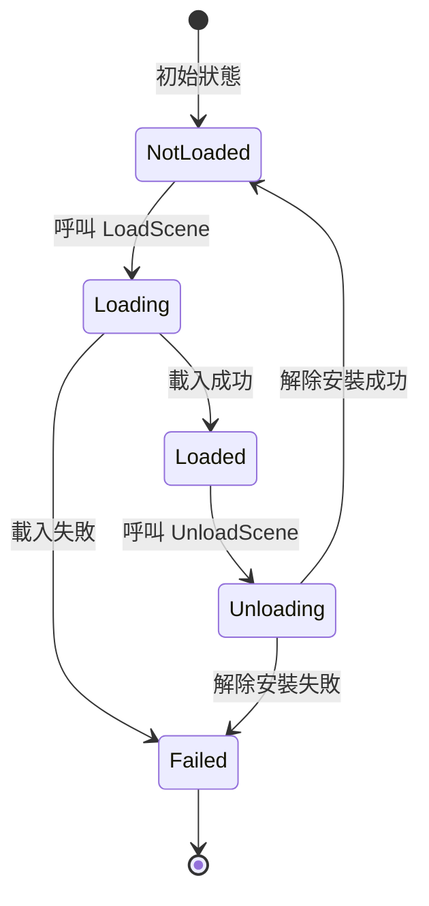
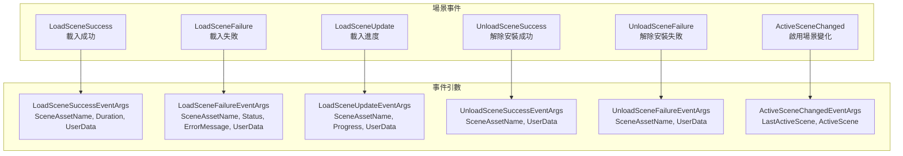

# 核心功能

GameFrameX Scene 場景管理組件提供了完整的非同步場景載入、解除安裝、狀態查詢和事件通知功能，是遊戲開發中管理多個場景的核心模組。

## 概述

Scene 組件是 GameFrameX 框架的核心模組之一，專門用於管理 Unity 遊戲中的場景資源。該組件基於 YooAsset 資源管理系統構建，提供了以下核心能力：

- **非同步場景載入**：支援非同步載入場景資源，無需阻塞主執行緒
- **場景狀態管理**：查詢場景的載入、解除安裝狀態
- **場景啟用控制**：管理當前啟用的場景和主攝像機
- **事件驅動**：完整的事件系統用於監聽場景狀態變化
- **場景優先順序**：支援設定場景載入優先順序，控制啟用順序

### 核心設計理念

Scene 組件採用模組化設計，將業務邏輯與 Unity 組件分離。`SceneComponent` 作為 Unity 組件掛載到 GameObject 上，而核心邏輯由 `GameSceneManager` 模組處理。這種設計使得程式碼更加清晰，便於測試和維護。



## 場景狀態管理

Scene 組件維護了三個內部字典來追蹤場景狀態，這種設計確保了高效的狀態查詢：



### 狀態查詢方法

Scene 組件提供了完整的場景狀態查詢 API，可以準確獲取任意場景的當前狀態：

```csharp
// 檢查場景是否已載入
bool isLoaded = sceneComponent.SceneIsLoaded("Assets/Scenes/MainMenu.unity");

// 檢查場景是否正在載入
bool isLoading = sceneComponent.SceneIsLoading("Assets/Scenes/GamePlay.unity");

// 檢查場景是否正在解除安裝
bool isUnloading = sceneComponent.SceneIsUnloading("Assets/Scenes/MainMenu.unity");

// 獲取所有已載入場景的名稱
string[] loadedScenes = sceneComponent.GetLoadedSceneAssetNames();

// 獲取所有正在載入的場景名稱
string[] loadingScenes = sceneComponent.GetLoadingSceneAssetNames();

// 獲取所有正在解除安裝的場景名稱
string[] unloadingScenes = sceneComponent.GetUnloadingSceneAssetNames();
```
> Source: [SceneComponent.cs](https://github.com/GameFrameX/com.gameframex.unity.scene/blob/main/Runtime/Scene/SceneComponent.cs#L174-L251)

### 場景存在性檢查

在載入場景前，可以先檢查場景資源是否存在：

```csharp
// 檢查場景資源是否存在
bool hasScene = sceneComponent.HasScene("Assets/Scenes/GamePlay.unity");
```
> Source: [SceneComponent.cs](https://github.com/GameFrameX/com.gameframex.unity.scene/blob/main/Runtime/Scene/SceneComponent.cs#L258-L274)

## 場景載入與解除安裝

### 載入場景

Scene 組件支援多種載入模式，可以根據遊戲需求選擇合適的載入方式：



#### 基礎載入

最簡單的場景載入方式，無需指定載入模式：

```csharp
// 載入單個場景（使用預設的 Additive 模式）
var handle = await sceneComponent.LoadScene("Assets/Scenes/GamePlay.unity");
```
> Source: [SceneComponent.cs](https://github.com/GameFrameX/com.gameframex.unity.scene/blob/main/Runtime/Scene/SceneComponent.cs#L280-L283)

#### 帶模式的載入

可以指定載入模式（Single 或 Additive）和使用者自定義資料：

```csharp
// 使用 Single 模式載入（替換當前場景）
var handle = await sceneComponent.LoadScene(
    "Assets/Scenes/GamePlay.unity", 
    LoadSceneMode.Single, 
    null  // 使用者自定義資料
);

// 使用 Additive 模式載入（疊加場景）
var handle = await sceneComponent.LoadScene(
    "Assets/Scenes/GamePlay.unity", 
    LoadSceneMode.Additive, 
    new { level = 1 }  // 自定義資料
);
```
> Source: [SceneComponent.cs](https://github.com/GameFrameX/com.gameframex.unity.scene/blob/main/Runtime/Scene/SceneComponent.cs#L291-L307)

**LoadSceneMode 說明：**
- **Single**：替換當前活動場景，載入完成後只保留新場景
- **Additive**：將新場景疊加到當前場景，保留所有已載入的場景

### 解除安裝場景

解除安裝場景是將已載入的場景從記憶體中移除的過程：

```csharp
// 解除安裝指定場景
sceneComponent.UnloadScene("Assets/Scenes/MainMenu.unity");

// 解除安裝場景並傳遞使用者自定義資料
sceneComponent.UnloadScene("Assets/Scenes/MainMenu.unity", new { reason = "quit" });
```
> Source: [SceneComponent.cs](https://github.com/GameFrameX/com.gameframex.unity.scene/blob/main/Runtime/Scene/SceneComponent.cs#L314-L331)

### 載入流程詳解

場景載入過程中，組件會經歷多個狀態轉換。理解這些狀態有助於更好地處理非同步載入邏輯：

1. **初始狀態**：場景不在任何字典中
2. **載入中**：場景新增到 `m_LoadingSceneAssetNames`，觸發 `LoadSceneUpdate` 事件
3. **載入完成**：場景移動到 `m_LoadedSceneAssetNames`，觸發 `LoadSceneSuccess` 事件
4. **解除安裝中**：場景新增到 `m_UnloadingSceneAssetNames`
5. **解除安裝完成**：場景從所有字典中移除，觸發 `UnloadSceneSuccess` 事件



## 場景啟用與主攝像機管理

### 活動場景管理

Scene 組件支援設定場景的載入順序，並根據順序自動啟用最優先的場景：

```csharp
// 設定場景載入優先順序（數值越大優先順序越高）
sceneComponent.SetSceneOrder("Assets/Scenes/MainMenu.unity", 1);
sceneComponent.SetSceneOrder("Assets/Scenes/GamePlay.unity", 10);
```
> Source: [SceneComponent.cs](https://github.com/GameFrameX/com.gameframex.unity.scene/blob/main/Runtime/Scene/SceneComponent.cs#L338-L367)

當多個場景疊加載入時，優先順序最高的場景會自動成為活動場景。

### 主攝像機重新整理

組件會自動追蹤當前活動場景的主攝像機：

```csharp
// 重新整理主攝像機引用
sceneComponent.RefreshMainCamera();

// 獲取當前主攝像機
Camera mainCam = sceneComponent.MainCamera;
```
> Source: [SceneComponent.cs](https://github.com/GameFrameX/com.gameframex.unity.scene/blob/main/Runtime/Scene/SceneComponent.cs#L372-L375)

### 啟用場景變化事件

當活動場景發生變化時，會觸發相應事件：

```csharp
m_EventComponent.Fire(this, ActiveSceneChangedEventArgs.Create(lastActiveScene, activeScene));
```
> Source: [SceneComponent.cs](https://github.com/GameFrameX/com.gameframex.unity.scene/blob/main/Runtime/Scene/SceneComponent.cs#L431)

## 事件系統

Scene 組件提供了完善的事件系統，開發者可以透過訂閱事件來響應場景狀態變化。這種設計實現了松耦合的通訊方式，使得不同模組可以獨立響應場景事件。



### 訂閱場景事件

在 `SceneComponent` 初始化時，會自動訂閱內部事件並轉發給 `EventComponent`：

```csharp
_gameSceneManager.LoadSceneSuccess += OnLoadGameSceneSuccess;
_gameSceneManager.LoadSceneFailure += OnLoadGameSceneFailure;
_gameSceneManager.LoadSceneUpdate += OnLoadGameSceneUpdate;
_gameSceneManager.UnloadSceneSuccess += OnUnloadGameSceneSuccess;
_gameSceneManager.UnloadSceneFailure += OnUnloadGameSceneFailure;
```
> Source: [SceneComponent.cs](https://github.com/GameFrameX/com.gameframex.unity.scene/blob/main/Runtime/Scene/SceneComponent.cs#L89-L103)

### 事件使用示例

```csharp
// 訂閱載入成功事件
EventComponent.Subscribe<LoadSceneSuccessEventArgs>(OnLoadSceneSuccess);

private void OnLoadSceneSuccess(object sender, LoadSceneSuccessEventArgs e)
{
    Debug.Log($"場景載入成功: {e.SceneAssetName}, 耗時: {e.Duration}秒");
}

// 訂閱載入進度事件
EventComponent.Subscribe<LoadSceneUpdateEventArgs>(OnLoadSceneUpdate);

private void OnLoadSceneUpdate(object sender, LoadSceneUpdateEventArgs e)
{
    Debug.Log($"載入進度: {e.SceneAssetName}, {e.Progress * 100}%");
}

// 訂閱解除安裝成功事件
EventComponent.Subscribe<UnloadSceneSuccessEventArgs>(OnUnloadSceneSuccess);

private void OnUnloadSceneSuccess(object sender, UnloadSceneSuccessEventArgs e)
{
    Debug.Log($"場景解除安裝成功: {e.SceneAssetName}");
}
```

## 組件配置

### SceneComponent 屬性

`SceneComponent` 繼承自 `GameFrameworkComponent`，掛載到 Unity 場景中時會自動初始化：

```csharp
[DisallowMultipleComponent]
[AddComponentMenu("GameFrameX/Scene")]
public sealed class SceneComponent : GameFrameworkComponent
{
    [SerializeField] private bool m_EnableLoadSceneUpdateEvent = true;
    [SerializeField] private bool m_EnableLoadSceneDependencyAssetEvent = true;
}
```
> Source: [SceneComponent.cs](https://github.com/GameFrameX/com.gameframex.unity.scene/blob/main/Runtime/Scene/SceneComponent.cs#L47-L64)

### 配置說明

| 屬性 | 型別 | 預設值 | 說明 |
|------|------|--------|------|
| `m_EnableLoadSceneUpdateEvent` | bool | true | 是否啟用場景載入進度更新事件 |
| `m_EnableLoadSceneDependencyAssetEvent` | bool | true | 是否啟用依賴資源載入事件 |

### 編輯器 Inspector

在 Unity 編輯器中，可以檢視當前場景狀態：

```csharp
// Inspector 中顯示的資訊
EditorGUILayout.LabelField("Loaded Scene Asset Names", GetSceneNameString(t.GetLoadedSceneAssetNames()));
EditorGUILayout.LabelField("Loading Scene Asset Names", GetSceneNameString(t.GetLoadingSceneAssetNames()));
EditorGUILayout.LabelField("Unloading Scene Asset Names", GetSceneNameString(t.GetUnloadingSceneAssetNames()));
EditorGUILayout.ObjectField("Main Camera", t.MainCamera, typeof(Camera), true);
```
> Source: [SceneComponentInspector.cs](https://github.com/GameFrameX/com.gameframex.unity.scene/blob/main/Editor/Inspector/SceneComponentInspector.cs#L64-L67)

## 核心流程

### 完整的場景切換流程

以下是一個完整的場景切換示例，展示了各個組件的協作過程：

```csharp
public class GameSceneController : MonoBehaviour
{
    private SceneComponent _sceneComponent;
    private EventComponent _eventComponent;

    private void Start()
    {
        _sceneComponent = GameEntry.GetComponent<SceneComponent>();
        _eventComponent = GameEntry.GetComponent<EventComponent>();
        
        // 訂閱事件
        _eventComponent.Subscribe<LoadSceneSuccessEventArgs>(OnLoadSceneSuccess);
        _eventComponent.Subscribe<LoadSceneFailureEventArgs>(OnLoadSceneFailure);
    }

    // 切換到遊戲場景
    public async void SwitchToGameScene()
    {
        try
        {
            // 設定場景優先順序
            _sceneComponent.SetSceneOrder("Assets/Scenes/GamePlay.unity", 10);
            
            // 非同步載入場景
            var handle = await _sceneComponent.LoadScene(
                "Assets/Scenes/GamePlay.unity",
                LoadSceneMode.Additive,
                new { timestamp = Time.time }
            );
            
            Debug.Log($"場景載入完成: {handle.Scene.name}");
        }
        catch (Exception ex)
        {
            Debug.LogError($"場景載入失敗: {ex.Message}");
        }
    }

    private void OnLoadSceneSuccess(object sender, LoadSceneSuccessEventArgs e)
    {
        Debug.Log($"場景 {e.SceneAssetName} 載入成功，耗時 {e.Duration} 秒");
    }

    private void OnLoadSceneFailure(object sender, LoadSceneFailureEventArgs e)
    {
        Debug.LogError($"場景 {e.SceneAssetName} 載入失敗: {e.ErrorMessage}");
    }
}
```

### 錯誤處理

`GameSceneManager` 在載入和解除安裝場景時會進行多重狀態檢查，防止重複操作：

```csharp
if (SceneIsUnloading(sceneAssetName))
{
    throw new GameFrameworkException(Utility.Text.Format("Scene asset '{0}' is being unloaded.", sceneAssetName));
}

if (SceneIsLoading(sceneAssetName))
{
    throw new GameFrameworkException(Utility.Text.Format("Scene asset '{0}' is being loaded.", sceneAssetName));
}

if (SceneIsLoaded(sceneAssetName))
{
    throw new GameFrameworkException(Utility.Text.Format("Scene asset '{0}' is already loaded.", sceneAssetName));
}
```
> Source: [GameSceneManager.cs](https://github.com/GameFrameX/com.gameframex.unity.scene/blob/main/Runtime/Scene/Scene/GameSceneManager.cs#L360-L373)

## 相關連結

- [快速入門](./3-getting-started) - 瞭解如何快速整合 Scene 組件
- [API 參考](./5-api-reference) - 完整的 API 介面文件
- [事件系統](./6-events) - 詳細的事件系統說明
- [常見問題](./7-troubleshooting) - 常見問題與解決方案
- [GameFrameX 官網](https://gameframex.doc.alianblank.com/) - 官方文件
- [GitHub 倉庫](https://github.com/GameFrameX/com.gameframex.unity.scene.git) - 專案原始碼
