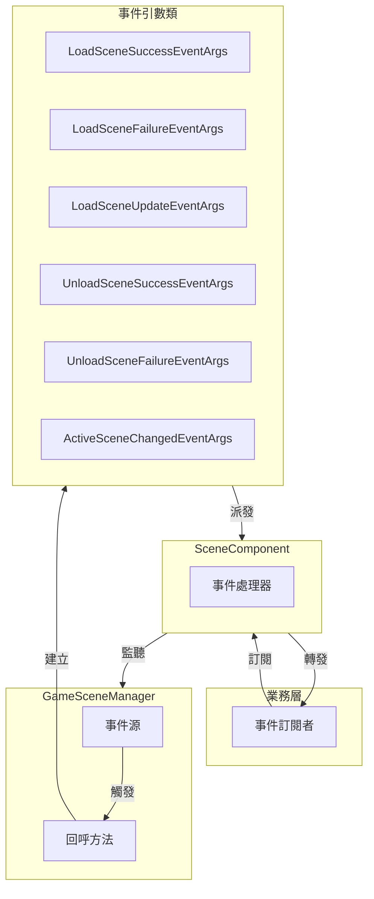
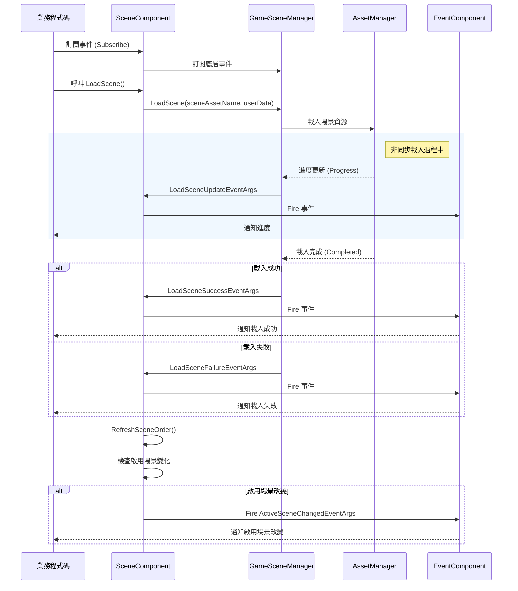

# 事件系統

GameFrameX Scene 場景管理模組提供了完善的事件系統，用於通知場景載入、解除安裝和啟用狀態的變化。本文件詳細介紹 Scene 模組的事件型別、事件流程以及如何在專案中使用這些事件。

## 概述

事件系統是 Scene 模組的核心組成部分，它採用觀察者模式（Observer Pattern）實現，允許開發者在場景狀態發生變化時接收通知並執行相應的邏輯。透過事件系統，可以實現：

- **解耦**：場景管理器與業務邏輯透過事件進行通訊，降低模組間的耦合度
- **非同步支援**：場景載入是非同步操作，事件系統提供了進度回呼和完成通知
- **狀態追蹤**：實時瞭解場景的載入、解除安裝、啟用狀態
- **物件池最佳化**：使用 `ReferencePool` 對事件引數進行復用，減少記憶體分配

Scene 模組定義了 6 種事件型別，涵蓋場景操作的完整生命週期：

| 事件型別 | 說明 | 觸發時機 |
|---------|------|---------|
| `LoadSceneSuccessEventArgs` | 載入場景成功事件 | 場景成功載入完成後 |
| `LoadSceneFailureEventArgs` | 載入場景失敗事件 | 場景載入失敗時 |
| `LoadSceneUpdateEventArgs` | 載入場景更新事件 | 場景載入過程中（進度更新） |
| `UnloadSceneSuccessEventArgs` | 解除安裝場景成功事件 | 場景成功解除安裝完成後 |
| `UnloadSceneFailureEventArgs` | 解除安裝場景失敗事件 | 場景解除安裝失敗時 |
| `ActiveSceneChangedEventArgs` | 啟用場景改變事件 | 當前啟用的場景發生變化時 |

## 架構

Scene 模組的事件系統採用分層架構設計，包含以下幾個關鍵組件：



### 事件流程

場景事件的發生遵循以下典型流程：



### 事件引數類層次結構

所有場景事件引數類都繼承自 `GameEventArgs` 基類（來自 GameFrameX.Event 模組），並實現了物件池化機制：

```mermaid
classDiagram
    class GameEventArgs {
        <<abstract>>
        +Id: string { get; }
        +Clear() void
    }
    
    class LoadSceneSuccessEventArgs {
        +EventId: string
        +SceneAssetName: string
        +Duration: float
        +UserData: object
        +Create() LoadSceneSuccessEventArgs
    }
    
    class LoadSceneFailureEventArgs {
        +EventId: string
        +SceneAssetName: string
        +ErrorMessage: string
        +Status: EOperationStatus
        +UserData: object
        +Create() LoadSceneFailureEventArgs
    }
    
    class LoadSceneUpdateEventArgs {
        +EventId: string
        +SceneAssetName: string
        +Progress: float
        +UserData: object
        +Create() LoadSceneUpdateEventArgs
    }
    
    class UnloadSceneSuccessEventArgs {
        +EventId: string
        +SceneAssetName: string
        +UserData: object
        +Create() UnloadSceneSuccessEventArgs
    }
    
    class UnloadSceneFailureEventArgs {
        +EventId: string
        +SceneAssetName: string
        +UserData: object
        +Create() UnloadSceneFailureEventArgs
    }
    
    class ActiveSceneChangedEventArgs {
        +EventId: string
        +LastActiveScene: Scene
        +ActiveScene: Scene
        +Create() ActiveSceneChangedEventArgs
    }
    
    GameEventArgs <|-- LoadSceneSuccessEventArgs
    GameEventArgs <|-- LoadSceneFailureEventArgs
    GameEventArgs <|-- LoadSceneUpdateEventArgs
    GameEventArgs <|-- UnloadSceneSuccessEventArgs
    GameEventArgs <|-- UnloadSceneFailureEventArgs
    GameEventArgs <|-- ActiveSceneChangedEventArgs
```

## 事件詳解

### 載入場景成功事件 (LoadSceneSuccessEventArgs)

場景成功載入完成後觸發，包含載入耗時資訊。

> Source: [LoadSceneSuccessEventArgs.cs](https://github.com/GameFrameX/com.gameframex.unity.scene/blob/main/Runtime/EventArgs/LoadSceneSuccessEventArgs.cs#L40-L105)

**屬性說明：**

| 屬性 | 型別 | 說明 |
|-----|------|------|
| `SceneAssetName` | string | 場景資源名稱 |
| `Duration` | float | 載入持續時間（秒） |
| `UserData` | object | 使用者自定義資料 |

### 載入場景失敗事件 (LoadSceneFailureEventArgs)

場景載入失敗時觸發，包含錯誤資訊。

> Source: [LoadSceneFailureEventArgs.cs](https://github.com/GameFrameX/com.gameframex.unity.scene/blob/main/Runtime/EventArgs/LoadSceneFailureEventArgs.cs#L41-L113)

**屬性說明：**

| 屬性 | 型別 | 說明 |
|-----|------|------|
| `SceneAssetName` | string | 場景資源名稱 |
| `ErrorMessage` | string | 錯誤資訊 |
| `Status` | EOperationStatus | 操作狀態 |
| `UserData` | object | 使用者自定義資料 |

### 載入場景更新事件 (LoadSceneUpdateEventArgs)

場景載入過程中持續觸發，用於顯示載入進度。

> Source: [LoadSceneUpdateEventArgs.cs](https://github.com/GameFrameX/com.gameframex.unity.scene/blob/main/Runtime/EventArgs/LoadSceneUpdateEventArgs.cs#L40-L105)

**屬性說明：**

| 屬性 | 型別 | 說明 |
|-----|------|------|
| `SceneAssetName` | string | 場景資源名稱 |
| `Progress` | float | 載入進度（0.0 - 1.0） |
| `UserData` | object | 使用者自定義資料 |

### 解除安裝場景成功事件 (UnloadSceneSuccessEventArgs)

場景成功解除安裝完成後觸發。

> Source: [UnloadSceneSuccessEventArgs.cs](https://github.com/GameFrameX/com.gameframex.unity.scene/blob/main/Runtime/EventArgs/UnloadSceneSuccessEventArgs.cs#L40-L96)

**屬性說明：**

| 屬性 | 型別 | 說明 |
|-----|------|------|
| `SceneAssetName` | string | 場景資源名稱 |
| `UserData` | object | 使用者自定義資料 |

### 解除安裝場景失敗事件 (UnloadSceneFailureEventArgs)

場景解除安裝失敗時觸發。

> Source: [UnloadSceneFailureEventArgs.cs](https://github.com/GameFrameX/com.gameframex.unity.scene/blob/main/Runtime/EventArgs/UnloadSceneFailureEventArgs.cs#L40-L96)

**屬性說明：**

| 屬性 | 型別 | 說明 |
|-----|------|------|
| `SceneAssetName` | string | 場景資源名稱 |
| `UserData` | object | 使用者自定義資料 |

### 啟用場景改變事件 (ActiveSceneChangedEventArgs)

當前啟用的場景發生變化時觸發。

> Source: [ActiveSceneChangedEventArgs.cs](https://github.com/GameFrameX/com.gameframex.unity.scene/blob/main/Runtime/EventArgs/ActiveSceneChangedEventArgs.cs#L40-L96)

**屬性說明：**

| 屬性 | 型別 | 說明 |
|-----|------|------|
| `LastActiveScene` | Scene | 上一個被啟用的場景 |
| `ActiveScene` | Scene | 當前被啟用的場景 |

## 使用示例

### 基礎用法：訂閱場景事件

在遊戲中，通常需要在遊戲入口或特定的管理器中訂閱場景事件。以下示例展示如何訂閱載入成功和失敗事件：

```csharp
using GameFrameX.Scene.Runtime;
using GameFrameX.Runtime;
using UnityEngine;

// 繼承自 MonoBehaviour 的指令碼
public class SceneEventExample : MonoBehaviour
{
    private SceneComponent _sceneComponent;

    private void Start()
    {
        // 獲取 SceneComponent 例項
        _sceneComponent = GameEntry.GetComponent<SceneComponent>();
        
        // 訂閱載入成功事件
        _sceneComponent.LoadSceneSuccess += OnLoadSceneSuccess;
        
        // 訂閱載入失敗事件
        _sceneComponent.LoadSceneFailure += OnLoadSceneFailure;
        
        // 訂閱解除安裝成功事件
        _sceneComponent.UnloadSceneSuccess += OnUnloadSceneSuccess;
        
        // 訂閱解除安裝失敗事件
        _sceneComponent.UnloadSceneFailure += OnUnloadSceneFailure;
        
        // 訂閱啟用場景改變事件
        _sceneComponent.ActiveSceneChanged += OnActiveSceneChanged;
    }

    private void OnLoadSceneSuccess(object sender, LoadSceneSuccessEventArgs e)
    {
        Debug.Log($"場景載入成功: {e.SceneAssetName}, 耗時: {e.Duration:F2}秒");
        
        // 可以透過 UserData 傳遞自定義資料
        if (e.UserData != null)
        {
            Debug.Log($"使用者資料: {e.UserData}");
        }
    }

    private void OnLoadSceneFailure(object sender, LoadSceneFailureEventArgs e)
    {
        Debug.LogError($"場景載入失敗: {e.SceneAssetName}, 錯誤: {e.ErrorMessage}");
    }

    private void OnUnloadSceneSuccess(object sender, UnloadSceneSuccessEventArgs e)
    {
        Debug.Log($"場景解除安裝成功: {e.SceneAssetName}");
    }

    private void OnUnloadSceneFailure(object sender, UnloadSceneFailureEventArgs e)
    {
        Debug.LogError($"場景解除安裝失敗: {e.SceneAssetName}");
    }

    private void OnActiveSceneChanged(object sender, ActiveSceneChangedEventArgs e)
    {
        Debug.Log($"啟用場景改變: {e.LastActiveScene.name} -> {e.ActiveScene.name}");
    }

    private void OnDestroy()
    {
        // 記得在組件銷燬時取消訂閱，避免記憶體洩漏
        if (_sceneComponent != null)
        {
            _sceneComponent.LoadSceneSuccess -= OnLoadSceneSuccess;
            _sceneComponent.LoadSceneFailure -= OnLoadSceneFailure;
            _sceneComponent.UnloadSceneSuccess -= OnUnloadSceneSuccess;
            _sceneComponent.UnloadSceneFailure -= OnUnloadSceneFailure;
            _sceneComponent.ActiveSceneChanged -= OnActiveSceneChanged;
        }
    }
}
```
> Source: [SceneComponent.cs](https://github.com/GameFrameX/com.gameframex.unity.scene/blob/main/Runtime/Scene/SceneComponent.cs#L89-L103)

### 高階用法：使用進度事件實現載入介面

在實際專案中，通常需要顯示載入介面來反饋載入進度：

```csharp
using UnityEngine;
using UnityEngine.UI;
using GameFrameX.Scene.Runtime;
using GameFrameX.Runtime;

public class LoadingSceneExample : MonoBehaviour
{
    [SerializeField] private Slider _progressSlider;
    [SerializeField] private Text _progressText;
    [SerializeField] private GameObject _loadingPanel;

    private SceneComponent _sceneComponent;

    private void Awake()
    {
        _loadingPanel.SetActive(false);
    }

    public void LoadSceneWithProgress(string sceneAssetName)
    {
        _sceneComponent = GameEntry.GetComponent<SceneComponent>();
        
        // 訂閱載入進度更新事件
        _sceneComponent.LoadSceneUpdate += OnLoadSceneUpdate;
        
        // 顯示載入介面
        _loadingPanel.SetActive(true);
        
        // 開始載入場景，傳入自定義資料
        var userData = new LoadSceneData { SceneName = sceneAssetName };
        _ = _sceneComponent.LoadScene(sceneAssetName, UnityEngine.SceneManagement.LoadSceneMode.Single, userData);
    }

    private void OnLoadSceneUpdate(object sender, LoadSceneUpdateEventArgs e)
    {
        // 更新 UI 顯示載入進度
        float progress = e.Progress * 100f;
        _progressSlider.value = e.Progress;
        _progressText.text = $"{progress:F1}%";
        
        Debug.Log($"載入進度: {e.SceneAssetName} - {progress:F1}%");
    }

    private void OnLoadSceneSuccess(object sender, LoadSceneSuccessEventArgs e)
    {
        Debug.Log($"場景載入完成: {e.SceneAssetName}");
        
        // 取消訂閱進度事件
        _sceneComponent.LoadSceneUpdate -= OnLoadSceneUpdate;
        
        // 隱藏載入介面
        _loadingPanel.SetActive(false);
    }

    // 自定義資料類
    public class LoadSceneData
    {
        public string SceneName;
    }
}
```

### 事件啟用配置

SceneComponent 提供了配置選項來控制事件的觸發：

```csharp
public sealed class SceneComponent : GameFrameworkComponent
{
    // 是否啟用載入場景更新事件
    [SerializeField] private bool m_EnableLoadSceneUpdateEvent = true;
    
    // 是否啟用載入場景依賴資源事件
    [SerializeField] private bool m_EnableLoadSceneDependencyAssetEvent = true;
}
```

> Source: [SceneComponent.cs](https://github.com/GameFrameX/com.gameframex.unity.scene/blob/main/Runtime/Scene/SceneComponent.cs#L62-L64)

透過 Inspector 面板或程式碼可以禁用不需要的事件，以最佳化效能。

## API 參考

### SceneComponent 事件

> Source: [SceneComponent.cs](https://github.com/GameFrameX/com.gameframex.unity.scene/blob/main/Runtime/Scene/SceneComponent.cs#L89-L103)

#### `LoadSceneSuccess` 事件

```csharp
public event EventHandler<LoadSceneSuccessEventArgs> LoadSceneSuccess;
```

場景載入成功時觸發。

**事件引數：**
- `SceneAssetName` (string): 場景資源名稱
- `Duration` (float): 載入持續時間
- `UserData` (object): 使用者自定義資料

---

#### `LoadSceneFailure` 事件

```csharp
public event EventHandler<LoadSceneFailureEventArgs> LoadSceneFailure;
```

場景載入失敗時觸發。

**事件引數：**
- `SceneAssetName` (string): 場景資源名稱
- `ErrorMessage` (string): 錯誤資訊
- `Status` (EOperationStatus): 操作狀態
- `UserData` (object): 使用者自定義資料

---

#### `LoadSceneUpdate` 事件

```csharp
public event EventHandler<LoadSceneUpdateEventArgs> LoadSceneUpdate;
```

場景載入過程中持續觸發。

**事件引數：**
- `SceneAssetName` (string): 場景資源名稱
- `Progress` (float): 載入進度 (0.0 - 1.0)
- `UserData` (object): 使用者自定義資料

---

#### `UnloadSceneSuccess` 事件

```csharp
public event EventHandler<UnloadSceneSuccessEventArgs> UnloadSceneSuccess;
```

場景解除安裝成功時觸發。

**事件引數：**
- `SceneAssetName` (string): 場景資源名稱
- `UserData` (object): 使用者自定義資料

---

#### `UnloadSceneFailure` 事件

```csharp
public event EventHandler<UnloadSceneFailureEventArgs> UnloadSceneFailure;
```

場景解除安裝失敗時觸發。

**事件引數：**
- `SceneAssetName` (string): 場景資源名稱
- `UserData` (object): 使用者自定義資料

---

#### `ActiveSceneChanged` 事件

```csharp
public event EventHandler<ActiveSceneChangedEventArgs> ActiveSceneChanged;
```

啟用場景發生改變時觸發。

**事件引數：**
- `LastActiveScene` (Scene): 上一個啟用的場景
- `ActiveScene` (Scene): 當前啟用的場景

### IGameSceneManager 事件

> Source: [IGameSceneManager.cs](https://github.com/GameFrameX/com.gameframex.unity.scene/blob/main/Runtime/Scene/Scene/IGameSceneManager.cs#L44-L70)

IGameSceneManager 介面定義了與 SceneComponent 相同的事件集，這些事件在 GameSceneManager 內部觸發，隨後被 SceneComponent 轉發到全域性事件系統。

### 事件引數建立方法

所有事件引數類都提供了靜態的 `Create` 方法用於建立事件例項，以及 `Clear` 方法用於清理資料（供物件池回收使用）。

```csharp
// 建立 LoadSceneSuccessEventArgs
LoadSceneSuccessEventArgs.Create(string sceneAssetName, float duration, object userData)

// 建立 LoadSceneFailureEventArgs
LoadSceneFailureEventArgs.Create(string sceneAssetName, EOperationStatus status, string errorMessage, object userData)

// 建立 LoadSceneUpdateEventArgs
LoadSceneUpdateEventArgs.Create(string sceneAssetName, float progress, object userData)

// 建立 UnloadSceneSuccessEventArgs
UnloadSceneSuccessEventArgs.Create(string sceneAssetName, object userData)

// 建立 UnloadSceneFailureEventArgs
UnloadSceneFailureEventArgs.Create(string sceneAssetName, object userData)

// 建立 ActiveSceneChangedEventArgs
ActiveSceneChangedEventArgs.Create(Scene lastActiveScene, Scene activeScene)
```

> Source: [LoadSceneSuccessEventArgs.cs](https://github.com/GameFrameX/com.gameframex.unity.scene/blob/main/Runtime/EventArgs/LoadSceneSuccessEventArgs.cs#L87-L94)

## 最佳實踐

### 1. 及時取消訂閱

在 MonoBehaviour 的 `OnDestroy` 或組件禁用時及時取消事件訂閱，避免記憶體洩漏：

```csharp
private void OnDestroy()
{
    if (_sceneComponent != null)
    {
        _sceneComponent.LoadSceneSuccess -= OnLoadSceneSuccess;
        // 取消其他所有訂閱...
    }
}
```

### 2. 使用 UserData 傳遞上下文

透過 `userData` 引數在場景載入時傳遞上下文資訊，避免使用全域性變數：

```csharp
// 載入場景時傳遞資料
await sceneComponent.LoadScene("Assets/Scenes/Game.unity", LoadSceneMode.Single, new GameLoadData { LevelId = 1 });

// 在事件中接收資料
private void OnLoadSceneSuccess(object sender, LoadSceneSuccessEventArgs e)
{
    if (e.UserData is GameLoadData data)
    {
        Debug.Log($"載入關卡: {data.LevelId}");
    }
}
```

### 3. 合理選擇事件型別

- **需要顯示進度條**：訂閱 `LoadSceneUpdate` 事件
- **只需要結果**：訂閱 `LoadSceneSuccess` / `LoadSceneFailure` 事件
- **需要響應場景切換**：訂閱 `ActiveSceneChanged` 事件

### 4. 禁用不需要的事件

如果不需要載入進度更新事件，可以在 Inspector 中禁用以提升效能：

```csharp
// 透過程式碼禁用
sceneComponent.m_EnableLoadSceneUpdateEvent = false;
```

## 相關連結

- [核心功能](./4-core-features) - 瞭解更多 Scene 模組的核心功能
- [API 參考](./5-api-reference) - 完整的 API 介面文件
- [快速入門](./3-getting-started) - 快速上手 Scene 模組
- [常見問題](./7-troubleshooting) - 常見問題與解決方案
- [GameFrameX 官網](https://gameframex.doc.alianblank.com/) - 官方文件
- [GitHub 倉庫](https://github.com/GameFrameX/com.gameframex.unity.scene) - 原始碼
