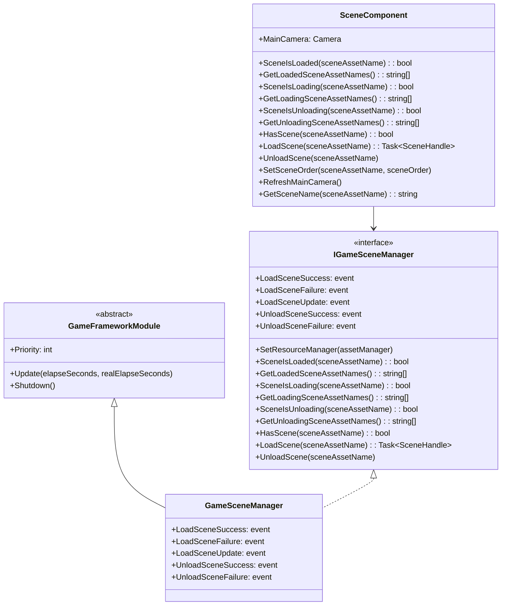
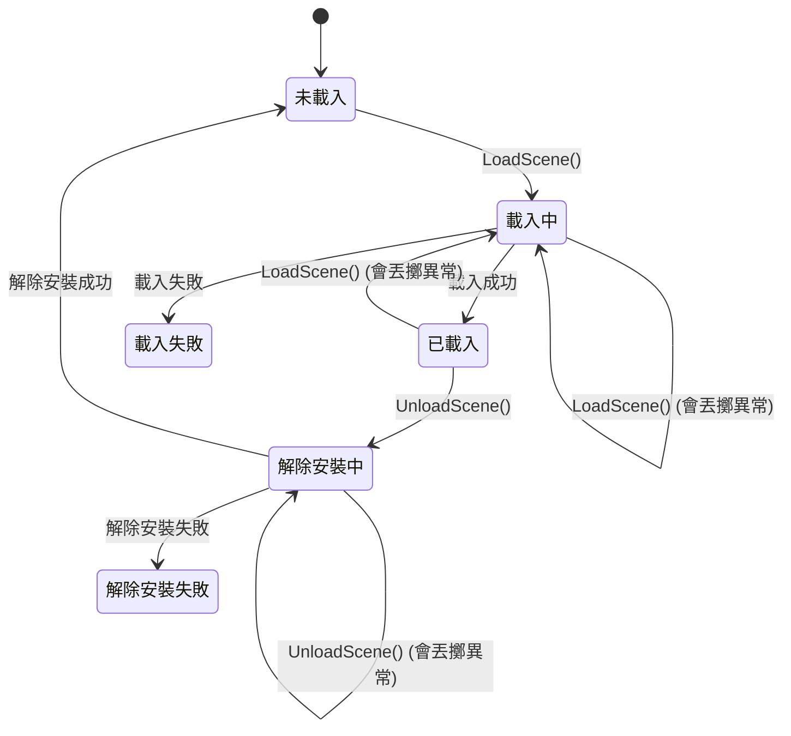

# API 參考

本文件詳細介紹 GameFrameX Scene 場景管理組件提供的所有公共 API，包括介面定義、方法簽名、引數說明以及返回值型別。

## 概述

GameFrameX Scene 組件提供了一套完整的場景管理解決方案，主要包含兩個核心類：

- **IGameSceneManager** - 場景管理器的抽象介面，定義了場景操作的標準契約
- **GameSceneManager** - IGameSceneManager 的具體實現，繼承自 GameFrameworkModule
- **SceneComponent** - Unity 組件封裝，提供 Unity 整合和場景啟用順序管理

組件依賴 YooAsset 資源管理系統進行場景資源的非同步載入和解除安裝。

## 類圖



## IGameSceneManager 介面

`IGameSceneManager` 是場景管理器的核心介面，定義了所有場景操作的標準方法。

> Source: [IGameSceneManager.cs](https://github.com/GameFrameX/com.gameframex.unity.scene/blob/main/Runtime/Scene/Scene/IGameSceneManager.cs#L1-L175)

### 事件定義

| 事件名稱 | 事件型別 | 描述 |
|---------|---------|------|
| LoadSceneSuccess | EventHandler~LoadSceneSuccessEventArgs~ | 場景載入成功時觸發 |
| LoadSceneFailure | EventHandler~LoadSceneFailureEventArgs~ | 場景載入失敗時觸發 |
| LoadSceneUpdate | EventHandler~LoadSceneUpdateEventArgs~ | 場景載入進度更新時觸發 |
| UnloadSceneSuccess | EventHandler~UnloadSceneSuccessEventArgs~ | 場景解除安裝成功時觸發 |
| UnloadSceneFailure | EventHandler~UnloadSceneFailureEventArgs~ | 場景解除安裝失敗時觸發 |

### `SetResourceManager(assetManager: IAssetManager): void`

設定資源管理器。在使用場景管理器之前必須先呼叫此方法設定 IAssetManager 實現。

**引數：**
- `assetManager` (IAssetManager): 資源管理器例項，不能為 null

**丟擲：**
- `GameFrameworkException`: 當 assetManager 為 null 時丟擲

---

### `SceneIsLoaded(sceneAssetName: string): bool`

檢查指定場景是否已載入。

**引數：**
- `sceneAssetName` (string): 場景資源名稱

**返回：** 
- (bool): 場景已載入返回 true，否則返回 false

**丟擲：**
- `GameFrameworkException`: 當 sceneAssetName 為空或 null 時丟擲

---

### `GetLoadedSceneAssetNames(): string[]`

獲取所有已載入場景的資源名稱。

**返回：** 
- (string[]): 已載入場景的資源名稱陣列

---

### `GetLoadedSceneAssetNames(results: List<string>): void`

獲取所有已載入場景的資源名稱（使用列表引數避免記憶體分配）。

**引數：**
- `results` (`List<string>`): 用於儲存結果的列表，不能為 null

**丟擲：**
- `GameFrameworkException`: 當 results 為 null 時丟擲

---

### `SceneIsLoading(sceneAssetName: string): bool`

檢查指定場景是否正在載入。

**引數：**
- `sceneAssetName` (string): 場景資源名稱

**返回：** 
- (bool): 場景正在載入返回 true，否則返回 false

**丟擲：**
- `GameFrameworkException`: 當 sceneAssetName 為空或 null 時丟擲

---

### `GetLoadingSceneAssetNames(): string[]`

獲取所有正在載入場景的資源名稱。

**返回：** 
- (string[]): 正在載入場景的資源名稱陣列

---

### `GetLoadingSceneAssetNames(results: List<string>): void`

獲取所有正在載入場景的資源名稱（使用列表引數避免記憶體分配）。

**引數：**
- `results` (`List<string>`): 用於儲存結果的列表，不能為 null

**丟擲：**
- `GameFrameworkException`: 當 results 為 null 時丟擲

---

### `SceneIsUnloading(sceneAssetName: string): bool`

檢查指定場景是否正在解除安裝。

**引數：**
- `sceneAssetName` (string): 場景資源名稱

**返回：** 
- (bool): 場景正在解除安裝返回 true，否則返回 false

**丟擲：**
- `GameFrameworkException`: 當 sceneAssetName 為空或 null 時丟擲

---

### `GetUnloadingSceneAssetNames(): string[]`

獲取所有正在解除安裝場景的資源名稱。

**返回：** 
- (string[]): 正在解除安裝場景的資源名稱陣列

---

### `GetUnloadingSceneAssetNames(results: List<string>): void`

獲取所有正在解除安裝場景的資源名稱（使用列表引數避免記憶體分配）。

**引數：**
- `results` (`List<string>`): 用於儲存結果的列表，不能為 null

**丟擲：**
- `GameFrameworkException`: 當 results 為 null 時丟擲

---

### `HasScene(sceneAssetName: string): bool`

檢查場景資源是否存在。

**引數：**
- `sceneAssetName` (string): 要檢查的場景資源名稱

**返回：** 
- (bool): 場景資源存在返回 true，否則返回 false

---

### `LoadScene(sceneAssetName: string): Task<SceneHandle>`

載入場景（使用預設引數）。以 Single 模式載入場景，不攜帶使用者資料。

**引數：**
- `sceneAssetName` (string): 場景資源名稱

**返回：** 
- (Task~SceneHandle~): 非同步操作任務，完成後返回 SceneHandle

**過載方法：**
```csharp
Task<SceneHandle> LoadScene(string sceneAssetName, object userData)
Task<SceneHandle> LoadScene(string sceneAssetName, LoadSceneMode sceneMode, object userData)
```

**引數說明：**
- `sceneAssetName` (string): 場景資源名稱（如 "Assets/Scenes/Game.unity"）
- `sceneMode` (LoadSceneMode): 載入模式，Single 或 Additive
- `userData` (object): 使用者自定義資料，會在事件中回傳

**丟擲：**
- `GameFrameworkException`: 當 sceneAssetName 為空或 null 時丟擲
- `GameFrameworkException`: 當未設定資源管理器時丟擲
- `GameFrameworkException`: 當場景正在解除安裝時丟擲
- `GameFrameworkException`: 當場景正在載入時丟擲
- `GameFrameworkException`: 當場景已載入時丟擲

---

### `UnloadScene(sceneAssetName: string): void`

解除安裝場景（使用預設引數）。不攜帶使用者資料。

**引數：**
- `sceneAssetName` (string): 場景資源名稱

**過載方法：**
```csharp
void UnloadScene(string sceneAssetName, object userData)
```

**引數說明：**
- `sceneAssetName` (string): 場景資源名稱
- `userData` (object): 使用者自定義資料，會在事件中回傳

**丟擲：**
- `GameFrameworkException`: 當 sceneAssetName 為空或 null 時丟擲
- `GameFrameworkException`: 當未設定資源管理器時丟擲
- `GameFrameworkException`: 當場景正在解除安裝時丟擲
- `GameFrameworkException`: 當場景正在載入時丟擲
- `GameFrameworkException`: 當場景未載入時丟擲

---

## SceneComponent 類

SceneComponent 是 Unity 組件封裝，繼承自 GameFrameworkComponent，提供與 Unity 生態系統的整合。

> Source: [SceneComponent.cs](https://github.com/GameFrameX/com.gameframex.unity.scene/blob/main/Runtime/Scene/SceneComponent.cs#L1-L472)

### 屬性

| 屬性名 | 型別 | 描述 |
|-------|------|------|
| MainCamera | Camera | 獲取當前場景的主攝像機 |

### 序列化欄位

| 欄位名 | 型別 | 預設值 | 描述 |
|-------|------|--------|------|
| m_EnableLoadSceneUpdateEvent | bool | true | 是否啟用場景載入更新事件 |
| m_EnableLoadSceneDependencyAssetEvent | bool | true | 是否啟用場景依賴資源載入事件 |

---

### `GetSceneName(sceneAssetName: string): string`

從場景資源路徑中提取場景名稱。

**引數：**
- `sceneAssetName` (string): 場景資源路徑（如 "Assets/Scenes/Game.unity"）

**返回：** 
- (string): 場景名稱（如 "Game"），無效輸入返回 null

**示例：**
```csharp
// 輸入: "Assets/Scenes/MainMenu.unity"
// 輸出: "MainMenu"
string sceneName = SceneComponent.GetSceneName("Assets/Scenes/MainMenu.unity");
```
> Source: [SceneComponent.cs](https://github.com/GameFrameX/com.gameframex.unity.scene/blob/main/Runtime/Scene/SceneComponent.cs#L144-L167)

---

### `LoadScene(sceneAssetName: string): Task<SceneHandle>`

載入場景（使用預設引數）。以 Additive 模式載入場景。

> 注意：SceneComponent 的預設載入模式為 Additive，與 IGameSceneManager 的預設模式（Single）不同。

**引數：**
- `sceneAssetName` (string): 場景資源名稱

**返回：** 
- (Task~SceneHandle~): 非同步操作任務，完成後返回 SceneHandle

**過載方法：**
```csharp
Task<SceneHandle> LoadScene(string sceneAssetName, LoadSceneMode sceneMode, object userData = null)
```

**驗證規則：**
- sceneAssetName 必須以 "Assets/" 開頭
- sceneAssetName 必須以 ".unity" 結尾

**示例：**
```csharp
// 非同步載入場景
var sceneComponent = GameEntry.GetComponent<SceneComponent>();
var handle = await sceneComponent.LoadScene("Assets/Scenes/Game.unity", LoadSceneMode.Additive);
Debug.Log($"場景載入完成，耗時: {handle.Duration}");
```
> Source: [SceneComponent.cs](https://github.com/GameFrameX/com.gameframex.unity.scene/blob/main/Runtime/Scene/SceneComponent.cs#L280-L307)

---

### `UnloadScene(sceneAssetName: string, userData: object = null): void`

解除安裝場景。

**引數：**
- `sceneAssetName` (string): 場景資源名稱
- `userData` (object): 使用者自定義資料（可選）

**驗證規則：**
- sceneAssetName 必須以 "Assets/" 開頭
- sceneAssetName 必須以 ".unity" 結尾

**示例：**
```csharp
var sceneComponent = GameEntry.GetComponent<SceneComponent>();
sceneComponent.UnloadScene("Assets/Scenes/MainMenu.unity");
```
> Source: [SceneComponent.cs](https://github.com/GameFramex.unity.scene/blob/main/Runtime/Scene/SceneComponent.cs#L314-L331)

---

### `SetSceneOrder(sceneAssetName: string, sceneOrder: int): void`

設定場景的啟用順序。該方法用於管理多個 Additive 載入場景時的活動場景優先順序。

**引數：**
- `sceneAssetName` (string): 場景資源名稱
- `sceneOrder` (int): 場景順序，數值越大優先順序越高

**行為說明：**
- 如果場景正在載入，將場景順序記錄到內部字典，待載入完成後應用
- 如果場景已載入，立即重新整理場景順序
- 如果場景未載入也未載入中，記錄錯誤日誌

**示例：**
```csharp
var sceneComponent = GameEntry.GetComponent<SceneComponent>();
// 設定 Main 場景的優先順序最高
sceneComponent.SetSceneOrder("Assets/Scenes/Main.unity", 100);
sceneComponent.SetSceneOrder("Assets/Scenes/UI.unity", 50);
```
> Source: [SceneComponent.cs](https://github.com/GameFrameX/com.gameframex.unity.scene/blob/main/Runtime/Scene/SceneComponent.cs#L338-L367)

---

### `RefreshMainCamera(): void`

重新整理當前場景的主攝像機引用。通常在場景載入或啟用場景變更後呼叫。

> Source: [SceneComponent.cs](https://github.com/GameFrameX/com.gameframex.unity.scene/blob/main/Runtime/Scene/SceneComponent.cs#L372-L375)

---

## 事件引數類

所有場景事件引數類都繼承自 GameEventArgs，並實現了 Create 工廠方法和 Clear 方法用於物件池管理。

> Source: [LoadSceneSuccessEventArgs.cs](https://github.com/GameFrameX/com.gameframex.unity.scene/blob/main/Runtime/EventArgs/LoadSceneSuccessEventArgs.cs#L1-L106)

### LoadSceneSuccessEventArgs

場景載入成功事件引數。

| 屬性名 | 型別 | 描述 |
|-------|------|------|
| SceneAssetName | string | 場景資源名稱 |
| Duration | float | 載入持續時間（秒） |
| UserData | object | 使用者自定義資料 |

**事件 ID:** `GameFrameX.Scene.Runtime.LoadSceneSuccessEventArgs`

---

### LoadSceneFailureEventArgs

場景載入失敗事件引數。

| 屬性名 | 型別 | 描述 |
|-------|------|------|
| SceneAssetName | string | 場景資源名稱 |
| ErrorMessage | string | 錯誤資訊 |
| UserData | object | 使用者自定義資料 |
| Status | EOperationStatus | 操作狀態 |

**事件 ID:** `GameFrameX.Scene.Runtime.LoadSceneFailureEventArgs`

> Source: [LoadSceneFailureEventArgs.cs](https://github.com/GameFrameX/com.gameframex.unity.scene/blob/main/Runtime/EventArgs/LoadSceneFailureEventArgs.cs#L1-L114)

---

### LoadSceneUpdateEventArgs

場景載入進度更新事件引數。

| 屬性名 | 型別 | 描述 |
|-------|------|------|
| SceneAssetName | string | 場景資源名稱 |
| Progress | float | 載入進度（0.0 - 1.0） |
| UserData | object | 使用者自定義資料 |

**事件 ID:** `GameFrameX.Scene.Runtime.LoadSceneUpdateEventArgs`

> Source: [LoadSceneUpdateEventArgs.cs](https://github.com/GameFrameX/com.gameframex.unity.scene/blob/main/Runtime/EventArgs/LoadSceneUpdateEventArgs.cs#L1-L106)

---

### UnloadSceneSuccessEventArgs

場景解除安裝成功事件引數。

| 屬性名 | 型別 | 描述 |
|-------|------|------|
| SceneAssetName | string | 場景資源名稱 |
| UserData | object | 使用者自定義資料 |

**事件 ID:** `GameFrameX.Scene.Runtime.UnloadSceneSuccessEventArgs`

> Source: [UnloadSceneSuccessEventArgs.cs](https://github.com/GameFrameX/com.gameframex.unity.scene/blob/main/Runtime/EventArgs/UnloadSceneSuccessEventArgs.cs#L1-L97)

---

### UnloadSceneFailureEventArgs

場景解除安裝失敗事件引數。

| 屬性名 | 型別 | 描述 |
|-------|------|------|
| SceneAssetName | string | 場景資源名稱 |
| UserData | object | 使用者自定義資料 |

**事件 ID:** `GameFrameX.Scene.Runtime.UnloadSceneFailureEventArgs`

> Source: [UnloadSceneFailureEventArgs.cs](https://github.com/GameFrameX/com.gameframex.unity.scene/blob/main/Runtime/EventArgs/UnloadSceneFailureEventArgs.cs#L1-L97)

---

### ActiveSceneChangedEventArgs

啟用場景變更事件引數。

| 屬性名 | 型別 | 描述 |
|-------|------|------|
| LastActiveScene | UnityEngine.SceneManagement.Scene | 上一個啟用的場景 |
| ActiveScene | UnityEngine.SceneManagement.Scene | 當前啟用的場景 |

**事件 ID:** `GameFrameX.Scene.Runtime.ActiveSceneChangedEventArgs`

> Source: [ActiveSceneChangedEventArgs.cs](https://github.com/GameFrameX/com.gameframex.unity.scene/blob/main/Runtime/EventArgs/ActiveSceneChangedEventArgs.cs#L1-L97)

---

## 場景狀態流程



---

## 常見使用模式

### 1. 透過 SceneComponent 載入和解除安裝場景

```csharp
// 獲取 SceneComponent 例項
var sceneComponent = GameEntry.GetComponent<SceneComponent>();

// 訂閱場景載入成功事件
sceneComponent.LoadSceneSuccess += OnLoadSceneSuccess;

// 載入場景
await sceneComponent.LoadScene("Assets/Scenes/Game.unity", LoadSceneMode.Additive);

private void OnLoadSceneSuccess(object sender, LoadSceneSuccessEventArgs e)
{
    Debug.Log($"場景 {e.SceneAssetName} 載入成功，耗時: {e.Duration}秒");
}
```

> Source: [SceneComponent.cs](https://github.com/GameFrameX/com.gameframex.unity.scene/blob/main/Runtime/Scene/SceneComponent.cs#L437-L446)

---

### 2. 場景切換（單場景模式）

```csharp
var sceneComponent = GameEntry.GetComponent<SceneComponent>();

// 解除安裝當前場景
sceneComponent.UnloadScene(currentSceneName);

// 載入新場景
await sceneComponent.LoadScene(newSceneName, LoadSceneMode.Single);
```

---

### 3. 多場景管理（ additive 模式）

```csharp
var sceneComponent = GameEntry.GetComponent<SceneComponent>();

// 載入基礎場景
await sceneComponent.LoadScene("Assets/Scenes/Base.unity", LoadSceneMode.Additive);

// 載入遊戲玩法場景
await sceneComponent.LoadScene("Assets/Scenes/Gameplay.unity", LoadSceneMode.Additive);

// 載入 UI 場景（優先順序最高）
sceneComponent.SetSceneOrder("Assets/Scenes/UI.unity", 100);
await sceneComponent.LoadScene("Assets/Scenes/UI.unity", LoadSceneMode.Additive);
```

---

### 4. 處理場景載入失敗

```csharp
var sceneComponent = GameEntry.GetComponent<SceneComponent>();

sceneComponent.LoadSceneFailure += OnLoadSceneFailure;

try 
{
    await sceneComponent.LoadScene("Assets/Scenes/Game.unity");
}
catch (Exception ex)
{
    Debug.LogError($"場景載入異常: {ex.Message}");
}

private void OnLoadSceneFailure(object sender, LoadSceneFailureEventArgs e)
{
    Debug.LogError($"場景載入失敗: {e.ErrorMessage}");
    // 可以在這裡顯示錯誤 UI 或執行其他恢復邏輯
}
```

---

### 5. 監聽活動場景變化

```csharp
var sceneComponent = GameEntry.GetComponent<SceneComponent>();

// 注意：ActiveSceneChangedEventArgs 透過 EventComponent 觸發
// 需要透過事件系統訂閱
```

> 關於事件系統的詳細使用，請參見 [事件系統](./6-events) 文件。

---

## 錯誤處理

場景管理器在以下情況會丟擲 GameFrameworkException：

| 錯誤場景 | 異常訊息 |
|---------|---------|
| sceneAssetName 為空 | "Scene asset name is invalid." |
| assetManager 未設定 | "You must set resource manager first." |
| 場景正在解除安裝 | "Scene asset '{0}' is being unloaded." |
| 場景正在載入 | "Scene asset '{0}' is being loaded." |
| 場景已載入 | "Scene asset '{0}' is already loaded." |
| 場景未載入 | "Scene asset '{0}' is not loaded yet." |

> Source: [GameSceneManager.cs](https://github.com/GameFrameX/com.gameframex.unity.scene/blob/main/Runtime/Scene/Scene/GameSceneManager.cs#L350-L373)

---

## 相關連結

- [核心功能](./4-core-features) - 瞭解場景管理的核心功能設計
- [事件系統](./6-events) - 瞭解事件系統的詳細使用
- [快速入門](./3-getting-started) - 快速開始使用場景組件
- [常見問題](./7-troubleshooting) - 常見問題與解決方案
