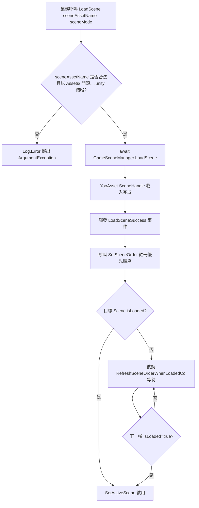

# 運作原理：非同步載入與作用中場景排序

`SceneComponent` 基於 YooAsset 的 `SceneHandle` 實作了**非同步載入**,當多個場景疊加(Additive)時,會透過 `m_SceneOrder` 排序字典與 `RefreshSceneOrder()` 來選取當前作用中場景。本文說明從呼叫 `LoadScene` 到 Unity `SetActiveScene` 的關鍵流程。

## 關鍵欄位概覽

| 欄位 | 類型 | 用途 |
|------|------|---------|
| `m_SceneOrder` | `SortedDictionary<string,int>` | 記錄每個 `sceneAssetName` 的作用中優先順序(數值越高 = 優先順序越高)|
| `m_GameFrameworkScene` | `UnityEngine.SceneManagement.Scene` | 框架內建場景;當沒有任何業務場景載入時,會回退至此場景 |
| `m_RefreshSceneOrderCo` | `Coroutine` | 當 YooAsset 已完成但 Unity 的 `isLoaded` 尚未為 `true` 時的重試協程 |
| `DefaultPriority` | `const int = 0` | 預設優先順序常數 |
| `m_EnableLoadSceneUpdateEvent` | `bool` | 是否啟用 `LoadSceneUpdate` 進度事件(預設為 `true`)|

欄位定義請參閱 [SceneComponent.cs](https://github.com/GameFrameX/com.gameframex.unity.scene/blob/main/Runtime/Scene/SceneComponent.cs#L51-L65)。

## 非同步載入流程

`SceneComponent.LoadScene` 回傳 `Task<YooAsset.SceneHandle>`,並在內部將請求轉發給 `GameSceneManager`。後者維護三個字典來區分載入狀態：

| 字典 | 含義 |
|------------|---------|
| `m_LoadedSceneAssetNames` | 已成功載入的場景資源 |
| `m_LoadingSceneAssetNames` | 正在載入中的場景(持有 `SceneHandleData`)|
| `m_UnloadingSceneAssetNames` | 正在卸載中的場景 |

字典與初始化邏輯請參閱 [GameSceneManager.cs](https://github.com/GameFrameX/com.gameframex.unity.scene/blob/main/Runtime/Scene/Scene/GameSceneManager.cs#L59-L84)。

`SceneComponent.Awake()` 訂閱了 `GameSceneManager` 上的五個事件:`LoadSceneSuccess`、`LoadSceneFailure`、`LoadSceneUpdate`(預設啟用)、`UnloadSceneSuccess` 與 `UnloadSceneFailure`。訂閱程式碼如下：

```csharp
_gameSceneManager.LoadSceneSuccess += OnLoadGameSceneSuccess;
_gameSceneManager.LoadSceneFailure += OnLoadGameSceneFailure;
if (m_EnableLoadSceneUpdateEvent)
{
    _gameSceneManager.LoadSceneUpdate += OnLoadGameSceneUpdate;
}
_gameSceneManager.UnloadSceneSuccess += OnUnloadGameSceneSuccess;
_gameSceneManager.UnloadSceneFailure += OnUnloadGameSceneFailure;
```

來源:[SceneComponent.cs](https://github.com/GameFrameX/com.gameframex.unity.scene/blob/main/Runtime/Scene/SceneComponent.cs#L91-L105)

`LoadScene` 的公開簽章如下:

```csharp
public async Task<YooAsset.SceneHandle> LoadScene(
    string sceneAssetName,
    UnityEngine.SceneManagement.LoadSceneMode sceneMode,
    object userData = null);
```

它會驗證 `sceneAssetName` 必須以 `Assets/` 開頭且以 `.unity` 結尾，然後 `await` 底層的 `GameSceneManager.LoadScene`。

來源:[SceneComponent.cs](https://github.com/GameFrameX/com.gameframex.unity.scene/blob/main/Runtime/Scene/SceneComponent.cs#L306-L322)

## 作用中場景排序機制

排序與啟用的核心進入點是 `SetSceneOrder` 與 `RefreshSceneOrder`。

```csharp
public void SetSceneOrder(string sceneAssetName, int sceneOrder)
{
    // ... 驗證 sceneAssetName 是否合法 ...
    if (SceneIsLoading(sceneAssetName))
    {
        m_SceneOrder[sceneAssetName] = sceneOrder;
        return;
    }
    if (SceneIsLoaded(sceneAssetName))
    {
        m_SceneOrder[sceneAssetName] = sceneOrder;
        RefreshSceneOrder();
        return;
    }
    Log.Error("Scene '{0}' is not loaded or loading.", sceneAssetName);
}
```

來源:[SceneComponent.cs](https://github.com/GameFrameX/com.gameframex.unity.scene/blob/main/Runtime/Scene/SceneComponent.cs#L352-L381)

`RefreshSceneOrder` 的運作方式如下：

1. 遍歷 `m_SceneOrder`,跳過仍在載入中的場景(`SceneIsLoading`),選出 `sceneOrder.Value` 最大的場景作為候選作用中場景。
2. 若所有場景仍在載入中或字典為空，則 `SetActiveScene(m_GameFrameworkScene)` 回退至框架場景。
3. 透過 `SceneManager.GetSceneByName(GetSceneName(maxSceneName))` 取得 Unity 場景物件。若 `scene.isLoaded == false` —— YooAsset 的 `await` 完成時機通常**早於** Unity 的 `isLoaded=true` —— 此時直接呼叫 `SetActiveScene` 會拋出 `ArgumentException`。

此時 `RefreshSceneOrder` 會啟動協程 `RefreshSceneOrderWhenLoadedCo`,等待下一幀 `isLoaded` 變為 `true` 後再啟用。同時也會 `StopCoroutine` 停止同名的舊協程，以避免舊協程與新協程爭用啟用順序。

來源:[SceneComponent.cs](https://github.com/GameFrameX/com.gameframex.unity.scene/blob/main/Runtime/Scene/SceneComponent.cs#L392-L437)



## 事件酬載(EventArgs)

非同步載入過程會透過 `GameFrameX.Runtime` 的物件池派發事件。所有酬載皆為 `GameEventArgs` 的子類別，並在 [GameFrameXSceneCroppingHelper.cs](https://github.com/GameFrameX/com.gameframex.unity.scene/blob/main/Runtime/GameFrameXSceneCroppingHelper.cs#L10-L21) 的 AOT 裁剪輔助器中被明確引用，以防止被錯誤裁減。

| 事件 | 酬載類別 | 用途 |
|-------|---------------|---------|
| `LoadSceneSuccess` | `LoadSceneSuccessEventArgs` | 載入成功 |
| `LoadSceneFailure` | `LoadSceneFailureEventArgs` | 載入失敗(包含 `Status`、`ErrorMessage`)|
| `LoadSceneUpdate` | `LoadSceneUpdateEventArgs` | 進度更新 |
| `UnloadSceneSuccess` | `UnloadSceneSuccessEventArgs` | 卸載成功 |
| `UnloadSceneFailure` | `UnloadSceneFailureEventArgs` | 卸載失敗 |
| `ActiveSceneChanged` | `ActiveSceneChangedEventArgs` | Unity 作用中場景變更 |

## 相關連結

- [SceneComponent.cs](https://github.com/GameFrameX/com.gameframex.unity.scene/blob/main/Runtime/Scene/SceneComponent.cs#L294-L343) — `LoadScene`/`UnloadScene`/`SetSceneOrder` 進入點
- [GameSceneManager.cs](https://github.com/GameFrameX/com.gameframex.unity.scene/blob/main/Runtime/Scene/Scene/GameSceneManager.cs#L145-L164) — 非同步載入實作，Update、Shutdown 會回收所有已載入場景
- [IGameSceneManager.cs](https://github.com/GameFrameX/com.gameframex.unity.scene/blob/main/Runtime/Scene/Scene/IGameSceneManager.cs) — 管理器介面契約
- [GameFrameXSceneCroppingHelper.cs](https://github.com/GameFrameX/com.gameframex.unity.scene/blob/main/Runtime/GameFrameXSceneCroppingHelper.cs) — AOT 裁剪輔助類別
- 相關 EventArgs:`LoadSceneSuccessEventArgs`、`LoadSceneFailureEventArgs`、`LoadSceneUpdateEventArgs`、`UnloadSceneSuccessEventArgs`、`UnloadSceneFailureEventArgs`、`ActiveSceneChangedEventArgs`(皆位於 `Runtime/EventArgs/`)