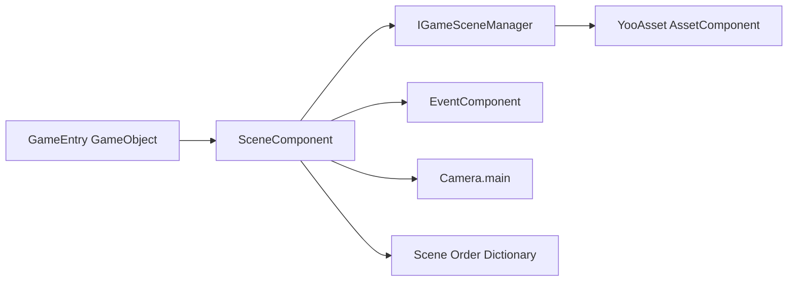

# 簡介與功能

GameFrameX Scene 是一個基於 [YooAsset](https://github.com/tuyoogame/YooAsset) 的 Unity 場景管理套件，提供非同步場景載入/卸載、事件驅動的狀態通知、進度追蹤以及作用中場景優先順序排序等功能。它是 Game Frame X 系統中場景子系統的統一入口。

## 快速開始

### 相依套件

| 套件 | 最低版本 |
|---|---------|
| `com.gameframex.unity.asset` | >= 2.5.0 |
| `com.gameframex.unity.event` | >= 1.1.0 |

### 安裝(UPM Scoped Registry)

編輯 Unity 專案的 `Packages/manifest.json`,在 `scopedRegistries` 中加入 GameFrameX 儲存庫，並在 `dependencies` 中加入 Scene 套件：

```json
{
  "scopedRegistries": [
    {
      "name": "GameFrameX",
      "url": "https://gameframex.upm.alianblank.uk",
      "scopes": ["com.gameframex"]
    }
  ],
  "dependencies": {
    "com.gameframex.unity.scene": "2.2.1"
  }
}
```

來源:[README.zh-CN.md](https://github.com/GameFrameX/com.gameframex.unity.scene/blob/main/README.zh-CN.md#L57-L73)

如需其他安裝方式(Git URL / 手動放置於 `Packages` 目錄)及詳細步驟，請參閱「安裝」。

### 新增 SceneComponent

在 GameEntry GameObject 上透過 `Add Component > GameFrameX > Scene` 新增 `SceneComponent`。框架會在啟動時自動將其初始化，無需額外呼叫。

```csharp
[DisallowMultipleComponent]
[AddComponentMenu("GameFrameX/Scene")]
[GameFrameXAutoComponent(-4000)]
public sealed class SceneComponent : GameFrameworkComponent
```

來源:[SceneComponent.cs](https://github.com/GameFrameX/com.gameframex.unity.scene/blob/main/Runtime/Scene/SceneComponent.cs#L46-L49)

### 執行第一個場景

1. 透過 `SceneComponent.LoadScene` 非同步載入場景，取得 `SceneHandle`。
2. 透過 `SceneComponent.SetSceneOrder` 設定優先順序，使其成為作用中場景。
3. 透過 `EventComponent` 訂閱 `LoadSceneSuccessEventArgs` 回呼通知。

```csharp
var handle = await SceneComponent.LoadScene("Assets/Scenes/GameScene.unity");
SceneComponent.SetSceneOrder("Assets/Scenes/GameScene.unity", 10);

EventComponent.Subscribe<LoadSceneSuccessEventArgs>(e =>
{
    Debug.Log($"Scene {e.SceneAssetName} loaded successfully, took {e.Duration:F2}s");
});
```

來源:[README.zh-CN.md](https://github.com/GameFrameX/com.gameframex.unity.scene/blob/main/README.zh-CN.md#L107-L154)

## 功能

| 功能 | 說明 |
|------|------|
| 非同步場景載入/卸載 | 基於 `Task` 的 `LoadScene` 與 `UnloadScene` API |
| `LoadSceneMode` 支援 | `Single`(全部替換)與 `Additive`(疊加)兩種模式 |
| 進度追蹤 | 透過 `LoadSceneUpdateEventArgs` 取得即時進度，可用於驅動載入 UI |
| 作用中場景排序 | 透過 `SetSceneOrder` 設定優先順序，數值越高者越優先成為作用中場景 |
| 自動刷新攝影機 | 當作用中場景切換時，自動刷新 `Camera.main` 參考 |
| 事件通知 | 透過 `EventComponent` 訂閱載入/卸載的成功、失敗與更新事件 |
| 狀態查詢 | 可隨時透過 `SceneIsLoaded` / `SceneIsLoading` / `SceneIsUnloading` 查詢 |
| 編輯器擴充 | `SceneComponent` 自訂 Inspector 面板 |

來源:[README.zh-CN.md](https://github.com/GameFrameX/com.gameframex.unity.scene/blob/main/README.zh-CN.md#L28-L37)

## 運作原理概覽

Scene 子系統以 `SceneComponent` 作為統一入口，內部委派 `IGameSceneManager` 與 `GameSceneManager` 執行非同步場景載入，並將生命週期事件轉發至 `EventComponent` 匯流排。呼叫端可透過訂閱事件或呼叫 `SceneIsLoaded` 等查詢介面來獲取狀態。



來源:[SceneComponent.cs](https://github.com/GameFrameX/com.gameframex.unity.scene/blob/main/Runtime/Scene/SceneComponent.cs#L49-L61)

## 後續步驟

- 如需場景載入/卸載的完整步驟與範例，請參閱「載入與卸載場景」
- 如需完整的事件訂閱清單，請參閱「事件參考」
- 如需 API 快速參考與版本變更，請參閱「API 參考」與「變更記錄」