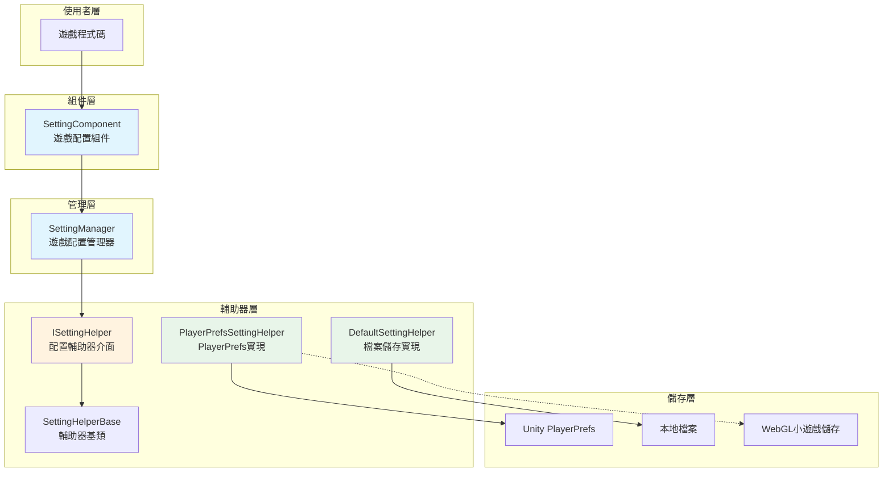
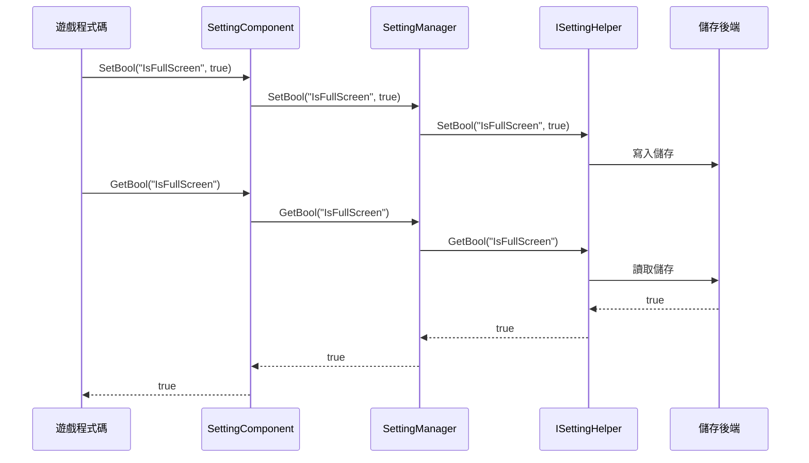

# 概述

GameFrameX Setting 配置組件是 GameFrameX 遊戲框架的核心組件之一，負責管理遊戲的配置資訊，提供儲存和獲取各種型別配置資料的功能。該組件採用分層架構設計，支援多種儲存後端，使遊戲設定的管理變得簡單高效。

## 概述

Setting 配置組件旨在解決遊戲開發中普遍存在的配置管理需求。在遊戲開發過程中，開發者需要儲存各種型別的設定資料，如畫面質量、音量大小、按鍵繫結、遊戲進度等。傳統做法是自行實現一套配置系統，不僅程式碼複用性低，而且難以維護。

GameFrameX Setting 組件提供了統一的配置管理解決方案：

- **型別安全**: 支援布林值、整數、浮點數、字串以及任意可序列化物件
- **多儲存後端**: 內建 PlayerPrefs 和檔案儲存兩種實現，支援自定義擴充套件
- **跨平臺支援**: 全面支援 Unity 各平臺，包括 WebGL 小遊戲（抖音、微信、快手）
- **編輯器整合**: 提供 Unity 編輯器Inspector面板，視覺化配置組件

## 架構設計



### 核心組件說明

| 組件 | 說明 | 設計意圖 |
|------|------|----------|
| SettingComponent | Unity MonoBehaviour 組件 | 作為框架與遊戲程式碼的橋樑，提供編輯器整合和生命週期管理 |
| SettingManager | 核心業務邏輯模組 | 負責設定資料的管理，驗證輸入，轉發請求到輔助器 |
| ISettingHelper | 儲存抽象介面 | 解耦儲存實現，便於擴充套件新的儲存後端 |
| SettingHelperBase | 輔助器基類 | 提供抽象方法定義，簡化輔助器實現 |

### 資料流向



## 功能特性

### 支援的資料型別

Setting 組件支援以下資料型別，滿足遊戲開發中的各種配置需求：

- **布林值 (bool)**: 用於開關類設定，如是否全屏、是否開啟音效等
- **整數 (int)**: 用於數值類設定，如解析度、畫質等級等
- **浮點數 (float)**: 用於精確數值設定，如音量大小、靈敏度等
- **字串 (string)**: 用於文字類設定，如玩家名稱、伺服器地址等
- **物件 (Object)**: 用於複雜配置，使用 JSON 序列化儲存，如遊戲進度、角色資料等

### 儲存後端

#### PlayerPrefsSettingHelper（預設）

基於 Unity 內建的 PlayerPrefs 實現，是最簡單直接的儲存方式：

- **優點**: 無需額外配置，即插即用
- **缺點**: 不支援獲取所有鍵名，無法批次刪除
- **適用場景**: 簡單的配置儲存

```csharp
// 預設使用 PlayerPrefsSettingHelper
settingComponent.SetBool("IsFullScreen", true);
settingComponent.SetFloat("Volume", 0.8f);
settingComponent.Save();
```

#### DefaultSettingHelper

基於本地檔案儲存的實現，提供更完善的功能：

- **優點**: 支援獲取所有設定項名稱，支援完整的資料管理
- **缺點**: 需要手動呼叫 Save() 儲存
- **適用場景**: 需要完整設定管理功能的遊戲

```csharp
// 使用檔案儲存
settingComponent.SetInt("HighScore", 10000);
settingComponent.Save();
```

### 跨平臺支援

PlayerPrefsSettingHelper 針對不同平臺有特殊處理：

| 平臺 | 儲存實現 | 特殊說明 |
|------|----------|----------|
| Unity Editor | Unity PlayerPrefs | 完整的讀寫支援 |
| Standalone | Unity PlayerPrefs | 完整的讀寫支援 |
| WebGL | 各平臺 Storage API | 抖音、微信、快手小遊戲各自適配 |
| Mobile | Unity PlayerPrefs | 完整的讀寫支援 |
| Console | Unity PlayerPrefs | 完整的讀寫支援 |

### 物件序列化

組件使用 JSON 序列化來儲存複雜物件，支援泛型和非泛型兩種介面：

```csharp
// 定義一個設定類
[Serializable]
public class GameSettings
{
    public bool IsFullScreen = true;
    public int ResolutionWidth = 1920;
    public int ResolutionHeight = 1080;
    public float Volume = 0.8f;
}

// 儲存物件
GameSettings settings = new GameSettings { IsFullScreen = true, Volume = 0.5f };
settingComponent.SetObject("GameSettings", settings);

// 讀取物件
GameSettings loadedSettings = settingComponent.GetObject<GameSettings>("GameSettings");
```

## 使用方式

### 基本配置

在 Unity 場景中建立 SettingComponent：

1. 在 Hierarchy 面板中建立空物體
2. 新增 `SettingComponent` 組件（選單：GameFrameX → Setting）
3. 系統會自動新增必要的依賴組件

### 配置輔助器選擇

在 Inspector 面板中，可以選擇不同的配置輔助器：

- **PlayerPrefsSettingHelper**: 預設使用，簡便易用
- **DefaultSettingHelper**: 檔案儲存，功能更全

也可以透過 `m_CustomSettingHelper` 欄位拖入自定義輔助器。

### 資料操作流程

```csharp
public class GameExample : MonoBehaviour
{
    private SettingComponent settingComponent;

    private void Start()
    {
        // 獲取設定組件（透過框架獲取或直接獲取）
        settingComponent = GameEntry.GetComponent<SettingComponent>();
    }

    private void SaveSettings()
    {
        // 儲存設定
        settingComponent.SetBool("IsFullScreen", true);
        settingComponent.SetFloat("Volume", 0.8f);
        settingComponent.SetString("PlayerName", "PlayerOne");
        
        // 重要：呼叫Save()持久化儲存
        settingComponent.Save();
    }

    private void LoadSettings()
    {
        // 讀取設定，支援預設值
        bool isFullScreen = settingComponent.GetBool("IsFullScreen", true);
        float volume = settingComponent.GetFloat("Volume", 0.5f);
        string playerName = settingComponent.GetString("PlayerName", "Default");
    }
}
```

## 相關連結

- [安裝指南](./02.installation)
- [快速開始](./03.getting-started)
- [功能特性](./04.features)
- [設定輔助器實現](./05.helper-implementation)
- [平臺配置](./06.platforms)
- [API 參考](./07.api-reference)
- [常見問題](./08.troubleshooting)
- [官方文件](https://gameframex.doc.alianblank.com/)
- [GitHub 倉庫](https://github.com/GameFrameX/com.gameframex.unity.setting)
