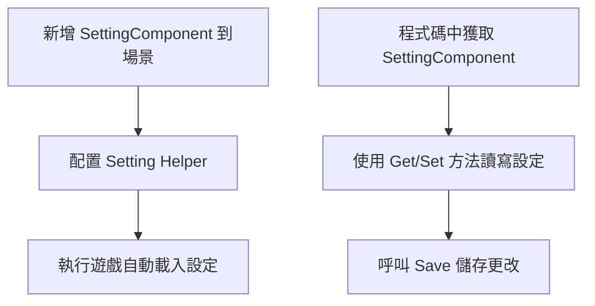
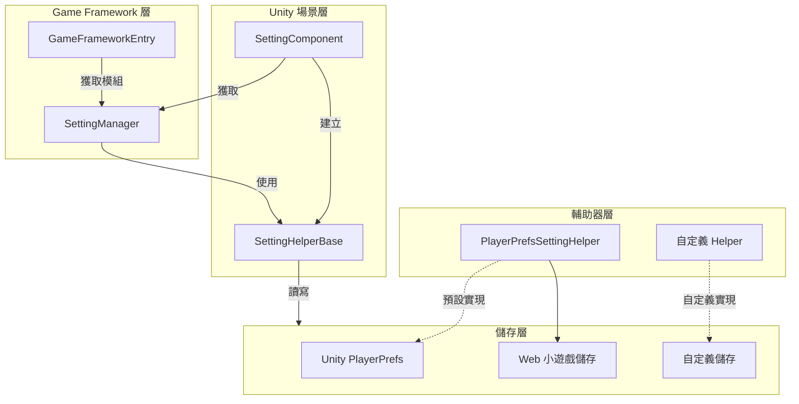

# 快速開始

本指南將幫助您快速上手 GameFrameX Setting 配置組件，瞭解如何在 Unity 專案中整合和使用設定功能。

## 概述

SettingComponent 是 GameFrameX 框架的核心組件，專門用於管理遊戲的配置資訊。它提供了簡潔的 API 來儲存和載入各種型別的遊戲設定，包括布林值、整數、浮點數、字串以及複雜的自定義物件。

該組件採用模組化設計，透過 `ISettingHelper` 介面支援不同的儲存實現，預設使用 Unity 的 PlayerPrefs，同時支援擴充套件自定義儲存方式。

## 快速開始流程



## 在 Unity 場景中新增組件

### 步驟 1：建立 Setting 組件

1. 在 Unity 編輯器中，開啟您的遊戲場景
2. 在 Hierarchy 面板中，建立一個空 GameObject 或選擇現有物件
3. 在 Inspector 面板中，點選 **Add Component** 按鈕
4. 在搜尋框中輸入 "Setting"，找到 **GameFrameX/Setting** 組件
5. 點選新增

```csharp
// SettingComponent 將自動新增以下依賴組件：
// - GameFrameXSettingCroppingHelper (必需)
```
> Source: [SettingComponent.cs](https://github.com/GameFrameX/com.gameframex.unity.setting/blob/main/Runtime/Setting/SettingComponent.cs#L46)

### 步驟 2：配置 Setting Helper

SettingComponent 會自動建立 `PlayerPrefsSettingHelper` 作為預設的儲存輔助器。您可以在 Inspector 面板中檢視和配置：

| 屬性 | 型別 | 預設值 | 說明 |
|------|------|--------|------|
| Setting Helper Type Name | string | "GameFrameX.Setting.Runtime.PlayerPrefsSettingHelper" | 設定輔助器的型別名稱 |
| Custom Setting Helper | SettingHelperBase | null | 自定義設定輔助器（可選） |

```csharp
// SettingComponent 在 Awake 中初始化設定助手
private void Awake()
{
    // 獲取 SettingManager 模組
    m_SettingManager = GameFrameworkEntry.GetModule<ISettingManager>();
    
    // 建立設定輔助器
    SettingHelperBase settingHelper = Helper.CreateHelper(m_SettingHelperTypeName, m_CustomSettingHelper);
    
    // 設定輔助器
    m_SettingManager.SetSettingHelper(settingHelper);
}
```
> Source: [SettingComponent.cs](https://github.com/GameFrameX/com.gameframex.unity.setting/blob/main/Runtime/Setting/SettingComponent.cs#L73-L98)

## 基本使用示例

### 在程式碼中獲取 SettingComponent

在 Unity 遊戲中，您可以透過多種方式獲取 SettingComponent：

```csharp
// 方式 1：透過場景中的 GameObject 獲取
SettingComponent settingComponent = FindObjectOfType<SettingComponent>();

// 方式 2：如果您使用 GameFrameX 的 MonoBehaviour 方式
// 假設您的類繼承自自定義的 MonoBehaviour
private SettingComponent settingComponent;

private void Start()
{
    settingComponent = GetComponent<SettingComponent>();
}
```
> Source: [README.md](https://github.com/GameFrameX/com.gameframex.unity.setting/blob/main/README.md#L86-L100)

### 儲存和載入設定

SettingComponent 在遊戲啟動時會自動呼叫 `Start()` 方法載入已儲存的設定：

```csharp
// 完整的設定管理示例
public class GameSettingsManager : MonoBehaviour
{
    private SettingComponent settingComponent;

    private void Start()
    {
        // 獲取 SettingComponent
        settingComponent = GetComponent<SettingComponent>();
        
        // 設定一些遊戲配置
        settingComponent.SetBool("IsFullScreen", true);
        settingComponent.SetInt("ResolutionWidth", 1920);
        settingComponent.SetFloat("Volume", 0.8f);
        settingComponent.SetString("PlayerName", "PlayerOne");
        
        // 儲存配置
        settingComponent.Save();
    }

    private void OnApplicationPause(bool pauseStatus)
    {
        // 當應用暫停時儲存設定（適用於移動平臺）
        if (pauseStatus)
        {
            settingComponent.Save();
        }
    }

    private void OnApplicationQuit()
    {
        // 應用退出時儲存設定
        settingComponent.Save();
    }
}
```
> Source: [README.md](https://github.com/GameFrameX/com.gameframex.unity.setting/blob/main/README.md#L86-L100)

### 讀取設定值

```csharp
// 檢查設定是否存在
bool hasVolumeSetting = settingComponent.HasSetting("Volume");

// 獲取設定值，使用預設值防止設定不存在時出錯
float volume = settingComponent.GetFloat("Volume", 0.5f);  // 如果不存在，返回 0.5f
bool isFullScreen = settingComponent.GetBool("IsFullScreen", false);  // 預設全屏關閉
int resolutionWidth = settingComponent.GetInt("ResolutionWidth", 1920);  // 預設 1920
string playerName = settingComponent.GetString("PlayerName", "Guest");  // 預設 Guest
```
> Source: [README.md](https://github.com/GameFrameX/com.gameframex.unity.setting/blob/main/README.md#L104-L110)

### 儲存和刪除設定

```csharp
// 儲存所有修改
settingComponent.Save();

// 刪除單個設定
settingComponent.RemoveSetting("PlayerName");

// 刪除所有設定
settingComponent.RemoveAllSettings();
```
> Source: [README.md](https://github.com/GameFrameX/com.gameframex.unity.setting/blob/main/README.md#L114-L120)

### 儲存複雜物件

SettingComponent 支援儲存自定義物件，物件會被自動序列化為 JSON：

```csharp
// 定義一個設定類
[Serializable]
public class GamePreferences
{
    public bool IsMusicEnabled = true;
    public bool IsSoundEnabled = true;
    public float MusicVolume = 0.7f;
    public float SoundVolume = 0.8f;
    public string Language = "en";
}

// 儲存複雜物件
var preferences = new GamePreferences
{
    IsMusicEnabled = true,
    MusicVolume = 0.8f,
    Language = "zh-CN"
};
settingComponent.SetObject("GamePreferences", preferences);

// 讀取複雜物件
var loadedPreferences = settingComponent.GetObject<GamePreferences>("GamePreferences", new GamePreferences());
```
> Source: [PlayerPrefsSettingHelper.cs](https://github.com/GameFrameX/com.gameframex.unity.setting/blob/main/Runtime/Setting/PlayerPrefsSettingHelper.cs#L620-L623)

## 組件架構



## 在執行時獲取設定

SettingComponent 提供多種資料型別的方法：

| 資料型別 | 讀取方法 | 寫入方法 |
|---------|---------|---------|
| 布林值 | `GetBool(name)` / `GetBool(name, default)` | `SetBool(name, value)` |
| 整數 | `GetInt(name)` / `GetInt(name, default)` | `SetInt(name, value)` |
| 浮點數 | `GetFloat(name)` / `GetFloat(name, default)` | `SetFloat(name, value)` |
| 字串 | `GetString(name)` / `GetString(name, default)` | `SetString(name, value)` |
| 物件 | `GetObject<T>(name)` / `GetObject<T>(name, default)` | `SetObject<T>(name, obj)` |

```csharp
// 完整示例：遊戲設定管理器
public class SettingsManager : MonoBehaviour
{
    private SettingComponent settingComponent;
    
    // 設定鍵名常量
    private const string KEY_MUSIC_ON = "setting.music.on";
    private const string KEY_MUSIC_VOLUME = "setting.music.volume";
    private const string KEY_GRAPHICS_QUALITY = "setting.graphics.quality";
    private const string KEY_PLAYER_DATA = "player.data";

    private void Awake()
    {
        settingComponent = GetComponent<SettingComponent>();
    }

    // 音樂設定
    public bool MusicEnabled
    {
        get => settingComponent.GetBool(KEY_MUSIC_ON, true);
        set => settingComponent.SetBool(KEY_MUSIC_ON, value);
    }

    public float MusicVolume
    {
        get => settingComponent.GetFloat(KEY_MUSIC_VOLUME, 0.5f);
        set => settingComponent.SetFloat(KEY_MUSIC_VOLUME, Mathf.Clamp01(value));
    }

    // 圖形設定
    public int GraphicsQuality
    {
        get => settingComponent.GetInt(KEY_GRAPHICS_QUALITY, 1);
        set => settingComponent.SetInt(KEY_GRAPHICS_QUALITY, value);
    }

    // 儲存玩家資料
    public void SavePlayerData(PlayerData data)
    {
        settingComponent.SetObject(KEY_PLAYER_DATA, data);
        settingComponent.Save();
    }

    // 載入玩家資料
    public PlayerData LoadPlayerData()
    {
        return settingComponent.GetObject<PlayerData>(KEY_PLAYER_DATA, new PlayerData());
    }
}
```

## 常見使用場景

### 場景 1：遊戲設定介面

```csharp
public class SettingsUI : MonoBehaviour
{
    [SerializeField] private SettingComponent settingComponent;
    [SerializeField] private Slider volumeSlider;
    [SerializeField] private Toggle fullscreenToggle;

    private void Start()
    {
        // 載入現有設定到 UI
        volumeSlider.value = settingComponent.GetFloat("Volume", 0.5f);
        fullscreenToggle.isOn = settingComponent.GetBool("Fullscreen", true);
    }

    public void OnVolumeChanged(float value)
    {
        settingComponent.SetFloat("Volume", value);
        settingComponent.Save();
    }

    public void OnFullscreenChanged(bool value)
    {
        settingComponent.SetBool("Fullscreen", value);
        settingComponent.Save();
    }
}
```

### 場景 2：玩家資料持久化

```csharp
[Serializable]
public class PlayerData
{
    public string playerName;
    public int level;
    public int experience;
    public List<string> achievements;
}

public class PlayerDataManager : MonoBehaviour
{
    private SettingComponent settingComponent;
    private const string KEY = "player.data";

    public void SavePlayer(PlayerData data)
    {
        settingComponent.SetObject(KEY, data);
        bool success = settingComponent.Save();
        Debug.Log($"玩家資料儲存{(success ? "成功" : "失敗")}");
    }

    public PlayerData LoadPlayer()
    {
        return settingComponent.GetObject<PlayerData>(KEY, new PlayerData());
    }
}
```

## 注意事項

1. **自動載入**：SettingComponent 在 `Start()` 方法中自動呼叫 `Load()` 載入設定，您無需手動呼叫。
2. **手動儲存**：設定修改後需要呼叫 `Save()` 方法才能持久化到儲存。
3. **平臺差異**：在不同平臺（如 WebGL 小遊戲）上，儲存行為可能略有不同，具體請參考平臺配置文件。
4. **物件序列化**：複雜物件會使用 JSON 序列化，請確保類標記為 `[Serializable]`。

## 相關連結

- [功能特性](./04.features) - 深入瞭解 Setting 架構設計
- [設定輔助器](./05.helper-implementation) - 自定義儲存實現
- [平臺配置](./06.platforms) - 不同平臺的具體配置
- [API 參考](./07.api-reference) - 完整的 API 方法文件
