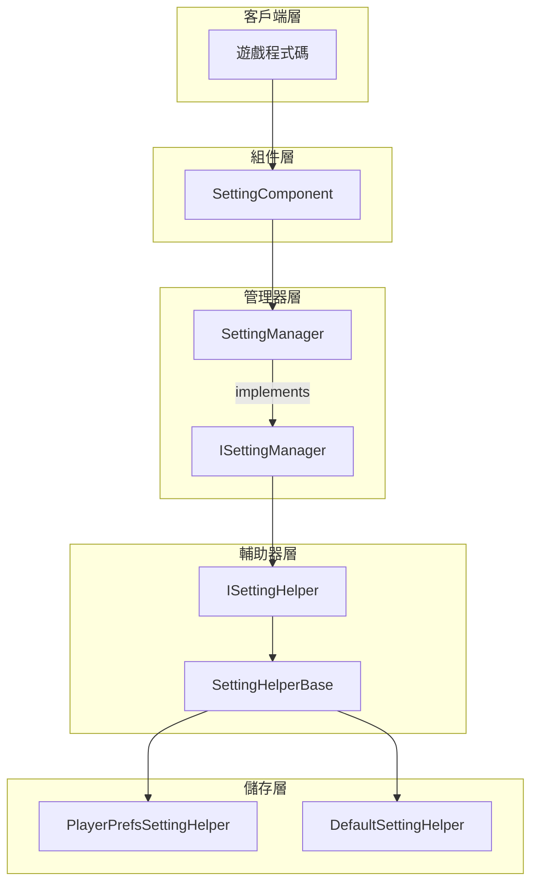
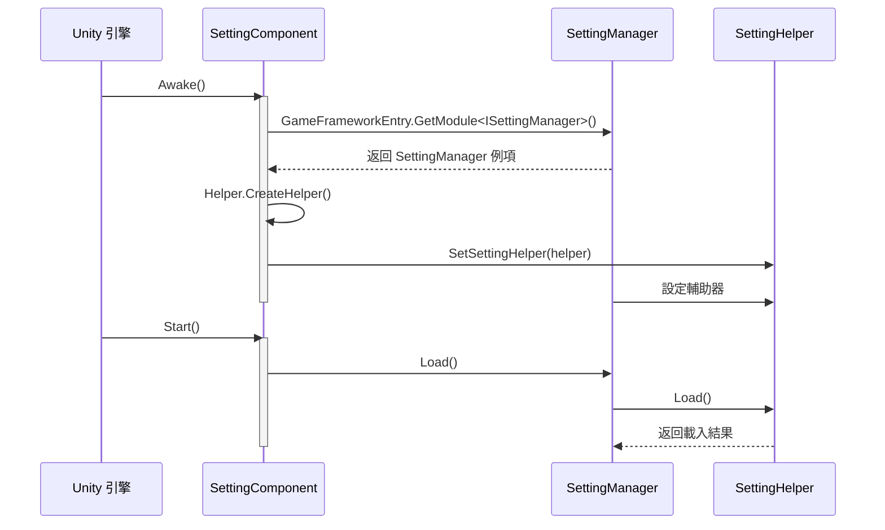

# 核心概念

GameFrameX Setting 配置組件是遊戲框架的核心模組之一，提供統一的配置管理抽象層，支援多種儲存後端，幫助開發者高效管理遊戲配置資料。

## 概述

Setting 組件採用分層架構設計，將業務邏輯與儲存實現解耦。核心設計理念包括：

1. **統一的配置介面**：提供型別安全的配置讀寫方法，支援布林、整數、浮點、字串及複雜物件
2. **可插拔的儲存後端**：透過策略模式支援不同的儲存實現
3. **面向 Unity 的組件化**：作為 MonoBehaviour 組件，可直接掛載到遊戲物件上

## 架構設計



### 各層職責

| 層級 | 組件 | 職責 |
|------|------|------|
| 組件層 | SettingComponent | Unity 組件入口，提供面向 Unity 的 API |
| 管理器層 | SettingManager | 業務邏輯處理，引數校驗，異常管理 |
| 輔助器層 | SettingHelperBase | 定義儲存介面抽象，實現型別轉換 |
| 儲存層 | PlayerPrefsSettingHelper / DefaultSettingHelper | 具體儲存實現 |

## 核心組件

### SettingComponent

SettingComponent 是整個系統的入口點，繼承自 GameFrameworkComponent，作為 Unity 組件使用。

```csharp
[DisallowMultipleComponent]
[RequireComponent(typeof(GameFrameXSettingCroppingHelper))]
[AddComponentMenu("GameFrameX/Setting")]
public sealed class SettingComponent : GameFrameworkComponent
```
> Source: [SettingComponent.cs](https://github.com/GameFrameX/com.gameframex.unity.setting/blob/main/Runtime/Setting/SettingComponent.cs#L43-L47)

**設計意圖**：作為 Unity 生態的入口點，SettingComponent 在 `Awake()` 中初始化 SettingManager，在 `Start()` 中載入配置資料。

### ISettingManager

ISettingManager 定義了配置管理的核心介面，負責業務邏輯層與資料訪問層的解耦。

```csharp
public interface ISettingManager
{
    int Count { get; }
    void SetSettingHelper(ISettingHelper settingHelper);
    bool Load();
    bool Save();
    // ... 讀寫方法
}
```
> Source: [ISettingManager.cs](https://github.com/GameFrameX/com.gameframex.unity.setting/blob/main/Runtime/Setting/Setting/ISettingManager.cs#L42-L342)

**設計意圖**：定義配置管理器的標準介面，使得上層組件無需關心具體實現細節。

### SettingManager

SettingManager 是 ISettingManager 的實現類，繼承自 GameFrameworkModule。

```csharp
public sealed class SettingManager : GameFrameworkModule, ISettingManager
{
    private ISettingHelper m_SettingHelper;
    // ... 實現 ISettingManager 介面
}
```
> Source: [SettingManager.cs](https://github.com/GameFrameX/com.gameframex.unity.setting/blob/main/Runtime/Setting/Setting/SettingManager.cs#L43-L736)

**設計意圖**：
- 繼承 GameFrameworkModule 融入 GameFrameX 框架生命週期
- 所有方法都包含空值檢查和引數校驗
- 異常資訊統一透過 GameFrameworkException 丟擲

### ISettingHelper / SettingHelperBase

ISettingHelper 是儲存後端的抽象介面，SettingHelperBase 是其抽象基類。

```csharp
public interface ISettingHelper
{
    int Count { get; }
    bool Load();
    bool Save();
    // ... 儲存操作方法
}

public abstract class SettingHelperBase : MonoBehaviour, ISettingHelper
{
    // ... 抽象方法定義
}
```
> Source: [ISettingHelper.cs](https://github.com/GameFrameX/com.gameframex.unity.setting/blob/main/Runtime/Setting/Setting/ISettingHelper.cs#L42-L332)
> Source: [SettingHelperBase.cs](https://github.com/GameFrameX/com.gameframex.unity.setting/blob/main/Runtime/Setting/SettingHelperBase.cs#L43-L333)

**設計意圖**：
- 繼承 MonoBehaviour 使其可以掛載到 GameObject
- 抽象方法要求子類實現具體的儲存邏輯

### 儲存後端實現

#### PlayerPrefsSettingHelper

基於 Unity PlayerPrefs 的實現，適用於大多數 Unity 專案。

```csharp
public class PlayerPrefsSettingHelper : SettingHelperBase
{
    // 使用 Unity PlayerPrefs API
    public override bool Save()
    {
#if UNITY_WEBGL && (ENABLE_DOUYIN_MINI_GAME || ENABLE_WECHAT_MINI_GAME || ENABLE_KUAISHOU_MINI_GAME)
        return true;  // 小遊戲平臺不做實際儲存
#else
        UnityEngine.PlayerPrefs.Save();
        return true;
#endif
    }
}
```
> Source: [PlayerPrefsSettingHelper.cs](https://github.com/GameFrameX/com.gameframex.unity.setting/blob/main/Runtime/Setting/PlayerPrefsSettingHelper.cs#L43-L638)

**平臺適配**：
- **編輯器/Standalone**：使用 Unity PlayerPrefs
- **抖音/微信/快手小遊戲**：使用各平臺原生儲存 API

#### DefaultSettingHelper

基於本地檔案的實現，支援獲取配置項列表。

```csharp
public class DefaultSettingHelper : SettingHelperBase
{
    private const string SettingFileName = "GameFrameworkSetting.dat";
    private string m_FilePath = null;
    private DefaultSetting m_Settings = null;
}
```
> Source: [DefaultSettingHelper.cs](https://github.com/GameFrameX/com.gameframex.unity.setting/blob/main/Runtime/Setting/DefaultSettingHelper.cs#L46-L52)

**特點**：
- 儲存路徑：`Application.persistentDataPath/GameFrameworkSetting.dat`
- 支援 `GetAllSettingNames()` 方法
- 使用二進位制序列化

### DefaultSetting

記憶體中的配置資料結構，使用 SortedDictionary 儲存。

```csharp
public sealed class DefaultSetting
{
    private readonly SortedDictionary<string, string> m_Settings = new SortedDictionary<string, string>(StringComparer.Ordinal);
}
```
> Source: [DefaultSetting.cs](https://github.com/GameFrameX/com.gameframex.unity.setting/blob/main/Runtime/Setting/DefaultSetting.cs#L47-L49)

## 資料型別支援

Setting 組件支援多種資料型別的配置儲存：

| 型別 | 讀取方法 | 寫入方法 | 說明 |
|------|----------|----------|------|
| 布林值 | GetBool / GetBool(name, default) | SetBool | 內部儲存為 0/1 |
| 整數 | GetInt / GetInt(name, default) | SetInt | 支援 int 範圍 |
| 浮點數 | GetFloat / GetFloat(name, default) | SetFloat | 使用 InvariantCulture 序列化 |
| 字串 | GetString / GetString(name, default) | SetString | 直接儲存 |
| 物件 | GetObject<T> / GetObject | SetObject<T> | JSON 序列化儲存 |

## 初始化流程



## 使用模式

### 基礎模式：使用 SettingComponent

```csharp
// 獲取 SettingComponent 組件
var settingComponent = UnityEngine.Object.FindObjectOfType<SettingComponent>();

// 儲存設定
settingComponent.SetBool("IsFullScreen", true);
settingComponent.SetInt("ResolutionWidth", 1920);
settingComponent.SetFloat("Volume", 0.8f);
settingComponent.SetString("PlayerName", "PlayerOne");
settingComponent.Save();

// 讀取設定（帶預設值）
bool isFullScreen = settingComponent.GetBool("IsFullScreen", false);
int resolution = settingComponent.GetInt("ResolutionWidth", 1280);
float volume = settingComponent.GetFloat("Volume", 0.5f);
string playerName = settingComponent.GetString("PlayerName", "Guest");
```
> Source: [README.md](https://github.com/GameFrameX/com.gameframex.unity.setting/blob/main/README.md#L85-L100)

### 進階模式：自定義儲存後端

```csharp
// 繼承 SettingHelperBase 實現自定義儲存
public class CustomSettingHelper : SettingHelperBase
{
    public override int Count => /* 實現計數 */;
    public override bool Load() { /* 實現載入 */ }
    public override bool Save() { /* 實現儲存 */ }
    // ... 實現其他抽象方法
}
```

然後在 Unity 編輯器中設定：
1. 建立帶有 SettingComponent 的 GameObject
2. 設定 Setting Helper Type Name 為自定義類名
3. 或直接掛載自定義 Helper 組件

## 平臺支援

| 平臺 | PlayerPrefsSettingHelper | DefaultSettingHelper |
|------|--------------------------|----------------------|
| Unity Editor | ✅ | ✅ |
| Windows/Mac/Linux | ✅ | ✅ |
| iOS | ✅ | ✅ |
| Android | ✅ | ✅ |
| WebGL (抖音小遊戲) | ✅ (平臺適配) | ✅ |
| WebGL (微信小遊戲) | ✅ (平臺適配) | ✅ |
| WebGL (快手小遊戲) | ✅ (平臺適配) | ✅ |

## 相關連結

- [設定輔助器實現](./05.helper-implementation) - 自定義輔助器指南
- [平臺配置](./06.platforms) - 各平臺特定配置
- [API 參考](./07.api-reference) - 完整的 API 文件
- [常見問題](./08.troubleshooting) - 常見問題與解決方案
