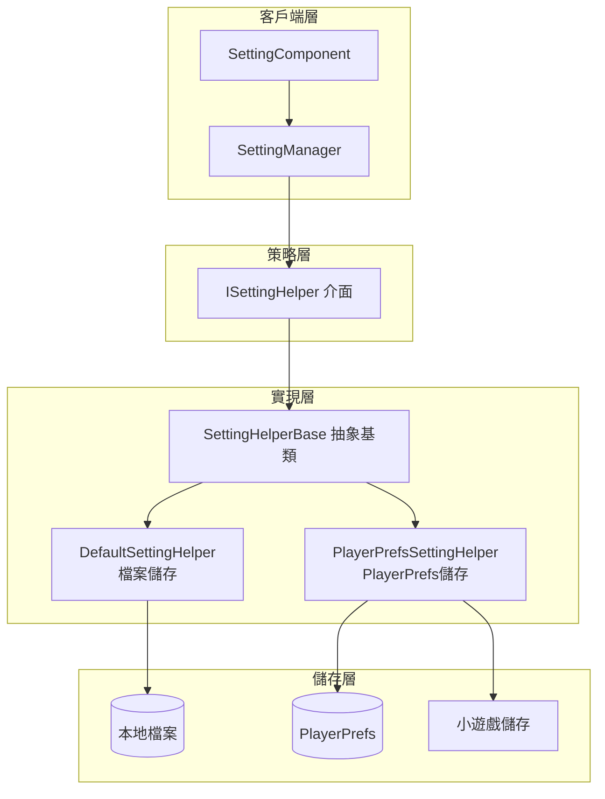

# 設定輔助器

設定輔助器（Setting Helper）是 GameFrameX 設定模組的核心組件，負責遊戲配置的底層儲存和讀取操作。透過策略模式設計，系統支援多種儲存後端，開發者可以根據專案需求選擇合適的儲存實現。

## 概述

設定輔助器是 `ISettingHelper` 介面的各種實現，負責將遊戲設定資料持久化到不同的儲存介質。該系統採用策略模式，使得儲存實現可以靈活切換而無需修改上層業務邏輯。

**設計意圖**：將設定儲存的底層實現與業務層分離，允許在不修改業務程式碼的情況下切換儲存方式（如從檔案儲存切換到 PlayerPrefs），同時支援針對不同平臺（Unity 原生、WebGL、小遊戲）的定製化儲存實現。



### 核心組件說明

| 組件 | 職責 | 適用場景 |
|------|------|----------|
| `ISettingHelper` | 定義設定儲存的統一介面 | 統一 API 規範 |
| `SettingHelperBase` | 提供抽象基類，實現 MonoBehaviour 生命週期 | 擴充套件新儲存方式 |
| `DefaultSettingHelper` | 基於本地檔案的二進位制序列化儲存 | 需要完整資料控制權 |
| `PlayerPrefsSettingHelper` | 基於 Unity PlayerPrefs 的鍵值儲存 | 簡單配置、快速原型 |

## 內建輔助器實現

### DefaultSettingHelper（檔案儲存輔助器）

`DefaultSettingHelper` 將遊戲設定儲存為本地二進位制檔案，使用自定義序列化格式。該實現提供了完整的資料控制權，支援獲取所有配置項名稱、統計數量等高階功能。

**儲存位置**：`<persistentDataPath>/GameFrameworkSetting.dat`

> Source: [DefaultSettingHelper.cs](https://github.com/GameFrameX/com.gameframex.unity.setting/blob/main/Runtime/Setting/DefaultSettingHelper.cs#L46-L529)

```csharp
public class DefaultSettingHelper : SettingHelperBase
{
    private const string SettingFileName = "GameFrameworkSetting.dat";
    private string m_FilePath = null;
    private DefaultSetting m_Settings = null;
    private DefaultSettingSerializer m_Serializer = null;

    private void Awake()
    {
        m_FilePath = Utility.Path.GetRegularPath(Path.Combine(Application.persistentDataPath, SettingFileName));
        m_Settings = new DefaultSetting();
        m_Serializer = new DefaultSettingSerializer();
        m_Serializer.RegisterSerializeCallback(0, SerializeDefaultSettingCallback);
        m_Serializer.RegisterDeserializeCallback(0, DeserializeDefaultSettingCallback);
    }
}
```

**特點**：
- 儲存路徑可預測，便於檔案管理和備份
- 支援完整的設定列舉和計數功能
- 二進位制序列化，檔案體積緊湊
- 支援自定義序列化器擴充套件

### PlayerPrefsSettingHelper（PlayerPrefs 儲存輔助器）

`PlayerPrefsSettingHelper` 基於 Unity 的 PlayerPrefs 實現，同時針對 WebGL 小遊戲平臺（抖音、微信、快手）提供了平臺特定的儲存適配。

> Source: [PlayerPrefsSettingHelper.cs](https://github.com/GameFrameX/com.gameframex.unity.setting/blob/main/Runtime/Setting/PlayerPrefsSettingHelper.cs#L43-L638)

```csharp
public class PlayerPrefsSettingHelper : SettingHelperBase
{
    // 平臺判斷示例：檢查是否存在指定配置項
    public override bool HasSetting(string settingName)
    {
#if UNITY_EDITOR
        return UnityEngine.PlayerPrefs.HasKey(settingName);
#endif
#if UNITY_WEBGL && ENABLE_DOUYIN_MINI_GAME
        return TTSDK.TTStorage.HasKeySync(settingName);
#elif UNITY_WEBGL && ENABLE_WECHAT_MINI_GAME
        return WeChatWASM.WXSDKManagerHandler.Instance.StorageHasKeySync(settingName);
#elif UNITY_WEBGL && ENABLE_KUAISHOU_MINI_GAME
        return KSWASM.KSBase.StorageHasKeySync(settingName);
#else
        return UnityEngine.PlayerPrefs.HasKey(settingName);
#endif
    }
}
```

**支援的平臺儲存**：

| 平臺 | 儲存實現 | 特殊處理 |
|------|----------|----------|
| Unity Editor | PlayerPrefs | 標準實現 |
| Unity Standalone | PlayerPrefs | 標準實現 |
| Unity WebGL (原生) | PlayerPrefs | 標準實現 |
| 抖音小遊戲 | TTStorage | 同步 API |
| 微信小遊戲 | WXStorage | 同步 API |
| 快手小遊戲 | KSStorage | 同步 API |

**注意事項**：
- `Count` 屬性始終返回 `-1`（PlayerPrefs 不支援計數）
- `GetAllSettingNames()` 不支援，返回 `null` 並輸出警告
- WebGL 小遊戲平臺 Save() 方法為空操作（小遊戲自動儲存）

## 輔助器基類

`SettingHelperBase` 是所有設定輔助器的抽象基類，繼承自 `MonoBehaviour`，提供統一的生命週期管理和介面定義。

> Source: [SettingHelperBase.cs](https://github.com/GameFrameX/com.gameframex.unity.setting/blob/main/Runtime/Setting/SettingHelperBase.cs#L43-L333)

### 抽象方法清單

| 方法 | 說明 |
|------|------|
| `Count` | 獲取配置項數量 |
| `Load()` | 載入配置 |
| `Save()` | 儲存配置 |
| `GetAllSettingNames()` | 獲取所有配置項名稱 |
| `HasSetting(name)` | 檢查配置項是否存在 |
| `RemoveSetting(name)` | 移除指定配置項 |
| `RemoveAllSettings()` | 清空所有配置 |
| `GetBool/SetBool` | 布林值讀寫 |
| `GetInt/SetInt` | 整數值讀寫 |
| `GetFloat/SetFloat` | 浮點數值讀寫 |
| `GetString/SetString` | 字串讀寫 |
| `GetObject/SetObject` | 物件序列化讀寫 |

## 建立自定義輔助器

要建立自定義設定輔助器，需要繼承 `SettingHelperBase` 並實現所有抽象方法。

```csharp
using GameFrameX.Setting.Runtime;
using UnityEngine;

public class CustomSettingHelper : SettingHelperBase
{
    // 自定義儲存實現
    private Dictionary<string, string> _storage = new Dictionary<string, string>();

    public override int Count => _storage.Count;

    public override bool Load()
    {
        // 從自定義儲存載入資料
        return true;
    }

    public override bool Save()
    {
        // 儲存資料到自定義儲存
        return true;
    }

    public override string[] GetAllSettingNames()
    {
        return _storage.Keys.ToArray();
    }

    public override bool HasSetting(string settingName)
    {
        return _storage.ContainsKey(settingName);
    }

    public override bool RemoveSetting(string settingName)
    {
        return _storage.Remove(settingName);
    }

    public override void RemoveAllSettings()
    {
        _storage.Clear();
    }

    // 實現所有 Get/Set 方法...
    // Bool, Int, Float, String, Object 的讀寫實現
}
```

> Source: [SettingHelperBase.cs](https://github.com/GameFrameX/com.gameframex.unity.setting/blob/main/Runtime/Setting/SettingHelperBase.cs)

## 輔助器選擇配置

在 Unity 編輯器中，可以透過 SettingComponent 選擇使用哪個輔助器：

1. 在場景中新增 `SettingComponent`（GameFrameX/Setting 選單）
2. 在 Inspector 中修改 `Setting Helper Type Name`
3. 或拖入自定義輔助器到 `Custom Setting Helper` 欄位

```csharp
// SettingComponent 中的輔助器建立邏輯
private void Awake()
{
    // ... 初始化程式碼 ...
    
    SettingHelperBase settingHelper = Helper.CreateHelper(m_SettingHelperTypeName, m_CustomSettingHelper);
    m_SettingManager.SetSettingHelper(settingHelper);
}
```

> Source: [SettingComponent.cs](https://github.com/GameFrameX/com.gameframex.unity.setting/blob/main/Runtime/Setting/SettingComponent.cs#L85-L97)

## 序列化機制

### DefaultSetting 內部資料結構

`DefaultSetting` 使用 `SortedDictionary<string, string>` 儲存所有配置項，將所有值統一轉換為字串進行儲存。

> Source: [DefaultSetting.cs](https://github.com/GameFrameX/com.gameframex.unity.setting/blob/main/Runtime/Setting/DefaultSetting.cs#L47-L400)

```csharp
public sealed class DefaultSetting
{
    private readonly SortedDictionary<string, string> m_Settings = new SortedDictionary<string, string>(StringComparer.Ordinal);

    public void Serialize(Stream stream)
    {
        using (BinaryWriter binaryWriter = new BinaryWriter(stream, Encoding.UTF8))
        {
            binaryWriter.Write7BitEncodedInt32(m_Settings.Count);
            foreach (KeyValuePair<string, string> setting in m_Settings)
            {
                binaryWriter.Write(setting.Key);
                binaryWriter.Write(setting.Value);
            }
        }
    }
}
```

### DefaultSettingSerializer 檔案格式

儲存檔案使用二進位制格式，包含以下部分：
- **檔案頭**：`GFS` 三個位元組（用於格式識別）
- **版本號**：7 位壓縮整型
- **資料**：鍵值對列表

> Source: [DefaultSettingSerializer.cs](https://github.com/GameFrameX/com.gameframex.unity.setting/blob/main/Runtime/Setting/DefaultSettingSerializer.cs#L43-L66)

```csharp
public sealed class DefaultSettingSerializer : GameFrameworkSerializer<DefaultSetting>
{
    private static readonly byte[] Header = new byte[] { (byte)'G', (byte)'F', (byte)'S' };

    protected override byte[] GetHeader()
    {
        return Header;
    }
}
```

## 平臺差異對比

| 功能 | DefaultSettingHelper | PlayerPrefsSettingHelper |
|------|---------------------|------------------------|
| 儲存位置 | persistentDataPath/dat 檔案 | PlayerPrefs 登錄檔 |
| Count 屬性 | ✅ 實際數量 | ❌ 始終返回 -1 |
| GetAllSettingNames | ✅ 支援 | ❌ 返回 null |
| 跨平臺一致性 | 需自行處理 | 自動適配 |
| 檔案可移植性 | ✅ 可複製移動 | ❌ 與裝置繫結 |
| 資料容量 | 無明顯限制 | 約 1MB 建議上限 |

## 相關連結

- [功能特性](./04.features) - 設定模組核心概念詳解
- [平臺配置](./06.platforms) - 各平臺配置說明
- [API 參考](./07.api-reference) - 設定管理器完整 API 文件
