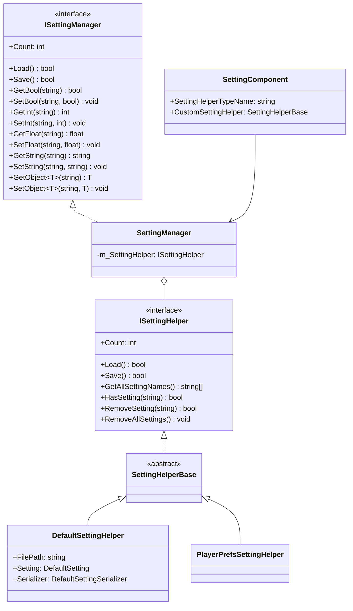
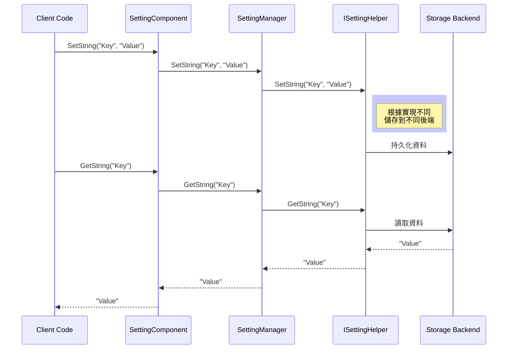

# API 參考

本文件詳細介紹 GameFrameX Setting 模組的所有公共 API，包括介面定義、類說明和使用方式。

## 概述

GameFrameX Setting 模組提供了一套完整的遊戲配置管理解決方案，支援多種儲存後端（檔案儲存、PlayerPrefs、小遊戲平臺儲存）。該模組採用分層架構設計，透過介面抽象實現儲存無關的設定管理功能。

## 架構概覽



## ISettingManager 介面

`ISettingManager` 是設定管理的核心介面，定義了遊戲設定的基本操作。

> Source: [ISettingManager.cs](https://github.com/GameFrameX/com.gameframex.unity.setting/blob/main/Runtime/Setting/Setting/ISettingManager.cs#L30-L342)

### 屬性

#### `Count: int`

獲取當前遊戲配置項的數量。

```csharp
int count = settingManager.Count;
```

> Source: [ISettingManager.cs](https://github.com/GameFrameX/com.gameframex.unity.setting/blob/main/Runtime/Setting/Setting/ISettingManager.cs#L50-L51)

### 方法

#### `Load(): bool`

載入遊戲配置。

**返回：** 是否載入成功。

```csharp
bool success = settingManager.Load();
```

> Source: [ISettingManager.cs](https://github.com/GameFrameX/com.gameframex.unity.setting/blob/main/Runtime/Setting/Setting/ISettingManager.cs#L70-L71)

---

#### `Save(): bool`

儲存遊戲配置。

**返回：** 是否儲存成功。

```csharp
bool success = settingManager.Save();
```

> Source: [ISettingManager.cs](https://github.com/GameFrameX/com.gameframex.unity.setting/blob/main/Runtime/Setting/Setting/ISettingManager.cs#L80-L81)

---

#### `GetAllSettingNames(): string[]`

獲取所有遊戲配置項的名稱陣列。

**返回：** 所有配置項名稱的陣列。

```csharp
string[] names = settingManager.GetAllSettingNames();
```

> Source: [ISettingManager.cs](https://github.com/GameFrameX/com.gameframex.unity.setting/blob/main/Runtime/Setting/Setting/ISettingManager.cs#L90-L91)

---

#### `GetAllSettingNames(results: List<string>): void`

獲取所有遊戲配置項的名稱列表。

**引數：**
- `results` (List<string>): 用於儲存配置項名稱的列表。

```csharp
var names = new List<string>();
settingManager.GetAllSettingNames(names);
```

> Source: [ISettingManager.cs](https://github.com/GameFrameX/com.gameframex.unity.setting/blob/main/Runtime/Setting/Setting/ISettingManager.cs#L100-L101)

---

#### `HasSetting(settingName: string): bool`

檢查指定配置項是否存在。

**引數：**
- `settingName` (string): 要檢查的配置項名稱。

**返回：** 配置項是否存在。

```csharp
bool exists = settingManager.HasSetting("PlayerName");
```

> Source: [ISettingManager.cs](https://github.com/GameFrameX/com.gameframex.unity.setting/blob/main/Runtime/Setting/Setting/ISettingManager.cs#L112-L113)

---

#### `RemoveSetting(settingName: string): bool`

移除指定配置項。

**引數：**
- `settingName` (string): 要移除的配置項名稱。

**返回：** 是否移除成功。

```csharp
bool success = settingManager.RemoveSetting("OldSetting");
```

> Source: [ISettingManager.cs](https://github.com/GameFrameX/com.gameframex.unity.setting/blob/main/Runtime/Setting/Setting/ISettingManager.cs#L122-L123)

---

#### `RemoveAllSettings(): void`

清空所有遊戲配置項。

```csharp
settingManager.RemoveAllSettings();
```

> Source: [ISettingManager.cs](https://github.com/GameFrameX/com.gameframex.unity.setting/blob/main/Runtime/Setting/Setting/ISettingManager.cs#L131-L132)

---

### 布林值操作

#### `GetBool(settingName: string): bool`

從指定配置項讀取布林值。

**引數：**
- `settingName` (string): 配置項名稱。

**返回：** 讀取的布林值。如果配置項不存在則丟擲異常。

```csharp
bool value = settingManager.GetBool("SoundEnabled");
```

> Source: [ISettingManager.cs](https://github.com/GameFrameX/com.gameframex.unity.setting/blob/main/Runtime/Setting/Setting/ISettingManager.cs#L142-L143)

---

#### `GetBool(settingName: string, defaultValue: bool): bool`

從指定配置項讀取布林值，支援預設值。

**引數：**
- `settingName` (string): 配置項名稱。
- `defaultValue` (bool): 配置項不存在時返回的預設值。

**返回：** 讀取的布林值或預設值。

```csharp
bool value = settingManager.GetBool("MusicEnabled", true);
```

> Source: [ISettingManager.cs](https://github.com/GameFrameX/com.gameframex.unity.setting/blob/main/Runtime/Setting/Setting/ISettingManager.cs#L154-L155)

---

#### `SetBool(settingName: string, value: bool): void`

向指定配置項寫入布林值。

**引數：**
- `settingName` (string): 配置項名稱。
- `value` (bool): 要寫入的布林值。

```csharp
settingManager.SetBool("SoundEnabled", true);
```

> Source: [ISettingManager.cs](https://github.com/GameFrameX/com.gameframex.unity.setting/blob/main/Runtime/Setting/Setting/ISettingManager.cs#L165-L166)

---

### 整數值操作

#### `GetInt(settingName: string): int`

從指定配置項讀取整數值。

**引數：**
- `settingName` (string): 配置項名稱。

**返回：** 讀取的整數值。如果配置項不存在則丟擲異常。

```csharp
int level = settingManager.GetInt("CurrentLevel");
```

> Source: [ISettingManager.cs](https://github.com/GameFrameX/com.gameframex.unity.setting/blob/main/Runtime/Setting/Setting/ISettingManager.cs#L176-L177)

---

#### `GetInt(settingName: string, defaultValue: int): int`

從指定配置項讀取整數值，支援預設值。

**引數：**
- `settingName` (string): 配置項名稱。
- `defaultValue` (int): 配置項不存在時返回的預設值。

**返回：** 讀取的整數值或預設值。

```csharp
int score = settingManager.GetInt("HighScore", 0);
```

> Source: [ISettingManager.cs](https://github.com/GameFrameX/com.gameframex.unity.setting/blob/main/Runtime/Setting/Setting/ISettingManager.cs#L188-L189)

---

#### `SetInt(settingName: string, value: int): void`

向指定配置項寫入整數值。

**引數：**
- `settingName` (string): 配置項名稱。
- `value` (int): 要寫入的整數值。

```csharp
settingManager.SetInt("CurrentLevel", 5);
```

> Source: [ISettingManager.cs](https://github.com/GameFrameX/com.gameframex.unity.setting/blob/main/Runtime/Setting/Setting/ISettingManager.cs#L199-L200)

---

### 浮點數值操作

#### `GetFloat(settingName: string): float`

從指定配置項讀取浮點數值。

**引數：**
- `settingName` (string): 配置項名稱。

**返回：** 讀取的浮點數值。如果配置項不存在則丟擲異常。

```csharp
float volume = settingManager.GetFloat("MusicVolume");
```

> Source: [ISettingManager.cs](https://github.com/GameFrameX/com.gameframex.unity.setting/blob/main/Runtime/Setting/Setting/ISettingManager.cs#L210-L211)

---

#### `GetFloat(settingName: string, defaultValue: float): float`

從指定配置項讀取浮點數值，支援預設值。

**引數：**
- `settingName` (string): 配置項名稱。
- `defaultValue` (float): 配置項不存在時返回的預設值。

**返回：** 讀取的浮點數值或預設值。

```csharp
float volume = settingManager.GetFloat("MusicVolume", 0.5f);
```

> Source: [ISettingManager.cs](https://github.com/GameFrameX/com.gameframex.unity.setting/blob/main/Runtime/Setting/Setting/ISettingManager.cs#L222-L223)

---

#### `SetFloat(settingName: string, value: float): void`

向指定配置項寫入浮點數值。

**引數：**
- `settingName` (string): 配置項名稱。
- `value` (float): 要寫入的浮點數值。

```csharp
settingManager.SetFloat("MusicVolume", 0.8f);
```

> Source: [ISettingManager.cs](https://github.com/GameFrameX/com.gameframex.unity.setting/blob/main/Runtime/Setting/Setting/ISettingManager.cs#L233-L234)

---

### 字串值操作

#### `GetString(settingName: string): string`

從指定配置項讀取字串值。

**引數：**
- `settingName` (string): 配置項名稱。

**返回：** 讀取的字串值。如果配置項不存在則丟擲異常。

```csharp
string playerName = settingManager.GetString("PlayerName");
```

> Source: [ISettingManager.cs](https://github.com/GameFrameX/com.gameframex.unity.setting/blob/main/Runtime/Setting/Setting/ISettingManager.cs#L244-L245)

---

#### `GetString(settingName: string, defaultValue: string): string`

從指定配置項讀取字串值，支援預設值。

**引數：**
- `settingName` (string): 配置項名稱。
- `defaultValue` (string): 配置項不存在時返回的預設值。

**返回：** 讀取的字串值或預設值。

```csharp
string playerName = settingManager.GetString("PlayerName", "Guest");
```

> Source: [ISettingManager.cs](https://github.com/GameFrameX/com.gameframex.unity.setting/blob/main/Runtime/Setting/Setting/ISettingManager.cs#L256-L257)

---

#### `SetString(settingName: string, value: string): void`

向指定配置項寫入字串值。

**引數：**
- `settingName` (string): 配置項名稱。
- `value` (string): 要寫入的字串值。

```csharp
settingManager.SetString("PlayerName", "Hero");
```

> Source: [ISettingManager.cs](https://github.com/GameFrameX/com.gameframex.unity.setting/blob/main/Runtime/Setting/Setting/ISettingManager.cs#L267-L268)

---

### 物件操作

#### `GetObject<T>(settingName: string): T`

從指定配置項讀取物件。

**型別引數：**
- `T`: 要讀取的物件型別，必須包含無參建構函式。

**引數：**
- `settingName` (string): 配置項名稱。

**返回：** 讀取的物件例項。如果配置項不存在則丟擲異常。

```csharp
var playerData = settingManager.GetObject<PlayerData>("PlayerData");
```

> Source: [ISettingManager.cs](https://github.com/GameFrameX/com.gameframex.unity.setting/blob/main/Runtime/Setting/Setting/ISettingManager.cs#L279-L280)

---

#### `GetObject(objectType: Type, settingName: string): object`

從指定配置項讀取物件（非泛型版本）。

**引數：**
- `objectType` (Type): 要讀取的物件型別。
- `settingName` (string): 配置項名稱。

**返回：** 讀取的物件例項。

```csharp
object playerData = settingManager.GetObject(typeof(PlayerData), "PlayerData");
```

> Source: [ISettingManager.cs](https://github.com/GameFrameX/com.gameframex.unity.setting/blob/main/Runtime/Setting/Setting/ISettingManager.cs#L291-L292)

---

#### `GetObject<T>(settingName: string, defaultObj: T): T`

從指定配置項讀取物件，支援預設值。

**型別引數：**
- `T`: 要讀取的物件型別。

**引數：**
- `settingName` (string): 配置項名稱。
- `defaultObj` (T): 配置項不存在時返回的預設物件。

**返回：** 讀取的物件或預設物件。

```csharp
var defaultData = new PlayerData();
var playerData = settingManager.GetObject("PlayerData", defaultData);
```

> Source: [ISettingManager.cs](https://github.com/GameFrameX/com.gameframex.unity.setting/blob/main/Runtime/Setting/Setting/ISettingManager.cs#L304-L305)

---

#### `GetObject(objectType: Type, settingName: string, defaultObj: object): object`

從指定配置項讀取物件（非泛型版本），支援預設值。

**引數：**
- `objectType` (Type): 要讀取的物件型別。
- `settingName` (string): 配置項名稱。
- `defaultObj` (object): 配置項不存在時返回的預設物件。

**返回：** 讀取的物件或預設物件。

```csharp
var defaultData = new PlayerData();
var playerData = settingManager.GetObject(typeof(PlayerData), "PlayerData", defaultData);
```

> Source: [ISettingManager.cs](https://github.com/GameFrameX/com.gameframex.unity.setting/blob/main/Runtime/Setting/Setting/ISettingManager.cs#L317-L318)

---

#### `SetObject<T>(settingName: string, obj: T): void`

向指定配置項寫入物件。

**型別引數：**
- `T`: 要寫入的物件型別。

**引數：**
- `settingName` (string): 配置項名稱。
- `obj` (T): 要寫入的物件。

```csharp
var playerData = new PlayerData { Name = "Hero", Level = 10 };
settingManager.SetObject("PlayerData", playerData);
```

> Source: [ISettingManager.cs](https://github.com/GameFrameX/com.gameframex.unity.setting/blob/main/Runtime/Setting/Setting/ISettingManager.cs#L329-L330)

---

#### `SetObject(settingName: string, obj: object): void`

向指定配置項寫入物件（非泛型版本）。

**引數：**
- `settingName` (string): 配置項名稱。
- `obj` (object): 要寫入的物件。

```csharp
var playerData = new PlayerData { Name = "Hero", Level = 10 };
settingManager.SetObject("PlayerData", (object)playerData);
```

> Source: [ISettingManager.cs](https://github.com/GameFrameX/com.gameframex.unity.setting/blob/main/Runtime/Setting/Setting/ISettingManager.cs#L340-L341)

---

## ISettingHelper 介面

`ISettingHelper` 是設定儲存的抽象介面，允許實現不同的儲存後端。

> Source: [ISettingHelper.cs](https://github.com/GameFrameX/com.gameframex.unity.setting/blob/main/Runtime/Setting/Setting/ISettingHelper.cs#L30-L332)

**介面方法與 ISettingManager 大致相同，但增加了以下內容：**
- 檔案序列化/反序列化操作
- 所有方法都是抽象的，由具體實現類提供

**設計意圖：** 該介面採用策略模式設計，允許在執行時切換不同的儲存實現，如檔案儲存、PlayerPrefs、或小遊戲平臺儲存。

---

## SettingManager 類

`SettingManager` 是 `ISettingManager` 的核心實現類，繼承自 `GameFrameworkModule`。

> Source: [SettingManager.cs](https://github.com/GameFrameX/com.gameframex.unity.setting/blob/main/Runtime/Setting/Setting/SettingManager.cs#L30-L737)

### 構造方法

#### `SettingManager()`

初始化 SettingManager 的新例項。

```csharp
var settingManager = new SettingManager();
```

> Source: [SettingManager.cs](https://github.com/GameFrameX/com.gameframex.unity.setting/blob/main/Runtime/Setting/Setting/SettingManager.cs#L53-L57)

### 方法

#### `SetSettingHelper(settingHelper: ISettingHelper): void`

設定遊戲配置輔助器。

**引數：**
- `settingHelper` (ISettingHelper): 遊戲配置輔助器例項。

**丟擲：** 當 settingHelper 為 null 時丟擲 GameFrameworkException。

```csharp
settingManager.SetSettingHelper(new PlayerPrefsSettingHelper());
```

> Source: [SettingManager.cs](https://github.com/GameFrameX/com.gameframex.unity.setting/blob/main/Runtime/Setting/Setting/SettingManager.cs#L111-L120)

---

#### `Update(elapseSeconds: float, realElapseSeconds: float): void`

每幀輪詢更新方法。此方法為空實現，因為設定管理器不需要每幀更新。

> Source: [SettingManager.cs](https://github.com/GameFrameX/com.gameframex.unity.setting/blob/main/Runtime/Setting/Setting/SettingManager.cs#L88-L90)

---

#### `Shutdown(): void`

關閉並清理設定管理器。在關閉時自動儲存所有未儲存的設定。

> Source: [SettingManager.cs](https://github.com/GameFrameX/com.gameframex.unity.setting/blob/main/Runtime/Setting/Setting/SettingManager.cs#L98-L101)

---

## SettingHelperBase 抽象類

`SettingHelperBase` 是所有設定輔助器的抽象基類，繼承自 `MonoBehaviour` 並實現 `ISettingHelper` 介面。

> Source: [SettingHelperBase.cs](https://github.com/GameFrameX/com.gameframex.unity.setting/blob/main/Runtime/Setting/SettingHelperBase.cs#L30-L333)

**設計意圖：** 提供 Unity 組件形式的輔助器基類，所有具體實現都可以作為組件掛載到場景中。

---

## DefaultSettingHelper 類

`DefaultSettingHelper` 是預設的設定輔助器實現，使用本地檔案儲存設定資料。

> Source: [DefaultSettingHelper.cs](https://github.com/GameFrameX/com.gameframex.unity.setting/blob/main/Runtime/Setting/DefaultSettingHelper.cs#L30-L529)

### 屬性

#### `FilePath: string` (只讀)

獲取遊戲配置儲存檔案的路徑。

```csharp
string path = defaultSettingHelper.FilePath;
```

> Source: [DefaultSettingHelper.cs](https://github.com/GameFrameX/com.gameframex.unity.setting/blob/main/Runtime/Setting/DefaultSettingHelper.cs#L76-L82)

---

#### `Setting: DefaultSetting` (只讀)

獲取遊戲配置資料例項。

```csharp
var settings = defaultSettingHelper.Setting;
```

> Source: [DefaultSettingHelper.cs](https://github.com/GameFrameX/com.gameframex.unity.setting/blob/main/Runtime/Setting/DefaultSettingHelper.cs#L91-L97)

---

#### `Serializer: DefaultSettingSerializer` (只讀)

獲取遊戲配置序列化器。

```csharp
var serializer = defaultSettingHelper.Serializer;
```

> Source: [DefaultSettingHelper.cs](https://github.com/GameFrameX/com.gameframex.unity.setting/blob/main/Runtime/Setting/DefaultSettingHelper.cs#L106-L112)

---

### 儲存檔案

預設儲存路徑：`Application.persistentDataPath/GameFrameworkSetting.dat`

> Source: [DefaultSettingHelper.cs](https://github.com/GameFrameX/com.gameframex.unity.setting/blob/main/Runtime/Setting/DefaultSettingHelper.cs#L48)

---

## PlayerPrefsSettingHelper 類

`PlayerPrefsSettingHelper` 基於 Unity PlayerPrefs 實現設定儲存，並支援多種小遊戲平臺。

> Source: [PlayerPrefsSettingHelper.cs](https://github.com/GameFrameX/com.gameframex.unity.setting/blob/main/Runtime/Setting/PlayerPrefsSettingHelper.cs#L30-L638)

### 平臺支援

- Unity Editor
- Unity WebGL (標準)
- 抖音小遊戲 (ENABLE_DOUYIN_MINI_GAME)
- 微信小遊戲 (ENABLE_WECHAT_MINI_GAME)
- 快手小遊戲 (ENABLE_KUAISHOU_MINI_GAME)

### 特性說明

| 特性 | 支援情況 |
|------|----------|
| Count | 不支援，始終返回 -1 |
| GetAllSettingNames | 不支援，返回 null |
| Load | 不需要，始終返回 true |
| Save | WebGL 小遊戲平臺為無操作 |

> Source: [PlayerPrefsSettingHelper.cs](https://github.com/GameFrameX/com.gameframex.unity.setting/blob/main/Runtime/Setting/PlayerPrefsSettingHelper.cs#L52-L100)

---

## SettingComponent 類

`SettingComponent` 是 Unity 組件，用於在 GameFrameX 框架中整合設定管理功能。

> Source: [SettingComponent.cs](https://github.com/GameFrameX/com.gameframex.unity.setting/blob/main/Runtime/Setting/SettingComponent.cs#L30-L447)

### 組件特性

- 繼承自 `GameFrameworkComponent`
- 掛載在場景中自動初始化
- 支援自定義設定輔助器型別

### 序列化欄位

#### `SettingHelperTypeName: string`

設定輔助器的型別名稱。預設為 `PlayerPrefsSettingHelper`。

```csharp
[SerializeField]
private string m_SettingHelperTypeName = "GameFrameX.Setting.Runtime.PlayerPrefsSettingHelper";
```

> Source: [SettingComponent.cs](https://github.com/GameFrameX/com.gameframex.unity.setting/blob/main/Runtime/Setting/SettingComponent.cs#L51)

---

#### `CustomSettingHelper: SettingHelperBase`

自定義設定輔助器例項。

```csharp
[SerializeField]
private SettingHelperBase m_CustomSettingHelper = null;
```

> Source: [SettingComponent.cs](https://github.com/GameFrameX/com.gameframex.unity.setting/blob/main/Runtime/Setting/SettingComponent.cs#L53)

---

### 方法

`SettingComponent` 提供了與 `ISettingManager` 相同的方法集，可直接在 Unity 指令碼中使用。

---

## 資料流



---

## 異常處理

| 異常型別 | 觸發條件 |
|----------|----------|
| GameFrameworkException | 設定輔助器未設定時呼叫方法 |
| GameFrameworkException | 設定名稱為空或 null |
| GameFrameworkException | 物件型別為 null |

```csharp
// 典型異常處理
try {
    var value = settingManager.GetString("Key");
} catch (GameFrameworkException ex) {
    Debug.LogError($"設定操作失敗: {ex.Message}");
}
```

---

## 相關連結

- [概述](./01.overview)
- [安裝](./02.installation)
- [快速開始](./03.getting-started)
- [功能特性](./04.features)
- [設定輔助器](./05.helper-implementation)
- [平臺配置](./06.platforms)
- [常見問題](./08.troubleshooting)
