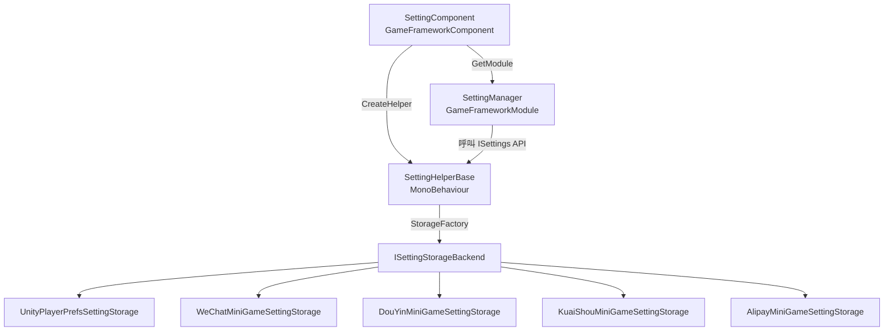

# 運作原理：SettingComponent 架構

`SettingComponent` 是 GameFrameX 設定模組的進入點元件，會在遊戲啟動時啟動 `SettingManager` 與 `SettingHelper`，負責設定的載入以及後續的讀寫。本頁將說明它如何被實例化、如何將處理委派給 Helper，以及資料最終會儲存到哪個儲存後端。

## 快速入門

只要附加 `SettingComponent`，框架就會自動完成設定的讀取與初始化，因此業務程式碼不需要手動 new。

1. 確認啟動場景的 `GameFrameX` 物件上已新增 `SettingComponent`（預設會與框架一同註冊）。
2. 預設使用 [PlayerPrefsSettingHelper.cs](https://github.com/GameFrameX/com.gameframex.unity.setting/blob/main/Runtime/Setting/PlayerPrefsSettingHelper.cs) 作為 Helper。若要改為 WeChat 小遊戲的儲存方式，請將 `m_SettingHelperTypeName` 欄位變更為對應小遊戲的 Helper 型別名稱。
3. 在業務程式碼中透過 `GameFrameX.Setting.Runtime.SettingComponent` 的 `GetBool` / `GetInt` / `GetString` 等方法來讀寫設定。

## 運作原理概覽

Setting 模組採用「元件 → 管理器 → Helper → 儲存後端」的 4 層委派結構，每一層僅依賴於緊鄰下一層的介面。



各層的職責：

| 層 | 型別 | 職責 |
|----|------|------|
| 元件層 | [SettingComponent.cs](https://github.com/GameFrameX/com.gameframex.unity.setting/blob/main/Runtime/Setting/SettingComponent.cs#L48-L100) | 在 `Awake` 中取得 `ISettingManager`，建立 `SettingHelperBase` 的實例並注入管理器。在 `Start` 中觸發首次 `Load()` |
| 管理器層 | [SettingManager.cs](https://github.com/GameFrameX/com.gameframex.unity.setting/blob/main/Runtime/Setting/Setting/SettingManager.cs#L43-L134) | 實作 [ISettingManager.cs](https://github.com/GameFrameX/com.gameframex.unity.setting/blob/main/Runtime/Setting/Setting/ISettingManager.cs)，對上層公開 `Get/Set*` 系列 API，內部將呼叫轉發給 `ISettingHelper` |
| Helper 層 | [SettingHelperBase.cs](https://github.com/GameFrameX/com.gameframex.unity.setting/blob/main/Runtime/Setting/SettingHelperBase.cs#L43-L335) | 對 `MonoBehaviour` 進行抽象化，提供設定讀寫、載入／卸載、序列化等通用功能 |
| 儲存後端 | [SettingStorageBackendFactory.cs](https://github.com/GameFrameX/com.gameframex.unity.setting/blob/main/Runtime/Setting/Storage/SettingStorageBackendFactory.cs) 與各 `ISettingStorageBackend` 實作 | 實際執行持久化的轉接器層：Unity 使用 `UnityPlayerPrefsSettingStorage`，小遊戲平台則使用對應平台的 storage 實作 |

## 啟動流程

啟動期間的關鍵步驟如下，順序與 `SettingComponent` 的 `Awake` / `Start` 一一對應：

1. **解析元件型別** —— 透過 `ImplementationComponentType = Utility.Assembly.GetType(componentType)`，告訴框架此介面對應的實作是 `SettingManager`。
2. **取得管理器** —— 透過 `GameFrameworkEntry.GetModule<ISettingManager>()` 取得全域唯一的管理器實例。
3. **建立 Helper** —— `Helper.CreateHelper(m_SettingHelperTypeName, m_CustomSettingHelper)`，預設型別名稱為 `"GameFrameX.Setting.Runtime.PlayerPrefsSettingHelper"`。若在 Inspector 中指定了 `m_CustomSettingHelper`，則會優先使用自訂實作。
4. **附加 Helper** —— 將建立的 Helper 重新命名為 `"SettingHelper"`，並附加在 `SettingComponent` 自身之下（參見 [SettingComponent.cs](https://github.com/GameFrameX/com.gameframex.unity.setting/blob/main/Runtime/Setting/SettingComponent.cs#L94-L99)）。
5. **注入管理器** —— 呼叫 `m_SettingManager.SetSettingHelper(settingHelper)`。此步驟會驗證 Helper 不為 null。
6. **首次載入** —— 在 `Start` 中執行 `m_SettingManager.Load()`，讀取已持久化在玩家本機的設定。即使失敗也只會記錄日誌，遊戲不會中斷。
7. **Shutdown 時儲存** —— `SettingManager.Shutdown()` 會在框架結束時自動呼叫 `Save()`，將記憶體中的最新值持久化。

## API 委派關係

`SettingComponent` 的每個公開方法都只是 `ISettingManager` 對應方法的薄封裝，業務呼叫端所使用的 `Count` / `GetBool` / `SetInt` 等介面簽章與 [ISettingManager.cs](https://github.com/GameFrameX/com.gameframex.unity.setting/blob/main/Runtime/Setting/Setting/ISettingManager.cs) 完全一致。

| SettingComponent 方法 | 委派目標 | ISettingManager 簽章 |
|----------------------|--------|----------------------|
| `Count` | → | `int Count { get; }` |
| `Save()` / `Load()` | → | `bool Load()` / `bool Save()` |
| `GetBool/SetBool(name[,defaultValue], value)` | → | 同名方法 |
| `GetInt/SetInt` | → | 同名方法 |
| `GetFloat/SetFloat` | → | 同名方法 |
| `GetString/SetString` | → | 同名方法 |
| `GetBool/Int/Float/String(..., object)` | → | 支援物件序列化的泛型版本 |
| `HasSetting/RemoveSetting/RemoveAllSettings` | → | 同名方法 |
| `GetAllSettingNames()` | → | 回傳 `string[]` |
| `GetAllSettingNames(List<string>)` | → | 將結果存入清單 |

`SettingManager` 在每次呼叫前都會執行 `EnsureSettingHelper()` 與 `EnsureSettingName()`（參見 [SettingManager.cs L47-L61](https://github.com/GameFrameX/com.gameframex.unity.setting/blob/main/Runtime/Setting/Setting/SettingManager.cs#L47-L61)）。若 Helper 尚未注入，會拋出 `GameFrameworkException("Setting helper is invalid.")`；若 settingName 為空，則會拋出 `"Setting name is invalid."`。

## Helper 與儲存後端

`SettingHelperBase` 本身只定義抽象介面，實際的讀寫由其子類別實作。儲存庫中提供的預設實作：

- [PlayerPrefsSettingHelper.cs](https://github.com/GameFrameX/com.gameframex.unity.setting/blob/main/Runtime/Setting/PlayerPrefsSettingHelper.cs)：基於 Unity 的 `PlayerPrefs`，適用於所有一般平台。
- 小遊戲平台專用 Helper：[WeChatMiniGameSettingStorage.cs](https://github.com/GameFrameX/com.gameframex.unity.setting/blob/main/Runtime/MiniGame/WeChat/WeChatMiniGameSettingStorage.cs)、[DouYinMiniGameSettingStorage.cs](https://github.com/GameFrameX/com.gameframex.unity.setting/blob/main/Runtime/MiniGame/DouYin/DouYinMiniGameSettingStorage.cs)、[KuaiShouMiniGameSettingStorage.cs](https://github.com/GameFrameX/com.gameframex.unity.setting/blob/main/Runtime/MiniGame/KuaiShou/KuaiShouMiniGameSettingStorage.cs)、[AlipayMiniGameSettingStorage.cs](https://github.com/GameFrameX/com.gameframex.unity.setting/blob/main/Runtime/MiniGame/Alipay/AlipayMiniGameSettingStorage.cs)。

Helper 會透過 `SettingStorageBackendFactory` 選擇對應當前平台的 `ISettingStorageBackend` 實作，因此業務程式碼無需關注底層細節。

## 自訂 Helper

```csharp
public class MySettingHelper : SettingHelperBase
{
    public override int Count => 0;
    public override bool Load() { /* 讀取邏輯 */ return true; }
    public override bool Save() { /* 寫入邏輯 */ return true; }
    // ... 其餘抽象成員依需求實作
}
```

只要將掛有腳本的 Prefab 拖曳到 `SettingComponent.m_CustomSettingHelper` 欄位，框架就會在 `Awake` 時優先使用它。若此欄位為空，則會依 `m_SettingHelperTypeName` 透過反射方式建立。

## 接下來

- 在 Inspector 中切換儲存平台：參見《如何選擇設定儲存後端》
- 業務程式碼中的設定讀寫範例：參見《如何讀寫遊戲設定》
- 平台儲存後端的錯誤疑難排解：參見《Setting 載入失敗時的處理方式》