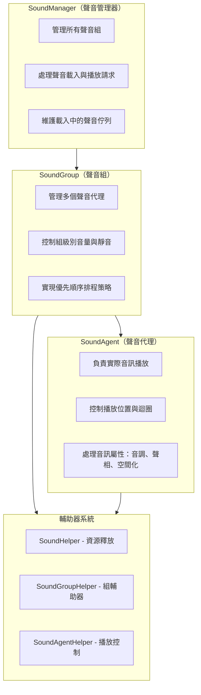
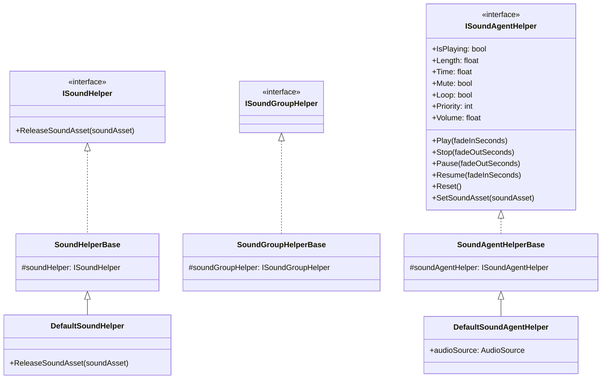
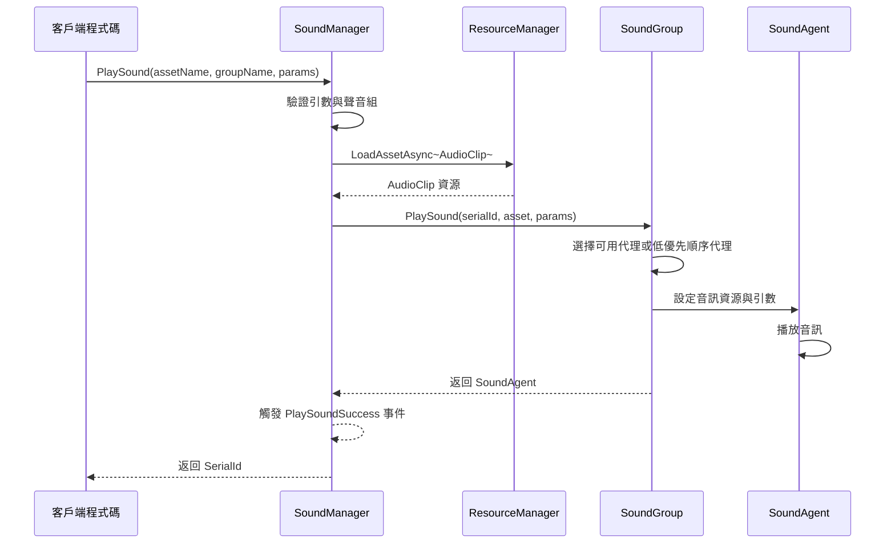
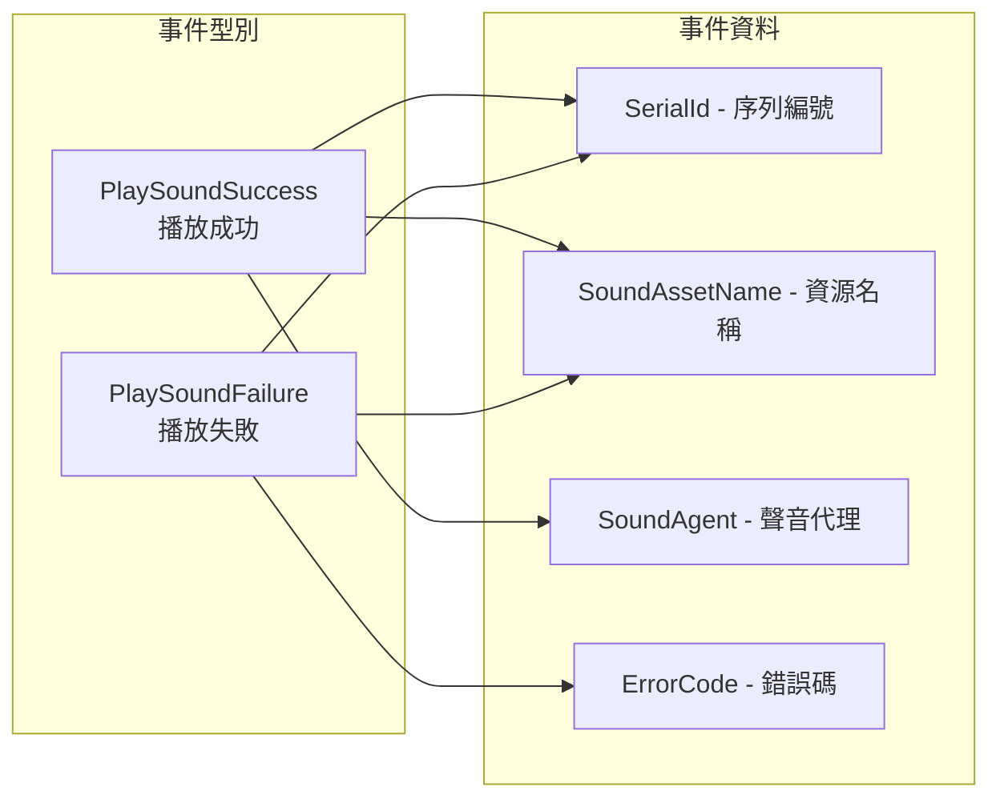

# 概述

GameFrameX Sound 是 GameFrameX 遊戲框架的音訊管理系統，專門為 Unity 遊戲引擎設計。它提供了一套完整的聲音播放、管理和控制解決方案，支援多聲音組、優先順序排程、淡入淡出等高階音訊功能。

## 系統架構

GameFrameX Sound 採用三層架構設計：管理器（SoundManager）→ 聲音組（SoundGroup）→ 聲音代理（SoundAgent）。這種分層設計使得音訊系統具有良好的可擴充套件性和靈活性，能夠滿足各種複雜的遊戲音訊需求。



## 核心概念

### 聲音管理器（SoundManager）

聲音管理器是整個音訊系統的核心組件，負責管理所有的聲音組和處理聲音播放請求。它繼承自 `GameFrameworkModule`，提供以下核心功能：

- **聲音組管理**：建立、查詢和銷燬聲音組
- **聲音播放**：非同步載入和播放聲音資源
- **播放控制**：暫停、恢復、停止單個或所有聲音
- **狀態查詢**：查詢正在載入或播放的聲音

> 詳細 API 說明請參閱 [聲音管理器](./4-core-concepts.1-sound-manager)

### 聲音組（SoundGroup）

聲音組用於組織和控制具有相似特性的聲音。例如，你可以為背景音樂建立一個 "Music" 組，為音效建立 "SFX" 組，每個組可以獨立控制音量和靜音狀態。

聲音組的核心特性：
- **獨立音量控制**：每個組有獨立的音量設定
- **靜音管理**：可以單獨靜音某個組而不影響其他組
- **優先順序策略**：可配置同優先順序聲音是否互相替換
- **代理池管理**：維護一組聲音代理用於併發播放

> 詳細 API 說明請參閱 [聲音組](./4-core-concepts.2-sound-group)

### 聲音代理（SoundAgent）

聲音代理是實際執行音訊播放的組件。每個聲音代理對應一個 `AudioSource`（或自定義音訊實現），負責：
- 播放/暫停/停止音訊
- 設定播放位置
- 控制迴圈播放
- 調整音調（Pitch）
- 設定立體聲聲相（PanStereo）
- 空間音訊混合（ SpatialBlend）
- 多普勒效果（DopplerLevel）

> 詳細 API 說明請參閱 [聲音代理](./4-core-concepts.3-sound-agent)

### 輔助器系統

GameFrameX Sound 採用輔助器（Helper）模式實現高度可擴充套件性：



透過繼承這些輔助器基類，開發者可以完全自定義音訊系統的底層實現，例如：
- 使用第三方音訊中介軟體（如 FMOD、Wwise）
- 實現特殊的音訊效果
- 自定義資源載入策略

## 聲音播放流程

當呼叫 `PlaySound` 方法時，系統按照以下流程處理：



1. **引數驗證**：檢查聲音組是否存在、是否有可用的聲音代理
2. **資源載入**：透過資源管理器非同步載入音訊資源
3. **代理分配**：從聲音組中選擇合適的代理（空閒或低優先順序）
4. **播放控制**：設定音訊引數並開始播放
5. **事件通知**：觸發成功或失敗事件

## 播放引數

`PlaySoundParams` 類包含所有可配置的播放引數：

| 引數 | 型別 | 預設值 | 說明 |
|------|------|--------|------|
| Time | float | 0f | 播放起始位置（秒） |
| MuteInSoundGroup | bool | false | 在組內是否靜音 |
| Loop | bool | false | 是否迴圈播放 |
| Priority | int | 0 | 播放優先順序（數值越高越優先） |
| VolumeInSoundGroup | float | 1.0f | 組內音量係數 |
| FadeInSeconds | float | 0f | 淡入時間（秒） |
| Pitch | float | 1.0f | 音調（0.5-3.0） |
| PanStereo | float | 0f | 立體聲位置（-1~1） |
| SpatialBlend | float | 0f | 空間混合量（2D/3D） |
| MaxDistance | float | 100f | 最大3D距離 |
| DopplerLevel | float | 1f | 多普勒效果等級 |

> 詳細說明請參閱 [播放引數](./5-api-reference.2-play-sound-params)

## 事件系統

GameFrameX Sound 提供完善的事件機制：



- **PlaySoundSuccess**：播放成功時觸發，包含序列編號、資源名稱、聲音代理等資訊
- **PlaySoundFailure**：播放失敗時觸發，包含錯誤碼和錯誤資訊

> 詳細說明請參閱 [事件引數](./5-api-reference.3-event-args)

## 使用示例

### 基本用法

```csharp
// 透過 SoundComponent 播放聲音
var soundComponent = GameEntry.GetComponent<SoundComponent>();
int serialId = await soundComponent.PlaySound("Assets/Audio/BGM_Main.mp3", "Music");
```

### 帶引數播放

```csharp
var playParams = PlaySoundParams.Create();
playParams.Loop = true;
playParams.VolumeInSoundGroup = 0.8f;
playParams.FadeInSeconds = 1.0f;

int serialId = await soundComponent.PlaySound("Assets/Audio/BGM_Battle.mp3", "Music", playParams);
```

### 控制播放

```csharp
// 暫停播放
soundComponent.PauseSound(serialId);

// 恢復播放
soundComponent.ResumeSound(serialId);

// 停止播放
soundComponent.StopSound(serialId);
```

## 設計理念

GameFrameX Sound 的設計遵循以下原則：

1. **分層管理**：透過 Manager → Group → Agent 的分層結構，實現細粒度的音訊控制
2. **優先順序排程**：基於優先順序的代理分配策略，確保重要聲音能夠及時播放
3. **輔助器擴充套件**：透過 Helper 模式支援自定義音訊實現，便於整合第三方音訊庫
4. **非同步載入**：使用 UniTask 實現非阻塞的音訊資源載入
5. **淡入淡出**：內建的音量漸變支援，提升音訊體驗

## 相關連結

- [安裝指南](./2-installation)
- [快速開始](./3-getting-started)
- [API 參考 - 介面定義](./5-api-reference.1-interfaces)
- [API 參考 - 播放引數](./5-api-reference.2-play-sound-params)
- [配置說明](./6-configuration)
- [擴充套件指南](./7-extending)
- [常見問題](./8-faq)
