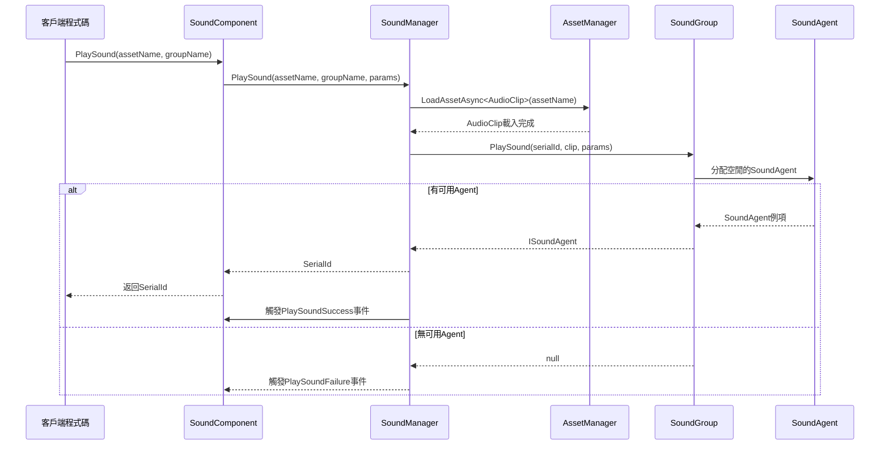

# 快速開始

本指南將幫助您快速上手 GameFrameX Sound 聲音管理組件，透過簡單的步驟即可在 Unity 專案中整合專業的音訊系統。

## 概述

GameFrameX Sound 是 GameFrameX 框架的聲音管理組件，提供完整的聲音播放、管理和控制功能。該組件支援多聲音組管理、非同步資源載入、空間音訊、聲音淡入淡出等高階特性，能夠滿足各種遊戲音訊需求。

**核心功能：**
- 多聲音組管理：支援同時管理多個聲音組，每個組可獨立控制音量和靜音
- 非同步載入：使用 UniTask 實現非同步資源載入，不阻塞遊戲主執行緒
- 靈活的事件系統：提供播放成功/失敗事件回呼
- 空間音訊支援：支援 3D 空間音效
- 聲音淡入淡出：支援播放時淡入、停止時淡出
- AudioMixer 整合：支援與 Unity AudioMixer 無縫對接

## 快速使用流程

以下是在 Unity 專案中快速整合 Sound 組件的五個步驟：

### 步驟 1：安裝組件

在 Unity 專案的 `manifest.json` 檔案中新增依賴：

```json
{
  "dependencies": {
    "com.gameframex.unity.sound": "https://github.com/GameFrameX/com.gameframex.unity.sound.git"
  }
}
```

> Source: [README.md](https://github.com/GameFrameX/com.gameframex.unity.sound/blob/main/README.md#L10-L14)

### 步驟 2：新增 SoundComponent

在 Unity 場景中建立一個空 GameObject，然後新增 `SoundComponent` 組件：

1. 在 Hierarchy 面板中右鍵點選，選擇 **Create Empty** 建立一個空物體
2. 將其重新命名為 "SoundSystem" 或其他合適的名稱
3. 在 Inspector 面板中點選 **Add Component**
4. 搜尋並選擇 **GameFrameX/Sound** 組件

> Source: [SoundComponent.cs](https://github.com/GameFrameX/com.gameframex.unity.sound/blob/main/Runtime/Sound/SoundComponent.cs#L50-L51)

```csharp
[DisallowMultipleComponent]
[AddComponentMenu("GameFrameX/Sound")]
public sealed partial class SoundComponent : GameFrameworkComponent
```

### 步驟 3：配置聲音組

在 SoundComponent 的 Inspector 面板中配置聲音組。點選 **Sound Groups** 陣列，為每個元素設定：

| 屬性 | 說明 | 示例值 |
|------|------|--------|
| Name | 聲音組名稱，用於程式碼中引用 | "Music", "SFX", "Voice" |
| Avoid Being Replaced By Same Priority | 是否避免被同優先順序聲音替換 | false |
| Mute | 是否靜音 | false |
| Volume | 音量大小 (0-1) | 1.0 |
| Agent Helper Count | 併發播放代理數量 | 3 |

> Source: [SoundComponent.cs](https://github.com/GameFrameX/com.gameframex.unity.sound/blob/main/Runtime/Sound/SoundComponent.cs#L175-L183)

典型的配置方案：
- **背景音樂組**：1 個 Agent，迴圈播放
- **音效組**：3-5 個 Agent，支援多音效同時播放
- **語音組**：1-2 個 Agent，確保語音清晰

### 步驟 4：在程式碼中播放聲音

透過 `SoundComponent` 播放聲音非常簡單：

```csharp
// 獲取 SoundComponent 例項
var soundComponent = GameEntry.GetComponent<SoundComponent>();

// 播放背景音樂（迴圈）
var musicParams = PlaySoundParams.Create(true); // true 表示迴圈播放
await soundComponent.PlaySound("Assets/Audio/Music/MainTheme.mp3", "Music", musicParams);

// 播放音效（不迴圈）
await soundComponent.PlaySound("Assets/Audio/SFX/Click.wav", "SFX");

// 播放 3D 空間音效
await soundComponent.PlaySound("Assets/Audio/SFX/Explosion.wav", "SFX", transform.position);
```

> Source: [SoundComponent.cs](https://github.com/GameFrameX/com.gameframex.unity.sound/blob/main/Runtime/Sound/SoundComponent.cs#L356-L430)

### 步驟 5：控制播放

使用返回的序列編號（SerialId）控制聲音播放：

```csharp
// 暫停聲音
soundComponent.PauseSound(serialId);

// 恢復播放
soundComponent.ResumeSound(serialId);

// 停止聲音（帶淡出效果）
soundComponent.StopSound(serialId, 0.5f); // 0.5秒淡出

// 停止所有聲音
soundComponent.StopAllLoadedSounds();
```

> Source: [SoundComponent.cs](https://github.com/GameFrameX/com.gameframex.unity.sound/blob/main/Runtime/Sound/SoundComponent.cs#L532-L614)

## 播放流程

以下流程圖展示了從呼叫 PlaySound 到聲音實際播放的完整過程：



## 播放引數配置

`PlaySoundParams` 類提供了豐富的播放引數配置：

```csharp
// 建立播放引數
var playSoundParams = ReferencePool.Acquire<PlaySoundParams>();

// 配置播放引數
playSoundParams.Loop = true;                    // 迴圈播放
playSoundParams.VolumeInSoundGroup = 0.8f;    // 組內音量
playSoundParams.Priority = 100;                // 優先順序
playSoundParams.FadeInSeconds = 1.0f;         // 淡入時間（秒）
playSoundParams.Pitch = 1.0f;                  // 音調
playSoundParams.SpatialBlend = 1.0f;           // 空間混合（3D音效）
playSoundParams.MaxDistance = 50f;             // 最大距離

// 使用後釋放回物件池
ReferencePool.Release(playSoundParams);
```

> Source: [PlaySoundParams.cs](https://github.com/GameFrameX/com.gameframex.unity.sound/blob/main/Runtime/Sound/Sound/PlaySoundParams.cs#L40-L258)

**常用引數說明：**

| 引數 | 型別 | 預設值 | 說明 |
|------|------|--------|------|
| Loop | bool | false | 是否迴圈播放 |
| VolumeInSoundGroup | float | 1.0 | 在聲音組內的音量 (0-1) |
| Priority | int | 0 | 播放優先順序，數值越高越優先 |
| FadeInSeconds | float | 0 | 淡入時間（秒） |
| Pitch | float | 1.0 | 播放音調 (0.5-2.0) |
| SpatialBlend | float | 0 | 空間混合量 (0=2D, 1=3D) |
| MaxDistance | float | 100 | 3D音效最大衰減距離 |

## 完整使用示例

以下是一個完整的使用示例，展示如何在遊戲啟動時播放背景音樂，並在玩家點選按鈕時播放音效：

```csharp
using UnityEngine;
using GameFrameX.Sound.Runtime;
using GameFrameX.Runtime;
using Cysharp.Threading.Tasks;

public class AudioExample : MonoBehaviour
{
    private SoundComponent _soundComponent;
    private int _bgMusicSerialId;
    
    private void Start()
    {
        // 獲取 SoundComponent
        _soundComponent = GameEntry.GetComponent<SoundComponent>();
        
        // 訂閱播放事件
        _soundComponent.PlaySoundSuccess += OnPlaySoundSuccess;
        _soundComponent.PlaySoundFailure += OnPlaySoundFailure;
        
        // 播放背景音樂
        PlayBackgroundMusic();
    }
    
    private async void PlayBackgroundMusic()
    {
        // 建立迴圈播放引數
        var musicParams = PlaySoundParams.Create(true);
        musicParams.FadeInSeconds = 2.0f;
        musicParams.VolumeInSoundGroup = 0.6f;
        
        _bgMusicSerialId = await _soundComponent.PlaySound(
            "Assets/Audio/Music/GameTitle.mp3", 
            "Music", 
            musicParams
        );
    }
    
    // 玩家點選按鈕時呼叫
    public void OnButtonClick()
    {
        // 播放點選音效
        _ = _soundComponent.PlaySound(
            "Assets/Audio/SFX/ButtonClick.wav", 
            "SFX"
        );
    }
    
    // 播放成功回呼
    private void OnPlaySoundSuccess(object sender, PlaySoundSuccessEventArgs e)
    {
        Debug.Log($"聲音播放成功: {e.SoundAssetName}, SerialId: {e.SerialId}");
    }
    
    // 播放失敗回呼
    private void OnPlaySoundFailure(object sender, PlaySoundFailureEventArgs e)
    {
        Debug.LogWarning($"聲音播放失敗: {e.SoundAssetName}, 錯誤: {e.ErrorMessage}");
    }
    
    private void OnDestroy()
    {
        if (_soundComponent != null)
        {
            _soundComponent.PlaySoundSuccess -= OnPlaySoundSuccess;
            _soundComponent.PlaySoundFailure -= OnPlaySoundFailure;
        }
    }
}
```

> Source: [SoundComponent.cs](https://github.com/GameFrameX/com.gameframex.unity.sound/blob/main/Runtime/Sound/SoundComponent.cs#L655-L688)

## 聲音組管理

在執行時動態管理聲音組：

```csharp
var soundComponent = GameEntry.GetComponent<SoundComponent>();

// 檢查聲音組是否存在
if (soundComponent.HasSoundGroup("Music"))
{
    // 獲取聲音組
    var musicGroup = soundComponent.GetSoundGroup("Music");
    
    // 設定音量
    musicGroup.Volume = 0.5f;
    
    // 靜音/取消靜音
    musicGroup.Mute = true;
    
    // 檢查是否正在播放
    bool isPlaying = musicGroup.IsPlaying(serialId);
}

// 停止當前播放的所有聲音
soundComponent.StopAllLoadedSounds();
soundComponent.StopAllLoadingSounds();
```

> Source: [ISoundGroup.cs](https://github.com/GameFrameX/com.gameframex.unity.sound/blob/main/Runtime/Interface/ISoundGroup.cs#L38-L87)

## 相關連結

- [聲音管理器](./4-core-concepts.1-sound-manager) - 瞭解 SoundManager 的詳細功能
- [聲音組](./4-core-concepts.2-sound-group) - 深入瞭解聲音組概念
- [聲音代理](./4-core-concepts.3-sound-agent) - 瞭解聲音代理機制
- [API 參考 - 介面定義](./5-api-reference.1-interfaces) - ISoundManager、ISoundGroup 等介面詳解
- [API 參考 - 播放引數](./5-api-reference.2-play-sound-params) - PlaySoundParams 完整引數說明
- [API 參考 - 事件引數](./5-api-reference.3-event-args) - 播放事件詳解
- [配置說明](./6-configuration) - 聲音系統配置選項
