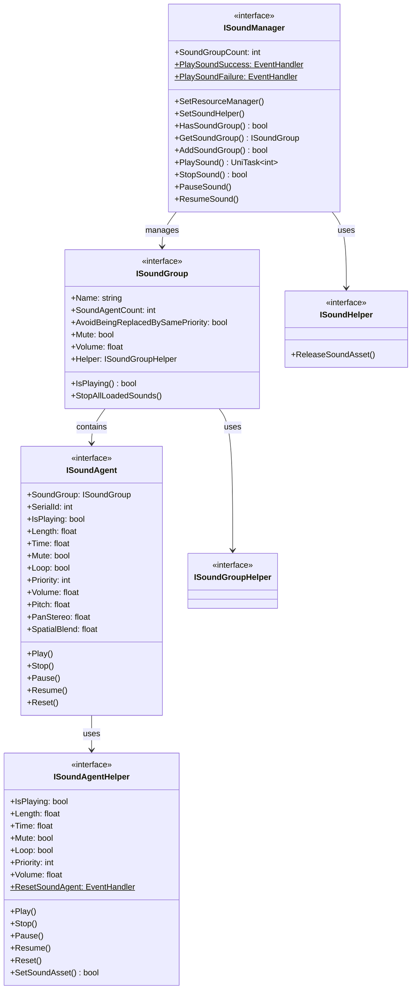

# 介面定義

本文件詳細介紹 GameFrameX 聲音系統中定義的所有核心介面。介面採用分層設計，提供了對聲音管理器、聲音組、聲音代理及輔助器的完整抽象。

## 概述

GameFrameX 聲音系統採用了經典的分層架構，透過介面定義實現了高度的可擴充套件性和可測試性。系統包含以下核心介面：

- **ISoundManager** - 聲音管理器介面，負責全域性聲音資源管理和播放控制
- **ISoundGroup** - 聲音組介面，管理一組相關聲音的播放行為
- **ISoundAgent** - 聲音代理介面，控制單個聲音例項的播放
- **ISoundHelper** - 聲音輔助器介面，用於資源釋放
- **ISoundGroupHelper** - 聲音組輔助器介面
- **ISoundAgentHelper** - 聲音代理輔助器介面

這種分層設計使得開發者可以針對不同平臺（如 FMOD、CRIWARE）實現特定的輔助器，同時保持上層程式碼的一致性。

## 介面架構



## ISoundManager 介面

ISoundManager 是聲音系統的核心介面，繼承自 GameFrameworkModule，提供全域性聲音管理功能。

### 核心屬性

| 屬性 | 型別 | 描述 |
|------|------|------|
| SoundGroupCount | `int` | 獲取當前已新增的聲音組數量 |
| PlaySoundSuccess | `EventHandler<PlaySoundSuccessEventArgs>`` | 播放聲音成功事件 |
| PlaySoundFailure | `EventHandler<PlaySoundFailureEventArgs>` | 播放聲音失敗事件 |

### 核心方法

#### 設定資源管理器

```csharp
void SetResourceManager(IAssetManager assetManager)
```

設定資源管理器，用於非同步載入聲音資源。

> Source: [ISoundManager.cs](https://github.com/GameFrameX/com.gameframex.unity.sound/blob/main/Runtime/Interface/ISoundManager.cs#L62-L64)

#### 設定聲音輔助器

```csharp
void SetSoundHelper(ISoundHelper soundHelper)
```

設定聲音輔助器，用於釋放聲音資源。

> Source: [ISoundManager.cs](https://github.com/GameFrameX/com.gameframex.unity.sound/blob/main/Runtime/Interface/ISoundManager.cs#L67-L70)

#### 新增聲音組

```csharp
bool AddSoundGroup(string soundGroupName, ISoundGroupHelper soundGroupHelper)
bool AddSoundGroup(string soundGroupName, bool soundGroupAvoidBeingReplacedBySamePriority, bool soundGroupMute, float soundGroupVolume, ISoundGroupHelper soundGroupHelper)
```

新增新的聲音組。第一個過載使用預設引數，第二個過載允許指定完整配置。

**引數：**
- `soundGroupName` - 聲音組名稱，用於標識和獲取聲音組
- `soundGroupAvoidBeingReplacedBySamePriority` - 同優先順序聲音是否避免被替換
- `soundGroupMute` - 聲音組是否靜音
- `soundGroupVolume` - 聲音組音量（0.0-1.0）
- `soundGroupHelper` - 聲音組輔助器例項

> Source: [ISoundManager.cs](https://github.com/GameFrameX/com.gameframex.unity.sound/blob/main/Runtime/Interface/ISoundManager.cs#L98-L115)

#### 獲取聲音組

```csharp
bool HasSoundGroup(string soundGroupName)
ISoundGroup GetSoundGroup(string soundGroupName)
ISoundGroup[] GetAllSoundGroups()
void GetAllSoundGroups(List<ISoundGroup> results)
```

獲取已新增的聲音組。支援按名稱查詢和獲取全部聲音組。

> Source: [ISoundManager.cs](https://github.com/GameFrameX/com.gameframex.unity.sound/blob/main/Runtime/Interface/ISoundManager.cs#L72-L96)

#### 播放聲音

```csharp
UniTask<int> PlaySound(string soundAssetName, string soundGroupName)
UniTask<int> PlaySound(string soundAssetName, string soundGroupName, int priority)
UniTask<int> PlaySound(string soundAssetName, string soundGroupName, PlaySoundParams playSoundParams)
UniTask<int> PlaySound(string soundAssetName, string soundGroupName, object userData)
UniTask<int> PlaySound(string soundAssetName, string soundGroupName, int priority, PlaySoundParams playSoundParams)
UniTask<int> PlaySound(string soundAssetName, string soundGroupName, int priority, object userData)
UniTask<int> PlaySound(string soundAssetName, string soundGroupName, PlaySoundParams playSoundParams, object userData)
UniTask<int> PlaySound(string soundAssetName, string soundGroupName, int priority, PlaySoundParams playSoundParams, object userData, int serialId)
```

播放聲音資源的核心方法，提供多個過載以滿足不同場景需求。返回聲音的序列編號（SerialId），用於後續播放控制。

**引數：**
- `soundAssetName` - 聲音資源名稱
- `soundGroupName` - 聲音組名稱
- `priority` - 載入優先順序
- `playSoundParams` - 播放引數（音調、音量、迴圈等）
- `userData` - 使用者自定義資料，會在事件中回傳
- `serialId` - 指定序列編號

> Source: [ISoundManager.cs](https://github.com/GameFrameX/com.gameframex.unity.sound/blob/main/Runtime/Interface/ISoundManager.cs#L143-L218)

#### 停止聲音

```csharp
bool StopSound(int serialId)
bool StopSound(int serialId, float fadeOutSeconds)
```

停止指定序列編號的聲音播放。第二個過載支援淡出效果。

> Source: [ISoundManager.cs](https://github.com/GameFrameX/com.gameframex.unity.sound/blob/main/Runtime/Interface/ISoundManager.cs#L220-L233)

#### 停止所有聲音

```csharp
void StopAllLoadedSounds()
void StopAllLoadedSounds(float fadeOutSeconds)
void StopAllLoadingSounds()
```

停止所有已載入或正在載入的聲音。

> Source: [ISoundManager.cs](https://github.com/GameFrameX/com.gameframex.unity.sound/blob/main/Runtime/Interface/ISoundManager.cs#L235-L249)

#### 暫停/恢復聲音

```csharp
void PauseSound(int serialId)
void PauseSound(int serialId, float fadeOutSeconds)
void ResumeSound(int serialId)
void ResumeSound(int serialId, float fadeInSeconds)
```

暫停和恢復指定聲音的播放。支援淡入淡出效果。

> Source: [ISoundManager.cs](https://github.com/GameFrameX/com.gameframex.unity.sound/blob/main/Runtime/Interface/ISoundManager.cs#L251-L275)

#### 查詢載入狀態

```csharp
int[] GetAllLoadingSoundSerialIds()
void GetAllLoadingSoundSerialIds(List<int> results)
bool IsLoadingSound(int serialId)
```

查詢當前正在載入的聲音序列編號。

> Source: [ISoundManager.cs](https://github.com/GameFrameX/com.gameframex.unity.sound/blob/main/Runtime/Interface/ISoundManager.cs#L124-L141)

---

## ISoundGroup 介面

ISoundGroup 表示聲音組，用於管理一組相關的聲音。每個聲音組有自己的音量控制、靜音設定和替換策略。

### 屬性

| 屬性 | 型別 | 讀寫 | 描述 |
|------|------|------|------|
| Name | `string` | 只讀 | 聲音組名稱 |
| SoundAgentCount | `int` | 只讀 | 聲音代理數量 |
| AvoidBeingReplacedBySamePriority | `bool` | 讀寫 | 同優先順序聲音是否避免被替換 |
| Mute | `bool` | 讀寫 | 聲音組靜音狀態 |
| Volume | `float` | 讀寫 | 聲音組音量（0.0-1.0） |
| Helper | `ISoundGroupHelper` | 只讀 | 聲音組輔助器 |

> Source: [ISoundGroup.cs](https://github.com/GameFrameX/com.gameframex.unity.sound/blob/main/Runtime/Interface/ISoundGroup.cs#L38-L68)

### 方法

#### 檢查播放狀態

```csharp
bool IsPlaying(int serialId)
```

檢查指定序列編號的聲音是否正在播放。如果找不到指定的序列編號也會返回 false。

> Source: [ISoundGroup.cs](https://github.com/GameFrameX/com.gameframex.unity.sound/blob/main/Runtime/Interface/ISoundGroup.cs#L70-L75)

#### 停止所有聲音

```csharp
void StopAllLoadedSounds()
void StopAllLoadedSounds(float fadeOutSeconds)
```

停止該聲音組中所有已載入的聲音。

> Source: [ISoundGroup.cs](https://github.com/GameFrameX/com.gameframex.unity.sound/blob/main/Runtime/Interface/ISoundGroup.cs#L77-L86)

---

## ISoundAgent 介面

ISoundAgent 表示聲音代理，是實際控制音訊播放的最小單元。每個聲音代理對應一個正在播放或已暫停的聲音例項。

### 屬性

| 屬性 | 型別 | 讀寫 | 描述 |
|------|------|------|------|
| SoundGroup | `ISoundGroup` | 只讀 | 所屬聲音組 |
| SerialId | `int` | 只讀 | 序列編號 |
| IsPlaying | `bool` | 只讀 | 是否正在播放 |
| Length | `float` | 只讀 | 聲音長度（秒） |
| Time | `float` | 讀寫 | 當前播放位置（秒） |
| Mute | `bool` | 只讀 | 靜音狀態 |
| MuteInSoundGroup | `bool` | 讀寫 | 在組內是否靜音 |
| Loop | `bool` | 讀寫 | 是否迴圈播放 |
| Priority | `int` | 讀寫 | 播放優先順序 |
| Volume | `float` | 只讀 | 當前音量 |
| VolumeInSoundGroup | `float` | 讀寫 | 在組內音量 |
| Pitch | `float` | 讀寫 | 音調 |
| PanStereo | `float` | 讀寫 | 立體聲聲相（-1.0到1.0） |
| SpatialBlend | `float` | 讀寫 | 空間混合量（0.0到1.0） |
| MaxDistance | `float` | 讀寫 | 最大距離 |
| DopplerLevel | `float` | 讀寫 | 多普勒等級 |
| Helper | `ISoundAgentHelper` | 只讀 | 代理輔助器 |

> Source: [ISoundAgent.cs](https://github.com/GameFrameX/com.gameframex.unity.sound/blob/main/Runtime/Interface/ISoundAgent.cs#L38-L123)

### 方法

#### 播放

```csharp
void Play()
void Play(float fadeInSeconds)
```

開始或恢復聲音播放。第二個過載支援淡入效果。

> Source: [ISoundAgent.cs](https://github.com/GameFrameX/com.gameframex.unity.sound/blob/main/Runtime/Interface/ISoundAgent.cs#L125-L134)

#### 停止

```csharp
void Stop()
void Stop(float fadeOutSeconds)
```

停止聲音播放。第二個過載支援淡出效果。

> Source: [ISoundAgent.cs](https://github.com/GameFrameX/com.gameframex.unity.sound/blob/main/Runtime/Interface/ISoundAgent.cs#L136-L145)

#### 暫停

```csharp
void Pause()
void Pause(float fadeOutSeconds)
```

暫停聲音播放。第二個過載支援淡出效果。

> Source: [ISoundAgent.cs](https://github.com/GameFrameX/com.gameframex.unity.sound/blob/main/Runtime/Interface/ISoundAgent.cs#L147-L156)

#### 恢復

```csharp
void Resume()
void Resume(float fadeInSeconds)
```

恢復暫停的聲音播放。第二個過載支援淡入效果。

> Source: [ISoundAgent.cs](https://github.com/GameFrameX/com.gameframex.unity.sound/blob/main/Runtime/Interface/ISoundAgent.cs#L158-L167)

#### 重置

```csharp
void Reset()
```

重置聲音代理到初始狀態。

> Source: [ISoundAgent.cs](https://github.com/GameFrameX/com.gameframex.unity.sound/blob/main/Runtime/Interface/ISoundAgent.cs#L169-L172)

---

## ISoundHelper 介面

ISoundHelper 是最簡單的介面，用於釋放聲音資源。

### 方法

```csharp
void ReleaseSoundAsset(object soundAsset)
```

釋放指定的聲音資源。

> Source: [ISoundHelper.cs](https://github.com/GameFrameX/com.gameframex.unity.sound/blob/main/Runtime/Interface/ISoundHelper.cs#L38-L45)

---

## ISoundGroupHelper 介面

ISoundGroupHelper 是聲音組輔助器的標記介面。目前沒有定義任何方法，僅作為基類標識使用。

> Source: [ISoundGroupHelper.cs](https://github.com/GameFrameX/com.gameframex.unity.sound/blob/main/Runtime/Interface/ISoundGroupHelper.cs#L38-L40)

---

## ISoundAgentHelper 介面

ISoundAgentHelper 是聲音代理輔助器介面，提供底層音訊播放控制。該介面與 ISoundAgent 類似，但面向底層實現。

### 屬性

| 屬性 | 型別 | 讀寫 | 描述 |
|------|------|------|------|
| IsPlaying | `bool` | 只讀 | 是否正在播放 |
| Length | `float` | 只讀 | 聲音長度（秒） |
| Time | `float` | 讀寫 | 當前播放位置（秒） |
| Mute | `bool` | 讀寫 | 靜音狀態 |
| Loop | `bool` | 讀寫 | 是否迴圈播放 |
| Priority | `int` | 讀寫 | 播放優先順序 |
| Volume | `float` | 讀寫 | 音量大小 |
| Pitch | `float` | 讀寫 | 音調 |
| PanStereo | `float` | 讀寫 | 立體聲聲相 |
| SpatialBlend | `float` | 讀寫 | 空間混合量 |
| MaxDistance | `float` | 讀寫 | 最大距離 |
| DopplerLevel | `float` | 讀寫 | 多普勒等級 |

### 事件

```csharp
event EventHandler<ResetSoundAgentEventArgs> ResetSoundAgent
```

當聲音代理被重置時觸發的事件。

### 方法

#### 播放

```csharp
void Play(float fadeInSeconds)
```

以指定淡入時間播放聲音。

> Source: [ISoundAgentHelper.cs](https://github.com/GameFrameX/com.gameframex.unity.sound/blob/main/Runtime/Interface/ISoundAgentHelper.cs#L107-L111)

#### 停止

```csharp
void Stop(float fadeOutSeconds)
```

以指定淡出時間停止聲音。

> Source: [ISoundAgentHelper.cs](https://github.com/GameFrameX/com.gameframex.unity.sound/blob/main/Runtime/Interface/ISoundAgentHelper.cs#L113-L117)

#### 暫停

```csharp
void Pause(float fadeOutSeconds)
```

以指定淡出時間暫停聲音。

> Source: [ISoundAgentHelper.cs](https://github.com/GameFrameX/com.gameframex.unity.sound/blob/main/Runtime/Interface/ISoundAgentHelper.cs#L119-L123)

#### 恢復

```csharp
void Resume(float fadeInSeconds)
```

以指定淡入時間恢復聲音。

> Source: [ISoundAgentHelper.cs](https://github.com/GameFrameX/com.gameframex.unity.sound/blob/main/Runtime/Interface/ISoundAgentHelper.cs#L125-L129)

#### 重置

```csharp
void Reset()
```

重置輔助器到初始狀態。

> Source: [ISoundAgentHelper.cs](https://github.com/GameFrameX/com.gameframex.unity.sound/blob/main/Runtime/Interface/ISoundAgentHelper.cs#L131-L134)

#### 設定聲音資源

```csharp
bool SetSoundAsset(object soundAsset)
```

設定要播放的聲音資源。返回是否設定成功。

> Source: [ISoundAgentHelper.cs](https://github.com/GameFrameX/com.gameframex.unity.sound/blob/main/Runtime/Interface/ISoundAgentHelper.cs#L136-L141)

---

## 事件引數

系統定義了以下事件引數型別用於回呼：

### PlaySoundSuccessEventArgs

播放聲音成功時觸發的事件引數。

| 屬性 | 型別 | 描述 |
|------|------|------|
| SerialId | `int` | 聲音的序列編號 |
| SoundAssetName | `string` | 聲音資源名稱 |
| SoundAgent | `ISoundAgent` | 用於播放的聲音代理 |
| Duration | `float` | 載入持續時間 |
| UserData | `object` | 使用者自定義資料 |

> Source: [PlaySoundSuccessEventArgs.cs](https://github.com/GameFrameX/com.gameframex.unity.sound/blob/main/Runtime/EventArgs/PlaySoundSuccessEventArgs.cs)

### PlaySoundFailureEventArgs

播放聲音失敗時觸發的事件引數。

| 屬性 | 型別 | 描述 |
|------|------|------|
| SerialId | `int` | 聲音的序列編號 |
| SoundAssetName | `string` | 聲音資源名稱 |
| SoundGroupName | `string` | 聲音組名稱 |
| PlaySoundParams | `PlaySoundParams` | 播放引數 |
| ErrorCode | `PlaySoundErrorCode` | 錯誤碼 |
| ErrorMessage | `string` | 錯誤資訊 |
| UserData | `object` | 使用者自定義資料 |

> Source: [PlaySoundFailureEventArgs.cs](https://github.com/GameFrameX/com.gameframex.unity.sound/blob/main/Runtime/EventArgs/PlaySoundFailureEventArgs.cs)

---

## 使用示例

### 監聽播放事件

```csharp
var soundManager = GameFrameworkEntry.GetModule<ISoundManager>();
soundManager.PlaySoundSuccess += OnPlaySoundSuccess;
soundManager.PlaySoundFailure += OnPlaySoundFailure;

private void OnPlaySoundSuccess(object sender, PlaySoundSuccessEventArgs e)
{
    Debug.Log($"聲音播放成功: {e.SoundAssetName}, 序列編號: {e.SerialId}");
}

private void OnPlaySoundFailure(object sender, PlaySoundFailureEventArgs e)
{
    Debug.LogError($"聲音播放失敗: {e.SoundAssetName}, 錯誤: {e.ErrorMessage}");
}
```

### 播放帶引數的聲音

```csharp
var playParams = PlaySoundParams.Create(loop: false);
playParams.Pitch = 1.0f;
playParams.VolumeInSoundGroup = 0.8f;
playParams.Priority = 100;

int serialId = await soundManager.PlaySound("bgm_music", "BGM", playParams);
```

### 控制聲音組音量

```csharp
ISoundGroup bgmGroup = soundManager.GetSoundGroup("BGM");
if (bgmGroup != null)
{
    bgmGroup.Volume = 0.5f;
    bgmGroup.Mute = false;
}
```

---

## 相關連結

- [播放引數](./5-api-reference.2-play-sound-params) - PlaySoundParams 詳細配置
- [事件引數](./5-api-reference.3-event-args) - 事件引數詳細說明
- [聲音管理器](./4-core-concepts.1-sound-manager) - 聲音管理器核心概念
- [聲音組](./4-core-concepts.2-sound-group) - 聲音組核心概念
- [聲音代理](./4-core-concepts.3-sound-agent) - 聲音代理核心概念
