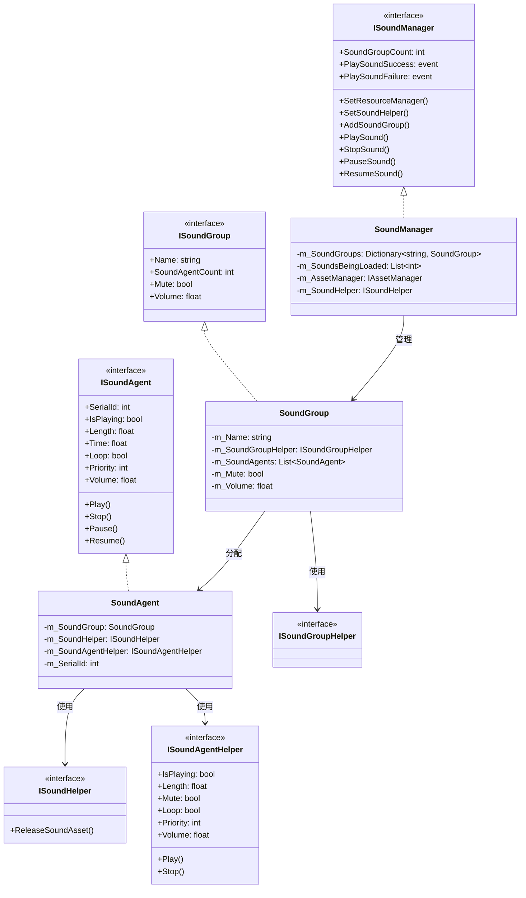
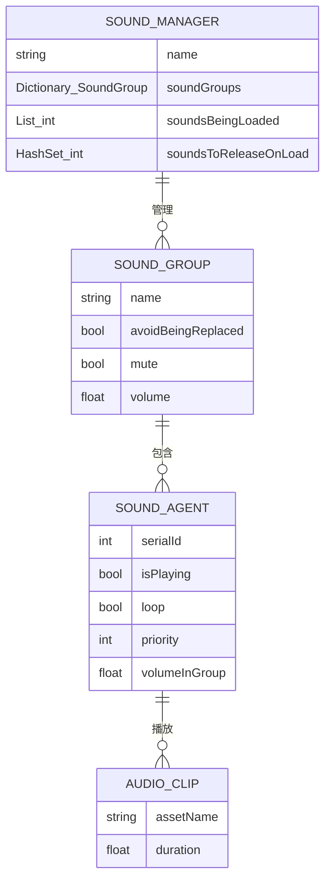
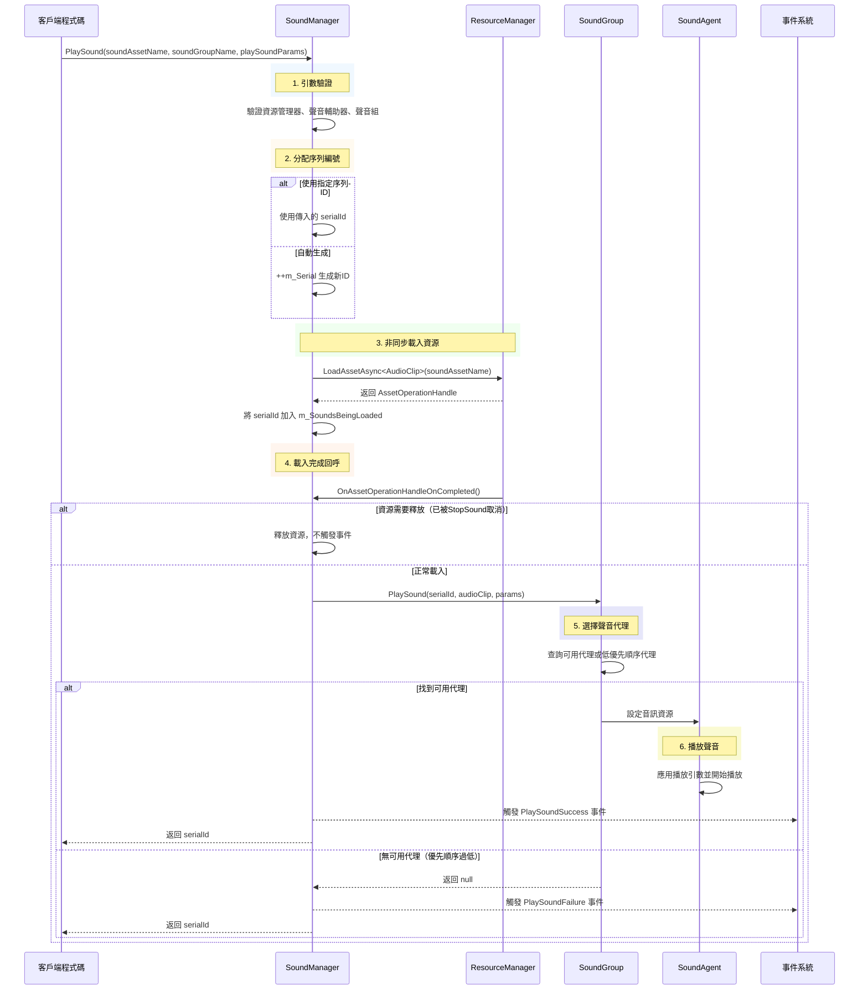
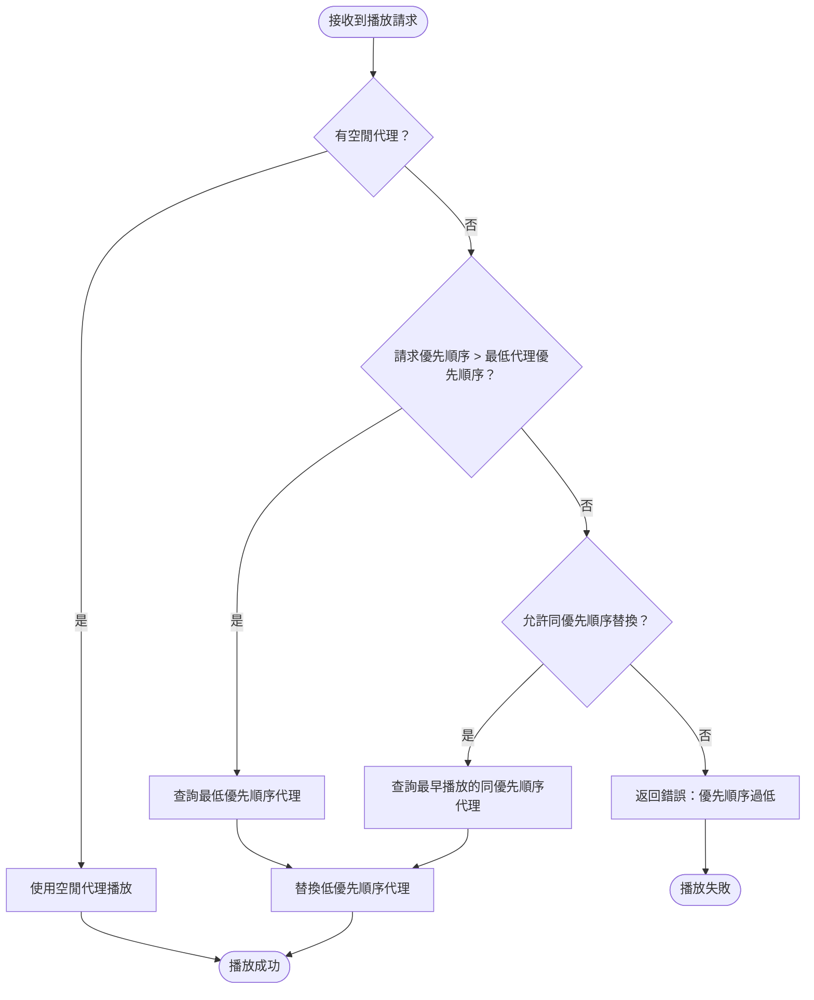

# 聲音管理器

聲音管理器（SoundManager）是 GameFrameX 音訊模組的核心組件，負責管理遊戲中的聲音播放、聲音組、聲音代理以及資源載入等核心功能。它提供了統一的介面來控制背景音樂、音效、語音等各種音訊資源，支援優先順序管理、音量控制、淡入淡出等高階特性。

## 概述

SoundManager 是 GameFrameX 框架中處理所有音訊相關操作的核心模組。作為 GameFrameworkModule 的實現類，它遵循框架的模組化設計原則，可以與其他框架模組（如資源管理器、事件系統）無縫整合。

**核心職責：**
- 管理多個聲音組（SoundGroup），每個組可獨立控制音量和靜音狀態
- 協調聲音代理（SoundAgent）的分配，實現優先順序排程和資源複用
- 非同步載入音訊資源，支援 YooAsset 資源管理系統
- 觸發播放成功/失敗事件，便於遊戲邏輯響應音訊狀態變化

**設計意圖：**
SoundManager 採用分層架構設計，將音訊播放的底層實現（SoundAgent）與管理層（SoundManager）分離。這種設計允許開發者透過自定義 Helper 來適配不同的音訊引擎（如 Unity AudioSource、Fmod、AudioKit），同時保持上層程式碼的一致性。優先順序機制確保重要音效能夠及時播放，避免因代理池滿導致的聲音丟失。

```mermaid
flowchart TD
    subgraph SoundManager["聲音管理器 (SoundManager)"]
        SM[核心管理器]
        SG[聲音組字典]
        SL[載入中的聲音列表]
        SR[待釋放資源集合]
    end
    
    subgraph External["外部依賴"]
        AM[資源管理器]
        SH[聲音輔助器]
        EC[事件組件]
    end
    
    subgraph SoundGroup["聲音組 (SoundGroup)"]
        SGH[輔助器]
        SAG[聲音代理列表]
    end
    
    subgraph SoundAgent["聲音代理 (SoundAgent)"]
        SAH[代理輔助器]
        ASSET[音訊資源]
    end
    
    AM --> SM : 載入音訊資源
    SH --> SM : 釋放資源回呼
    SM --> SG : 管理聲音組
    SG --> SGH
    SGH --> SAG
    SAG --> SAH
    SAH --> ASSET : 播放音訊
    SM --> EC : 觸發播放事件
```

## 核心架構

### 模組層次結構

SoundManager 採用三層架構設計，每層承擔不同的職責：

1. **介面層**：定義 ISoundManager、ISoundGroup、ISoundAgent 等介面，封裝業務邏輯
2. **實現層**：SoundManager、SoundGroup、SoundAgent 的具體實現
3. **輔助層**：各種 Helper 介面及其預設實現，提供平臺特定的音訊處理能力



### 核心資料結構

SoundManager 內部維護三個核心資料結構：



- **m_SoundGroups**：儲存所有聲音組的字典，以組名為鍵，支援 O(1) 查詢
- **m_SoundsBeingLoaded**：記錄正在非同步載入的聲音序列 ID，用於跟蹤載入狀態
- **m_SoundsToReleaseOnLoad**：記錄需要在下一次載入完成時立即釋放的聲音 ID，用於處理 StopSound 在載入期間被呼叫的情況

## 聲音播放流程

### 完整播放流程

當呼叫 PlaySound 方法時，SoundManager 會執行以下步驟：



### 聲音代理選擇策略

SoundGroup 採用智慧代理選擇策略，確保高優先順序聲音能夠及時播放：



**代理選擇邏輯：**
1. 優先使用空閒的代理
2. 如果沒有空閒代理，比較請求優先順序與現有播放聲音的優先順序
3. 如果請求優先順序更高，替換最低優先順序的代理
4. 如果優先順序相同，根據 `AvoidBeingReplacedBySamePriority` 設定決定是否替換同優先順序聲音

## 使用示例

### 基礎使用方式

在 Unity 場景中新增 SoundComponent 後，可以透過以下方式播放聲音：

```csharp
// 透過 SoundComponent 播放音效
var soundComponent = GameEntry.GetComponent<SoundComponent>();
int serialId = await soundComponent.PlaySound("Assets/Sounds/click.wav", "UI");
```

> Source: [SoundComponent.cs](https://github.com/GameFrameX/com.gameframex.unity.sound/blob/main/Runtime/Sound/SoundComponent.cs#L356-L359)

### 帶引數的播放

```csharp
// 建立播放引數
var playParams = PlaySoundParams.Create(false);
playParams.VolumeInSoundGroup = 0.8f;
playParams.Priority = 100;
playParams.Loop = false;
playParams.FadeInSeconds = 0.3f;

// 播放音效
int serialId = await soundComponent.PlaySound("Assets/Sounds/bgm_main.wav", "Background", playParams);
```

> Source: [PlaySoundParams.cs](https://github.com/GameFrameX/com.gameframex.unity.sound/blob/main/Runtime/Sound/Sound/PlaySoundParams.cs#L233-L239)

### 事件監聽

```csharp
// 監聽播放成功事件
soundComponent.PlaySoundSuccess += OnPlaySoundSuccess;

// 監聽播放失敗事件
soundComponent.PlaySoundFailure += OnPlaySoundFailure;

private void OnPlaySoundSuccess(object sender, PlaySoundSuccessEventArgs e)
{
    Debug.Log($"聲音播放成功: {e.SoundAssetName}, SerialId: {e.SerialId}");
    // 可透過 e.SoundAgent 獲取播放代理進行更精細的控制
}

private void OnPlaySoundFailure(object sender, PlaySoundFailureEventArgs e)
{
    Debug.LogWarning($"聲音播放失敗: {e.SoundAssetName}, 錯誤碼: {e.ErrorCode}, 原因: {e.ErrorMessage}");
}
```

> Source: [PlaySoundSuccessEventArgs.cs](https://github.com/GameFrameX/com.gameframex.unity.sound/blob/main/Runtime/EventArgs/PlaySoundSuccessEventArgs.cs#L89-L98)

### 聲音控制

```csharp
// 暫停指定聲音
soundComponent.PauseSound(serialId);

// 恢復播放
soundComponent.ResumeSound(serialId);

// 停止播放（帶淡出效果）
soundComponent.StopSound(serialId, 0.5f);

// 停止所有已載入的聲音
soundComponent.StopAllLoadedSounds(1.0f);

// 停止所有正在載入的聲音
soundComponent.StopAllLoadingSounds();
```

> Source: [SoundManager.cs](https://github.com/GameFrameX/com.gameframex.unity.sound/blob/main/Runtime/Sound/Sound/SoundManager.cs#L584-L609)

### 聲音組管理

```csharp
// 新增新的聲音組
soundComponent.AddSoundGroup("Combat", false, false, 1.0f, 4);

// 獲取聲音組
var soundGroup = soundComponent.GetSoundGroup("UI");

// 設定組音量
soundGroup.Volume = 0.5f;

// 設定組靜音
soundGroup.Mute = true;

// 檢查聲音組是否存在
if (soundComponent.HasSoundGroup("Background"))
{
    // 播放背景音樂
}
```

> Source: [SoundComponent.cs](https://github.com/GameFrameX/com.gameframex.unity.sound/blob/main/Runtime/Sound/SoundComponent.cs#L199-L212)

## 預設常量值

SoundManager 使用以下預設常量值，可以在 Constant.cs 中檢視：

> Source: [Constant.cs](https://github.com/GameFrameX/com.gameframex.unity.sound/blob/main/Runtime/Sound/Sound/Constant.cs#L38-L99)

| 屬性 | 預設值 | 說明 |
|------|--------|------|
| DefaultTime | 0f | 預設播放位置 |
| DefaultMute | false | 預設不靜音 |
| DefaultLoop | false | 預設不迴圈 |
| DefaultPriority | 0 | 預設優先順序 |
| DefaultVolume | 1f | 預設音量（滿音量） |
| DefaultFadeInSeconds | 0f | 預設淡入時間 |
| DefaultFadeOutSeconds | 0f | 預設淡出時間 |
| DefaultPitch | 1f | 預設音調 |
| DefaultPanStereo | 0f | 預設立體聲位置 |
| DefaultSpatialBlend | 0f | 預設空間混合量 |
| DefaultMaxDistance | 100f | 預設最大距離 |
| DefaultDopplerLevel | 1f | 預設多普勒等級 |

## 錯誤碼說明

播放聲音時可能遇到以下錯誤碼：

> Source: [PlaySoundErrorCode.cs](https://github.com/GameFrameX/com.gameframex.unity.sound/blob/main/Runtime/Sound/Sound/PlaySoundErrorCode.cs#L38-L69)

| 錯誤碼 | 說明 |
|--------|------|
| Unknown | 未知錯誤 |
| SoundGroupNotExist | 指定的聲音組不存在 |
| SoundGroupHasNoAgent | 聲音組沒有可用的聲音代理 |
| LoadAssetFailure | 載入音訊資源失敗 |
| IgnoredDueToLowPriority | 由於優先順序過低被忽略 |
| SetSoundAssetFailure | 設定音訊資源到代理失敗 |

## 相關連結

- [聲音組](./4-core-concepts.2-sound-group) - 瞭解聲音組的詳細配置和管理
- [聲音代理](./4-core-concepts.3-sound-agent) - 瞭解聲音代理的工作原理
- [介面定義](./5-api-reference.1-interfaces) - 檢視完整的介面定義
- [播放引數](./5-api-reference.2-play-sound-params) - 檢視 PlaySoundParams 詳細引數
- [事件引數](./5-api-reference.3-event-args) - 檢視事件引數定義
- [配置說明](./6-configuration) - 檢視模組配置說明
- [擴充套件指南](./7-extending) - 瞭解如何擴充套件音訊系統
