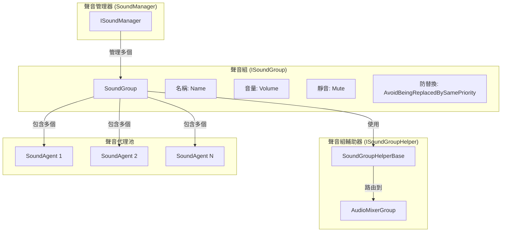
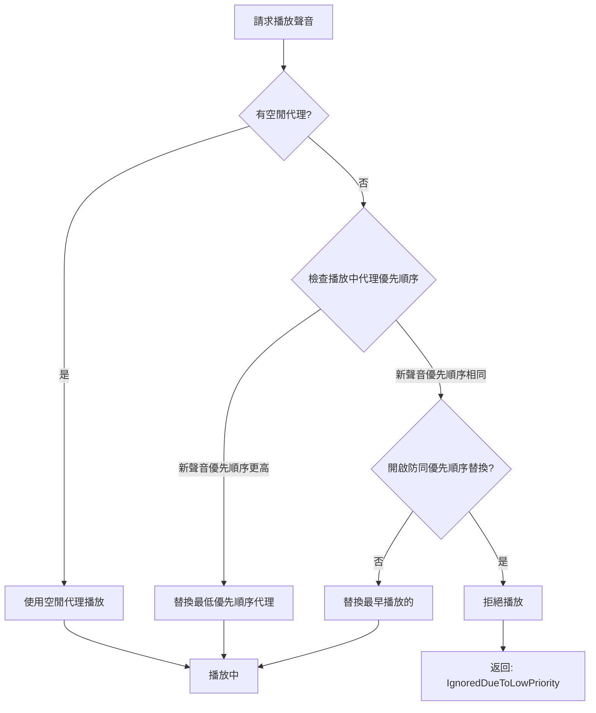

# 聲音組

聲音組（Sound Group）是 GameFrameX 聲音系統中的核心概念，用於組織和管理一組相關的音訊播放通道。每個聲音組獨立控制其音量、靜音狀態和優先順序策略，提供了靈活的音訊分類播放能力。

## 概述

聲音組解決了遊戲開發中常見的音訊管理需求：如何區分背景音樂、音效、UI聲音等不同型別的音訊，並對其進行獨立控制。透過聲音組，開發者可以：

- **分類管理**：將不同型別的音訊分配到不同的組（如BGM、SE、Voice）
- **獨立控制**：單獨調節每組音量或靜音狀態
- **優先順序管理**：透過優先順序策略控制聲音替換邏輯
- **混音整合**：透過 AudioMixerGroup 連線到 Unity 混音系統

聲音組由多個聲音代理（Sound Agent）組成，每個代理負責實際播放一個音訊。每個聲音組至少需要一個代理，代理數量決定了該組可以同時播放的聲音數量上限。

## 架構



### 核心組件

| 組件 | 作用 | 檔案位置 |
|------|------|----------|
| `ISoundGroup` | 聲音組介面定義 | [Runtime/Interface/ISoundGroup.cs](https://github.com/GameFrameX/com.gameframex.unity.sound/blob/main/Runtime/Interface/ISoundGroup.cs#L38-L87) |
| `SoundGroup` | 聲音組實現類 | [Runtime/Sound/Sound/SoundManager.SoundGroup.cs](https://github.com/GameFrameX/com.gameframex.unity.sound/blob/main/Runtime/Sound/Sound/SoundManager.SoundGroup.cs#L43-L324) |
| `ISoundGroupHelper` | 輔助器介面 | [Runtime/Interface/ISoundGroupHelper.cs](https://github.com/GameFrameX/com.gameframex.unity.sound/blob/main/Runtime/Interface/ISoundGroupHelper.cs#L38-L40) |
| `SoundGroupHelperBase` | 輔助器基類 | [Runtime/Sound/SoundGroupHelperBase.cs](https://github.com/GameFrameX/com.gameframex.unity.sound/blob/main/Runtime/Sound/SoundGroupHelperBase.cs#L42-L54) |
| `DefaultSoundGroupHelper` | 預設輔助器實現 | [Runtime/Sound/DefaultSoundGroupHelper.cs](https://github.com/GameFrameX/com.gameframex.unity.sound/blob/main/Runtime/Sound/DefaultSoundGroupHelper.cs#L38-L40) |

## 核心功能

### 聲音組屬性

```csharp
public interface ISoundGroup
{
    // 獲取聲音組名稱
    string Name { get; }

    // 獲取聲音代理數量
    int SoundAgentCount { get; }

    // 是否避免被同優先順序聲音替換
    // 當為 true 時，相同優先順序的音訊不會相互替換
    bool AvoidBeingReplacedBySamePriority { get; set; }

    // 靜音狀態
    bool Mute { get; set; }

    // 音量 (0.0 - 1.0)
    float Volume { get; set; }

    // 聲音組輔助器
    ISoundGroupHelper Helper { get; }
}
```

> Source: [ISoundGroup.cs](https://github.com/GameFrameX/com.gameframex.unity.sound/blob/main/Runtime/Interface/ISoundGroup.cs#L38-L87)

### 優先順序替換策略

聲音組的核心功能是根據優先順序管理聲音代理的分配。當需要播放新聲音時，系統會按照以下邏輯選擇代理：



具體實現邏輯如下：

```csharp
// 聲音播放時的代理分配邏輯
public ISoundAgent PlaySound(int serialId, object soundAsset, PlaySoundParams playSoundParams, out PlaySoundErrorCode? errorCode)
{
    errorCode = null;
    SoundAgent candidateAgent = null;
    foreach (SoundAgent soundAgent in m_SoundAgents)
    {
        if (!soundAgent.IsPlaying)
        {
            candidateAgent = soundAgent;
            break;
        }

        // 尋找優先順序更低或同優先順序但播放時間更早的代理
        if (soundAgent.Priority < playSoundParams.Priority)
        {
            if (candidateAgent == null || soundAgent.Priority < candidateAgent.Priority)
            {
                candidateAgent = soundAgent;
            }
        }
        else if (!m_AvoidBeingReplacedBySamePriority && soundAgent.Priority == playSoundParams.Priority)
        {
            if (candidateAgent == null || soundAgent.SetSoundAssetTime < candidateAgent.SetSoundAssetTime)
            {
                candidateAgent = soundAgent;
            }
        }
    }
    // ...
}
```

> Source: [SoundManager.SoundGroup.cs](https://github.com/GameFrameX/com.gameframex.unity.sound/blob/main/Runtime/Sound/Sound/SoundManager.SoundGroup.cs#L175-L228)

### 音量與靜音

聲音組的音量和靜音狀態會自動同步到所有關聯的聲音代理：

```csharp
// 設定靜音狀態時同步到所有代理
public bool Mute
{
    get { return m_Mute; }
    set
    {
        m_Mute = value;
        foreach (SoundAgent soundAgent in m_SoundAgents)
        {
            soundAgent.RefreshMute();  // 重新整理靜音狀態
        }
    }
}

// 設定音量時同步到所有代理
public float Volume
{
    get { return m_Volume; }
    set
    {
        m_Volume = value;
        foreach (SoundAgent soundAgent in m_SoundAgents)
        {
            soundAgent.RefreshVolume();  // 重新整理音量
        }
    }
}
```

> Source: [SoundManager.SoundGroup.cs](https://github.com/GameFrameX/com.gameframex.unity.sound/blob/main/Runtime/Sound/Sound/SoundManager.SoundGroup.cs#L102-L129)

這種設計確保了音量調節和靜音操作的即時性和一致性。

## 聲音組輔助器

### AudioMixerGroup 整合

聲音組透過 `SoundGroupHelperBase` 連線到 Unity 的音訊混音系統：

```csharp
public abstract class SoundGroupHelperBase : MonoBehaviour, ISoundGroupHelper
{
    [SerializeField] private AudioMixerGroup m_AudioMixerGroup = null;

    /// <summary>
    /// 獲取或設定聲音組輔助器所在的混音組。
    /// </summary>
    public AudioMixerGroup AudioMixerGroup
    {
        get { return m_AudioMixerGroup; }
        set { m_AudioMixerGroup = value; }
    }
}
```

> Source: [SoundGroupHelperBase.cs](https://github.com/GameFrameX/com.gameframex.unity.sound/blob/main/Runtime/Sound/SoundGroupHelperBase.cs#L42-L54)

這個設計允許開發者：
- 透過 Unity Editor 為每個聲音組分配不同的 AudioMixerGroup
- 利用 Unity 的 AudioMixer 實現複雜的音訊處理（EQ、壓縮、混響等）
- 對不同型別的聲音應用不同的混音效果

### 自定義輔助器

可以透過繼承 `SoundGroupHelperBase` 建立自定義輔助器：

```csharp
public class CustomSoundGroupHelper : SoundGroupHelperBase
{
    // 自定義擴充套件邏輯
    protected override void Start()
    {
        base.Start();
        // 自定義初始化邏輯
    }
}
```

## 使用示例

### 透過 SoundComponent 配置聲音組

在 Unity Editor 中配置聲音組是最常用的方式：

```csharp
// SoundComponent.cs 中的聲音組配置類
[Serializable]
private sealed class SoundGroup
{
    [SerializeField] private string m_Name = null;                              // 聲音組名稱
    [SerializeField] private bool m_AvoidBeingReplacedBySamePriority = false;   // 防同優先順序替換
    [SerializeField] private bool m_Mute = false;                                 // 預設靜音狀態
    [SerializeField, Range(0f, 1f)] private float m_Volume = 1f;                  // 預設音量
    [SerializeField] private int m_AgentHelperCount = 1;                        // 代理數量
}
```

> Source: [SoundComponent.SoundGroup.cs](https://github.com/GameFrameX/com.gameframex.unity.sound/blob/main/Runtime/Sound/SoundComponent.SoundGroup.cs#L44-L112)

### 執行時動態建立

在執行時也可以動態新增聲音組：

```csharp
// 在 SoundComponent 中動態新增聲音組
public bool AddSoundGroup(string soundGroupName, bool soundGroupAvoidBeingReplacedBySamePriority, bool soundGroupMute, float soundGroupVolume, int soundAgentHelperCount)
{
    if (m_SoundManager.HasSoundGroup(soundGroupName))
    {
        return false;
    }

    var soundGroupHelper = CreateCustomSoundGroupHelper(soundGroupName, soundAgentHelperCount);
    if (!m_SoundManager.AddSoundGroup(soundGroupName, soundGroupAvoidBeingReplacedBySamePriority, soundGroupMute, soundGroupVolume, soundGroupHelper))
    {
        return false;
    }
    return true;
}
```

> Source: [SoundComponent.cs](https://github.com/GameFrameX/com.gameframex.unity.sound/blob/main/Runtime/Sound/SoundComponent.cs#L252-L287)

### 控制聲音組

獲取聲音組並控制其屬性：

```csharp
// 獲取聲音組
var soundGroup = soundComponent.GetSoundGroup("BGM");

// 設定音量
soundGroup.Volume = 0.5f;

// 靜音
soundGroup.Mute = true;

// 停止所有播放中的聲音
soundGroup.StopAllLoadedSounds();

// 帶淡出停止
soundGroup.StopAllLoadedSounds(1.0f);
```

## 配置說明

### 聲音組配置引數

| 引數 | 型別 | 預設值 | 說明 |
|------|------|--------|------|
| Name | string | - | 聲音組名稱，必須唯一 |
| AvoidBeingReplacedBySamePriority | bool | false | 是否避免被同優先順序聲音替換 |
| Mute | bool | false | 預設靜音狀態 |
| Volume | float | 1.0 | 預設音量 (0.0-1.0) |
| AgentHelperCount | int | 1 | 聲音代理數量，決定同時播放數上限 |

### 典型配置方案

| 場景 | 名稱 | 代理數 | 優先順序策略 | 用途 |
|------|------|--------|------------|------|
| 背景音樂 | BGM | 1-2 | 開啟防替換 | 音樂播放 |
| 音效 | SE | 5-10 | 關閉防替換 | 各類音效 |
| 語音 | Voice | 2-3 | 開啟防替換 | 角色對話 |
| UI音效 | UI | 3-5 | 開啟防替換 | 介面反饋 |

## 相關連結

- [聲音管理器](./4-core-concepts.1-sound-manager) - 聲音組的上一級管理組件
- [聲音代理](./4-core-concepts.3-sound-agent) - 聲音組管理的音訊播放單元
- [介面定義](./5-api-reference.1-interfaces) - ISoundGroup 完整介面定義
- [播放引數](./5-api-reference.2-play-sound-params) - 聲音播放引數配置
