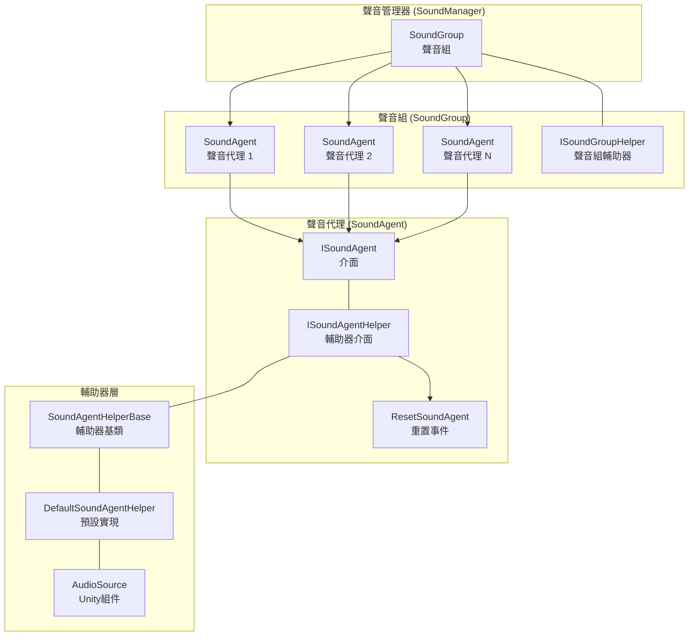
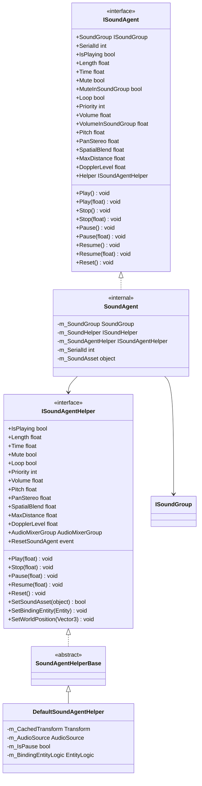
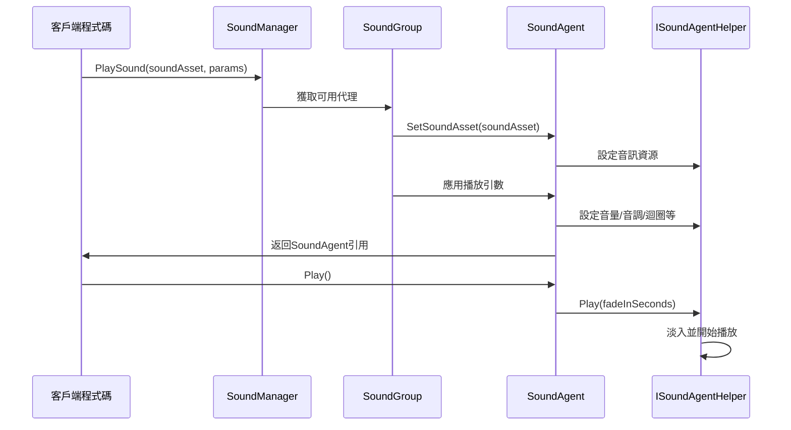
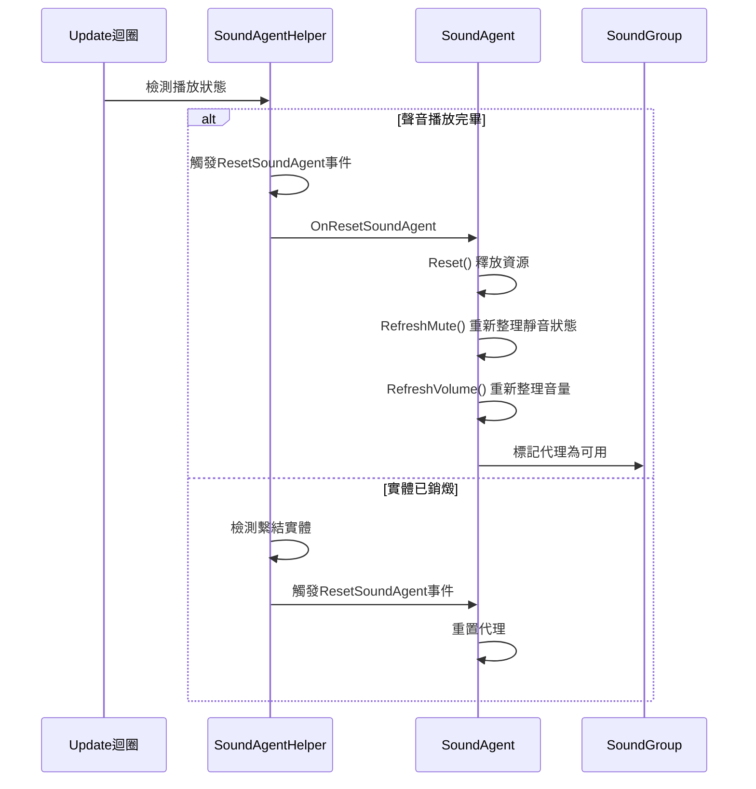

# 聲音代理

聲音代理（Sound Agent）是 GameFrameX 聲音系統中的最小播放單元，負責管理單個音訊例項的播放、控制和狀態。每個聲音代理代表一個具體的聲音播放通道，可以獨立控制音量、音調、迴圈、靜音等屬性。

## 概述

聲音代理是聲音系統架構中的核心組件，位於聲音組（SoundGroup）的下一層級。在遊戲中，當需要播放一個音效或背景音樂時，聲音系統會從對應的聲音組中獲取一個可用的聲音代理來執行播放任務。

### 設計意圖

聲音代理的設計採用了代理模式（Proxy Pattern）和物件池（Object Pool）思想的結合：

1. **代理模式**：聲音代理作為上層業務邏輯與底層音訊實現之間的中介，透過 ISoundAgent 介面封裝了複雜的播放控制邏輯
2. **物件池思想**：聲音組預先建立一定數量的聲音代理，需要播放聲音時從池中獲取，播放完畢後歸還，避免頻繁建立銷燬帶來的效能開銷
3. **分層設計**：透過 ISoundAgentHelper 介面隔離 Unity 特定的 AudioSource 實現，便於擴充套件和替換

### 核心職責

聲音代理的主要職責包括：

- **播放控制**：開始、暫停、恢復、停止聲音播放
- **引數調節**：實時調整音量、音調、立體聲相、空間混合等引數
- **狀態管理**：跟蹤播放狀態（是否正在播放、播放進度等）
- **資源管理**：載入和釋放音訊資源
- **事件通知**：在播放結束、實體銷燬等事件發生時通知上層

## 架構

### 組件關係圖



### 類圖



## 核心功能

### 播放控制

聲音代理提供了完整的播放控制方法，支援帶淡入淡出效果的播放過渡：

```csharp
// 直接播放，使用預設淡入時間
agent.Play();

// 帶淡入效果的播放，0.5秒內淡入到目標音量
agent.Play(0.5f);

// 直接停止，使用預設淡出時間
agent.Stop();

// 帶淡出效果的停止，1秒內淡出
agent.Stop(1.0f);

// 暫停播放
agent.Pause();

// 帶淡出效果的暫停
agent.Pause(0.3f);

// 恢復播放
agent.Resume();

// 帶淡入效果的恢復
agent.Resume(0.3f);
```
> Source: [ISoundAgent.cs](https://github.com/GameFrameX/com.gameframex.unity.sound/blob/main/Runtime/Interface/ISoundAgent.cs#L125-L167)

### 音量控制

聲音代理採用雙層音量控制機制：代理自身音量 × 聲音組音量，這種設計允許在不改變單個音效音量的前提下統一調節整個聲音組的音量：

```csharp
// 設定代理自身音量（0.0 - 1.0）
agent.VolumeInSoundGroup = 0.8f;

// 獲取實際生效音量（代理音量 × 組音量）
float actualVolume = agent.Volume;
```
> Source: [SoundManager.SoundAgent.cs](https://github.com/GameFrameX/com.gameframex.unity.sound/blob/main/Runtime/Sound/Sound/SoundManager.SoundAgent.cs#L209-L217)

### 空間音訊

聲音代理支援 3D 空間音訊效果，可以根據音源與聽者的位置關係自動計算音量衰減：

```csharp
// 設定空間混合量（0 = 2D，1 = 3D）
agent.SpatialBlend = 1.0f;

// 設定最大衰減距離
agent.MaxDistance = 50.0f;

// 設定多普勒效應等級
agent.DopplerLevel = 0.5f;
```
> Source: [ISoundAgent.cs](https://github.com/GameFrameX/com.gameframex.unity.sound/blob/main/Runtime/Interface/ISoundAgent.cs#L105-L118)

### 實體繫結

聲音代理可以繫結到遊戲實體，使音源位置跟隨實體移動：

```csharp
// 透過輔助器繫結實體
agent.Helper.SetBindingEntity(entity);

// 設定世界座標位置
agent.Helper.SetWorldPosition(new Vector3(10, 0, 5));
```
> Source: [DefaultSoundAgentHelper.cs](https://github.com/GameFrameX/com.gameframex.unity.sound/blob/main/Runtime/Sound/DefaultSoundAgentHelper.cs#L295-L323)

### 播放進度控制

```csharp
// 獲取聲音總長度
float length = agent.Length;

// 獲取或設定當前播放位置（秒）
agent.Time = 5.0f;  // 跳轉到第5秒
float currentTime = agent.Time;

// 獲取是否正在播放
if (agent.IsPlaying)
{
    Debug.Log($"播放進度: {agent.Time}/{agent.Length}");
}
```
> Source: [ISoundAgent.cs](https://github.com/GameFrameX/com.gameframex.unity.sound/blob/main/Runtime/Interface/ISoundAgent.cs#L50-L63)

## 核心流程

### 聲音播放流程



### 聲音結束重置流程

當聲音播放完畢後，系統會自動觸發重置流程，釋放當前代理以供其他聲音使用：


> Source: [DefaultSoundAgentHelper.cs](https://github.com/GameFrameX/com.gameframex.unity.sound/blob/main/Runtime/Sound/DefaultSoundAgentHelper.cs#L333-L367)

## 擴充套件自定義輔助器

可以透過繼承 `SoundAgentHelperBase` 來實現自定義的聲音代理輔助器，以支援不同的音訊實現方案（如 FMOD、Wwise 等）：

```csharp
using UnityEngine;
using GameFrameX.Sound.Runtime;

public class CustomSoundAgentHelper : SoundAgentHelperBase
{
    private AudioSource m_AudioSource;
    private AudioClip m_CurrentClip;

    public override bool IsPlaying => m_AudioSource?.isPlaying ?? false;

    public override float Length => m_CurrentClip?.length ?? 0f;

    public override float Time
    {
        get => m_AudioSource?.time ?? 0f;
        set { if (m_AudioSource != null) m_AudioSource.time = value; }
    }

    // ... 其他屬性實現

    public override void Play(float fadeInSeconds)
    {
        m_AudioSource.Play();
        // 實現自定義淡入邏輯
    }

    public override bool SetSoundAsset(object soundAsset)
    {
        m_CurrentClip = soundAsset as AudioClip;
        if (m_CurrentClip == null) return false;
        
        m_AudioSource.clip = m_CurrentClip;
        return true;
    }

    // ... 其他方法實現
}
```
> Source: [SoundAgentHelperBase.cs](https://github.com/GameFrameX/com.gameframex.unity.sound/blob/main/Runtime/Sound/SoundAgentHelperBase.cs#L38-L162)

## 屬性說明

| 屬性 | 型別 | 預設值 | 說明 |
|------|------|--------|------|
| SerialId | int | 0 | 聲音的序列編號，用於標識本次播放請求 |
| IsPlaying | bool | - | 當前是否正在播放 |
| Length | float | 0 | 聲音總時長（秒） |
| Time | float | 0 | 當前播放位置（秒） |
| Mute | bool | false | 是否靜音（只讀，由組控制） |
| MuteInSoundGroup | bool | false | 在聲音組內是否靜音 |
| Loop | bool | false | 是否迴圈播放 |
| Priority | int | 0 | 聲音優先順序（數值越大優先順序越高） |
| Volume | float | 1.0 | 實際生效音量（代理×組） |
| VolumeInSoundGroup | float | 1.0 | 代理自身的音量 |
| Pitch | float | 1.0 | 音調（0.5-2.0） |
| PanStereo | float | 0 | 立體聲相（-1左 → 1右） |
| SpatialBlend | float | 0 | 空間混合量（0=2D → 1=3D） |
| MaxDistance | float | 100 | 3D模式下最大衰減距離 |
| DopplerLevel | float | 1 | 多普勒效應等級 |

> Source: [Constant.cs](https://github.com/GameFrameX/com.gameframex.unity.sound/blob/main/Runtime/Sound/Sound/Constant.cs#L38-L99)

## 相關連結

- [聲音管理器](./4-core-concepts.1-sound-manager) - 聲音系統的核心管理器
- [聲音組](./4-core-concepts.2-sound-group) - 管理多個聲音代理的組
- [介面定義](./5-api-reference.1-interfaces) - ISoundAgent 和 ISoundAgentHelper 介面詳情
- [事件引數](./5-api-reference.3-event-args) - 聲音相關事件引數說明
