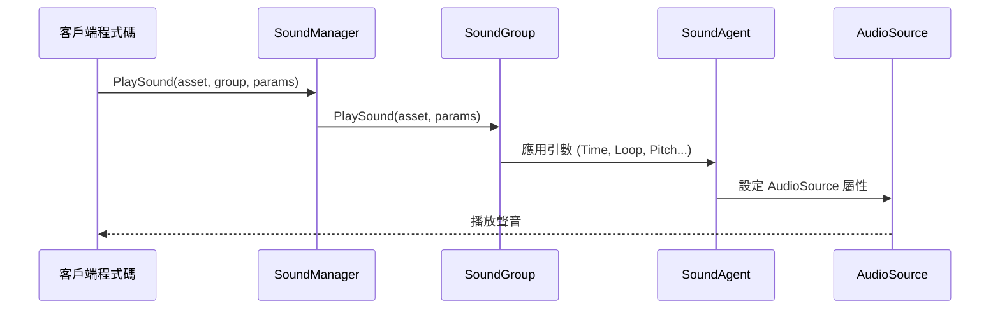

# 播放引數

PlaySoundParams 類用於配置聲音播放的各種屬性，包括音量、音調、迴圈、淡入淡出等引數。這些引數在播放聲音時傳遞給 SoundManager，以控制聲音的具體播放方式。

## 概述

PlaySoundParams 是聲音系統的核心引數類，它封裝了播放聲音時所需的所有配置選項。該類實現了 IReference 介面，支援物件池化管理，可以重複使用以減少記憶體分配。

在呼叫 ISoundManager.PlaySound 方法時，可以傳入 PlaySoundParams 例項來定製化聲音的播放行為。如果傳入 null 或不傳入引數，系統將使用預設引數值。

### 設計意圖

PlaySoundParams 採用引數物件模式（Parameter Object Pattern），將多個相關的播放引數封裝為一個物件。這種設計：

- **簡化 API**：避免在 PlaySound 方法中傳遞大量獨立引數
- **提高可讀性**：透過命名屬性使引數含義清晰明瞭
- **支援預設值**：所有引數都有合理的預設值，無需全部設定
- **物件池化**：實現 IReference 介面，支援 ReferencePool 回收複用

### 引數應用流程



## 引數說明

### 播放控制引數

| 引數 | 型別 | 預設值 | 說明 |
|------|------|--------|------|
| Time | float | 0f | 播放位置（秒），從指定時間開始播放 |
| Loop | bool | false | 是否迴圈播放 |
| FadeInSeconds | float | 0f | 淡入時間（秒），播放開始時的音量漸變 |

### 聲音組引數

| 引數 | 型別 | 預設值 | 說明 |
|------|------|--------|------|
| MuteInSoundGroup | bool | false | 在所屬聲音組內是否靜音 |
| VolumeInSoundGroup | float | 1f | 在所屬聲音組內的音量（0.0-1.0） |
| Priority | int | 0 | 聲音優先順序，數值越高優先順序越高 |

### 音效引數

| 引數 | 型別 | 預設值 | 說明 |
|------|------|--------|------|
| Pitch | float | 1f | 音調，1.0 為正常速度 |
| PanStereo | float | 0f | 立體聲位置，-1 為左聲道，1 為右聲道 |

### 空間音訊引數

| 引數 | 型別 | 預設值 | 說明 |
|------|------|--------|------|
| SpatialBlend | float | 0f | 空間混合量，0 為 2D 聲音，1 為 3D 聲音 |
| MaxDistance | float | 100f | 最大衰減距離（僅 3D 聲音有效） |
| DopplerLevel | float | 1f | 多普勒效應等級，0 為禁用 |

## 詳細引數解釋

### Time - 播放位置

設定聲音開始播放的位置（以秒為單位）。這對於實現斷點續播、預覽功能或跳過片頭非常有用。

```csharp
var playSoundParams = PlaySoundParams.Create();
playSoundParams.Time = 5.5f; // 從第5.5秒開始播放
await soundManager.PlaySound("bgm_music", "MusicGroup", playSoundParams);
```
> Source: [PlaySoundParams.cs](https://github.com/GameFrameX/com.gameframex.unity.sound/blob/main/Runtime/Sound/Sound/PlaySoundParams.cs#L124-L128)

### Loop - 迴圈播放

控制聲音是否迴圈播放。對於背景音樂或環境音效通常設定為 true，對於一次性音效設定為 false。

```csharp
// 播放迴圈背景音樂
var musicParams = PlaySoundParams.Create(isLoop: true);
// 或者
var musicParams = PlaySoundParams.Create();
musicParams.Loop = true;
await soundManager.PlaySound("bgm_forest", "MusicGroup", musicParams);
```
> Source: [PlaySoundParams.cs](https://github.com/GameFrameX/com.gameframex.unity.sound/blob/main/Runtime/Sound/Sound/PlaySoundParams.cs#L142-L146)

### FadeInSeconds - 淡入時間

設定聲音開始播放時的淡入時間，使音量從 0 逐漸過渡到目標音量。這對於避免突然的聲音爆發非常有用。

```csharp
var playSoundParams = PlaySoundParams.Create();
playSoundParams.FadeInSeconds = 2.0f; // 2秒淡入
await soundManager.PlaySound("ui_click", "UIGroup", playSoundParams);
```
> Source: [PlaySoundParams.cs](https://github.com/GameFrameX/com.gameframex.unity.sound/blob/main/Runtime/Sound/Sound/PlaySoundParams.cs#L169-L173)

### MuteInSoundGroup - 組內靜音

控制該聲音在其所屬聲音組內是否靜音。注意：即使設定為靜音，該聲音仍然會佔用聲音組的播放通道。

```csharp
var playSoundParams = PlaySoundParams.Create();
playSoundParams.MuteInSoundGroup = true; // 暫時靜音
await soundManager.PlaySound("voice_intro", "VoiceGroup", playSoundParams);
```
> Source: [PlaySoundParams.cs](https://github.com/GameFrameX/com.gameframex.unity.sound/blob/main/Runtime/Sound/Sound/PlaySoundParams.cs#L133-L137)

### VolumeInSoundGroup - 組內音量

設定該聲音在其所屬聲音組內的音量係數。最終音量 = 聲音組音量 × 個體音量。

```csharp
var playSoundParams = PlaySoundParams.Create();
playSoundParams.VolumeInSoundGroup = 0.5f; // 50% 音量
await soundManager.PlaySound("effect_explosion", "EffectGroup", playSoundParams);
```
> Source: [PlaySoundParams.cs](https://github.com/GameFrameX/com.gameframex.unity.sound/blob/main/Runtime/Sound/Sound/PlaySoundParams.cs#L160-L164)

### Priority - 優先順序

設定聲音的優先順序。當聲音組中沒有可用的播放通道時，低優先順序的聲音會被高優先順序的替換。優先順序範圍建議：0-255，數值越高優先順序越高。

```csharp
var playSoundParams = PlaySoundParams.Create();
playSoundParams.Priority = 100; // 高優先順序
await soundManager.PlaySound("ui_important", "UIGroup", playSoundParams);
```
> Source: [PlaySoundParams.cs](https://github.com/GameFrameX/com.gameframex.unity.sound/blob/main/Runtime/Sound/Sound/PlaySoundParams.cs#L151-L155)

### Pitch - 音調

調整聲音的播放速度/音調。1.0 為正常速度，小於 1.0 為慢速/低音調，大於 1.0 為快速/高音調。

```csharp
var playSoundParams = PlaySoundParams.Create();
playSoundParams.Pitch = 0.8f; // 稍微降低音調
await soundManager.PlaySound("npc_voice", "VoiceGroup", playSoundParams);
```
> Source: [PlaySoundParams.cs](https://github.com/GameFrameX/com.gameframex.unity.sound/blob/main/Runtime/Sound/Sound/PlaySoundParams.cs#L178-L182)

### PanStereo - 立體聲位置

控制聲音在左右聲道之間的位置。-1.0 為完全左聲道，0.0 為居中，1.0 為完全右聲道。

```csharp
var playSoundParams = PlaySoundParams.Create();
playSoundParams.PanStereo = -0.5f; // 偏左
await soundManager.PlaySound("footstep_left", "EffectGroup", playSoundParams);
```
> Source: [PlaySoundParams.cs](https://github.com/GameFrameX/com.gameframex.unity.sound/blob/main/Runtime/Sound/Sound/PlaySoundParams.cs#L187-L191)

### SpatialBlend - 空間混合

控制聲音從 2D（立體聲）到 3D（空間化）的過渡。0.0 為完全 2D 聲音，1.0 為完全 3D 聲音。

```csharp
var playSoundParams = PlaySoundParams.Create();
playSoundParams.SpatialBlend = 1.0f; // 完全 3D 聲音
playSoundParams.MaxDistance = 50f;
await soundManager.PlaySound("ambient_bird", "WorldGroup", playSoundParams);
```
> Source: [PlaySoundParams.cs](https://github.com/GameFrameX/com.gameframex.unity.sound/blob/main/Runtime/Sound/Sound/PlaySoundParams.cs#L196-L200)

### MaxDistance - 最大距離

設定 3D 聲音的最大衰減距離。超過此距離後，聲音音量不再繼續衰減。

```csharp
var playSoundParams = PlaySoundParams.Create();
playSoundParams.SpatialBlend = 1.0f;
playSoundParams.MaxDistance = 30f; // 30米外聽不到
await soundManager.PlaySound("car_engine", "WorldGroup", playSoundParams);
```
> Source: [PlaySoundParams.cs](https://github.com/GameFrameX/com.gameframex.unity.sound/blob/main/Runtime/Sound/Sound/PlaySoundParams.cs#L205-L209)

### DopplerLevel - 多普勒等級

設定 3D 聲音的多普勒效應強度。當聲源和聽者相對移動時，會產生多普勒頻移效果。0.0 為禁用，1.0 為正常強度。

```csharp
var playSoundParams = PlaySoundParams.Create();
playSoundParams.SpatialBlend = 1.0f;
playSoundParams.DopplerLevel = 0.5f; // 減弱多普勒效果
await soundManager.PlaySound("car_passing", "WorldGroup", playSoundParams);
```
> Source: [PlaySoundParams.cs](https://github.com/GameFrameX/com.gameframex.unity.sound/blob/main/Runtime/Sound/Sound/PlaySoundParams.cs#L214-L218)

## 使用方法

### 建立播放引數

推薦使用靜態工廠方法 `Create()` 建立 PlaySoundParams 例項，該方法從物件池中獲取例項：

```csharp
// 基礎用法：使用預設引數
var playSoundParams = PlaySoundParams.Create();

// 帶迴圈引數
var loopParams = PlaySoundParams.Create(isLoop: true);
```
> Source: [PlaySoundParams.cs](https://github.com/GameFrameX/com.gameframex.unity.sound/blob/main/Runtime/Sound/Sound/PlaySoundParams.cs#L233-L239)

### 完整使用示例

```csharp
// 建立播放引數並配置
var playSoundParams = PlaySoundParams.Create();
playSoundParams.Loop = true;                      // 迴圈播放
playSoundParams.VolumeInSoundGroup = 0.8f;        // 80% 音量
playSoundParams.Priority = 100;                   // 高優先順序
playSoundParams.FadeInSeconds = 1.0f;             // 1秒淡入
playSoundParams.Pitch = 1.0f;                      // 正常音調

// 播放聲音
int serialId = await soundManager.PlaySound("bgm_battle", "MusicGroup", playSoundParams);
```
> Source: [ISoundManager.cs](https://github.com/GameFrameX/com.gameframex.unity.sound/blob/main/Runtime/Interface/ISoundManager.cs#L165-L167)

### 引數到 AudioSource 的對映

PlaySoundParams 中的引數最終會對映到 Unity 的 AudioSource 組件：

| PlaySoundParams | AudioSource | 說明 |
|-----------------|-------------|------|
| Time | time | 播放位置 |
| MuteInSoundGroup | mute × groupMute | 組內靜音 |
| Loop | loop | 迴圈播放 |
| Priority | priority | 優先順序 |
| VolumeInSoundGroup | volume × groupVolume | 組內音量 |
| FadeInSeconds | Play() 時漸變 | 淡入時間 |
| Pitch | pitch | 音調 |
| PanStereo | panStereo | 立體聲位置 |
| SpatialBlend | spatialBlend | 空間混合 |
| MaxDistance | maxDistance | 最大距離 |
| DopplerLevel | dopplerLevel | 多普勒等級 |

> Source: [SoundManager.SoundGroup.cs](https://github.com/GameFrameX/com.gameframex.unity.sound/blob/main/Runtime/Sound/Sound/SoundManager.SoundGroup.cs#L216-L226)

## 注意事項

1. **物件池管理**：使用 `PlaySoundParams.Create()` 建立的引數在播放完成後會自動釋放回物件池，無需手動釋放。

2. **如果引數為 null**：呼叫 PlaySound 時傳入 null 引數，系統會自動建立預設引數的 PlaySoundParams。

3. **優先順序與通道**：當聲音組的所有通道都被佔用時，低優先順序的正在播放的聲音會被新來的高優先順序聲音替換。

4. **音量疊加**：最終音量 = 聲音組音量（SoundGroup.Volume）× 個體音量（VolumeInSoundGroup）。

5. **空間音訊**：空間相關引數（MaxDistance、DopplerLevel）需要將 SpatialBlend 設定為大於 0 的值才能生效。

## 相關連結

- [介面定義](./5-api-reference.1-interfaces) - ISoundManager 和相關介面
- [事件引數](./5-api-reference.3-event-args) - 播放事件相關引數
- [聲音管理器](./4-core-concepts.1-sound-manager) - 聲音管理器詳解
- [聲音組](./4-core-concepts.2-sound-group) - 聲音組管理
- [聲音代理](./4-core-concepts.3-sound-agent) - 聲音代理詳解
