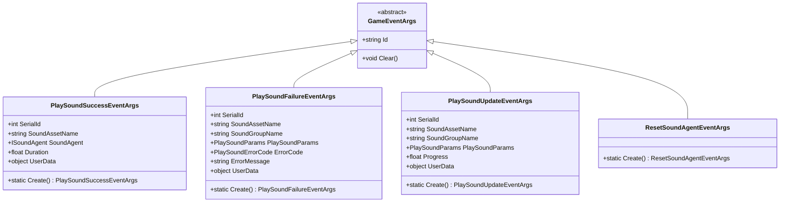
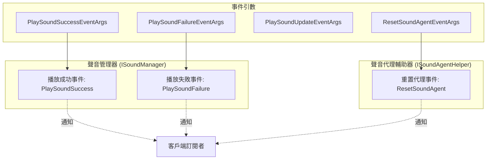
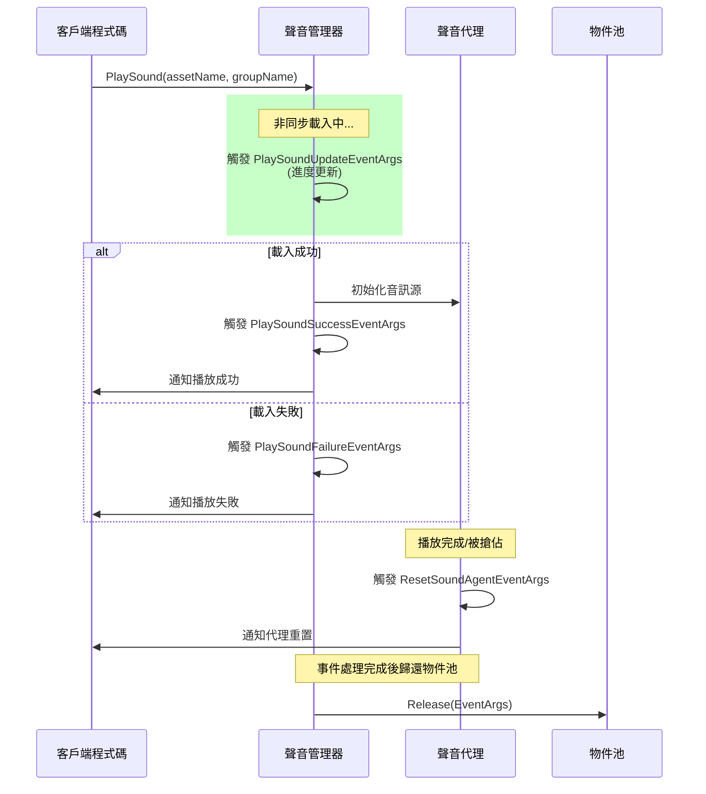

# 事件引數

本節詳細介紹 GameFrameX 聲音系統中使用的事件引數類，這些類用於在聲音播放過程中傳遞事件資料，使外部組件能夠響應聲音播放的成功、失敗、更新以及聲音代理重置等狀態變化。

## 概述

GameFrameX 聲音系統採用事件驅動架構，當聲音播放狀態發生變化時，系統會丟擲相應的事件並攜帶詳細的事件引數。這些事件引數類均繼承自 `GameFrameX.Event.Runtime.GameEventArgs` 基類，提供了統一的物件池管理機制以最佳化記憶體使用。

事件引數在系統中的主要作用包括：

- **狀態通知**：將聲音播放的結果（成功或失敗）通知給訂閱者
- **進度追蹤**：提供非同步載入進度資訊用於 UI 展示
- **錯誤處理**：攜帶錯誤碼和錯誤資訊便於問題診斷
- **代理管理**：通知聲音代理需要重置以複用資源

## 事件引數類體系

GameFrameX 聲音系統定義了四個核心事件引數類，分別對應不同的聲音系統狀態變化。



### 事件流與組件關係



## 核心事件引數詳解

### PlaySoundSuccessEventArgs

`PlaySoundSuccessEventArgs` 在聲音成功開始播放時觸發，包含了播放操作的完整結果資訊。

```csharp
public sealed class PlaySoundSuccessEventArgs : GameEventArgs
{
    /// <summary>
    /// 獲取聲音的序列編號。
    /// </summary>
    public int SerialId { get; private set; }

    /// <summary>
    /// 獲取聲音資源名稱。
    /// </summary>
    public string SoundAssetName { get; private set; }

    /// <summary>
    /// 獲取用於播放的聲音代理。
    /// </summary>
    public ISoundAgent SoundAgent { get; private set; }

    /// <summary>
    /// 獲取載入持續時間。
    /// </summary>
    public float Duration { get; private set; }

    /// <summary>
    /// 獲取使用者自定義資料。
    /// </summary>
    public object UserData { get; private set; }

    public static PlaySoundSuccessEventArgs Create(int serialId, string soundAssetName, 
        ISoundAgent soundAgent, float duration, object userData)
    {
        // 從物件池獲取例項並初始化
    }
}
```
> Source: [PlaySoundSuccessEventArgs.cs](https://github.com/GameFrameX/com.gameframex.unity.sound/blob/main/Runtime/EventArgs/PlaySoundSuccessEventArgs.cs#L41-L98)

**使用場景**：當需要知道聲音是否成功播放、獲取用於控制播放的 SoundAgent 代理例項，或記錄載入耗時等場景時訂閱此事件。

---

### PlaySoundFailureEventArgs

`PlaySoundFailureEventArgs` 在聲音播放失敗時觸發，攜帶詳細的錯誤資訊以便診斷問題。

```csharp
public sealed class PlaySoundFailureEventArgs : GameEventArgs
{
    /// <summary>
    /// 獲取聲音的序列編號。
    /// </summary>
    public int SerialId { get; private set; }

    /// <summary>
    /// 獲取聲音資源名稱。
    /// </summary>
    public string SoundAssetName { get; private set; }

    /// <summary>
    /// 獲取聲音組名稱。
    /// </summary>
    public string SoundGroupName { get; private set; }

    /// <summary>
    /// 獲取播放聲音引數。
    /// </summary>
    public PlaySoundParams PlaySoundParams { get; private set; }

    /// <summary>
    /// 獲取錯誤碼。
    /// </summary>
    public PlaySoundErrorCode ErrorCode { get; private set; }

    /// <summary>
    /// 獲取錯誤資訊。
    /// </summary>
    public string ErrorMessage { get; private set; }

    /// <summary>
    /// 獲取使用者自定義資料。
    /// </summary>
    public object UserData { get; private set; }

    public static PlaySoundFailureEventArgs Create(int serialId, string soundAssetName, 
        string soundGroupName, PlaySoundParams playSoundParams, PlaySoundErrorCode errorCode, 
        string errorMessage, object userData)
    {
        // 從物件池獲取例項並初始化
    }
}
```
> Source: [PlaySoundFailureEventArgs.cs](https://github.com/GameFrameX/com.gameframex.unity.sound/blob/main/Runtime/EventArgs/PlaySoundFailureEventArgs.cs#L41-L115)

**錯誤碼列舉 (PlaySoundErrorCode)**：

| 錯誤碼 | 說明 |
|--------|------|
| `Unknown` | 未知錯誤 |
| `SoundGroupNotExist` | 聲音組不存在 |
| `SoundGroupHasNoAgent` | 聲音組沒有聲音代理 |
| `LoadAssetFailure` | 載入資源失敗 |
| `IgnoredDueToLowPriority` | 因優先順序低被忽略 |
| `SetSoundAssetFailure` | 設定聲音資源失敗 |

> Source: [PlaySoundErrorCode.cs](https://github.com/GameFrameX/com.gameframex.unity.sound/blob/main/Runtime/Sound/Sound/PlaySoundErrorCode.cs#L38-L69)

---

### PlaySoundUpdateEventArgs

`PlaySoundUpdateEventArgs` 在非同步載入聲音資源的過程中定期觸發，用於報告載入進度。

```csharp
public sealed class PlaySoundUpdateEventArgs : GameEventArgs
{
    /// <summary>
    /// 獲取聲音的序列編號。
    /// </summary>
    public int SerialId { get; private set; }

    /// <summary>
    /// 獲取聲音資源名稱。
    /// </summary>
    public string SoundAssetName { get; private set; }

    /// <summary>
    /// 獲取聲音組名稱。
    /// </summary>
    public string SoundGroupName { get; private set; }

    /// <summary>
    /// 獲取播放聲音引數。
    /// </summary>
    public PlaySoundParams PlaySoundParams { get; private set; }

    /// <summary>
    /// 獲取載入聲音進度。
    /// </summary>
    public float Progress { get; private set; }

    /// <summary>
    /// 獲取使用者自定義資料。
    /// </summary>
    public object UserData { get; private set; }

    public static PlaySoundUpdateEventArgs Create(int serialId, string soundAssetName, 
        string soundGroupName, PlaySoundParams playSoundParams, float progress, object userData)
    {
        // 從物件池獲取例項並初始化
    }
}
```
> Source: [PlaySoundUpdateEventArgs.cs](https://github.com/GameFrameX/com.gameframex.unity.sound/blob/main/Runtime/EventArgs/PlaySoundUpdateEventArgs.cs#L41-L106)

**使用場景**：在 UI 上顯示載入進度條，或進行其他需要知道載入進度的操作。

---

### ResetSoundAgentEventArgs

`ResetSoundAgentEventArgs` 是一個輕量級事件引數，當聲音代理需要重置（例如播放完畢或被搶佔）時觸發。

```csharp
public sealed class ResetSoundAgentEventArgs : GameEventArgs
{
    /// <summary>
    /// 初始化重置聲音代理事件的新例項。
    /// </summary>
    public ResetSoundAgentEventArgs()
    {
    }

    /// <summary>
    /// 建立重置聲音代理事件。
    /// </summary>
    public static ResetSoundAgentEventArgs Create()
    {
        ResetSoundAgentEventArgs resetSoundAgentEventArgs = ReferencePool.Acquire<ResetSoundAgentEventArgs>();
        return resetSoundAgentEventArgs;
    }

    /// <summary>
    /// 清理重置聲音代理事件。
    /// </summary>
    public override void Clear()
    {
    }

    public static readonly string EventId = typeof(ResetSoundAgentEventArgs).FullName;

    public override string Id => EventId;
}
```
> Source: [ResetSoundAgentEventArgs.cs](https://github.com/GameFrameX/com.gameframex.unity.sound/blob/main/Runtime/EventArgs/ResetSoundAgentEventArgs.cs#L41-L76)

**使用場景**：監聽聲音代理的重置狀態，以便進行資源清理或狀態同步。

---

## 事件訂閱與使用示例

### 訂閱播放成功事件

```csharp
// 獲取聲音管理器例項
var soundManager = GameEntry.GetManager<ISoundManager>();

// 訂閱播放成功事件
soundManager.PlaySoundSuccess += OnPlaySoundSuccess;

private void OnPlaySoundSuccess(object sender, PlaySoundSuccessEventArgs e)
{
    UnityEngine.Debug.Log($"聲音播放成功: {e.SoundAssetName}, 持續時間: {e.Duration}");
    // 可以透過 e.SoundAgent 控制播放，如暫停、停止等
    // e.UserData 包含播放時傳入的自定義資料
}
```

> Source: [ISoundManager.cs](https://github.com/GameFrameX/com.gameframex.unity.sound/blob/main/Runtime/Interface/ISoundManager.cs#L50-L53)

### 訂閱播放失敗事件

```csharp
soundManager.PlaySoundFailure += OnPlaySoundFailure;

private void OnPlaySoundFailure(object sender, PlaySoundFailureEventArgs e)
{
    UnityEngine.Debug.LogError($"聲音播放失敗: {e.SoundAssetName}, 錯誤碼: {e.ErrorCode}, 錯誤資訊: {e.ErrorMessage}");
    // 可以根據錯誤碼進行不同的處理
    if (e.ErrorCode == PlaySoundErrorCode.SoundGroupNotExist)
    {
        // 處理聲音組不存在的情況
    }
}
```

> Source: [ISoundManager.cs](https://github.com/GameFrameX/com.gameframex.unity.sound/blob/main/Runtime/Interface/ISoundManager.cs#L55-L58)

### 訂閱重置聲音代理事件

```csharp
// 聲音代理輔助器介面
public interface ISoundAgentHelper
{
    /// <summary>
    /// 重置聲音代理事件。
    /// </summary>
    event EventHandler<ResetSoundAgentEventArgs> ResetSoundAgent;
}
```
> Source: [ISoundAgentHelper.cs](https://github.com/GameFrameX/com.gameframex.unity.sound/blob/main/Runtime/Interface/ISoundAgentHelper.cs#L102-L105)

---

## 物件池機制

所有事件引數類都採用物件池模式進行管理，這是 GameFrameX 框架的記憶體最佳化策略：

1. **建立**：使用靜態 `Create()` 方法從物件池獲取例項
2. **使用**：填充事件屬性
3. **釋放**：事件處理完成後，框架自動呼叫 `ReferencePool.Release()` 歸還到物件池
4. **重置**：歸還時呼叫 `Clear()` 方法將所有屬性重置為預設值

這種設計避免了頻繁的物件分配和垃圾回收，提高了效能，特別是在頻繁觸發事件的場景下效果顯著。

```csharp
// 事件引數建立示例
PlaySoundSuccessEventArgs args = PlaySoundSuccessEventArgs.Create(
    serialId: 1,
    soundAssetName: "bgm_music",
    soundAgent: soundAgent,
    duration: 180.5f,
    userData: null
);

// 觸發事件
soundManager.PlaySoundSuccess?.Invoke(this, args);

// 歸還到物件池
ReferencePool.Release(args);
```

---

## 事件觸發時序



---

## 相關連結

- [介面定義](./5-api-reference.1-interfaces) - ISoundManager 和 ISoundAgentHelper 介面詳細定義
- [播放引數](./5-api-reference.2-play-sound-params) - PlaySoundParams 引數配置說明
- [聲音管理器](./4-core-concepts.1-sound-manager) - 聲音管理器核心概念與實現
- [聲音代理](./4-core-concepts.3-sound-agent) - 聲音代理組件詳解
