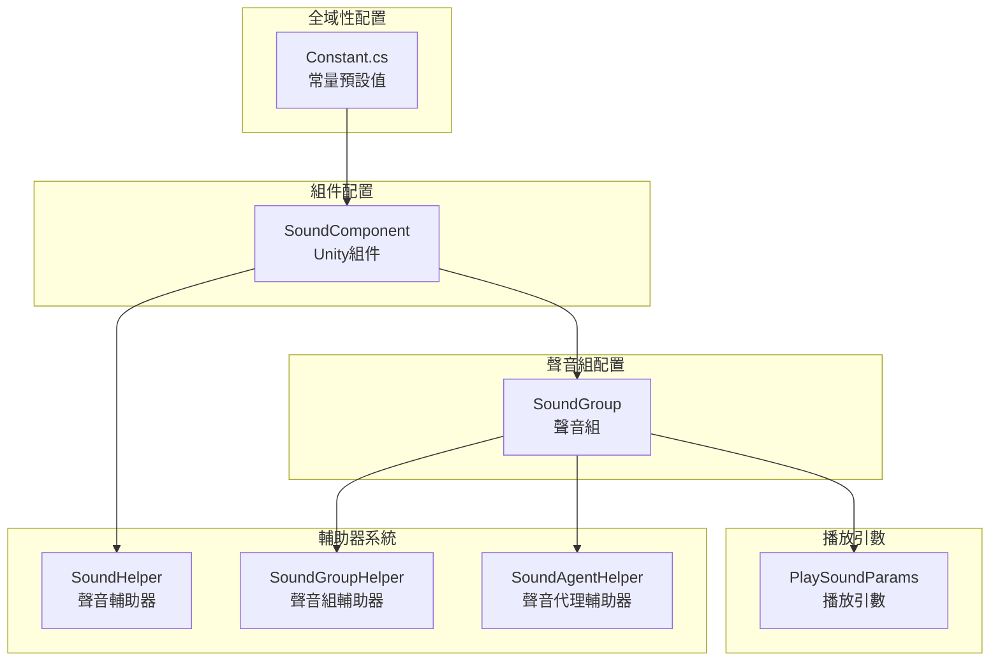
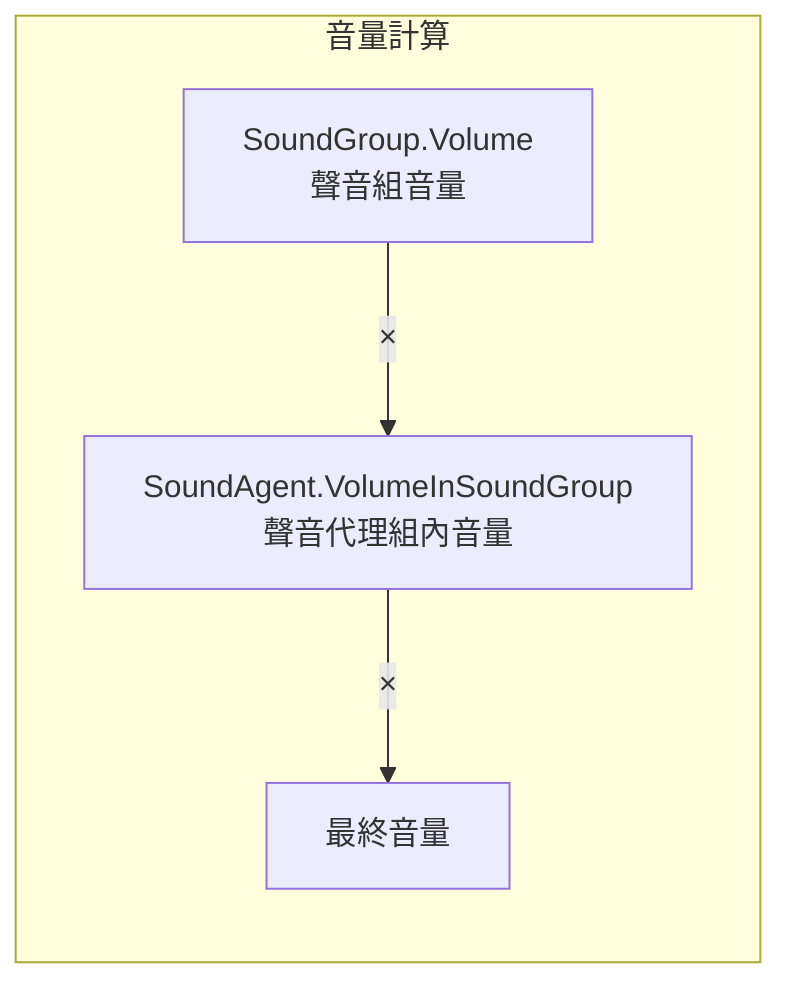

# 配置說明

本文件詳細介紹 GameFrameX Sound 聲音組件的配置系統，涵蓋所有可配置的選項及其預設值。

## 概述

GameFrameX Sound 組件採用分層配置架構，從全域性預設值到單個聲音的播放引數，形成了完整的配置體系。這種設計允許開發者在不同層級設定聲音屬性，既可以設定全域性預設值，也可以在需要時覆蓋單個聲音的播放行為。

配置系統主要包含以下幾個層級：

1. **常量預設值** - 系統級的全域性預設值
2. **聲音組配置** - 聲音組的音量、靜音、同優先順序替換策略
3. **播放引數配置** - 單個聲音的播放引數
4. **輔助器配置** - 可擴充套件的輔助器系統

## 配置架構



### 配置流程說明

系統初始化時，首先載入 `Constant.cs` 中的常量預設值作為所有聲音的基準。然後 `SoundComponent` 在 Unity 場景中啟動時，會根據 Inspector 面板中的設定建立聲音組。每個聲音組可以獨立配置音量、靜音狀態和代理數量。當播放聲音時，可以透過 `PlaySoundParams` 覆蓋預設的播放引數。

## 常量預設值

常量定義在 `Runtime/Sound/Sound/Constant.cs` 檔案中，這些值是整個系統的基礎預設值。

> Source: [Constant.cs](https://github.com/GameFrameX/com.gameframex.unity.sound/blob/main/Runtime/Sound/Sound/Constant.cs#L38-L99)

| 常量 | 型別 | 預設值 | 說明 |
|------|------|--------|------|
| DefaultTime | float | 0f | 播放位置（秒） |
| DefaultMute | bool | false | 預設是否靜音 |
| DefaultLoop | bool | false | 預設是否迴圈播放 |
| DefaultPriority | int | 0 | 聲音載入優先順序 |
| DefaultVolume | float | 1f | 預設音量（0.0-1.0） |
| DefaultFadeInSeconds | float | 0f | 淡入時間（秒） |
| DefaultFadeOutSeconds | float | 0f | 淡出時間（秒） |
| DefaultPitch | float | 1f | 音調（0.5-2.0） |
| DefaultPanStereo | float | 0f | 立體聲相（-1.0到1.0） |
| DefaultSpatialBlend | float | 0f | 空間混合量（0.0到1.0） |
| DefaultMaxDistance | float | 100f | 最大距離 |
| DefaultDopplerLevel | float | 1f | 多普勒等級 |

## 聲音組配置

聲音組（SoundGroup）用於管理一組相關聲音的共享設定。每個聲音組可以獨立控制音量、靜音狀態和聲音代理數量。

### SoundComponent 中的聲音組配置

在 Unity 編輯器中，透過 `SoundComponent` 組件的 Inspector 面板配置聲音組：

> Source: [SoundComponent.SoundGroup.cs](https://github.com/GameFrameX/com.gameframex.unity.sound/blob/main/Runtime/Sound/SoundComponent.SoundGroup.cs#L45-L111)

```csharp
[Serializable]
private sealed class SoundGroup
{
    [SerializeField] private string m_Name = null;
    [SerializeField] private bool m_AvoidBeingReplacedBySamePriority = false;
    [SerializeField] private bool m_Mute = false;
    [SerializeField, Range(0f, 1f)] private float m_Volume = 1f;
    [SerializeField] private int m_AgentHelperCount = 1;
}
```

### 聲音組引數說明

| 引數 | 型別 | 預設值 | 說明 |
|------|------|--------|------|
| Name | string | - | 聲音組名稱，用於標識和獲取聲音組 |
| AvoidBeingReplacedBySamePriority | bool | false | 是否避免被同優先順序聲音替換 |
| Mute | bool | false | 聲音組是否靜音 |
| Volume | float | 1f | 聲音組音量（0.0-1.0） |
| AgentHelperCount | int | 1 | 聲音代理輔助器數量，決定可同時播放的聲音數量 |

### 執行時動態配置

透過 `ISoundGroup` 介面可以在執行時動態修改聲音組配置：

> Source: [ISoundGroup.cs](https://github.com/GameFrameX/com.gameframex.unity.sound/blob/main/Runtime/Interface/ISoundGroup.cs#L38-L87)

```csharp
public interface ISoundGroup
{
    string Name { get; }
    int SoundAgentCount { get; }
    bool AvoidBeingReplacedBySamePriority { get; set; }
    bool Mute { get; set; }
    float Volume { get; set; }
    ISoundHelper Helper { get; }
}
```

### 配置示例：建立聲音組

```csharp
// 透過 SoundComponent 新增聲音組
var soundComponent = GameEntry.GetComponent<SoundComponent>();
soundComponent.AddSoundGroup("背景音樂", 1);  // 名稱和代理數量
soundComponent.AddSoundGroup("音效", 5);      // 同時支援5個音效

// 透過 SoundManager 新增更詳細的聲音組配置
soundComponent.AddSoundGroup(
    "語音",                    // 聲音組名稱
    true,                      // 避免被同優先順序替換
    false,                     // 不靜音
    0.8f,                      // 音量 80%
    3                          // 3個代理
);

// 獲取聲音組並動態調整
var soundGroup = soundComponent.GetSoundGroup("背景音樂");
soundGroup.Volume = 0.5f;  // 調整音量
soundGroup.Mute = true;    // 靜音
```

## 播放引數配置

`PlaySoundParams` 類用於配置單個聲音的播放引數。這些引數在呼叫 `PlaySound` 方法時作為可選引數傳入。

> Source: [PlaySoundParams.cs](https://github.com/GameFrameX/com.gameframex.unity.sound/blob/main/Runtime/Sound/Sound/PlaySoundParams.cs#L40-L258)

### PlaySoundParams 屬性

| 屬性 | 型別 | 預設值 | 說明 |
|------|------|--------|------|
| Time | float | 0f | 播放位置，從指定時間開始播放 |
| MuteInSoundGroup | bool | false | 在聲音組內是否靜音 |
| Loop | bool | false | 是否迴圈播放 |
| Priority | int | 0 | 聲音優先順序（數值越高越優先） |
| VolumeInSoundGroup | float | 1f | 在聲音組內的音量係數 |
| FadeInSeconds | float | 0f | 淡入時間（秒） |
| Pitch | float | 1f | 音調（0.5-2.0，1為正常） |
| PanStereo | float | 0f | 立體聲相（-1為左聲道，1為右聲道） |
| SpatialBlend | float | 0f | 空間混合（0為2D，1為3D） |
| MaxDistance | float | 100f | 3D聲音的最大距離 |
| DopplerLevel | float | 1f | 多普勒效果等級 |

### 使用 PlaySoundParams

```csharp
// 建立播放引數
var playParams = PlaySoundParams.Create();

// 配置引數
playParams.Loop = true;                    // 迴圈播放
playParams.VolumeInSoundGroup = 0.8f;      // 80% 音量
playParams.Pitch = 1.2f;                   // 稍微加快
playParams.FadeInSeconds = 0.5f;           // 0.5秒淡入
playParams.Priority = 100;                  // 高優先順序

// 播放聲音時傳入引數
await soundComponent.PlaySound("bgm_music", "背景音樂", playParams);

// 使用完成後釋放（如果啟用了引用計數）
if (playParams.Referenced)
{
    ReferencePool.Release(playParams);
}
```

## SoundComponent 組件配置

`SoundComponent` 是 Unity 場景中用於初始化聲音系統的主組件。透過 Inspector 面板或程式碼進行配置。

> Source: [SoundComponent.cs](https://github.com/GameFrameX/com.gameframex.unity.sound/blob/main/Runtime/Sound/SoundComponent.cs#L46-L75)

### Inspector 可配置項

| 屬性 | 型別 | 預設值 | 說明 |
|------|------|--------|------|
| Instance Root | Transform | null | 聲音例項的根節點 |
| Audio Mixer | AudioMixer | null | Unity 音訊混音器 |
| Sound Helper Type Name | string | "GameFrameX.Sound.Runtime.DefaultSoundHelper" | 聲音輔助器型別 |
| Custom Sound Helper | SoundHelperBase | null | 自定義聲音輔助器例項 |
| Sound Group Helper Type Name | string | "GameFrameX.Sound.Runtime.DefaultSoundGroupHelper" | 聲音組輔助器型別 |
| Custom Sound Group Helper | SoundGroupHelperBase | null | 自定義聲音組輔助器例項 |
| Sound Agent Helper Type Name | string | "GameFrameX.Sound.Runtime.DefaultSoundAgentHelper" | 聲音代理輔助器型別 |
| Custom Sound Agent Helper | SoundAgentHelperBase | null | 自定義聲音代理輔助器例項 |
| Sound Groups | SoundGroup[] | null | 聲音組陣列 |

### 程式碼配置 SoundComponent

```csharp
// 建立 SoundComponent 並配置
var soundGameObject = new GameObject("Sound");
var soundComponent = soundGameObject.AddComponent<SoundComponent>();

// 透過程式碼配置輔助器型別
// 注意：這些通常在 Inspector 中配置
// soundComponent.m_SoundHelperTypeName = "MyCustomSoundHelper";
// soundComponent.m_SoundGroupHelperTypeName = "MyCustomSoundGroupHelper";
// soundComponent.m_SoundAgentHelperTypeName = "MyCustomSoundAgentHelper";

// 配置 AudioMixer
// soundComponent.m_AudioMixer = myAudioMixer;

// 配置例項根節點
// soundComponent.m_InstanceRoot = myInstanceRoot;
```

## 輔助器系統配置

GameFrameX Sound 採用輔助器（Helper）模式實現可擴充套件性。開發者可以透過繼承基類建立自定義輔助器。

### 輔助器型別

| 輔助器 | 基類 | 用途 |
|--------|------|------|
| SoundHelper | SoundHelperBase | 管理聲音資源的載入和釋放 |
| SoundGroupHelper | SoundGroupHelperBase | 管理聲音組的音訊混合 |
| SoundAgentHelper | SoundAgentHelperBase | 控制單個聲音的播放行為 |

> Source: [SoundHelperBase.cs](https://github.com/GameFrameX/com.gameframex.unity.sound/blob/main/Runtime/Sound/SoundHelperBase.cs#L41-L48)

### 自定義輔助器示例

```csharp
// 自定義聲音代理輔助器
public class MyCustomSoundAgentHelper : SoundAgentHelperBase
{
    private AudioSource _audioSource;

    public override bool IsPlaying => _audioSource?.isPlaying ?? false;
    public override float Length => _audioSource?.clip?.length ?? 0;
    public override float Time { get => _audioSource?.time ?? 0; set { if (_audioSource) _audioSource.time = value; } }
    public override bool Mute { get => _audioSource?.mute ?? false; set { if (_audioSource) _audioSource.mute = value; } }
    public override bool Loop { get => _audioSource?.loop ?? false; set { if (_audioSource) _audioSource.loop = value; } }
    public override int Priority { get => _audioSource?.priority ?? 128; set { if (_audioSource) _audioSource.priority = value; } }
    public override float Volume { get => _audioSource?.volume ?? 1f; set { if (_audioSource) _audioSource.volume = value; } }
    public override float Pitch { get => _audioSource?.pitch ?? 1f; set { if (_audioSource) _audioSource.pitch = value; } }
    public override float PanStereo { get => _audioSource?.panStereo ?? 0; set { if (_audioSource) _audioSource.panStereo = value; } }
    public override float SpatialBlend { get => _audioSource?.spatialBlend ?? 0; set { if (_audioSource) _audioSource.spatialBlend = value; } }
    public override float MaxDistance { get => _audioSource?.maxDistance ?? 100f; set { if (_audioSource) _audioSource.maxDistance = value; } }
    public override float DopplerLevel { get => _audioSource?.dopplerLevel ?? 1f; set { if (_audioSource) _audioSource.dopplerLevel = value; } }
    public override AudioMixerGroup AudioMixerGroup { get; set; }

    public override event EventHandler<ResetSoundAgentEventArgs> ResetSoundAgent;

    public override void Play(float fadeInSeconds)
    {
        _audioSource.Play();
    }

    public override void Stop(float fadeOutSeconds)
    {
        _audioSource.Stop();
    }

    public override void Pause(float fadeOutSeconds)
    {
        _audioSource.Pause();
    }

    public override void Resume(float fadeInSeconds)
    {
        _audioSource.UnPause();
    }

    public override void Reset()
    {
        if (_audioSource)
        {
            _audioSource.clip = null;
            _audioSource.Stop();
        }
    }

    public override bool SetSoundAsset(object soundAsset)
    {
        if (soundAsset is AudioClip clip)
        {
            _audioSource.clip = clip;
            return true;
        }
        return false;
    }

    public override void SetBindingEntity(Entity.Runtime.Entity bindingEntity)
    {
        // 實現3D聲音繫結邏輯
    }

    public override void SetWorldPosition(Vector3 worldPosition)
    {
        if (_audioSource)
        {
            _audioSource.transform.position = worldPosition;
        }
    }

    private void Awake()
    {
        _audioSource = gameObject.AddComponent<AudioSource>();
        _audioSource.spatialBlend = 1f; // 預設為3D聲音
    }
}
```

## 音量計算層級

最終的播放音量由多個層級相乘決定：



計算公式為：`最終音量 = SoundGroup.Volume × SoundAgent.VolumeInSoundGroup`

例如：
- 聲音組音量 = 0.8（80%）
- 聲音播放音量 = 0.5（50%）
- 最終音量 = 0.8 × 0.5 = 0.4（40%）

## 完整配置示例

以下是一個完整的聲音系統配置示例：

```csharp
// 1. 初始化 SoundComponent
var soundGameObject = new GameObject("SoundSystem");
var soundComponent = soundGameObject.AddComponent<SoundComponent>();

// 2. 配置聲音組（在 Start 中自動處理，這裡展示等效程式碼）
// 透過程式碼新增聲音組
soundComponent.AddSoundGroup("音樂", 1);                    // 背景音樂組，1個代理
soundComponent.AddSoundGroup("音效", 10);                   // 音效組，10個代理
soundComponent.AddSoundGroup("語音", 3, true, false, 0.8f, 3); // 語音組，3個代理，80%音量

// 3. 播放不同型別的聲音
// 播放背景音樂 - 迴圈
var bgmParams = PlaySoundParams.Create(true);
bgmParams.VolumeInSoundGroup = 0.6f;
bgmParams.FadeInSeconds = 1.0f;
await soundComponent.PlaySound("assets/audio/bgm_title", "音樂", bgmParams);

// 播放音效 - 一次播放
var sfxParams = PlaySoundParams.Create(false);
sfxParams.VolumeInSoundGroup = 1.0f;
sfxParams.Priority = 100;  // 高優先順序
await soundComponent.PlaySound("assets/audio/sfx_click", "音效", sfxParams);

// 播放3D音效
var posParams = PlaySoundParams.Create(false);
posParams.SpatialBlend = 1.0f;  // 3D聲音
posParams.MaxDistance = 50f;
await soundComponent.PlaySound("assets/audio/sfx_footstep", "音效", posParams, Vector3.one * 10);

// 4. 執行時控制
var musicGroup = soundComponent.GetSoundGroup("音樂");
musicGroup.Volume = 0.5f;  // 調整背景音樂音量
musicGroup.Mute = false;   // 取消靜音

// 5. 停止聲音
soundComponent.StopAllLoadedSounds(0.5f);  // 0.5秒淡出
```

## 相關連結

- [核心概念 - 聲音管理器](./4-core-concepts.1-sound-manager)
- [核心概念 - 聲音組](./4-core-concepts.2-sound-group)
- [核心概念 - 聲音代理](./4-core-concepts.3-sound-agent)
- [API 參考 - 介面定義](./5-api-reference.1-interfaces)
- [API 參考 - 播放引數](./5-api-reference.2-play-sound-params)
- [擴充套件指南](./7-extending)
