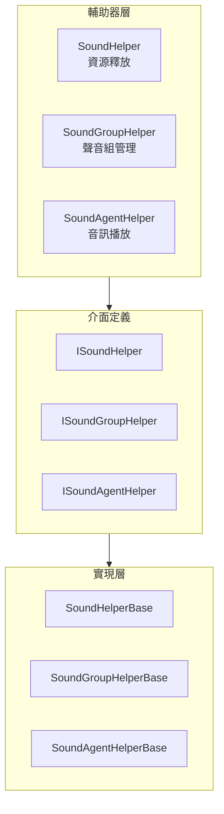

# 擴充套件指南

本文件詳細介紹如何擴充套件 GameFrameX 聲音系統，包括自定義聲音輔助器、聲音組和聲音代理的實現方法。

## 概述

GameFrameX 聲音系統採用模組化設計，提供了多個擴充套件點以滿足不同專案的需求。透過擴充套件這些介面和基類，開發者可以：

- 實現自定義的聲音資源載入和釋放邏輯
- 建立特殊的聲音組管理方式
- 替換預設的音訊播放實現（如使用 FMOD、CRIWARE 等第三方音訊中介軟體）
- 動態新增自定義聲音組和聲音代理

## 擴充套件點架構

系統提供三個主要的擴充套件層級，分別對應聲音系統的不同組件：



### 擴充套件點說明

| 擴充套件點 | 介面 | 基類 | 用途 |
|--------|------|------|------|
| 聲音輔助器 | ISoundHelper | SoundHelperBase | 自定義資源釋放邏輯 |
| 聲音組輔助器 | ISoundGroupHelper | SoundGroupHelperBase | 聲音組管理和混音 |
| 聲音代理輔助器 | ISoundAgentHelper | SoundAgentHelperBase | 音訊播放實現（主要擴充套件點） |

## 自定義聲音輔助器

聲音輔助器（SoundHelper）負責聲音資源的釋放邏輯。系統預設提供了基於 Unity 資源系統的實現。

### 介面定義

> Source: [ISoundHelper.cs](https://github.com/GameFrameX/com.gameframex.unity.sound/blob/main/Runtime/Interface/ISoundHelper.cs#L35-L46)

```csharp
namespace GameFrameX.Sound.Runtime
{
    public interface ISoundHelper
    {
        void ReleaseSoundAsset(object soundAsset);
    }
}
```

### 基類實現

> Source: [SoundHelperBase.cs](https://github.com/GameFrameX/com.gameframex.unity.sound/blob/main/Runtime/Sound/SoundHelperBase.cs#L38-L49)

```csharp
public abstract class SoundHelperBase : MonoBehaviour, ISoundHelper
{
    public abstract void ReleaseSoundAsset(object soundAsset);
}
```

### 實現示例

以下示例展示如何自定義聲音資源的釋放邏輯：

```csharp
using GameFrameX.Sound.Runtime;
using UnityEngine;

public class CustomSoundHelper : SoundHelperBase
{
    public override void ReleaseSoundAsset(object soundAsset)
    {
        if (soundAsset == null)
        {
            return;
        }

        // 自定義資源釋放邏輯
        // 例如：使用物件池管理 AudioClip
        AudioClip clip = soundAsset as AudioClip;
        if (clip != null)
        {
            // 示例：延遲釋放或放入物件池
            Resources.UnloadAsset(clip);
        }
    }
}
```

## 自定義聲音組輔助器

聲音組輔助器（SoundGroupHelper）用於管理聲音組，包括混音器組（AudioMixerGroup）的配置。

### 介面定義

> Source: [ISoundGroupHelper.cs](https://github.com/GameFrameX/com.gameframex.unity.sound/blob/main/Runtime/Interface/ISoundGroupHelper.cs#L35-L41)

```csharp
namespace GameFrameX.Sound.Runtime
{
    public interface ISoundGroupHelper
    {
    }
}
```

### 基類實現

> Source: [SoundGroupHelperBase.cs](https://github.com/GameFrameX/com.gameframex.unity.sound/blob/main/Runtime/Sound/SoundGroupHelperBase.cs#L38-L55)

```csharp
public abstract class SoundGroupHelperBase : MonoBehaviour, ISoundGroupHelper
{
    [SerializeField] private AudioMixerGroup m_AudioMixerGroup = null;

    public AudioMixerGroup AudioMixerGroup
    {
        get { return m_AudioMixerGroup; }
        set { m_AudioMixerGroup = value; }
    }
}
```

### 實現示例

```csharp
using GameFrameX.Sound.Runtime;
using UnityEngine;
using UnityEngine.Audio;

public class CustomSoundGroupHelper : SoundGroupHelperBase
{
    [SerializeField] private float m_CustomVolume = 1.0f;

    protected override void Awake()
    {
        base.Awake();
        
        // 自定義初始化邏輯
        if (AudioMixerGroup != null)
        {
            Debug.Log($"SoundGroup initialized with mixer: {AudioMixerGroup.name}");
        }
    }

    public float CustomVolume
    {
        get { return m_CustomVolume; }
        set { m_CustomVolume = value; }
    }
}
```

## 自定義聲音代理輔助器（主要擴充套件點）

聲音代理輔助器（SoundAgentHelper）是系統的核心擴充套件點，負責實際的音訊播放實現。透過自定義 SoundAgentHelper，可以：

- 替換 Unity AudioSource 實現
- 整合第三方音訊中介軟體（FMOD、CRIWARE、Wwise 等）
- 實現特殊的音訊處理效果
- 新增自定義的空間音訊計算

### 介面定義

> Source: [ISoundAgentHelper.cs](https://github.com/GameFrameX/com.gameframex.unity.sound/blob/main/Runtime/Interface/ISoundAgentHelper.cs#L35-L143)

```csharp
namespace GameFrameX.Sound.Runtime
{
    public interface ISoundAgentHelper
    {
        // 屬性
        bool IsPlaying { get; }
        float Length { get; }
        float Time { get; set; }
        bool Mute { get; set; }
        bool Loop { get; set; }
        int Priority { get; set; }
        float Volume { get; set; }
        float Pitch { get; set; }
        float PanStereo { get; set; }
        float SpatialBlend { get; set; }
        float MaxDistance { get; set; }
        float DopplerLevel { get; set; }

        // 事件
        event EventHandler<ResetSoundAgentEventArgs> ResetSoundAgent;

        // 方法
        void Play(float fadeInSeconds);
        void Stop(float fadeOutSeconds);
        void Pause(float fadeOutSeconds);
        void Resume(float fadeInSeconds);
        void Reset();
        bool SetSoundAsset(object soundAsset);
    }
}
```

### 基類定義

> Source: [SoundAgentHelperBase.cs](https://github.com/GameFrameX/com.gameframex.unity.sound/blob/main/Runtime/Sound/SoundAgentHelperBase.cs#L38-L163)

基類繼承自 `MonoBehaviour`，所有自定義實現都應繼承此類。

### 實現示例：使用第三方音訊中介軟體

以下示例展示如何建立一個使用自定義音訊系統的 SoundAgentHelper：

```csharp
using GameFrameX.Sound.Runtime;
using GameFrameX.Entity.Runtime;
using GameFrameX.Runtime;
using UnityEngine;
using UnityEngine.Audio;
using System;

public class CustomAudioSourceAgentHelper : SoundAgentHelperBase
{
    private AudioSource m_AudioSource;
    private bool m_IsPlaying;
    private float m_CurrentVolume = 1.0f;
    private EventHandler<ResetSoundAgentEventArgs> m_ResetEventHandler;

    public override bool IsPlaying => m_IsPlaying;

    public override float Length => m_AudioSource?.clip?.length ?? 0f;

    public override float Time
    {
        get => m_AudioSource.time;
        set => m_AudioSource.time = value;
    }

    public override bool Mute
    {
        get => m_AudioSource.mute;
        set => m_AudioSource.mute = value;
    }

    public override bool Loop
    {
        get => m_AudioSource.loop;
        set => m_AudioSource.loop = value;
    }

    public override int Priority
    {
        get => 128 - m_AudioSource.priority;
        set => m_AudioSource.priority = 128 - value;
    }

    public override float Volume
    {
        get => m_CurrentVolume;
        set
        {
            m_CurrentVolume = value;
            m_AudioSource.volume = value;
        }
    }

    public override float Pitch
    {
        get => m_AudioSource.pitch;
        set => m_AudioSource.pitch = value;
    }

    public override float PanStereo
    {
        get => m_AudioSource.panStereo;
        set => m_AudioSource.panStereo = value;
    }

    public override float SpatialBlend
    {
        get => m_AudioSource.spatialBlend;
        set => m_AudioSource.spatialBlend = value;
    }

    public override float MaxDistance
    {
        get => m_AudioSource.maxDistance;
        set => m_AudioSource.maxDistance = value;
    }

    public override float DopplerLevel
    {
        get => m_AudioSource.dopplerLevel;
        set => m_AudioSource.dopplerLevel = value;
    }

    public override AudioMixerGroup AudioMixerGroup
    {
        get => m_AudioSource.outputAudioMixerGroup;
        set => m_AudioSource.outputAudioMixerGroup = value;
    }

    public override event EventHandler<ResetSoundAgentEventArgs> ResetSoundAgent
    {
        add => m_ResetEventHandler += value;
        remove => m_ResetEventHandler -= value;
    }

    public override void Play(float fadeInSeconds)
    {
        m_IsPlaying = true;
        m_AudioSource.Play();
        // 可以新增淡入邏輯
    }

    public override void Stop(float fadeOutSeconds)
    {
        m_IsPlaying = false;
        m_AudioSource.Stop();
    }

    public override void Pause(float fadeOutSeconds)
    {
        m_IsPlaying = false;
        m_AudioSource.Pause();
    }

    public override void Resume(float fadeInSeconds)
    {
        m_IsPlaying = true;
        m_AudioSource.UnPause();
    }

    public override void Reset()
    {
        m_IsPlaying = false;
        m_AudioSource.clip = null;
    }

    public override bool SetSoundAsset(object soundAsset)
    {
        if (soundAsset is AudioClip clip)
        {
            m_AudioSource.clip = clip;
            return true;
        }
        return false;
    }

    public override void SetBindingEntity(Entity bindingEntity)
    {
        // 實現實體繫結邏輯
    }

    public override void SetWorldPosition(Vector3 worldPosition)
    {
        transform.position = worldPosition;
    }

    private void Awake()
    {
        m_AudioSource = gameObject.GetOrAddComponent<AudioSource>();
        m_AudioSource.playOnAwake = false;
    }
}
```

## 配置自定義擴充套件

在 SoundComponent 中配置自定義擴充套件有三種方式：

### 方式一：透過 Inspector 配置（推薦）

在 Unity 編輯器中，選擇掛載了 SoundComponent 的遊戲物件，在 Inspector 面板中配置：

```csharp
// SoundComponent 欄位說明
[SerializeField] private string m_SoundHelperTypeName = "GameFrameX.Sound.Runtime.DefaultSoundHelper";
[SerializeField] private SoundHelperBase m_CustomSoundHelper = null;

[SerializeField] private string m_SoundGroupHelperTypeName = "GameFrameX.Sound.Runtime.DefaultSoundGroupHelper";
[SerializeField] private SoundGroupHelperBase m_CustomSoundGroupHelper = null;

[SerializeField] private string m_SoundAgentHelperTypeName = "GameFrameX.Sound.Runtime.DefaultSoundAgentHelper";
[SerializeField] private SoundAgentHelperBase m_CustomSoundAgentHelper = null;
```

### 方式二：程式碼動態新增

在執行時動態新增自定義聲音組和代理：

```csharp
// 獲取 SoundComponent
var soundComponent = GameEntry.GetComponent<SoundComponent>();

// 新增自定義聲音組
soundComponent.AddSoundGroup("CustomGroup", 4);

// 獲取自定義聲音組
var customGroup = soundComponent.GetSoundGroup("CustomGroup");
```

### 方式三：繼承 SoundComponent

建立一個繼承自 SoundComponent 的子類，自定義初始化邏輯：

```csharp
using GameFrameX.Sound.Runtime;
using UnityEngine;

public class CustomSoundComponent : SoundComponent
{
    protected override void Awake()
    {
        // 自定義初始化前邏輯
        base.Awake();
        // 自定義初始化後邏輯
    }

    private void Start()
    {
        // 動態新增自定義聲音組
        AddSoundGroup("Music", 2);
        AddSoundGroup("SFX", 8);
        AddSoundGroup("Voice", 4);
    }
}
```

## 動態聲音組管理

### 新增聲音組

```csharp
var soundComponent = GameEntry.GetComponent<SoundComponent>();

// 基礎新增
soundComponent.AddSoundGroup("Music", 4);

// 完整引數新增
soundComponent.AddSoundGroup(
    "Music",                      // 聲音組名稱
    false,                        // 避免被同優先順序替換
    false,                        // 靜音
    1.0f,                         // 音量
    4                             // 代理數量
);
```

### 訪問聲音組

```csharp
var soundComponent = GameEntry.GetComponent<SoundComponent>();

// 獲取指定聲音組
var musicGroup = soundComponent.GetSoundGroup("Music");

// 獲取所有聲音組
var allGroups = soundComponent.GetAllSoundGroups();

// 檢查聲音組是否存在
if (soundComponent.HasSoundGroup("Music"))
{
    // 處理邏輯
}
```

### 控制聲音組

```csharp
var musicGroup = soundComponent.GetSoundGroup("Music") as ISoundGroup;

// 設定音量
musicGroup.Volume = 0.8f;

// 設定靜音
musicGroup.Mute = false;

// 停止所有已載入聲音
musicGroup.StopAllLoadedSounds();

// 停止所有已載入聲音（帶淡出）
musicGroup.StopAllLoadedSounds(0.5f);
```

## 播放引數擴充套件

透過 PlaySoundParams 可以自定義播放行為：

```csharp
using GameFrameX.Sound.Runtime;

// 建立播放引數
var playParams = PlaySoundParams.Create(isLoop: false);

// 配置播放引數
playParams.Priority = 100;                    // 優先順序 (0-255)
playParams.VolumeInSoundGroup = 1.0f;        // 組內音量
playParams.Pitch = 1.0f;                      // 音調
playParams.PanStereo = 0f;                    // 立體聲 (-1~1)
playParams.SpatialBlend = 0f;                 // 空間混合 (2D-3D)
playParams.MaxDistance = 50f;                 // 最大距離
playParams.DopplerLevel = 1f;                 // 多普勒等級
playParams.FadeInSeconds = 0.3f;             // 淡入時間
playParams.Loop = false;                      // 迴圈播放

// 播放聲音
int serialId = await soundComponent.PlaySound(
    "Assets/Audio/BGM_Main.mp3",
    "Music",
    playParams
);
```

## 擴充套件最佳實踐

### 1. 繼承正確的基類

始終繼承系統提供的基類，而不是直接實現介面。基類已經處理了大部分通用邏輯：

```csharp
// ✅ 正確：繼承基類
public class MySoundAgentHelper : SoundAgentHelperBase { }

// ❌ 錯誤：直接實現介面
public class MySoundAgentHelper : MonoBehaviour, ISoundAgentHelper { }
```

### 2. 處理資源引用

在自定義 SoundAgentHelper 中正確處理音訊資源的生命週期：

```csharp
public override void Reset()
{
    base.Reset();
    // 清理音訊資源引用
    if (m_AudioSource != null)
    {
        m_AudioSource.clip = null;
    }
}
```

### 3. 事件觸發

當聲音播放完成或需要重置時，正確觸發事件：

```csharp
public override void Update()
{
    // 檢測播放完成
    if (!IsPlaying && m_AudioSource.clip != null && m_ResetEventHandler != null)
    {
        var eventArgs = ResetSoundAgentEventArgs.Create();
        m_ResetEventHandler(this, eventArgs);
        ReferencePool.Release(eventArgs);
    }
}
```

### 4. 混音器配置

正確配置 AudioMixerGroup 以支援混音：

```csharp
public override AudioMixerGroup AudioMixerGroup
{
    get => m_AudioSource.outputAudioMixerGroup;
    set
    {
        m_AudioSource.outputAudioMixerGroup = value;
        // 可以新增額外的混音器配置邏輯
    }
}
```

### 5. 第三方中介軟體整合

整合 FMOD 等第三方音訊中介軟體時的建議：

```csharp
public class FmodSoundAgentHelper : SoundAgentHelperBase
{
    private FMOD.Studio.EventInstance m_EventInstance;

    public override bool IsPlaying
    {
        get
        {
            m_EventInstance.getPlaybackState(out var state);
            return state == FMOD.Studio.PLAYBACK_STATE.PLAYING;
        }
    }

    public override float Length
    {
        get
        {
            m_EventInstance.getDescription(out var description);
            description.getLength(out var length);
            return length / 1000f; // 轉換為秒
        }
    }

    public override void Play(float fadeInSeconds)
    {
        m_EventInstance.start();
    }

    public override void Stop(float fadeOutSeconds)
    {
        m_EventInstance.stop(FMOD.Studio.STOP_MODE.ALLOWFADEOUT);
    }

    public override bool SetSoundAsset(object soundAsset)
    {
        // 將資源路徑轉換為 FMOD 事件
        string eventPath = soundAsset as string;
        if (!string.IsNullOrEmpty(eventPath))
        {
            FMODUnity.RuntimeManager.StudioSystem.createEvent(eventPath, out m_EventInstance);
            return true;
        }
        return false;
    }
}
```

## 相關連結

- [核心概念 - 聲音管理器](./4-core-concepts.1-sound-manager)
- [核心概念 - 聲音組](./4-core-concepts.2-sound-group)
- [核心概念 - 聲音代理](./4-core-concepts.3-sound-agent)
- [API 參考 - 介面定義](./5-api-reference.1-interfaces)
- [API 參考 - 播放引數](./5-api-reference.2-play-sound-params)
- [API 參考 - 事件引數](./5-api-reference.3-event-args)
- [配置說明](./6-configuration)
- [快速開始](./3-getting-started)
