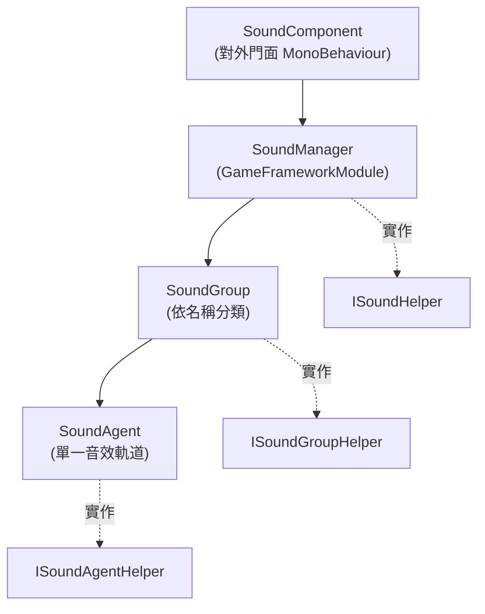

# 架構一覽：Component / Manager / Group / Agent

GameFrameX 音效模組採用 4 層架構設計。`SoundComponent` 作為對外門面（Facade），呼叫框架模組 `SoundManager`；管理器內部依 `SoundGroup`（音效群組）分類資源，每個音效群組底下會掛載多個實際播放音效的 `SoundAgent`（音效代理）。每一層都提供了可替換底層實作的 `*Helper` 介面（例如：對接不同的音訊引擎）。

## 運作原理一覽

這四個 `*Helper`（`ISoundHelper` / `ISoundGroupHelper` / `ISoundAgentHelper` / `ISoundHelperBase`）即為注入點，預設實作可在 [DefaultSoundHelper.cs](https://github.com/GameFrameX/com.gameframex.unity.sound/blob/main/Runtime/Sound/DefaultSoundHelper.cs#L1-L80)、[DefaultSoundGroupHelper.cs](https://github.com/GameFrameX/com.gameframex.unity.sound/blob/main/Runtime/Sound/DefaultSoundGroupHelper.cs)、[DefaultSoundAgentHelper.cs](https://github.com/GameFrameX/com.gameframex.unity.sound/blob/main/Runtime/Sound/DefaultSoundAgentHelper.cs) 中查看。

## 各層的角色

| 層級 | 型別 / 檔案 | 角色 |
|------|------------|------|
| Component | [SoundComponent](https://github.com/GameFrameX/com.gameframex.unity.sound/blob/main/Runtime/Sound/SoundComponent.cs) 繼承自 `MonoBehaviour` | 作為對外門面，接收上層（UI、戰鬥等）的呼叫並轉發給 `SoundManager`。提供 `PlaySound` / `StopSound` / 音量增減、音效群組註冊等 API |
| Manager | [SoundManager](https://github.com/GameFrameX/com.gameframex.unity.sound/blob/main/Runtime/Sound/Sound/SoundManager.cs) 繼承自 `GameFrameworkModule` | 模組核心，管理所有 `SoundGroup` 的字典，並統一處理載入、釋放、成功/失敗事件 |
| Group | [SoundGroup](https://github.com/GameFrameX/com.gameframex.unity.sound/blob/main/Runtime/Sound/Sound/SoundManager.SoundGroup.cs) 實作 [ISoundGroup](https://github.com/GameFrameX/com.gameframex.unity.sound/blob/main/Runtime/Interface/ISoundGroup.cs) | 以名稱區分的音效群組（例如：BGM、UI、戰鬥），決定該群組可同時播放的音效軌道數（`SoundAgentCount`）與混音屬性 |
| Agent | [SoundAgent](https://github.com/GameFrameX/com.gameframex.unity.sound/blob/main/Runtime/Sound/Sound/SoundManager.SoundAgent.cs) 實作 [ISoundAgent](https://github.com/GameFrameX/com.gameframex.unity.sound/blob/main/Runtime/Interface/ISoundAgent.cs) | 單一音效播放代理，負責維護播放狀態、音量、靜音、所屬群組等屬性 |

## 核心呼叫鏈

呼叫一次 `PlaySound` 後，參數會沿著以下鏈路傳遞：

1. `SoundComponent.PlaySound(soundGroup, soundAssetName, ...)` 收集 `PlaySoundParams` 並以 `serialId` 進行序列化。
2. `SoundManager.PlaySound(serialId, soundGroupName, ...)` 會在 `m_SoundGroups` 字典中尋找或建立對應的群組。
3. 目標 `SoundGroup` 透過自身的 `Helper`（`ISoundGroupHelper`）申請或重複使用閒置的 `SoundAgent`。
4. `SoundAgent` 實際載入資源（使用相依性注入的 `IAssetManager`），載入完成後再透過 `Helper` 實際播放音訊。
5. 載入/播放的成功與失敗會分別觸發 `PlaySoundSuccess` / `PlaySoundFailure` 事件 [SoundManager.cs#90-L103](https://github.com/GameFrameX/com.gameframex.unity.sound/blob/main/Runtime/Sound/Sound/SoundManager.cs#L90-L103)。

## 介面與擴充點

| 介面 | 預設實作 | 替換情境 |
|------|---------|---------|
| [ISoundHelper](https://github.com/GameFrameX/com.gameframex.unity.sound/blob/main/Runtime/Interface/ISoundHelper.cs) | [DefaultSoundHelper.cs](https://github.com/GameFrameX/com.gameframex.unity.sound/blob/main/Runtime/Sound/DefaultSoundHelper.cs) | 替換音訊後端（例如：FMOD / Wwise） |
| [ISoundGroupHelper](https://github.com/GameFrameX/com.gameframex.unity.sound/blob/main/Runtime/Interface/ISoundGroupHelper.cs) | [DefaultSoundGroupHelper.cs](https://github.com/GameFrameX/com.gameframex.unity.sound/blob/main/Runtime/Sound/DefaultSoundGroupHelper.cs) | 自訂群組的建立與回收策略 |
| [ISoundAgentHelper](https://github.com/GameFrameX/com.gameframex.unity.sound/blob/main/Runtime/Interface/ISoundAgentHelper.cs) | [DefaultSoundAgentHelper.cs](https://github.com/GameFrameX/com.gameframex.unity.sound/blob/main/Runtime/Sound/DefaultSoundAgentHelper.cs) | 自訂播放、音量、靜音、低通濾波器等行為 |
| `ISoundManager` | `SoundManager`（實作） | 通常無需替換 |

`SoundComponent` 會在 `Awake` 中依據 `GameFrameXSound` Hook 的 `[Preserve]` 參考清單（[GameFrameXSoundCroppingHelper.cs](https://github.com/GameFrameX/com.gameframex.unity.sound/blob/main/Runtime/GameFrameXSoundCroppingHelper.cs#L1-L36)）保留預設 Helper 型別，以避免它們被程式碼剝離（code stripping）移除。

## 下一步

- 整合與初始化步驟：參見《音效模組整合方式》
- BGM 播放與切換：參見《音效播放與控制方式》
- 解決播放失敗、音效被截斷等問題：參見《音效播放失敗時的處理方式》
- API 與錯誤碼快速查閱：參見《API 參考》