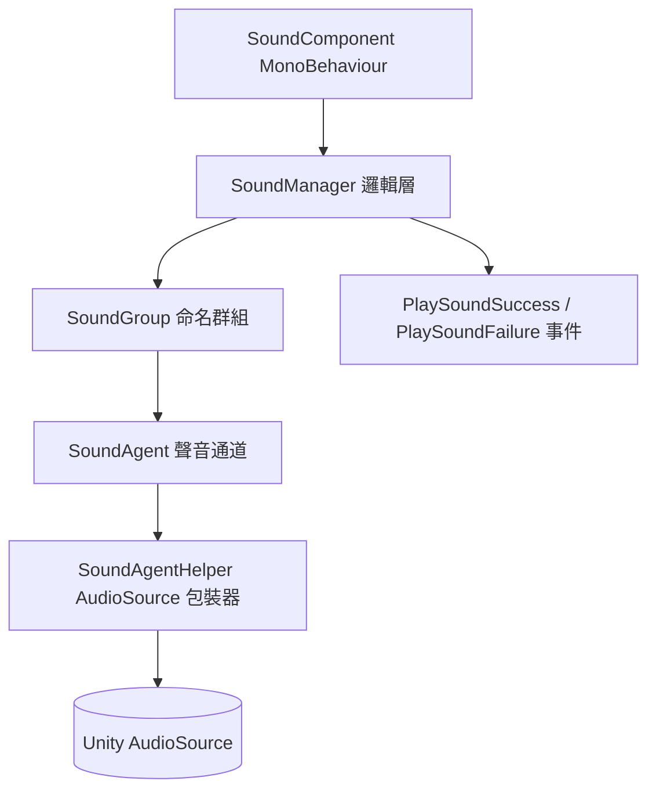

# 聲音模組簡介

GameFrameX Sound 是 GameFrameX 框架的聲音子模組，基於 Unity AudioSource 提供群組播放、空間音訊、優先順序搶佔以及事件驅動的通知功能，讓遊戲能夠有效率地管理 BGM、SFX、Voice 等各種音訊資源。

## 快速開始

### 1. 安裝

選擇以下其中一種方式，將 `com.gameframex.unity.sound` 加入 Unity 專案：

1. 在 `Packages/manifest.json` 中加入 scopedRegistries 與相依套件：

```json
{
  "scopedRegistries": [
    {
      "name": "GameFrameX",
      "url": "https://gameframex.upm.alianblank.uk",
      "scopes": ["com.gameframex"]
    }
  ],
  "dependencies": {
    "com.gameframex.unity.sound": "1.2.0"
  }
}
```

來源：[README.zh-CN.md](https://github.com/GameFrameX/com.gameframex.unity.sound/blob/main/README.zh-CN.md#L38-L58)

2. 直接加入 Git 相依套件：
```json
{
  "dependencies": {
    "com.gameframex.unity.sound": "https://github.com/gameframex/com.gameframex.unity.sound.git"
  }
}
```

來源：[README.zh-CN.md](https://github.com/GameFrameX/com.gameframex.unity.sound/blob/main/README.zh-CN.md#L60-L65)

3. 在 Unity 的 `Package Manager` 中貼上 `Git URL` 進行安裝，或直接將儲存庫放入專案的 `Packages` 目錄中。

### 2. 最小播放範例

只要透過 `SoundManager` 取得群組並呼叫 `PlaySound`，即可播放音訊：

```csharp
using GameFrameX.Sound.Runtime;

SoundManager soundManager = GameFrameworkEntry.GetModule<SoundManager>();
soundManager.PlaySound("SFX", "Assets/Audio/click.wav");
```

來源：[ISoundManager.cs](https://github.com/GameFrameX/com.gameframex.unity.sound/blob/main/Runtime/Interface/ISoundManager.cs#L43-L80)

主要的播放參數都集結在 `PlaySoundParams` 中，可設定音量、音調、淡入/淡出、循環、優先順序、空間混合等屬性：

```csharp
PlaySoundParams param = new PlaySoundParams
{
    Loop = false,
    Volume = 1f,
    Pitch = 1f,
    FadeInSeconds = 0.2f,
    Priority = 0,
};
```

來源：[PlaySoundParams.cs](https://github.com/GameFrameX/com.gameframex.unity.sound/blob/main/Runtime/Sound/Sound/PlaySoundParams.cs#L40-L80)

### 3. 接收播放結果

可透過 `PlaySoundSuccess` 與 `PlaySoundFailure` 事件取得非同步播放的結果：

```csharp
soundManager.PlaySoundSuccess += (sender, e) => { /* 播放成功 */ };
soundManager.PlaySoundFailure += (sender, e) => { /* 播放失敗 */ };
```

來源：[SoundManager.cs](https://github.com/GameFrameX/com.gameframex.unity.sound/blob/main/Runtime/Sound/Sound/SoundManager.cs#L90-L100)

## 運作原理概覽

聲音模組遵循 GameFrameX 經典的「Manager + Helper + Agent」分層架構，在執行階段從最外層的 MonoBehaviour 元件一路深入至實際的 `AudioSource`：



- **SoundGroup**：命名群組（例如 `BGM`、`SFX`、`Voice`），負責管理獨立的音量、靜音狀態以及同時存在的代理數量。
- **SoundAgent**：群組內同時輸出聲音的通道。當所有代理皆在使用中時，優先順序較低的請求會被自動逐出。
- **SoundAgentHelper**：包裝 `AudioSource` 的包裝器，負責實際的播放、淡入/淡出以及生命週期管理。
- **PlaySoundParams**：池化的播放參數物件，所有屬性皆可依需求覆寫。
- **事件系統**：播放成功/失敗會透過 GameFrameX 事件匯流排統一派發，事件參數同樣取自參考池。

## 功能特性

| 特性 | 說明 |
|------|------|
| 聲音群組 | 將聲音組織為命名群組（BGM、SFX、Voice 等），並為每個群組獨立管理音量、靜音與代理數量 |
| 優先順序播放 | 支援非同步播放，當代理都在使用中時，會自動逐出優先順序較低的聲音 |
| 完整生命週期 | 支援播放、暫停、停止以及淡入/淡出 |
| 空間音訊 | 可將聲音綁定至遊戲實體，或放置於指定的世界座標 |
| AudioMixer 整合 | 將群組路由至指定的 AudioMixer Group，實現精確的混音 |
| 事件驅動通知 | 透過 GameFrameX 事件系統傳遞播放成功/失敗的通知 |
| 參考池化 | 所有事件參數與播放參數皆取自參考池，將 GC 降至最低 |

來源：[README.zh-CN.md](https://github.com/GameFrameX/com.gameframex.unity.sound/blob/main/README.zh-CN.md#L24-L32)

## 相依性

| 套件 | 說明 |
|----|------|
| `com.gameframex.unity` | 核心框架（模組系統、參考池、工具類別） |
| `com.gameframex.unity.asset` | 資產載入（整合 YooAsset） |
| `com.gameframex.unity.entity` | 實體系統，用於空間音訊綁定 |
| `com.gameframex.unity.event` | 事件系統，用於播放通知 |

來源：[README.zh-CN.md](https://github.com/GameFrameX/com.gameframex.unity.sound/blob/main/README.zh-CN.md#L85-L93)

## 下一步

- 關於如何載入音訊並觸發播放，請參閱《聲音播放方式》（即將推出）
- 事件訂閱與失敗原因代碼，請參閱《播放事件與錯誤碼參考》（即將推出）
- 自訂 Helper 與群組設定，請參閱《群組與 Helper 擴充》（即將推出）