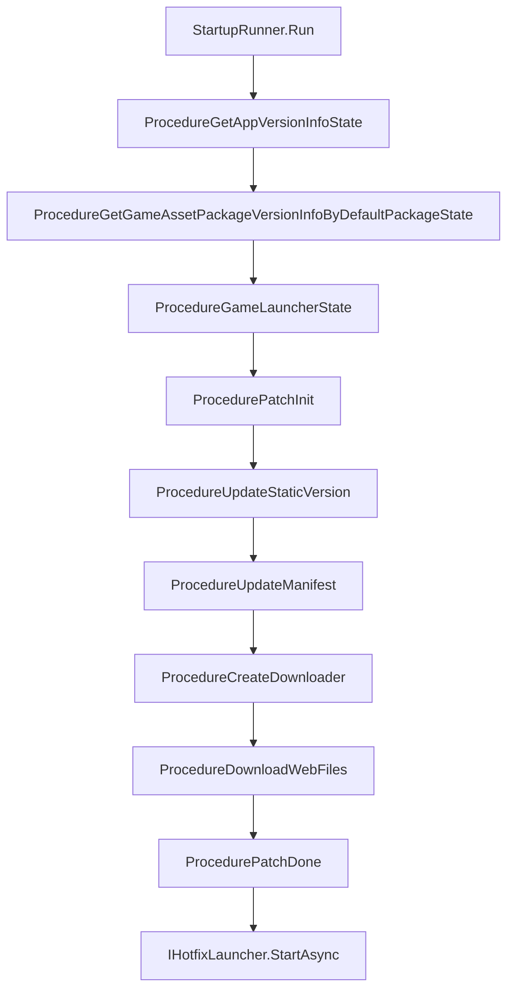

# 啟動流程概述

`com.gameframex.unity.startup` 將「遊戲從執行到可遊玩」的過程拆分為可設定、可插拔替換的啟動管線：先以主/備用 URL 取得全域資訊 → 驗證 App 與資源版本 → YooAsset 補丁流程（初始化 → 靜態版本 → 清單 → 下載 → 完成）→ 啟動熱更新進入點。開發者只需實作 `IStartupUIHandler`（引導 UI）與 `IHotfixLauncher`（熱更新進入點），即可替換預設實作。

## 快速開始

1. 在 `Packages/manifest.json` 中加入相依套件：

    ```json
    {
      "dependencies": {
        "com.gameframex.unity.startup": "1.1.0"
      },
      "scopedRegistries": [
        {
          "name": "GameFrameX",
          "url": "https://gameframex.upm.alianblank.uk",
          "scopes": ["com.gameframex"]
        }
      ]
    }
    ```

    `scopes` 控制哪些套件會透過此 registry 進行解析，僅有以 `com.gameframex` 開頭的套件會從這裡取得。

2. 在 Unity Editor 中透過 `Create > GameFrameX > Startup Options` 建立設定資產，並填入主/備用 URL、PlayMode、熱更新進入點、HTTP 共用參數等。

3. 實作 `IStartupUIHandler`（FairyGUI / UGUI / 自訂 UI 皆可）與 `IHotfixLauncher`（HybridCLR 或其他熱更新方案）。

4. 在場景中呼叫一行進入程式碼：

    ```csharp
    var result = await StartupRunner.Run(_options, uiHandler, hotfixLauncher);
    if (result.Success) { /* 啟動完成，遊戲就緒 */ }
    ```

    來源：[README.zh-CN.md](https://github.com/GameFrameX/com.gameframex.unity.startup/blob/main/README.zh-CN.md#L1-L100)

## 運作原理概述

啟動管線以有限狀態機（FSM）的形式組織 `Procedure` 節點，每個節點完成自身職責後，會透過 `ChangeState<T>` 切換至下一個節點。



節點說明：

| 流程節點 | 職責 |
|----------|------|
| `ProcedureGetAppVersionInfoState` | 取得全域資訊（URL 主/備用 failover） |
| `ProcedureGetGameAssetPackageVersionInfoByDefaultPackageState` | 取得 App 與資源包版本 |
| `ProcedureGameLauncherState` | 切換至 YooAsset 資源模式 |
| `ProcedurePatchInit` | 根據 PlayMode 初始化 YooAsset 資源包 |
| `ProcedureUpdateStaticVersion` | 請求資源包靜態版本號 |
| `ProcedureUpdateManifest` | 更新資源清單 |
| `ProcedureCreateDownloader` | 建立下載器 |
| `ProcedureDownloadWebFiles` | 下載補丁檔案並更新進度 |
| `ProcedurePatchDone` | 補丁流程完成 |
| `IHotfixLauncher.StartAsync` | 載入熱更新組件並執行進入點 |

兩條完成通知路徑會同時觸發：`UniTask<StartupResult>` 的 await 結果，以及 `StartupCompletedEventArgs` / `StartupFailedEventArgs` 事件，開發者可任選其一進行監聽。

## 主要設定項快速參考

`StartupOptions` ScriptableObject 的主要欄位：

| 欄位 | 用途 |
|------|------|
| `GlobalInfoUrls` | 全域資訊介面的主/備用 URL 清單，與 `MaxAttemptsPerUrl` 重試策略搭配使用 |
| `GamePlayMode` | 資源執行模式，啟動流程會在載入前同步至 Asset 元件 |
| `HotfixAssemblyName` / `HotfixEntryTypeName` / `HotfixEntryMethodName` | 熱更新進入點（組件 / 型別 / 方法） |
| `PackageName` / `Channel` / `SubChannel` | HTTP 共用參數（純資料，不依賴 SDK） |
| `LauncherUIResName` | 啟動 UI 資源路徑，預設值為 `UI/UILauncher` |
| `SkipRemoteStartupRequests` | 跳過所有遠端啟動請求，於 WebGL 獨立執行或無後端部署時啟用 |

PlayMode 自動分支：`EditorSimulateMode` / `OfflinePlayMode` / `HostPlayMode` / `WebPlayMode`，`ProcedurePatchInit` 會根據目前模式選擇空 URL 或實際 URL 來初始化 YooAsset：

來源：[ProcedurePatchInit.cs](https://github.com/GameFrameX/com.gameframex.unity.startup/blob/main/Runtime/Procedures/Patch/ProcedurePatchInit.cs#L33-L48)

## 後續步驟

- 啟動 UI 實作：參閱《IStartupUIHandler 實作方式》
- HybridCLR 整合：參閱《IHotfixLauncher 實作方式》
- 主/備用 URL 重試策略：參閱《URL Failover 參考》
- 獨立執行/無後端部署：啟用 `SkipRemoteStartupRequests`