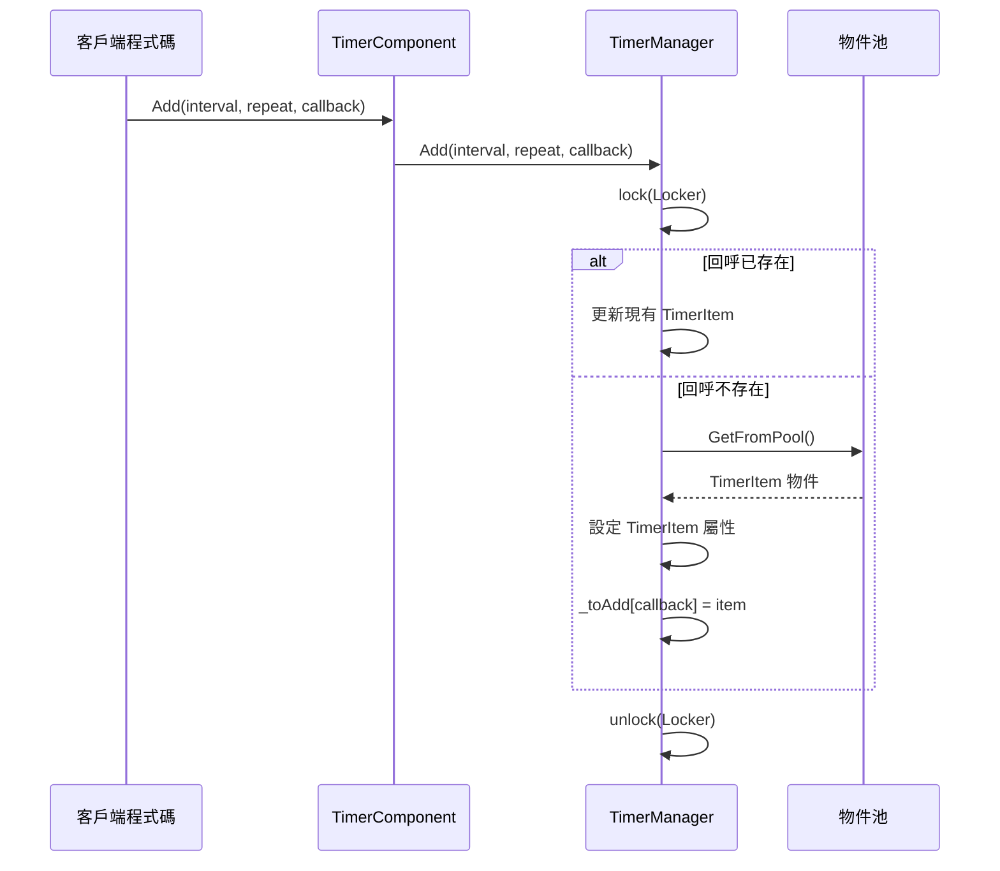
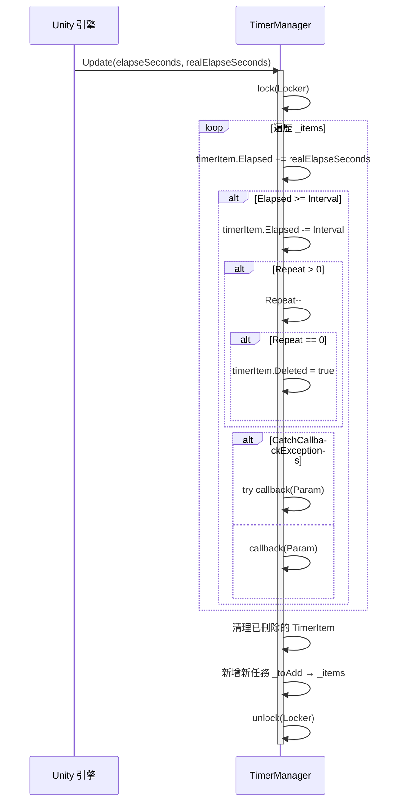

# Timer 組件介紹

Timer 組件是 GameFrameX 框架為 Unity 遊戲開發提供的計時器管理模組。該組件提供了在遊戲中新增、管理和執行定時任務的能力，支援單次執行、重複執行和幀更新等多種定時模式。

## 概述

Timer 組件是 GameFrameX 架構中專注於時間排程的基礎組件。在遊戲開發過程中，開發者經常需要處理各種與時間相關的邏輯，例如：

- 延遲執行某些操作
- 週期性觸發遊戲事件
- 倒計時功能
- 每幀執行特定邏輯

Timer 組件透過簡潔的 API 設計，讓開發者可以輕鬆實現這些需求，同時提供了執行緒安全的實現和效能最佳化。

## 組件架構

Timer 組件採用經典的三層架構設計，包括組件層、介面層和實現層：

```mermaid
flowchart TD
    subgraph Unity["Unity 組件層"]
        TC[TimerComponent]
    end

    subgraph Interface["介面層"]
        ITM[ITimerManager]
    end

    subgraph Implementation["實現層"]
        TM[TimerManager]
        Pool[物件池 _pool]
    end

    subgraph Data["資料層"]
        Items["_items 字典"]
        ToAdd["_toAdd 字典"]
        ToRemove["_toRemove 列表"]
    end

    TC -->|"呼叫方法"| ITM
    ITM <|..|"實現"| TM
    TM -->|"物件複用"| Pool
    TM -->|"管理"| Items
    TM -->|"管理"| ToAdd
    TM -->|"管理"| ToRemove
```

### 架構說明

| 層次 | 類名 | 職責 |
|------|------|------|
| 組件層 | TimerComponent | 作為 Unity 組件暴露給場景，提供面向使用者的 API |
| 介面層 | ITimerManager | 定義計時器管理器的抽象介面 |
| 實現層 | TimerManager | 實現具體的計時器邏輯 |

## 核心設計

### 介面-實現模式

Timer 組件使用介面-實現分離的設計，便於單元測試和擴充套件：

```csharp
> Source: [ITimerManager.cs](https://github.com/GameFrameX/com.gameframex.unity.timer/blob/main/Runtime/Timer/ITimerManager.cs#L1-L54)

public interface ITimerManager
{
    void Add(float interval, int repeat, Action<object> callback, object callbackParam = null);
    void AddOnce(float interval, Action<object> callback, object callbackParam = null);
    void AddUpdate(Action<object> callback);
    void AddUpdate(Action<object> callback, object callbackParam);
    bool Exists(Action<object> callback);
    void Remove(Action<object> callback);
}
```

這種設計允許在不同的模組中透過介面引用計時器功能，而不依賴具體實現。

### 物件池模式

TimerManager 內部使用物件池來複用 TimerItem 物件，減少垃圾回收壓力：

```csharp
> Source: [TimerManager.cs](https://github.com/GameFrameX/com.gameframex.unity.timer/blob/main/Runtime/Timer/TimerManager.cs#L266-L289)

private TimerItem GetFromPool()
{
    TimerItem t;
    int cnt = _pool.Count;
    if (cnt > 0)
    {
        t = _pool[cnt - 1];
        _pool.RemoveAt(cnt - 1);
        t.Deleted = false;
        t.Elapsed = 0;
    }
    else
    {
        t = new TimerItem();
    }
    return t;
}
```

### 執行緒安全設計

TimerManager 使用 `lock` 鎖機制確保多執行緒環境下的資料安全：

```csharp
> Source: [TimerManager.cs](https://github.com/GameFrameX/com.gameframex.unity.timer/blob/main/Runtime/Timer/TimerManager.cs#L38-L38)

private static readonly object Locker = new object();
```

所有對 `_items`、`_toAdd`、`_toRemove` 等共享資料的操作都在鎖的保護下進行。

### 異常處理策略

透過靜態屬性 `CatchCallbackExceptions` 可以控制是否捕獲回呼中的異常：

```csharp
> Source: [TimerManager.cs](https://github.com/GameFrameX/com.gameframex.unity.timer/blob/main/Runtime/Timer/TimerManager.cs#L40-L43)

/// <summary>
/// 是否觸發回呼異常
/// </summary>
public static bool CatchCallbackExceptions = false;
```

當設定為 `true` 時，回呼中的異常會被捕獲並記錄警告日誌，不會中斷計時器的主迴圈。

## 核心流程

### 任務新增流程



### 任務執行流程



## 核心功能

Timer 組件提供以下核心功能：

| 方法 | 功能描述 |
|------|----------|
| Add | 新增定時重複執行的任務 |
| AddOnce | 新增只執行一次的任務 |
| AddUpdate | 新增每幀更新執行的任務 |
| Exists | 檢查指定任務是否存在 |
| Remove | 移除指定的任務 |

### 新增定時任務 (Add)

新增一個定時重複執行的任務，支援指定間隔時間和重複次數：

```csharp
> Source: [README.md](https://github.com/GameFrameX/com.gameframex.unity.timer/blob/main/README.md#L30-L32)

Add(1000, 5, MyMethod);
```

引數說明：
- `interval`：間隔時間（單位為毫秒）
- `repeat`：重複次數，0 表示無限重複
- `callback`：回呼函式
- `callbackParam`：回呼引數（可選）

### 新增單次任務 (AddOnce)

新增一個延遲執行一次的任務：

```csharp
> Source: [README.md](https://github.com/GameFrameX/com.gameframex.unity.timer/blob/main/README.md#L46-L48)

AddOnce(5000, MyMethod);
```

### 新增幀更新任務 (AddUpdate)

新增每幀執行的任務，適用於需要持續監測或更新的場景：

```csharp
> Source: [README.md](https://github.com/GameFrameX/com.gameframex.unity.timer/blob/main/README.md#L60-L63)

AddUpdate(MyMethod);
```

### 檢查和移除任務

檢查任務是否存在並根據需要移除：

```csharp
> Source: [README.md](https://github.com/GameFrameX/com.gameframex.unity.timer/blob/main/README.md#L78-L95)

bool exists = GetComponent<TimerComponent>().Exists(MyMethod);
GetComponent<TimerComponent>().Remove(MyMethod);
```

## 使用示例

以下是一個完整的使用示例：

```csharp
// 假設這是您要觸發的方法
void MyMethod(object param)
{
    Debug.Log("方法被觸發");
}

// 建立定時任務，每隔1秒執行MyMethod方法，共執行5次
GetComponent<TimerComponent>().Add(1000, 5, MyMethod);

// 建立定時任務，5秒後執行一次MyMethod方法
GetComponent<TimerComponent>().AddOnce(5000, MyMethod);

// 檢查是否存在某個任務
bool exists = GetComponent<TimerComponent>().Exists(MyMethod);

// 移除特定的任務
GetComponent<TimerComponent>().Remove(MyMethod);
```

> Source: [README.md](https://github.com/GameFrameX/com.gameframex.unity.timer/blob/main/README.md#L101-L119)

## 配置選項

Timer 組件提供以下可配置項：

| 選項 | 型別 | 預設值 | 描述 |
|------|------|--------|------|
| CatchCallbackExceptions | static bool | false | 是否捕獲回呼中的異常，防止計時器主迴圈被中斷 |

### 配置示例

```csharp
// 開啟異常捕獲，防止回呼異常中斷計時器
TimerManager.CatchCallbackExceptions = true;
```

## 注意事項

1. **初始化要求**：在使用計時器前，請確保 `TimerManager` 已正確初始化並已註冊到 `GameFrameworkEntry` 模組中。

2. **效能考慮**：儘量避免使用過小的間隔時間（例如小於幀時間），這可能會導致效能問題。建議最小間隔不低於 100 毫秒。

3. **回呼簽名**：所有回呼函式必須符合 `Action<object>` 簽名，即接受一個 object 引數並返回 void。

4. **執行緒安全**：雖然 TimerManager 內部實現了執行緒安全機制，但在多執行緒環境下仍需注意回呼函式的執行緒安全性。

## 相關連結

- [功能特性](./1-overview.features) - 瞭解更多 Timer 組件的功能細節
- [安裝指南](./2-installation) - 如何安裝和配置 Timer 組件
- [快速開始](./3-getting-started) - 快速上手 Timer 組件
- [新增定時任務](./4-core-functions.add-timer) - 定時任務詳細用法
- [新增單次任務](./4-core-functions.add-once) - 單次任務詳細用法
- [新增幀更新任務](./4-core-functions.add-update) - 幀更新任務詳細用法
- [檢查和移除任務](./4-core-functions.exists-remove) - 任務管理詳細用法
- [API 參考](./5-api-reference.timer-component) - TimerComponent 完整 API
