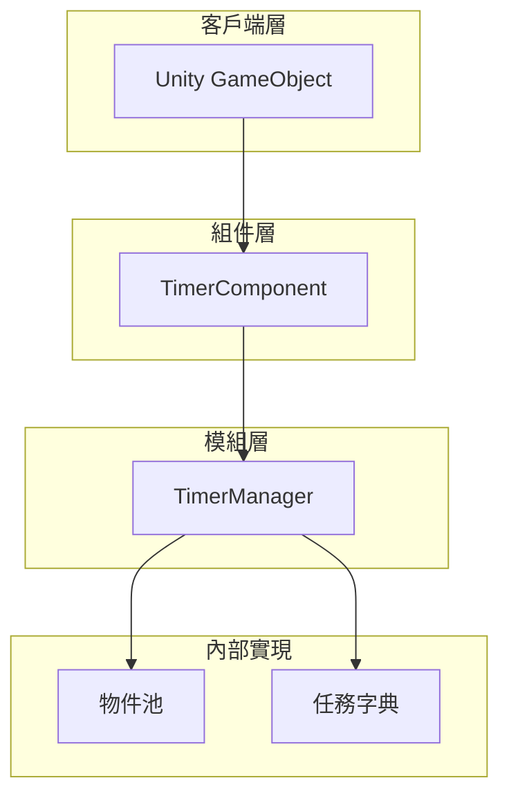

# 快速開始

Timer 組件是 GameFrameX 框架提供的計時器功能模組，用於在 Unity 專案中管理和執行定時任務。無論是週期性事件、單次延遲執行還是每幀更新，Timer 組件都能為您提供簡單高效的解決方案。

## 概述

Timer 組件提供以下核心功能：

- **定時任務**：以指定時間間隔重複執行的任務
- **單次任務**：延遲指定時間後執行一次的任務
- **幀更新任務**：每幀執行的任務，適用於需要高頻更新的場景
- **任務管理**：檢查任務是否存在、移除指定任務

該組件基於 GameFrameX 框架架構設計，自動整合到框架的模組系統中，支援執行緒安全的操作和物件池最佳化。

## 架構

Timer 組件採用分層架構設計，核心組件包括：



**架構說明：**

- **TimerComponent**：Unity 組件層，提供給開發者直接使用的介面，繼承自 `GameFrameworkComponent`
- **TimerManager**：核心模組層，繼承自 `GameFrameworkModule`，實現 `ITimerManager` 介面，負責定時任務的排程和執行
- **物件池**：使用物件池模式管理 TimerItem，減少記憶體分配和 GC 壓力
- **任務字典**：使用執行緒安全的字典儲存任務，支援動態新增和移除

## 基本使用

### 第一步：新增組件

在 Unity 編輯器中，選擇需要使用計時器的 GameObject，點選 **Add Component**，搜尋 **Timer** 並新增：

> Source: [TimerComponent.cs](https://github.com/GameFrameX/com.gameframex.unity.timer/blob/main/Runtime/Timer/TimerComponent.cs#L11-L13)

```csharp
[DisallowMultipleComponent]
[AddComponentMenu("Game Framework/Timer")]
public class TimerComponent : GameFrameworkComponent
```

### 第二步：獲取組件例項

在指令碼中獲取 TimerComponent 例項：

```csharp
// 獲取 TimerComponent 組件
var timerComponent = gameObject.GetComponent<TimerComponent>();
```

### 第三步：使用定時功能

#### 新增定時任務

每隔指定時間執行一次任務，可設定重複次數：

```csharp
// 每隔 1 秒執行一次，共執行 5 次
timerComponent.Add(1f, 5, (param) => {
    Debug.Log("定時任務執行");
});

// 每隔 2 秒執行，無限重複 (repeat = 0)
timerComponent.Add(2f, 0, (param) => {
    Debug.Log("無限重複任務");
});
```

> Source: [TimerComponent.cs](https://github.com/GameFrameX/com.gameframex.unity.timer/blob/main/Runtime/Timer/TimerComponent.cs#L37-L40)

#### 新增單次任務

延遲指定時間後執行一次：

```csharp
// 5 秒後執行一次
timerComponent.AddOnce(5f, (param) => {
    Debug.Log("單次任務執行");
});
```

> Source: [TimerComponent.cs](https://github.com/GameFrameX/com.gameframex.unity.timer/blob/main/Runtime/Timer/TimerComponent.cs#L48-L51)

#### 新增幀更新任務

每幀執行的任務，適用於需要高頻更新的場景：

```csharp
// 每幀執行
timerComponent.AddUpdate((param) => {
    // 每幀執行的邏輯
});

// 帶引數的版本
timerComponent.AddUpdate((param) => {
    int frameCount = (int)param;
    Debug.Log($"當前幀: {frameCount}");
}, 0);
```

> Source: [TimerComponent.cs](https://github.com/GameFrameX/com.gameframex.unity.timer/blob/main/Runtime/Timer/TimerComponent.cs#L57-L70)

#### 檢查任務是否存在

```csharp
// 檢查指定回呼的任務是否存在
bool exists = timerComponent.Exists((param) => {
    Debug.Log("任務");
});

Debug.Log($"任務是否存在: {exists}");
```

> Source: [TimerComponent.cs](https://github.com/GameFrameX/com.gameframex.unity.timer/blob/main/Runtime/Timer/TimerComponent.cs#L77-L80)

#### 移除任務

```csharp
// 移除指定任務
timerComponent.Remove((param) => {
    Debug.Log("要移除的任務");
});
```

> Source: [TimerComponent.cs](https://github.com/GameFrameX/com.gameframex.unity.timer/blob/main/Runtime/Timer/TimerComponent.cs#L86-L89)

## 完整示例

以下是一個完整的指令碼示例，展示瞭如何使用 TimerComponent：

```csharp
using UnityEngine;
using GameFrameX.Timer.Runtime;

public class TimerExample : MonoBehaviour
{
    private TimerComponent _timerComponent;
    private int _executeCount = 0;

    void Start()
    {
        // 獲取 TimerComponent
        _timerComponent = gameObject.AddComponent<TimerComponent>();

        // 示例 1：每 1 秒執行一次，共執行 10 次
        _timerComponent.Add(1f, 10, OnTimerTick);

        // 示例 2：5 秒後執行一次
        _timerComponent.AddOnce(5f, OnDelayComplete);

        // 示例 3：每幀執行
        _timerComponent.AddUpdate(OnFrameUpdate);
    }

    void OnTimerTick(object param)
    {
        _executeCount++;
        Debug.Log($"定時任務執行次數: {_executeCount}");
    }

    void OnDelayComplete(object param)
    {
        Debug.Log("延遲任務執行完成");
        
        // 移除幀更新任務
        _timerComponent.Remove(OnFrameUpdate);
    }

    void OnFrameUpdate(object param)
    {
        // 每幀執行的邏輯
    }

    void OnDestroy()
    {
        // 清理所有任務
        if (_timerComponent != null)
        {
            _timerComponent.Remove(OnTimerTick);
            _timerComponent.Remove(OnDelayComplete);
            _timerComponent.Remove(OnFrameUpdate);
        }
    }
}
```

> Source: [TimerComponent.cs](https://github.com/GameFrameX/com.gameframex.unity.timer/blob/main/Runtime/Timer/TimerComponent.cs#L1-L91)

## 重要說明

### 時間單位

Timer 組件的時間引數**以秒為單位**，而非毫秒：

- `interval = 1f` 表示間隔 1 秒
- `interval = 0.5f` 表示間隔 0.5 秒
- `interval = 0.001f` 表示間隔 1 毫秒（用於幀更新）

### 執行緒安全

TimerManager 內部使用 `lock` 機制確保執行緒安全，可以在多執行緒環境中安全使用。

### 回呼異常處理

可以透過設定 `TimerManager.CatchCallbackExceptions` 來控制是否捕獲回呼中的異常：

```csharp
// 捕獲回呼異常，避免異常終止定時器
TimerManager.CatchCallbackExceptions = true;
```

> Source: [TimerManager.cs](https://github.com/GameFrameX/com.gameframex.unity.timer/blob/main/Runtime/Timer/TimerManager.cs#L43)

## 相關連結

- [功能特性](./1-overview.features) - 瞭解更多 Timer 組件的功能特性
- [安裝指南](./2-installation) - 檢視完整的安裝步驟
- [新增定時任務](./4-core-functions.add-timer) - 定時任務的詳細用法
- [新增單次任務](./4-core-functions.add-once) - 單次任務的詳細用法
- [新增幀更新任務](./4-core-functions.add-update) - 幀更新任務的詳細用法
- [檢查和移除任務](./4-core-functions.exists-remove) - 任務管理的詳細用法
- [API 參考 - TimerComponent](./5-api-reference.timer-component) - TimerComponent 完整 API
- [API 參考 - ITimerManager](./5-api-reference.itimer-manager) - ITimerManager 介面定義
- [API 參考 - TimerManager](./5-api-reference.timer-manager) - TimerManager 實現細節
- [使用示例](./6-samples) - 更多使用示例
- [常見問題](./7-troubleshooting) - 常見問題解答
