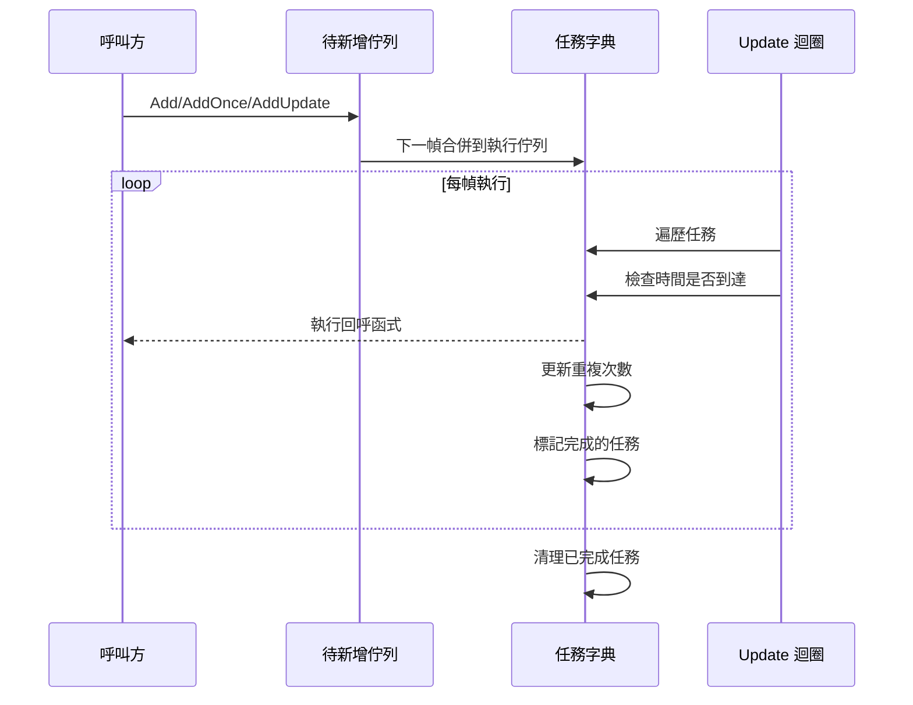

# 功能特性

Timer 組件是 GameFrameX 框架中的計時器模組，提供了一套完整的時間排程解決方案，支援定時重複任務、單次延遲任務和幀更新任務的管理。

## 概述

Timer 組件專為 Unity 遊戲開發設計，提供高精度、可控的定時任務排程能力。該組件採用分層架構設計，上層透過 TimerComponent 組件供 Unity 場景使用，下層透過 TimerManager 實現核心邏輯，ITimerManager 介面定義標準化的定時器服務。

## 核心功能

### 1. 定時重複任務

定時重複任務（Add 方法）允許開發者設定一個間隔時間和重複次數，任務將按指定間隔重複執行。

**功能特點：**
- 支援指定重複次數（0 表示無限重複）
- 精確的時間間隔控制（以秒為單位）
- 任務執行時傳遞自定義引數

**典型應用場景：**
- 週期性血量恢復
- 定時重新整理遊戲道具
- 週期性儲存遊戲資料

### 2. 單次延遲任務

單次任務（AddOnce 方法）在指定延遲時間後執行一次，適合需要延遲執行的場景。

**功能特點：**
- 延遲時間精確可控
- 執行完成後自動移除，無需手動管理
- 與 Add(interval, 1, callback) 等效

**典型應用場景：**
- 延遲幾秒後顯示對話方塊
- 倒計時結束後結束遊戲
- 技能冷卻完成提示

### 3. 幀更新任務

幀更新任務（AddUpdate 方法）每幀都會執行，適合需要高頻更新的場景。

**功能特點：**
- 最小間隔約為 0.001 秒（1 毫秒）
- 無限重複執行
- 常用於實時監控或持續性檢查

**典型應用場景：**
- 實時進度條更新
- 動畫狀態機更新
- 持續檢測條件是否滿足

### 4. 任務存在性檢查

Exists 方法用於檢查指定的回呼函式是否已經存在於任務佇列中。

**功能特點：**
- 同時檢查待新增佇列和執行佇列
- 返回布林值表示是否存在

**典型應用場景：**
- 防止重複新增相同任務
- 在新增前驗證任務狀態

### 5. 任務移除

Remove 方法用於移除指定的任務，停止其執行。

**功能特點：**
- 支援移除正在等待的任務
- 支援移除正在執行的任務（標記為刪除）
- 自動回收資源到物件池

**典型應用場景：**
- 玩家死亡時停止所有戰鬥相關的定時任務
- 關閉介面時清理相關的定時重新整理
- 取消倒計時

## 架構設計

```mermaid
graph TD
    subgraph Unity 層
        TC[TimerComponent<br/>Unity 組件]
    end

    subgraph 介面層
        ITM[ITimerManager<br/>定時器介面]
    end

    subgraph 實現層
        TM[TimerManager<br/>定時器管理器]
        GFM[GameFrameworkModule<br/>框架模組基類]
    end

    subgraph 內部實現
        Pool[物件池]
        Dict[任務字典]
    end

    TC --> ITM
    ITM <|.. TM
    TM --> GFM
    TM --> Pool
    TM --> Dict
```

**組件說明：**

| 組件 | 職責 | 層級 |
|------|------|------|
| TimerComponent | Unity 組件封裝，提供場景中的定時器功能 | Unity 層 |
| ITimerManager | 定義定時器的標準介面，包含所有核心方法 | 介面層 |
| TimerManager | 實現定時器核心邏輯，包括任務排程和執行 | 實現層 |
| 物件池 | 複用 TimerItem 物件，減少記憶體分配 | 內部實現 |

## 任務執行流程



## 技術特性

### 執行緒安全

TimerManager 內部使用 `lock` 關鍵字保護所有操作，確保在多執行緒環境下安全執行。

### 效能最佳化

- **物件池模式**：使用 `_pool` 列表複用 TimerItem 物件，避免頻繁 GC
- **延遲新增**：新任務新增到 `_toAdd` 佇列，在下一幀 Update 時合併到主佇列
- **增量時間處理**：處理時間漂移，任務完成後重置計時器

### 異常處理

透過 `TimerManager.CatchCallbackExceptions` 靜態屬性控制是否捕獲回呼中的異常：
- `false`（預設）：異常直接丟擲，可能中斷遊戲迴圈
- `true`：捕獲異常並輸出警告日誌，任務標記為刪除

## 使用方式

### 透過組件使用

在 Unity 場景中，將 TimerComponent 新增到遊戲物件上即可使用：

```csharp
// 新增定時任務，每隔1秒執行一次，共執行10次
GetComponent<TimerComponent>().Add(1f, 10, OnTimerTick);

// 新增單次任務，5秒後執行
GetComponent<TimerComponent>().AddOnce(5f, OnDelayedExecute);

// 新增幀更新任務
GetComponent<TimerComponent>().AddUpdate(OnFrameUpdate);

// 檢查任務是否存在
bool exists = GetComponent<TimerComponent>().Exists(OnTimerTick);

// 移除任務
GetComponent<TimerComponent>().Remove(OnTimerTick);
```

> Source: [TimerComponent.cs](https://github.com/GameFrameX/com.gameframex.unity.timer/blob/main/Runtime/Timer/TimerComponent.cs#L30-L89)

### 透過模組使用

在框架內部，可以透過 GameFrameworkEntry 獲取 ITimerManager 模組：

```csharp
var timerManager = GameFrameworkEntry.GetModule<ITimerManager>();
timerManager.Add(1f, 5, OnTick);
```

> Source: [TimerManager.cs](https://github.com/GameFrameX/com.gameframex.unity.timer/blob/main/Runtime/Timer/TimerManager.cs#L156-L188)

## 回呼函式定義

所有定時任務使用統一的回呼函式簽名：

```csharp
void CallbackName(object param)
{
    // param 是傳入的引數，可以是任意物件
    // 如果不需要引數，可以傳入 null
}
```

> Source: [ITimerManager.cs](https://github.com/GameFrameX/com.gameframex.unity.timer/blob/main/Runtime/Timer/ITimerManager.cs#L18)

## 引數說明

| 方法 | 引數 | 型別 | 說明 |
|------|------|------|------|
| Add | interval | float | 間隔時間（秒） |
| Add | repeat | int | 重複次數（0=無限） |
| Add | callback | Action\<object\> | 回呼函式 |
| Add | callbackParam | object | 回呼引數 |
| AddOnce | interval | float | 延遲時間（秒） |
| AddOnce | callback | Action\<object\> | 回呼函式 |
| AddOnce | callbackParam | object | 回呼引數 |
| AddUpdate | callback | Action\<object\> | 回呼函式 |
| AddUpdate | callbackParam | object | 回呼引數 |
| Exists | callback | Action\<object\> | 要檢查的回呼 |
| Remove | callback | Action\<object\> | 要移除的回呼 |

## 相關連結

- [Timer 組件介紹](./1-overview.introduction)
- [安裝指南](./2-installation)
- [快速開始](./3-getting-started)
- [核心功能 - 新增定時任務](./4-core-functions.add-timer)
- [核心功能 - 新增單次任務](./4-core-functions.add-once)
- [核心功能 - 新增幀更新任務](./4-core-functions.add-update)
- [核心功能 - 檢查和移除任務](./4-core-functions.exists-remove)
- [API 參考 - TimerComponent](./5-api-reference.timer-component)
- [API 參考 - ITimerManager](./5-api-reference.itimer-manager)
- [API 參考 - TimerManager](./5-api-reference.timer-manager)
