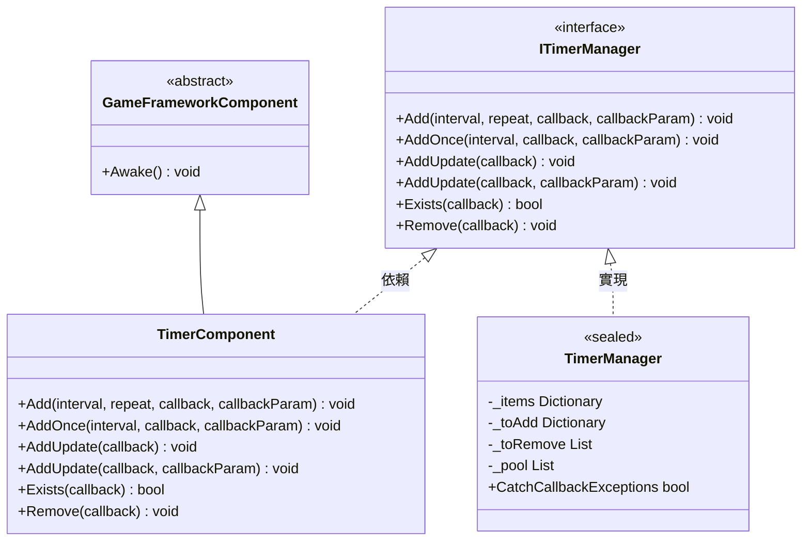
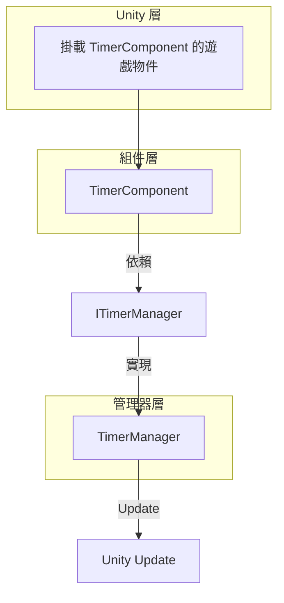
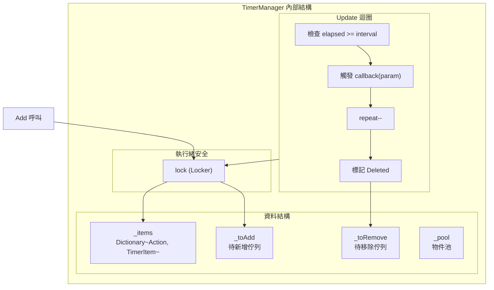

# TimerComponent

TimerComponent 是 Timer 模組的 Unity 組件封裝，提供定時任務管理功能。作為 GameFrameX 框架的核心組件之一，它允許開發者新增各種定時執行的任務，包括重複執行、單次執行和每幀更新執行的任務。

## 概述

TimerComponent 繼承自 GameFrameworkComponent，是一個 Unity 組件（[DisallowMultipleComponent]），需要掛載到 Unity 遊戲物件上使用。該組件內部委託 ITimerManager（TimerManager 實現）來處理實際的定時任務邏輯，自身僅提供簡潔的 Unity API 介面。

**繼承層次：**



## 架構說明

TimerComponent 在架構中位於 **API 層**，為 Unity 開發者提供便捷的呼叫介面：



**工作流程：**
1. 開發者在 Unity 編輯器中將 TimerComponent 掛載到遊戲物件
2. 呼叫 TimerComponent 的公開方法新增定時任務
3. TimerComponent 將請求轉發給 TimerManager
4. TimerManager 在 Update 迴圈中檢測並觸發定時任務回呼

## API 參考

### `Add(interval, repeat, callback, callbackParam)`

新增一個定時重複執行的任務。

```csharp
public void Add(float interval, int repeat, Action<object> callback, object callbackParam = null)
```
> Source: [TimerComponent.cs](https://github.com/GameFrameX/com.gameframex.unity.timer/blob/main/Runtime/Timer/TimerComponent.cs#L37-L40)

**引數：**
| 引數名 | 型別 | 必填 | 描述 |
|--------|------|------|------|
| interval | float | 是 | 間隔時間（以秒為單位） |
| repeat | int | 是 | 重複次數，0 表示無限重複 |
| callback | Action\<object\> | 是 | 定時觸發時執行的回呼函式 |
| callbackParam | object | 否 | 傳遞給回呼函式的引數 |

**返回值：** 無

**使用示例：**

```csharp
// 每隔1秒執行一次，共執行10次
timerComponent.Add(1f, 10, OnTimerTick, "tick data");

// 無限重複執行（每秒一次）
timerComponent.Add(1f, 0, OnTimerTick);
```

---

### `AddOnce(interval, callback, callbackParam)`

新增一個只執行一次的定時任務。

```csharp
public void AddOnce(float interval, Action<object> callback, object callbackParam = null)
```
> Source: [TimerComponent.cs](https://github.com/GameFrameX/com.gameframex.unity.timer/blob/main/Runtime/Timer/TimerComponent.cs#L48-L51)

**引數：**
| 引數名 | 型別 | 必填 | 描述 |
|--------|------|------|------|
| interval | float | 是 | 延遲時間（以秒為單位），延遲後執行一次 |
| callback | Action\<object\> | 是 | 延遲到達時執行的回呼函式 |
| callbackParam | object | 否 | 傳遞給回呼函式的引數 |

**返回值：** 無

**使用示例：**

```csharp
// 5秒後執行一次
timerComponent.AddOnce(5f, OnDelayedAction, "delayed");

// 1秒後執行一次
timerComponent.AddOnce(1f, OnGameStart);
```

---

### `AddUpdate(callback)`

新增一個每幀更新執行的任務（無引數版本）。

```csharp
public void AddUpdate(Action<object> callback)
```
> Source: [TimerComponent.cs](https://github.com/GameFrameX/com.gameframex.unity.timer/blob/main/Runtime/Timer/TimerComponent.cs#L57-L60)

**引數：**
| 引數名 | 型別 | 必填 | 描述 |
|--------|------|------|------|
| callback | Action\<object\> | 是 | 每幀執行的回呼函式 |

**返回值：** 無

**備註：** 內部實現為間隔 0.001 秒的無限重複任務，實際執行頻率受 Unity Update 幀率影響。

**使用示例：**

```csharp
// 每幀執行
timerComponent.AddUpdate(OnFrameUpdate);
```

---

### `AddUpdate(callback, callbackParam)`

新增一個每幀更新執行的任務（帶引數版本）。

```csharp
public void AddUpdate(Action<object> callback, object callbackParam)
```
> Source: [TimerComponent.cs](https://github.com/GameFrameX/com.gameframex.unity.timer/blob/main/Runtime/Timer/TimerComponent.cs#L67-L70)

**引數：**
| 引數名 | 型別 | 必填 | 描述 |
|--------|------|------|------|
| callback | Action\<object\> | 是 | 每幀執行的回呼函式 |
| callbackParam | object | 是 | 傳遞給回呼函式的引數 |

**返回值：** 無

**使用示例：**

```csharp
// 每幀執行並傳遞引數
timerComponent.AddUpdate(OnFrameUpdate, frameCounter);
```

---

### `Exists(callback)`

檢查指定的任務是否存在。

```csharp
public bool Exists(Action<object> callback)
```
> Source: [TimerComponent.cs](https://github.com/GameFrameX/com.gameframex.unity.timer/blob/main/Runtime/Timer/TimerComponent.cs#L77-L80)

**引數：**
| 引數名 | 型別 | 必填 | 描述 |
|--------|------|------|------|
| callback | Action\<object\> | 是 | 要檢查的回呼函式 |

**返回值：** bool - 任務存在返回 true，不存在返回 false

**使用示例：**

```csharp
if (timerComponent.Exists(OnTimerTick))
{
    Debug.Log("任務正在執行");
}
```

---

### `Remove(callback)`

移除指定的定時任務。

```csharp
public void Remove(Action<object> callback)
```
> Source: [TimerComponent.cs](https://github.com/GameFrameX/com.gameframex.unity.timer/blob/main/Runtime/Timer/TimerComponent.cs#L86-L89)

**引數：**
| 引數名 | 型別 | 必填 | 描述 |
|--------|------|------|------|
| callback | Action\<object\> | 是 | 要移除的回呼函式 |

**返回值：** 無

**使用示例：**

```csharp
// 移除指定任務
timerComponent.Remove(OnTimerTick);

// 移除所有幀更新任務
timerComponent.Remove(OnFrameUpdate);
```

---

## 內部實現機制

### TimerManager 核心邏輯

TimerComponent 背後的實際處理由 TimerManager 完成。TimerManager 使用以下機制確保高效和執行緒安全：



### 關鍵設計特點

1. **延遲新增/移除佇列**：使用 `_toAdd` 和 `_toRemove` 佇列避免在 Update 遍歷過程中修改集合導致的問題
2. **物件池模式**：`_pool` 列表複用 TimerItem 物件，減少 GC 開銷
3. **執行緒安全**：所有操作都透過 `lock (Locker)` 保護
4. **異常處理選項**：透過 `TimerManager.CatchCallbackExceptions` 靜態屬性控制是否捕獲回呼異常

## 常見使用模式

### 基礎模式

```csharp
// 獲取組件引用
var timer = GetComponent<TimerComponent>();

// 新增重複任務
timer.Add(1f, 5, OnTick, "data");

// 定義回呼
void OnTick(object param)
{
    Debug.Log($"Timer tick: {param}");
}
```

### 遊戲開發常見場景

```csharp
// 延遲執行（單次）
timerComponent.AddOnce(3f, OnLevelStart);

// 持續效果（如中毒扣血）
timerComponent.Add(1f, 0, OnPoisonDamage, 10);

// 每幀檢測
timerComponent.AddUpdate(OnCheckInput);

// 條件移除
if (timerComponent.Exists(myCallback))
{
    timerComponent.Remove(myCallback);
}
```

## 相關連結

- [ITimerManager 介面參考](./5-api-reference.itimer-manager)
- [TimerManager 實現參考](./5-api-reference.timer-manager)
- [核心功能 - 新增定時任務](./4-core-functions.add-timer)
- [核心功能 - 新增單次任務](./4-core-functions.add-once)
- [核心功能 - 新增幀更新任務](./4-core-functions.add-update)
- [核心功能 - 檢查和移除任務](./4-core-functions.exists-remove)
- [快速開始](./3-getting-started)
