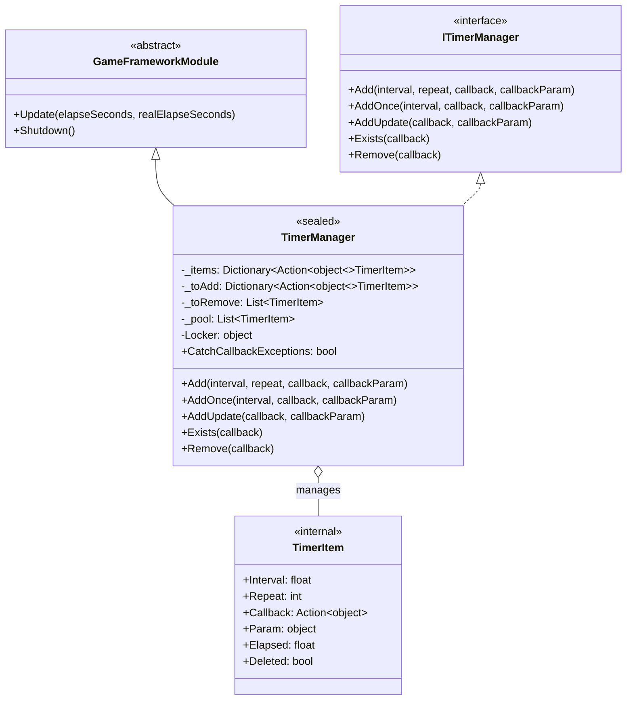
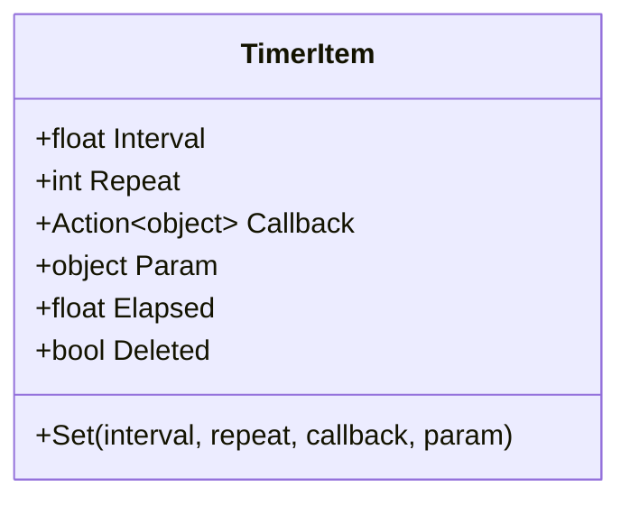

# TimerManager

TimerManager 是 GameFrameX 計時器模組的核心實現類，負責定時任務的排程與執行。它繼承自 `GameFrameworkModule` 並實現 `ITimerManager` 介面，提供精確的時間間隔控制、重複次數管理以及執行緒安全的操作機制。

## 概述

TimerManager 是整個計時器系統的核心引擎，負責在遊戲執行時管理所有定時任務的生命週期。該類採用物件池模式減少垃圾回收壓力，使用雙緩衝機制（待新增/待移除列表）確保在 Update 迴圈中安全地新增和刪除任務，同時透過鎖機制保證多執行緒環境下的執行緒安全性。

作為 GameFrameX 框架的核心模組，TimerManager 在每一幀的 Update 回呼中遍歷所有活動任務，檢查是否滿足觸發條件，並執行相應的回呼函式。它支援三種型別的定時任務：固定間隔重複任務、單次延遲任務以及每幀更新任務。

### 核心職責

- 管理定時任務的新增、移除和執行
- 維護任務執行的時間累加和觸發邏輯
- 提供物件池複用機制最佳化效能
- 保證多執行緒環境下的操作安全性

### 設計特點

TimerManager 在設計上採用了多個最佳化策略以確保高效能和穩定性。首先，物件池技術避免了頻繁建立和銷燬 TimerItem 物件，顯著減少了 GC（垃圾回收）壓力。其次，任務的雙緩衝機制允許在遍歷過程中安全地新增新任務和標記刪除任務，而不會導致集合修改異常。最後，執行緒鎖確保了在多執行緒訪問時的資料一致性。



## 核心流程

TimerManager 的核心執行流程發生在每一幀的 Update 方法中。該流程確保了定時任務能夠按照精確的時間間隔觸發，同時處理任務的動態新增和移除。

```mermaid
flowchart TD
    subgraph UpdateLoop["Update 迴圈"]
        Start([開始 Update]) --> Lock["獲取鎖 Locker"]
        Lock --> CheckItems{"_items 數量\n> 0?"}
        
        CheckItems -->|Yes| Iterate["遍歷 _items 集合"]
        CheckItems -->|No| CheckToRemove["檢查 _toRemove"]
        
        Iterate --> CheckDeleted{當前 TimerItem\n已刪除?}
        CheckDeleted -->|Yes| AddToRemove["新增到 _toRemove"]
        CheckDeleted -->|No| UpdateElapsed["累加 Elapsed"]
        
        UpdateElapsed --> CheckInterval{Elapsed \n>= Interval?}
        CheckInterval -->|No| ContinueIterate["繼續下一個"]
        CheckInterval -->|Yes| ResetElapsed["重置 Elapsed"]
        
        ResetElapsed --> CheckRepeat{Repeat \n> 0?}
        CheckRepeat -->|Yes| DecrementRepeat["Repeat--"]
        DecrementRepeat --> CheckRepeatZero{Repeat == 0?}
        CheckRepeatZero -->|Yes| MarkDeleted["標記 Deleted"]
        CheckRepeatZero -->|No| ExecuteCallback["執行回呼"]
        
        MarkDeleted --> AddToRemove
        ExecuteCallback --> ContinueIterate
        
        AddToRemove --> ContinueIterate
        
        ContinueIterate --> HasNext{"還有更多\n任務?"}
        HasNext -->|Yes| Iterate
        HasNext -->|No| CheckToRemove
        
        CheckToRemove --> ProcessRemove{"_toRemove\n數量 > 0?"}
        ProcessRemove -->|Yes| RemoveItems["移除已標記的任務\n並歸還到物件池"]
        ProcessRemove -->|No| CheckToAdd
        
        RemoveItems --> CheckToAdd
        CheckToAdd --> ProcessAdd{"_toAdd\n數量 > 0?"}
        ProcessAdd -->|Yes| AddNewItems["將新任務\n新增到 _items"]
        ProcessAdd -->|No| Release["釋放鎖"]
        ProcessAdd -->|No| End([結束 Update])
        
        AddNewItems --> Release
        Release --> End
    end
```



### 流程說明

Update 方法的執行流程分為四個主要階段。首先是任務遍歷階段，遍歷當前所有活動任務，累加每個任務的已用時間（Elapsed），檢查是否達到觸發間隔。其次是回呼執行階段，當任務滿足觸發條件時，執行其繫結的回呼函式，並根據 Repeat 引數決定是否遞減重複次數。第三是移除處理階段，將已標記為刪除的任務從集合中移除，歸還到物件池以供複用。最後是新增處理階段，將待新增佇列中的新任務合併到活動任務集合中。

這種設計確保了即使在回呼執行過程中新增或移除其他任務，也不會影響遍歷的正確性，因為實際的新增和移除操作都在遍歷結束後才執行。

## 內部類 TimerItem

TimerItem 是 TimerManager 內部的巢狀類，用於儲存單個定時任務的完整狀態資訊。每個 TimerItem 物件包含任務的執行間隔、剩餘重複次數、回呼函式、回呼引數以及內部狀態標誌。



| 屬性 | 型別 | 說明 |
|------|------|------|
| Interval | float | 任務觸發間隔，單位為秒 |
| Repeat | int | 剩餘重複次數，0 表示無限重複 |
| Callback | Action\<object\> | 任務觸發時執行的回呼函式 |
| Param | object | 傳遞給回呼函式的引數 |
| Elapsed | float | 自上次觸發以來經過的時間 |
| Deleted | bool | 標記任務是否已被刪除 |

## 使用示例

### 基本用法

以下示例展示如何新增一個簡單的重複定時任務：

```csharp
// 建立一個定時任務，每隔1秒執行一次，共執行10次
TimerManager.Instance.Add(1.0f, 10, callback: (param) => 
{
    Debug.Log($"定時任務執行，引數: {param}");
}, callbackParam: "Hello Timer");
```
> Source: [TimerManager.cs](https://github.com/GameFrameX/com.gameframex.unity.timer/blob/main/Runtime/Timer/TimerManager.cs#L156-L188)

### 單次任務用法

使用 AddOnce 方法新增一個延遲執行一次的任務：

```csharp
// 5秒後執行一次任務
TimerManager.Instance.AddOnce(5.0f, callback: (param) => 
{
    Debug.Log("任務只執行一次");
}, callbackParam: null);
```
> Source: [TimerManager.cs](https://github.com/GameFrameX/com.gameframex.unity.timer/blob/main/Runtime/Timer/TimerManager.cs#L197-L200)

### 每幀更新任務

使用 AddUpdate 方法新增每幀執行的輕量級任務：

```csharp
// 每幀執行的任務（間隔約0.001秒）
TimerManager.Instance.AddUpdate(callback: (param) => 
{
    // 每幀執行的邏輯
    transform.Rotate(Vector3.up, 10f * Time.deltaTime);
});
```
> Source: [TimerManager.cs](https://github.com/GameFrameX/com.gameframex.unity.timer/blob/main/Runtime/Timer/TimerManager.cs#L206-L219)

### 任務檢查與移除

使用 Exists 和 Remove 方法管理任務的生命週期：

```csharp
private Action<object> _myTimerCallback;

void Start()
{
    // 新增任務並儲存回呼引用
    _myTimerCallback = OnTimerTick;
    TimerManager.Instance.Add(1.0f, 5, _myTimerCallback, "test");
}

void OnTimerTick(object param)
{
    Debug.Log($"Tick: {param}");
}

// 在其他方法中檢查和移除
void StopTimer()
{
    if (TimerManager.Instance.Exists(_myTimerCallback))
    {
        TimerManager.Instance.Remove(_myTimerCallback);
        Debug.Log("任務已移除");
    }
}
```
> Source: [TimerManager.cs](https://github.com/GameFrameX/com.gameframex.unity.timer/blob/main/Runtime/Timer/TimerManager.cs#L226-L264)

## API 參考

### `TimerManager`

完整類宣告如下：

```csharp
public sealed class TimerManager : GameFrameworkModule, ITimerManager
```
> Source: [TimerManager.cs](https://github.com/GameFrameX/com.gameframex.unity.timer/blob/main/Runtime/Timer/TimerManager.cs#L12)

**繼承關係：**
- 父類：GameFrameworkModule
- 介面：ITimerManager

---

### `CatchCallbackExceptions`

```csharp
public static bool CatchCallbackExceptions = false;
```
> Source: [TimerManager.cs](https://github.com/GameFrameX/com.gameframex.unity.timer/blob/main/Runtime/Timer/TimerManager.cs#L43)

**說明：** 全域性靜態屬性，控制是否捕獲回呼函式執行過程中發生的異常。

**預設值：** false

**使用場景：**
- 當設定為 `true` 時，回呼函式執行發生異常會被捕獲並記錄警告日誌，任務會被標記為刪除
- 當設定為 `false` 時，回呼函式執行發生的異常會直接丟擲，可能導致應用程式崩潰

---

### `Add(interval, repeat, callback, callbackParam)`

```csharp
public void Add(float interval, int repeat, Action<object> callback, object callbackParam = null)
```
> Source: [TimerManager.cs](https://github.com/GameFrameX/com.gameframex.unity.timer/blob/main/Runtime/Timer/TimerManager.cs#L156-L188)

**說明：** 新增一個定時重複執行的任務。

**引數：**
| 引數名 | 型別 | 必填 | 預設值 | 說明 |
|--------|------|------|--------|------|
| interval | float | 是 | - | 任務觸發間隔時間，單位為秒 |
| repeat | int | 是 | - | 重複次數，0 表示無限重複 |
| callback | Action\<object\> | 是 | - | 任務觸發時執行的回呼函式 |
| callbackParam | object | 否 | null | 傳遞給回呼函式的引數 |

**返回型別：** void

**內部邏輯：**
1. 檢查回呼函式是否為空，為空則記錄警告日誌並返回
2. 檢查任務是否已存在，存在則更新引數並重置狀態
3. 從物件池獲取或建立新的 TimerItem
4. 將任務新增到待新增佇列，等待下一幀合併到活動集合

**異常處理：**
- 當 callback 為 null 時，記錄警告日誌但不丟擲異常

---

### `AddOnce(interval, callback, callbackParam)`

```csharp
public void AddOnce(float interval, Action<object> callback, object callbackParam = null)
```
> Source: [TimerManager.cs](https://github.com/GameFrameX/com.gameframex.unity.timer/blob/main/Runtime/Timer/TimerManager.cs#L197-L200)

**說明：** 新增一個只執行一次的定時任務。本質上是 repeat 引數為 1 的 Add 呼叫。

**引數：**
| 引數名 | 型別 | 必填 | 預設值 | 說明 |
|--------|------|------|--------|------|
| interval | float | 是 | - | 延遲時間，單位為秒 |
| callback | Action\<object\> | 是 | - | 任務觸發時執行的回呼函式 |
| callbackParam | object | 否 | null | 傳遞給回呼函式的引數 |

**返回型別：** void

**等價實現：**
```csharp
Add(interval, 1, callback, callbackParam);
```

---

### `AddUpdate(callback)`

```csharp
public void AddUpdate(Action<object> callback)
```
> Source: [TimerManager.cs](https://github.com/GameFrameX/com.gameframex.unity.timer/blob/main/Runtime/Timer/TimerManager.cs#L206-L209)

**說明：** 新增一個每幀更新執行的任務。

**引數：**
| 引數名 | 型別 | 必填 | 說明 |
|--------|------|------|------|
| callback | Action\<object\> | 是 | 每幀執行的回呼函式 |

**返回型別：** void

**等價實現：**
```csharp
Add(0.001f, 0, callback);
```

**注意：** 間隔時間設定為 0.001 秒（約等於每幀），repeat 為 0 表示無限重複。

---

### `AddUpdate(callback, callbackParam)`

```csharp
public void AddUpdate(Action<object> callback, object callbackParam)
```
> Source: [TimerManager.cs](https://github.com/GameFrameX/com.gameframex.unity.timer/blob/main/Runtime/Timer/TimerManager.cs#L216-L219)

**說明：** 新增一個每幀更新執行的任務，並傳遞引數。

**引數：**
| 引數名 | 型別 | 必填 | 說明 |
|--------|------|------|------|
| callback | Action\<object\> | 是 | 每幀執行的回呼函式 |
| callbackParam | object | 是 | 傳遞給回呼函式的引數 |

**返回型別：** void

**等價實現：**
```csharp
Add(0.001f, 0, callback, callbackParam);
```

---

### `Exists(callback)`

```csharp
public bool Exists(Action<object> callback)
```
> Source: [TimerManager.cs](https://github.com/GameFrameX/com.gameframex.unity.timer/blob/main/Runtime/Timer/TimerManager.cs#L226-L243)

**說明：** 檢查指定回呼函式的任務是否存在。

**引數：**
| 引數名 | 型別 | 必填 | 說明 |
|--------|------|------|------|
| callback | Action\<object\> | 是 | 要檢查的回呼函式 |

**返回型別：** bool

**返回說明：**
- 如果任務在待新增佇列（_toAdd）中存在，返回 true
- 如果任務在活動佇列（_items）中存在且未被標記為刪除，返回 true
- 其他情況返回 false

**執行緒安全：** 該方法內部會獲取鎖以保證執行緒安全。

---

### `Remove(callback)`

```csharp
public void Remove(Action<object> callback)
```
> Source: [TimerManager.cs](https://github.com/GameFrameX/com.gameframex.unity.timer/blob/main/Runtime/Timer/TimerManager.cs#L249-L264)

**說明：** 移除指定回呼函式對應的任務。

**引數：**
| 引數名 | 型別 | 必填 | 說明 |
|--------|------|------|------|
| callback | Action\<object\> | 是 | 要移除的回呼函式 |

**返回型別：** void

**內部邏輯：**
1. 檢查任務是否在待新增佇列中，存在則從佇列移除並歸還到物件池
2. 檢查任務是否在活動佇列中，存在則標記為 Deleted 狀態，等待下一幀移除

**注意：** 如果任務正在執行回呼過程中被移除，回呼仍會執行完成，只是之後會被清理。

---

### `Update(elapseSeconds, realElapseSeconds)`

```csharp
protected override void Update(float elapseSeconds, float realElapseSeconds)
```
> Source: [TimerManager.cs](https://github.com/GameFrameX/com.gameframex.unity.timer/blob/main/Runtime/Timer/TimerManager.cs#L45-L137)

**說明：** 框架更新方法，由 GameFrameX 框架在每幀自動呼叫。

**引數：**
| 引數名 | 型別 | 說明 |
|--------|------|------|
| elapseSeconds | float | 遊戲邏輯經過的時間（可能受時間縮放影響） |
| realElapseSeconds | float | 實際經過的真實時間 |

**返回型別：** void

**內部邏輯：**
1. 獲取鎖確保執行緒安全
2. 遍歷所有活動任務，累加時間並檢查觸發條件
3. 執行滿足條件的回呼函式
4. 處理任務刪除和新增
5. 釋放鎖

**注意：** 這是框架內部方法，通常不需要直接呼叫。

---

### `Shutdown()`

```csharp
protected override void Shutdown()
```
> Source: [TimerManager.cs](https://github.com/GameFrameX/com.gameframex.unity.timer/blob/main/Runtime/Timer/TimerManager.cs#L139-L147)

**說明：** 框架關閉方法，由 GameFrameX 框架在系統關閉時呼叫。

**返回型別：** void

**內部邏輯：**
1. 獲取鎖確保執行緒安全
2. 清空待移除佇列、待新增佇列和活動任務集合

**注意：** 這是框架內部方法，通常不需要直接呼叫。

---

### 內部方法

#### `GetFromPool()`

```csharp
private TimerItem GetFromPool()
```
> Source: [TimerManager.cs](https://github.com/GameFrameX/com.gameframex.unity.timer/blob/main/Runtime/Timer/TimerManager.cs#L266-L283)

**說明：** 從物件池獲取一個 TimerItem 例項。

**返回型別：** TimerItem

**內部邏輯：**
1. 檢查物件池中是否有可用例項
2. 如果有，複用並重置狀態
3. 如果沒有，建立新的例項

---

#### `ReturnToPool(timerItem)`

```csharp
private void ReturnToPool(TimerItem timerItem)
```
> Source: [TimerManager.cs](https://github.com/GameFrameX/com.gameframex.unity.timer/blob/main/Runtime/Timer/TimerManager.cs#L285-L289)

**說明：** 將 TimerItem 例項歸還到物件池。

**引數：**
| 引數名 | 型別 | 說明 |
|--------|------|------|
| timerItem | TimerItem | 要歸還的例項 |

**返回型別：** void

---

## 相關連結

- [TimerComponent](./5-api-reference.timer-component) - Unity 組件封裝
- [ITimerManager](./5-api-reference.itimer-manager) - 計時器介面定義
- [快速開始](./3-getting-started) - 快速入門指南
- [核心功能](./4-core-functions.add-timer) - 定時任務操作詳解
- [使用示例](./6-samples) - 更多使用案例
