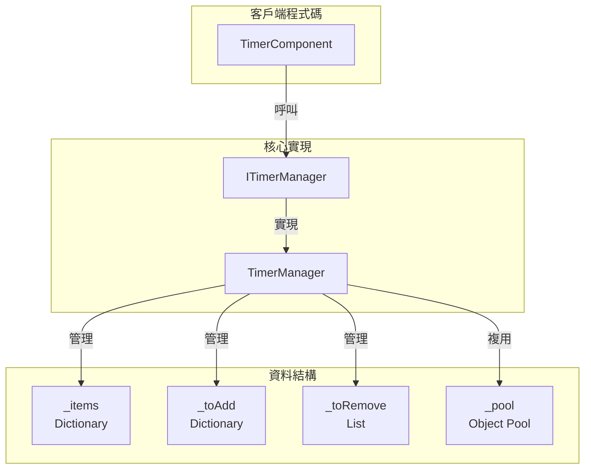
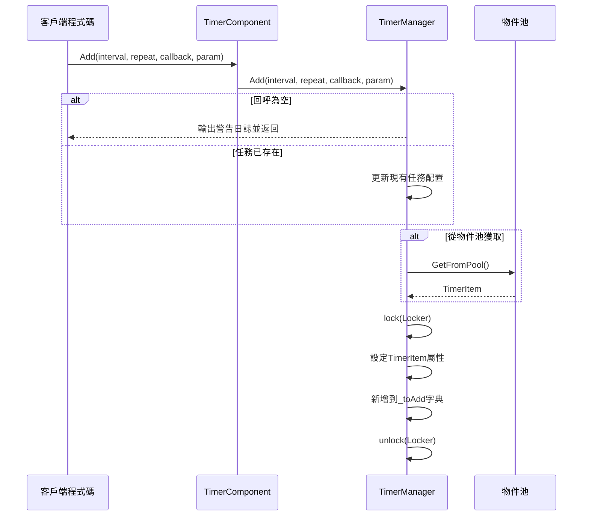
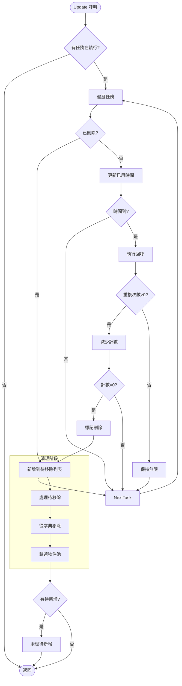

# 新增定時任務

本文件介紹如何在 GameFrameX Timer 組件中新增各類定時任務。

## 概述

Timer 組件提供了三種新增定時任務的方式：

1. **Add 方法** - 新增可重複執行的定時任務
2. **AddOnce 方法** - 新增僅執行一次的任務
3. **AddUpdate 方法** - 新增每幀執行的任務

所有任務都透過 TimerComponent 暴露給 Unity 組件使用，內部由 TimerManager 實現具體的定時邏輯。

## 核心概念

### 定時任務引數

| 引數 | 型別 | 說明 |
|------|------|------|
| interval | float | 間隔時間（秒） |
| repeat | int | 重複次數（0 表示無限重複） |
| callback | Action\<object\> | 回呼函式 |
| callbackParam | object | 傳遞給回呼的引數（可選） |

### 任務狀態管理

TimerManager 使用以下資料結構管理任務：

- `_items` - 正在執行的任務字典
- `_toAdd` - 等待新增到執行佇列的任務
- `_toRemove` - 等待移除的任務
- `_pool` - 物件池，用於複用 TimerItem 物件



## 任務新增流程



### 任務執行流程



## 使用示例

### 基本定時任務

新增一個每 1 秒執行一次，共執行 10 次的任務：

```csharp
// 透過 TimerComponent 新增定時任務
var timerComponent = gameObject.GetComponent<TimerComponent>();
timerComponent.Add(1.0f, 10, callback, null);

void callback(object param)
{
    Debug.Log("定時任務執行!");
}
```

> Source: [TimerComponent.cs](https://github.com/GameFrameX/com.gameframex.unity.timer/blob/main/Runtime/Timer/TimerComponent.cs#L37-L40)

### 無限重複任務

新增一個每 2 秒執行一次的無限迴圈任務（repeat = 0 表示無限）：

```csharp
// repeat 為 0 表示無限重複執行
timerComponent.Add(2.0f, 0, onInfiniteTick, "myData");

void onInfiniteTick(object param)
{
    string data = param as string;
    Debug.Log($"無限任務執行, 資料: {data}");
}
```

> Source: [TimerManager.cs](https://github.com/GameFrameX/com.gameframex.unity.timer/blob/main/Runtime/Timer/TimerManager.cs#L156-L188)

### 帶引數的任務

透過 callbackParam 傳遞自定義資料：

```csharp
// 傳遞複雜資料物件
var myData = new { Name = "Player", Score = 100 };
timerComponent.Add(1.0f, 5, onScoreUpdate, myData);

void onScoreUpdate(object param)
{
    var data = param as dynamic;
    Debug.Log($"玩家: {data.Name}, 分數: {data.Score}");
}
```

> Source: [TimerManager.cs](https://github.com/GameFrameX/com.gameframex.unity.timer/blob/main/Runtime/Timer/TimerManager.cs#L24-L30)

## 內部實現詳解

### TimerItem 資料結構

```csharp
class TimerItem
{
    public float Interval;      // 間隔時間
    public int Repeat;           // 剩餘重複次數
    public Action<object> Callback;  // 回呼函式
    public object Param;        // 回呼引數
    
    public float Elapsed;       // 已用時間
    public bool Deleted;        // 刪除標記
}
```

> Source: [TimerManager.cs](https://github.com/GameFrameX/com.gameframex.unity.timer/blob/main/Runtime/Timer/TimerManager.cs#L14-L31)

### 時間精度處理

TimerManager 在 Update 中處理時間累積：

```csharp
timerItem.Elapsed += realElapseSeconds;
if (timerItem.Elapsed < timerItem.Interval)
{
    continue;  // 時間未到，跳過
}

timerItem.Elapsed -= timerItem.Interval;
// 處理時間漂移：如果 elapsed 太小或太大則重置
if (timerItem.Elapsed < 0 || timerItem.Elapsed > 0.03f)
    timerItem.Elapsed = 0;
```

這種設計確保了：
- 任務在精確的間隔後執行
- 累積的時間誤差被自動修正
- 即使幀率波動也能保持相對準確

> Source: [TimerManager.cs](https://github.com/GameFrameX/com.gameframex.unity.timer/blob/main/Runtime/Timer/TimerManager.cs#L63-L71)

### 物件池機制

為減少垃圾回收壓力，TimerManager 實現了物件池：

```csharp
private TimerItem GetFromPool()
{
    if (_pool.Count > 0)
    {
        var item = _pool[_pool.Count - 1];
        _pool.RemoveAt(_pool.Count - 1);
        item.Deleted = false;
        item.Elapsed = 0;
        return item;
    }
    return new TimerItem();
}

private void ReturnToPool(TimerItem t)
{
    t.Callback = null;
    _pool.Add(t);
}
```

> Source: [TimerManager.cs](https://github.com/GameFrameX/com.gameframex.unity.timer/blob/main/Runtime/Timer/TimerManager.cs#L266-L289)

### 執行緒安全

所有對任務字典的操作都使用 lock 保護：

```csharp
private static readonly object Locker = new object();

public void Add(float interval, int repeat, Action<object> callback, object callbackParam = null)
{
    lock (Locker)
    {
        // ... 新增任務邏輯
    }
}
```

> Source: [TimerManager.cs](https://github.com/GameFrameX/com.gameframex.unity.timer/blob/main/Runtime/Timer/TimerManager.cs#L38)

## 異常處理

TimerManager 提供了靜態配置來控制回呼異常處理：

```csharp
// 預設情況下不捕獲異常，異常會直接丟擲
public static bool CatchCallbackExceptions = false;

// 開啟異常捕獲
TimerManager.CatchCallbackExceptions = true;
```

開啟後，異常會被捕獲並記錄警告日誌，任務會被自動刪除。

> Source: [TimerManager.cs](https://github.com/GameFrameX/com.gameframex.unity.timer/blob/main/Runtime/Timer/TimerManager.cs#L42-L43)

## 相關連結

- [新增單次任務](./4-core-functions.add-once) - 詳細瞭解 AddOnce 方法
- [新增幀更新任務](./4-core-functions.add-update) - 詳細瞭解 AddUpdate 方法
- [檢查和移除任務](./4-core-functions.exists-remove) - 瞭解如何檢查和移除任務
- [TimerComponent API 參考](./5-api-reference.timer-component) - 完整的 API 文件
- [ITimerManager 介面](./5-api-reference.itimer-manager) - 介面定義
- [TimerManager 實現](./5-api-reference.timer-manager) - 內部實現細節
