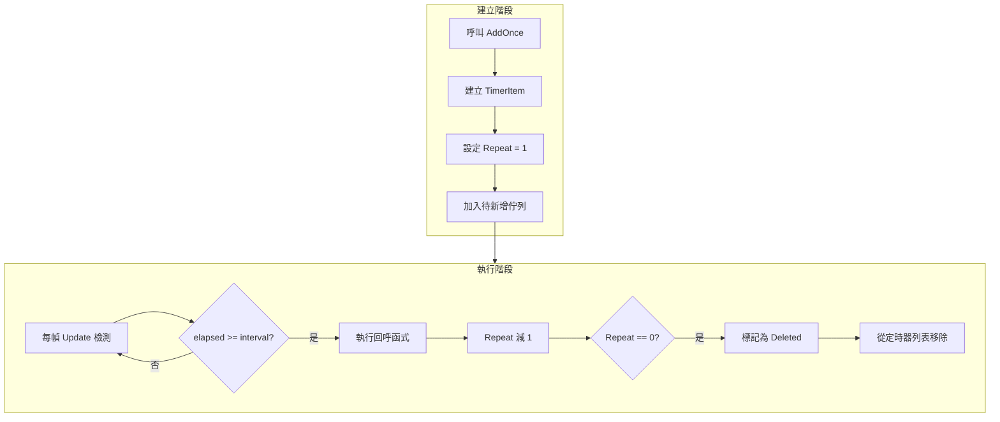

# 新增單次任務

新增單次任務功能允許開發者新增一個只執行一次的定時任務，適用於延遲執行、一次性事件觸發等場景。

## 概述

`AddOnce` 是 Timer 組件提供的核心方法之一，用於新增一個只執行一次的定時任務。該方法會在指定的延遲時間後觸發回呼函式，執行完成後自動從定時器列表中移除。

**使用場景：**
- 延遲執行某個操作（如幾秒後顯示提示）
- 一次性事件觸發（如遊戲開始倒計時）
- 延遲初始化某些組件
- 定時提醒功能

## 核心實現

`AddOnce` 方法的內部實現非常簡潔，它複用 `Add` 方法，將重複次數設定為 1：

```csharp
// TimerManager.cs 第 197-200 行
public void AddOnce(float interval, Action<object> callback, object callbackParam = null)
{
    Add(interval, 1, callback, callbackParam);
}
```

> Source: [TimerManager.cs](https://github.com/GameFrameX/com.gameframex.unity.timer/blob/main/Runtime/Timer/TimerManager.cs#L197-L200)

**設計意圖：** 透過複用 `Add` 方法，程式碼更加簡潔，同時利用已有的物件池和執行緒安全機制，減少重複程式碼和潛在 bug。

## 工作原理



## 使用示例

### 基礎用法

新增一個 3 秒後執行的任務：

```csharp
// 獲取 TimerComponent 組件
var timerComponent = GetComponent<TimerComponent>();

// 新增一個 3 秒後執行一次的任務
timerComponent.AddOnce(3f, OnTimerComplete);

// 回呼方法
private void OnTimerComplete(object param)
{
    Debug.Log("定時任務執行完成！");
}
```

> Source: [README.md](https://github.com/GameFrameX/com.gameframex.unity.timer/blob/main/README.md#L44-L52)

### 傳遞引數

可以為回呼函式傳遞自定義引數：

```csharp
// 新增帶引數的單次任務
timerComponent.AddOnce(5f, OnDelayedAction, "自定義引數");

// 回呼方法接收引數
private void OnDelayedAction(object param)
{
    string message = param as string;
    Debug.Log($"收到引數: {message}");
}
```

### 在管理器級別使用

直接使用 `ITimerManager` 介面：

```csharp
// 獲取 TimerManager 模組
var timerManager = GameFrameworkEntry.GetModule<ITimerManager>();

// 新增單次任務
timerManager.AddOnce(2f, OnManagerTimer, null);
```

> Source: [ITimerManager.cs](https://github.com/GameFrameX/com.gameframex.unity.timer/blob/main/Runtime/Timer/ITimerManager.cs#L26)

## API 參考

### `TimerComponent.AddOnce`

```csharp
public void AddOnce(float interval, Action<object> callback, object callbackParam = null)
```

**功能描述：** 新增一個只執行一次的定時任務。

**引數說明：**

| 引數 | 型別 | 必填 | 預設值 | 說明 |
|------|------|------|--------|------|
| `interval` | float | 是 | - | 延遲時間，以秒為單位 |
| `callback` | Action\<object\> | 是 | - | 任務觸發時執行的回呼函式 |
| `callbackParam` | object | 否 | null | 傳遞給回呼函式的引數 |

**呼叫示例：**

```csharp
timerComponent.AddOnce(3f, MyCallback, "test");
```

### `ITimerManager.AddOnce`

```csharp
void AddOnce(float interval, Action<object> callback, object callbackParam = null);
```

**功能描述：** 在定時器管理器級別新增單次任務。

**詳細說明：** 請參閱 [TimerComponent.AddOnce](#timercomponentaddonce) 的引數說明，兩者簽名完全一致。

> Source: [ITimerManager.cs](https://github.com/GameFrameX/com.gameframex.unity.timer/blob/main/Runtime/Timer/ITimerManager.cs#L20-L26)

## 注意事項

1. **時間單位**：引數 `interval` 的單位是**秒**（秒），而非毫秒。例如，傳入 `5f` 表示 5 秒後執行。

2. **回呼簽名**：回呼函式必須接受一個 `object` 型別的引數，即使不使用引數也必須宣告：

   ```csharp
   // 正確
   void MyCallback(object param) { }
   
   // 錯誤 - 簽名不匹配
   void MyCallback() { }
   ```

3. **自動移除**：任務執行完成後會自動從定時器列表中移除，無需手動呼叫 `Remove`。

4. **重複新增**：如果使用相同的回呼函式再次呼叫 `AddOnce`，會更新現有任務的引數（間隔時間和回呼引數）。

5. **執行緒安全**：`AddOnce` 方法內部使用了鎖機制，可以安全地在多執行緒環境中呼叫。

## 相關連結

- [新增定時任務](./4-core-functions.add-timer) - 瞭解如何新增重複執行的定時任務
- [新增幀更新任務](./4-core-functions.add-update) - 瞭解如何新增每幀執行的任務
- [檢查和移除任務](./4-core-functions.exists-remove) - 瞭解如何檢查和移除任務
- [TimerComponent API 參考](./5-api-reference.timer-component) - 完整的 TimerComponent API 文件
- [ITimerManager API 參考](./5-api-reference.itimer-manager) - 完整的 ITimerManager 介面文件
- [TimerManager API 參考](./5-api-reference.timer-manager) - 完整的 TimerManager 實現文件
