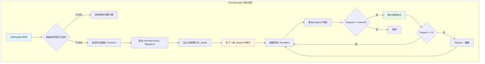
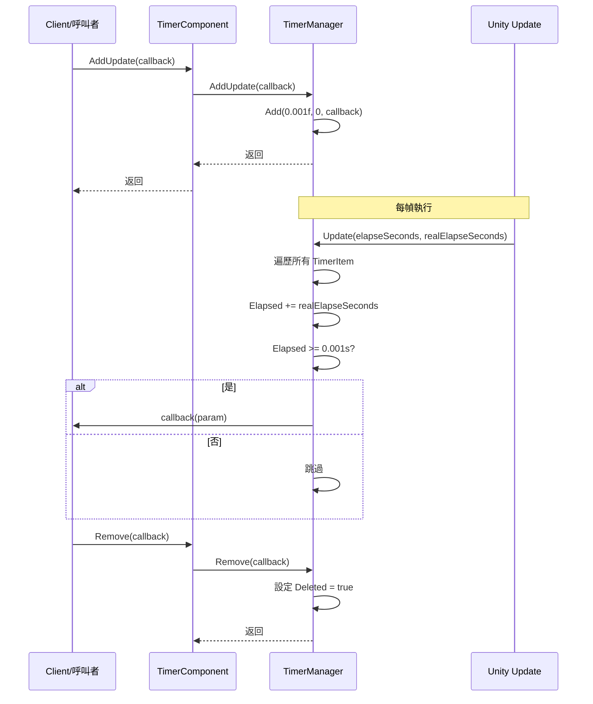

# 新增幀更新任務

新增幀更新任務是 Timer 組件的核心功能之一，用於註冊一個在每一幀都會執行的回呼函式。與定時任務和單次任務不同，幀更新任務適合需要持續高頻執行的操作，例如遊戲中的輸入檢測、動畫更新、或需要每幀都執行的邏輯。

## 概述

幀更新任務（AddUpdate）是一種特殊的定時任務，其內部實現是將間隔時間設定為極小值（0.001秒），重複次數設定為無限（0表示無限重複）。這意味著註冊的回呼函式將在 Unity 的每一幀更新中被呼叫。



### 核心特性

- **無限執行**：repeat 引數為 0，表示任務會持續執行直到手動移除
- **高頻呼叫**：每幀執行（約每 16ms 一次，取決於幀率）
- **引數支援**：支援傳遞自定義引數到回呼函式
- **重複註冊檢測**：如果相同的回呼已存在，會自動更新引數而不是建立新任務

## 工作原理

### 內部實現

幀更新任務本質上是一個特殊的定時任務，透過以下方式實現每幀執行：

> Source: [TimerManager.cs#L206-L219](https://github.com/GameFrameX/com.gameframex.unity.timer/blob/main/Runtime/Timer/TimerManager.cs#L206-L219)

```csharp
/// <summary>
/// 新增一個每幀更新執行的任務
/// </summary>
/// <param name="callback">要執行的回呼函式</param>
public void AddUpdate(Action<object> callback)
{
    Add(0.001f, 0, callback);
}

/// <summary>
/// 新增一個每幀更新執行的任務
/// </summary>
/// <param name="callback">要執行的回呼函式</param>
/// <param name="callbackParam">回呼函式的引數</param>
public void AddUpdate(Action<object> callback, object callbackParam)
{
    Add(0.001f, 0, callback, callbackParam);
}
```

核心邏輯解析：
1. **Interval = 0.001f**：設定極短的間隔時間（約1毫秒），確保每幀都能觸發
2. **Repeat = 0**：設定為0表示無限重複，任務不會自動移除
3. **Add 方法**：複用現有的定時任務新增邏輯，統一管理

### 執行流程



## 使用示例

### 基本用法

以下示例展示如何在遊戲迴圈中每幀執行一個方法：

```csharp
using GameFrameX.Timer.Runtime;
using UnityEngine;

public class PlayerController : MonoBehaviour
{
    private TimerComponent _timerComponent;
    
    private void Start()
    {
        // 獲取 TimerComponent 組件
        _timerComponent = GetComponent<TimerComponent>();
        
        // 註冊每幀執行的任務
        _timerComponent.AddUpdate(OnEveryFrame);
    }
    
    private void OnEveryFrame(object param)
    {
        // 每幀執行的邏輯
        // 例如：處理輸入、更新動畫狀態等
        Debug.Log("每幀執行");
    }
    
    private void OnDestroy()
    {
        // 移除幀更新任務，避免記憶體洩漏
        if (_timerComponent != null)
        {
            _timerComponent.Remove(OnEveryFrame);
        }
    }
}
```

### 傳遞引數的用法

如果需要在回呼中傳遞自定義引數，可以使用帶引數的過載：

```csharp
public class GameManager : MonoBehaviour
{
    private TimerComponent _timerComponent;
    private int _frameCount = 0;
    
    private void Start()
    {
        _timerComponent = GetComponent<TimerComponent>();
        
        // 傳遞當前物件作為引數
        _timerComponent.AddUpdate(OnUpdateWithParam, this);
    }
    
    private void OnUpdateWithParam(object param)
    {
        // 將引數轉換回原始型別
        var gameManager = param as GameManager;
        if (gameManager != null)
        {
            gameManager._frameCount++;
            if (gameManager._frameCount % 60 == 0)
            {
                Debug.Log($"已執行 {gameManager._frameCount} 幀");
            }
        }
    }
}
```

### 使用 Lambda 表示式

對於簡單的邏輯，可以使用 Lambda 表示式簡化程式碼：

```csharp
private TimerComponent _timerComponent;

private void Start()
{
    _timerComponent = GetComponent<TimerComponent>();
    
    // 使用 Lambda 表示式
    _timerComponent.AddUpdate(param => 
    {
        var deltaTime = (float)param;
        // 執行基於幀的邏輯
    }, Time.deltaTime);
}
```

### 檢查任務是否存在

在新增幀更新任務前，可以先檢查是否已存在相同的回呼：

```csharp
private void Start()
{
    _timerComponent = GetComponent<TimerComponent>();
    
    // 檢查任務是否存在
    if (!_timerComponent.Exists(OnEveryFrame))
    {
        _timerComponent.AddUpdate(OnEveryFrame);
    }
}

private void OnEveryFrame(object param)
{
    // 業務邏輯
}
```

## API 參考

### `TimerComponent.AddUpdate`

> See [TimerComponent API Reference](./5-api-reference.timer-component) for full details

### `ITimerManager.AddUpdate`

> See [ITimerManager API Reference](./5-api-reference.itimer-manager) for full details

### `TimerManager.AddUpdate`

> See [TimerManager API Reference](./5-api-reference.timer-manager) for full details

## 注意事項

1. **效能考慮**：每幀執行的回呼應當保持簡潔，避免執行耗時操作
2. **及時移除**：當不再需要幀更新任務時，必須呼叫 `Remove()` 方法手動移除，否則會導致記憶體洩漏和持續的效能消耗
3. **重複註冊**：系統會自動處理重複註冊（更新現有任務引數），但建議在新增前使用 `Exists()` 檢查
4. **幀率依賴**：任務的執行頻率依賴於遊戲的幀率，在低幀率情況下執行頻率會降低

## 最佳實踐

| 場景 | 推薦做法 |
|------|----------|
| 輸入檢測 | 使用 AddUpdate，每幀檢查輸入狀態 |
| 動畫狀態機 | 使用 AddUpdate，更新動畫引數 |
| 長時間執行的任務 | 定期檢查並適時呼叫 Remove() |
| 條件觸發 | 結合 Exists() 方法管理任務生命週期 |

## 相關連結

- [新增定時任務](./4-core-functions.add-timer)
- [新增單次任務](./4-core-functions.add-once)
- [檢查和移除任務](./4-core-functions.exists-remove)
- [TimerComponent API 參考](./5-api-reference.timer-component)
- [ITimerManager API 參考](./5-api-reference.itimer-manager)
- [TimerManager API 參考](./5-api-reference.timer-manager)
