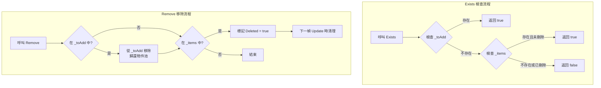

# 檢查和移除任務

在 Timer 計時器組件中，除了新增定時任務外，還提供了檢查任務是否存在以及移除任務的功能。這些功能對於動態管理定時任務、避免重複新增或在特定條件下取消任務非常有用。

## 概述

TimerComponent 提供了兩個核心方法用於檢查和移除任務：

- **Exists** - 檢查指定回呼函式對應的任務是否存在
- **Remove** - 移除（取消）指定回呼函式對應的任務

這兩個方法都透過回呼函式的引用（`Action<object>`）來標識和操作任務，因此需要確保傳入的是同一個委託例項。

## 核心功能

### 檢查任務是否存在

`Exists` 方法用於檢查指定的回呼函式是否對應一個有效的定時任務。

```csharp
public bool Exists(Action<object> callback)
```

**實現原理：**

> Source: [TimerManager.cs](https://github.com/GameFrameX/com.gameframex.unity.timer/blob/main/Runtime/Timer/TimerManager.cs#L226-L243)

```csharp
public bool Exists(Action<object> callback)
{
    lock (Locker)
    {
        // 第一步：檢查待新增列表
        if (_toAdd.ContainsKey(callback))
        {
            return true;
        }

        // 第二步：檢查活躍任務列表
        if (_items.TryGetValue(callback, out var at))
        {
            // 只有未被標記為刪除的任務才視為存在
            return !at.Deleted;
        }

        return false;
    }
}
```

**檢查邏輯說明：**

1. **待新增列表（`_toAdd`）**：檢查任務是否在等待新增佇列中剛建立但尚未生效
2. **活躍任務列表（`_items`）**：檢查任務是否在當前活躍的任務列表中
3. **刪除標記（`Deleted`）**：只有未被標記為刪除的任務才返回 true

### 移除指定任務

`Remove` 方法用於移除（取消）指定的定時任務。該方法採用延遲刪除機制，不會立即從字典中移除，而是在下一幀 Update 時清理。

```csharp
public void Remove(Action<object> callback)
```

**實現原理：**

> Source: [TimerManager.cs](https://github.com/GameFrameX/com.gameframex.unity.timer/blob/main/Runtime/Timer/TimerManager.cs#L249-L264)

```csharp
public void Remove(Action<object> callback)
{
    lock (Locker)
    {
        // 如果任務還在待新增佇列中，直接取消並歸還到物件池
        if (_toAdd.TryGetValue(callback, out var t))
        {
            _toAdd.Remove(callback);
            ReturnToPool(t);
        }

        // 如果任務已在活躍列表中，標記為刪除
        if (_items.TryGetValue(callback, out t))
        {
            t.Deleted = true;
        }
    }
}
```

**移除邏輯說明：**

1. **待新增佇列**：如果任務尚未開始執行（還在 `_toAdd` 中），直接從佇列中移除並歸還物件池
2. **活躍列表**：如果任務正在活躍列表中執行，將其標記為 `Deleted = true`
3. **延遲清理**：在下一幀 `Update()` 迴圈中，會自動清理所有被標記為 Deleted 的任務

## 工作流程圖



## 使用示例

### 基本用法

```csharp
using GameFrameX.Timer.Runtime;
using UnityEngine;

public class TimerExample : MonoBehaviour
{
    private TimerComponent _timer;

    private void Start()
    {
        _timer = GetComponent<TimerComponent>();

        // 定義一個回呼方法
        void OnTick(object param)
        {
            Debug.Log($"Tick at {Time.time}");
        }

        // 新增一個定時任務，每秒執行一次
        _timer.Add(1.0f, 0, OnTick);

        // 檢查任務是否存在
        bool exists = _timer.Exists(OnTick);
        Debug.Log($"任務是否存在: {exists}"); // 輸出: True

        // 移除任務
        _timer.Remove(OnTick);

        // 再次檢查
        exists = _timer.Exists(OnTick);
        Debug.Log($"任務是否存在: {exists}"); // 輸出: False
    }
}
```

> Source: [TimerComponent.cs](https://github.com/GameFrameX/com.gameframex.unity.timer/blob/main/Runtime/Timer/TimerComponent.cs#L72-L89)

### 動態管理任務

在實際應用中，可能需要根據遊戲狀態動態新增和移除任務：

```csharp
public class GameTimerManager : MonoBehaviour
{
    private TimerComponent _timer;
    private Action<object> _gameLoopTask;

    private void Start()
    {
        _timer = GetComponent<TimerComponent>();
        _gameLoopTask = OnGameLoop;
    }

    // 暫停遊戲時停止迴圈任務
    public void PauseGame()
    {
        if (_timer.Exists(_gameLoopTask))
        {
            _timer.Remove(_gameLoopTask);
            Debug.Log("遊戲迴圈任務已暫停");
        }
    }

    // 恢復遊戲時重新開始迴圈任務
    public void ResumeGame()
    {
        if (!_timer.Exists(_gameLoopTask))
        {
            _timer.AddUpdate(_gameLoopTask);
            Debug.Log("遊戲迴圈任務已恢復");
        }
    }

    private void OnGameLoop(object param)
    {
        // 遊戲迴圈邏輯
    }
}
```

### Lambda 表示式的注意事項

使用 Lambda 表示式時需要特別注意，每次 Lambda 表示式都會建立新的委託例項，導致無法正確匹配和移除任務：

```csharp
// ❌ 錯誤示例：Lambda 表示式每次建立新例項
_timer.Add(1.0f, 5, (param) => Debug.Log("Tick"));
_timer.Exists((param) => Debug.Log("Tick")); // 返回 False，因為是不同的委託例項
_timer.Remove((param) => Debug.Log("Tick"));  // 無法移除，因為是不同的委託例項

// ✅ 正確示例：使用具名方法或儲存委託引用
Action<object> myTick = (param) => Debug.Log("Tick");
_timer.Add(1.0f, 5, myTick);
_timer.Exists(myTick);  // 返回 True
_timer.Remove(myTick);   // 正確移除
```

## 執行緒安全性

`Exists` 和 `Remove` 方法都使用 `lock (Locker)` 來保證執行緒安全。由於 TimerManager 的 Update 方法也在鎖內執行操作，這些方法可以安全地在任何執行緒上呼叫。

> Source: [TimerManager.cs](https://github.com/GameFrameX/com.gameframex.unity.timer/blob/main/Runtime/Timer/TimerManager.cs#L38)

```csharp
private static readonly object Locker = new object();
```

## API 參考

### TimerComponent

#### `Exists(callback: Action<object>): bool`

檢查指定的任務是否存在。

**引數：**
- `callback` (`Action<object>`): 要檢查的回呼函式

**返回：** 
- `bool`: 任務存在且未標記為刪除時返回 true，否則返回 false

#### `Remove(callback: Action<object>): void`

移除指定的任務。

**引數：**
- `callback` (`Action<object>`): 要移除的回呼函式

**說明：**
- 如果任務在待新增佇列中，會被立即移除
- 如果任務在活躍列表中，會被標記為刪除，在下一幀清理

### ITimerManager

> Source: [ITimerManager.cs](https://github.com/GameFrameX/com.gameframex.unity.timer/blob/main/Runtime/Timer/ITimerManager.cs#L41-L52)

介面定義完全相同：

```csharp
bool Exists(Action<object> callback);
void Remove(Action<object> callback);
```

## 常見問題

### 為什麼 Remove 後 Exists 仍返回 true？

如果在 Remove 呼叫後立即呼叫 Exists，可能仍返回 true，因為：
1. 任務被標記為 Deleted，但尚未在下一幀 Update 中清理
2. 解決方案：在 Remove 後等待一幀，或使用其他機制確認

### Lambda 表示式無法匹配任務怎麼辦？

如前所述，每次 Lambda 表示式會建立新的委託例項。解決方案是：
1. 使用具名方法代替 Lambda
2. 儲存委託引用並複用

### 多次呼叫 Remove 會出問題嗎？

不會。Remove 方法設計為冪等操作，多次呼叫不會產生錯誤。如果任務不存在，方法會靜默返回。

## 相關連結

- [Timer 組件介紹](../1-overview.introduction)
- [功能特性](../1-overview.features)
- [新增定時任務](./4-core-functions.add-timer)
- [新增單次任務](./4-core-functions.add-once)
- [新增幀更新任務](./4-core-functions.add-update)
- [API 參考 - TimerComponent](./5-api-reference.timer-component)
- [API 參考 - ITimerManager](./5-api-reference.itimer-manager)
