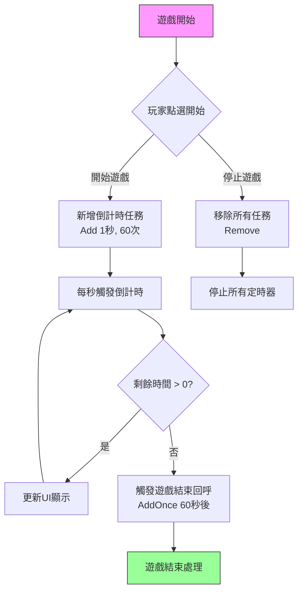

# 使用示例

本章節提供 Timer 計時器組件的完整使用示例，展示如何在 Unity 專案中實際應用各種定時任務功能。

## 概述

Timer 組件提供了一套完整的定時任務解決方案，支援以下幾種定時模式：
- **迴圈定時任務**：按固定間隔重複執行
- **單次定時任務**：延遲指定時間後執行一次
- **幀更新任務**：每幀執行一次，適用於需要持續監控的場景

這些示例基於實際的原始碼編寫，可以直接在你的專案中使用。

## 基礎使用示例

### 新增迴圈定時任務

以下示例展示如何建立一個每間隔 1 秒執行一次，總共執行 5 次的定時任務：

```csharp
using GameFrameX.Timer.Runtime;
using UnityEngine;

public class TimerExample : MonoBehaviour
{
    private TimerComponent _timerComponent;

    private void Start()
    {
        // 獲取 TimerComponent 組件
        _timerComponent = GetComponent<TimerComponent>();
        
        // 新增定時任務：間隔1秒，執行5次
        _timerComponent.Add(1f, 5, OnTimerTick, "Hello Timer");
    }

    private void OnTimerTick(object param)
    {
        Debug.Log($"定時任務觸發，引數: {param}");
    }
}
```
> Source: [TimerComponent.cs](https://github.com/GameFrameX/com.gameframex.unity.timer/blob/main/Runtime/Timer/TimerComponent.cs#L37-L40)

### 新增單次定時任務

使用 `AddOnce` 方法新增延遲執行一次的任務：

```csharp
using GameFrameX.Timer.Runtime;
using UnityEngine;

public class DelayedTaskExample : MonoBehaviour
{
    private TimerComponent _timerComponent;

    private void Start()
    {
        _timerComponent = GetComponent<TimerComponent>();
        
        // 5秒後執行一次
        _timerComponent.AddOnce(5f, OnDelayedExecute, "延遲任務完成");
    }

    private void OnDelayedExecute(object param)
    {
        Debug.Log($"延遲任務執行: {param}");
        // 可以在這裡執行延遲後的邏輯，如顯示結算介面等
    }
}
```
> Source: [TimerComponent.cs](https://github.com/GameFrameX/com.gameframex.unity.timer/blob/main/Runtime/Timer/TimerComponent.cs#L48-L51)

### 新增幀更新任務

使用 `AddUpdate` 新增每幀執行的任務：

```csharp
using GameFrameX.Timer.Runtime;
using UnityEngine;

public class FrameUpdateExample : MonoBehaviour
{
    private TimerComponent _timerComponent;
    private int _frameCount = 0;

    private void Start()
    {
        _timerComponent = GetComponent<TimerComponent>();
        
        // 每幀執行一次任務
        _timerComponent.AddUpdate(OnFrameUpdate, null);
    }

    private void OnFrameUpdate(object param)
    {
        _frameCount++;
        if (_frameCount % 60 == 0) // 每60幀列印一次
        {
            Debug.Log($"已執行 {_frameCount} 幀");
        }
    }
}
```
> Source: [TimerComponent.cs](https://github.com/GameFrameX/com.gameframex.unity.timer/blob/main/Runtime/Timer/TimerComponent.cs#L57-L70)

## 檢查和移除任務

### 檢查任務是否存在

在實際應用中，可能需要檢查某個定時任務是否仍在執行：

```csharp
using GameFrameX.Timer.Runtime;
using UnityEngine;

public class CheckTimerExample : MonoBehaviour
{
    private TimerComponent _timerComponent;
    private Action<object> _myTimerCallback;

    private void Start()
    {
        _timerComponent = GetComponent<TimerComponent>();
        
        // 儲存回呼引用以便後續檢查
        _myTimerCallback = OnTimerTick;
        
        // 新增定時任務
        _timerComponent.Add(1f, 10, _myTimerCallback, null);
        
        // 檢查任務是否存在
        bool exists = _timerComponent.Exists(_myTimerCallback);
        Debug.Log($"任務是否存在: {exists}");
    }

    private void OnTimerTick(object param)
    {
        Debug.Log("定時任務執行中...");
    }
}
```
> Source: [TimerComponent.cs](https://github.com/GameFrameX/com.gameframex.unity.timer/blob/main/Runtime/Timer/TimerComponent.cs#L77-L80)

### 移除指定任務

可以透過回呼函式引用來移除定時任務：

```csharp
using GameFrameX.Timer.Runtime;
using UnityEngine;

public class RemoveTimerExample : MonoBehaviour
{
    private TimerComponent _timerComponent;
    private Action<object> _repeatTimerCallback;
    private bool _shouldStop = false;

    private void Start()
    {
        _timerComponent = GetComponent<TimerComponent>();
        
        // 建立需要移除的回呼
        _repeatTimerCallback = OnRepeatTick;
        
        // 新增無限重複的定時任務
        _timerComponent.Add(1f, 0, _repeatTimerCallback, null);
        
        // 10秒後移除任務
        _timerComponent.AddOnce(10f, OnStopTimer, null);
    }

    private void OnRepeatTick(object param)
    {
        if (_shouldStop) return;
        Debug.Log("重複任務執行中...");
    }

    private void OnStopTimer(object param)
    {
        _shouldStop = true;
        // 移除定時任務
        _timerComponent.Remove(_repeatTimerCallback);
        Debug.Log("定時任務已移除");
    }
}
```
> Source: [TimerComponent.cs](https://github.com/GameFrameX/com.gameframex.unity.timer/blob/main/Runtime/Timer/TimerComponent.cs#L86-L89)

## 完整使用示例

以下是一個更完整的示例，展示如何在遊戲開發中實際應用 Timer 組件：

```csharp
using GameFrameX.Timer.Runtime;
using UnityEngine;
using UnityEngine.UI;

public class GameTimerController : MonoBehaviour
{
    [Header("UI 組件")]
    public Text timerText;
    public Button startButton;
    public Button stopButton;

    private TimerComponent _timerComponent;
    private int _remainingSeconds;
    private Action<object> _countdownCallback;
    private Action<object> _gameOverCallback;

    private void Awake()
    {
        _timerComponent = GetComponent<TimerComponent>();
        
        // 初始化回呼引用
        _countdownCallback = OnCountdownTick;
        _gameOverCallback = OnGameOver;
    }

    private void Start()
    {
        // 繫結按鈕事件
        startButton.onClick.AddListener(StartGame);
        stopButton.onClick.AddListener(StopGame);
        
        UpdateTimerDisplay(0);
    }

    private void StartGame()
    {
        // 倒計時：每秒執行一次，共60秒
        _remainingSeconds = 60;
        _timerComponent.Add(1f, 60, _countdownCallback, null);
        
        // 遊戲結束時觸發
        _timerComponent.AddOnce(60f, _gameOverCallback, "時間到！");
    }

    private void StopGame()
    {
        // 停止所有定時任務
        _timerComponent.Remove(_countdownCallback);
        _timerComponent.Remove(_gameOverCallback);
        Debug.Log("遊戲已停止");
    }

    private void OnCountdownTick(object param)
    {
        _remainingSeconds--;
        UpdateTimerDisplay(_remainingSeconds);
    }

    private void OnGameOver(object param)
    {
        Debug.Log(param);
        UpdateTimerDisplay(0);
        // 遊戲結束處理邏輯
    }

    private void UpdateTimerDisplay(int seconds)
    {
        if (timerText != null)
        {
            int minutes = seconds / 60;
            int secs = seconds % 60;
            timerText.text = $"{minutes:D2}:{secs:D2}";
        }
    }
}
```

### 任務流程圖



## 異常處理

TimerManager 提供了全域性異常捕獲功能，可以防止定時任務中的異常導致遊戲崩潰：

```csharp
using GameFrameX.Timer.Runtime;
using UnityEngine;

public class ExceptionHandlingExample : MonoBehaviour
{
    private TimerComponent _timerComponent;

    private void Start()
    {
        _timerComponent = GetComponent<TimerComponent>();
        
        // 啟用異常捕獲
        TimerManager.CatchCallbackExceptions = true;
        
        // 新增可能會丟擲異常的定時任務
        _timerComponent.Add(2f, 3, OnRiskyTask, null);
    }

    private void OnRiskyTask(object param)
    {
        // 模擬可能發生的異常
        if (Random.value > 0.5f)
        {
            throw new System.Exception("模擬的定時任務異常");
        }
        Debug.Log("任務安全執行");
    }
}
```
> Source: [TimerManager.cs](https://github.com/GameFrameX/com.gameframex.unity.timer/blob/main/Runtime/Timer/TimerManager.cs#L43)

## 傳遞引數示例

所有定時任務都支援傳遞引數，可以在回呼中接收：

```csharp
using GameFrameX.Timer.Runtime;
using UnityEngine;

public class ParameterExample : MonoBehaviour
{
    private TimerComponent _timerComponent;

    private void Start()
    {
        _timerComponent = GetComponent<TimerComponent>();
        
        // 傳遞自定義引數物件
        var gameData = new GameTimerData 
        { 
            levelId = 1, 
            score = 1000 
        };
        
        _timerComponent.Add(1f, 5, OnGameTimerTick, gameData);
    }

    private void OnGameTimerTick(object param)
    {
        if (param is GameTimerData data)
        {
            Debug.Log($"關卡: {data.levelId}, 分數: {data.score}");
            data.score += 100;
        }
    }
}

public class GameTimerData
{
    public int levelId;
    public int score;
}
```
> Source: [TimerComponent.cs](https://github.com/GameFrameX/com.gameframex.unity.timer/blob/main/Runtime/Timer/TimerComponent.cs#L37-L40)

## 使用場景彙總

| 場景 | 推薦方法 | 說明 |
|------|----------|------|
| 定時重新整理資料 | Add | 按固定間隔迴圈執行 |
| 延遲執行 | AddOnce | 延遲指定時間後執行一次 |
| 每幀檢測 | AddUpdate | 適用於輸入檢測、狀態監控 |
| 倒計時功能 | Add + AddOnce | 迴圈顯示倒計時，結束時觸發結束回呼 |
| 技能冷卻 | Add | 週期性檢查冷卻時間 |
| 動畫播放 | AddOnce | 延遲播放或序列幀動畫 |

## 相關連結

- [Timer 組件介紹](../1-overview.introduction)
- [功能特性](../1-overview.features)
- [新增定時任務](../4-core-functions.add-timer)
- [新增單次任務](../4-core-functions.add-once)
- [新增幀更新任務](../4-core-functions.add-update)
- [檢查和移除任務](../4-core-functions.exists-remove)
- [TimerComponent API 參考](../5-api-reference.timer-component)
- [ITimerManager API 參考](../5-api-reference.itimer-manager)
- [TimerManager API 參考](../5-api-reference.timer-manager)
- [常見問題](../7-troubleshooting)
