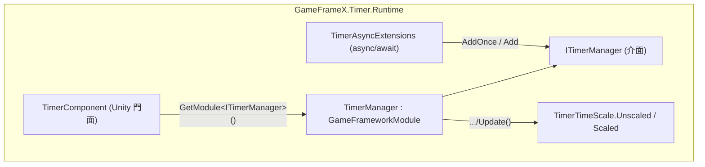

# 概述：GameFrameX Timer 能做什麼

GameFrameX Timer 是 Unity 的輕量級計時器/任務排程模組：一行程式碼即可註冊延遲呼叫、迴圈呼叫、每幀更新與 async/await 等待，支援依 ID/回呼/標籤管理生命週期，並提供暫停/恢復、剩餘時間查詢與 timeScale 相容模式。執行階段核心由 `TimerManager`(模組實作)、`TimerComponent`(Unity 元件門面)與 `TimerAsyncExtensions`(async 擴充)組成。

## 快速開始

1. 確認專案已安裝本套件(`com.gameframex.unity.timer`),組件為 `GameFrameX.Timer.Runtime`。
2. 場景中已有 GameFrameX 基礎元件時，`TimerComponent` 會透過 `GameFrameworkEntry.GetModule<ITimerManager>()` 自動取得管理器；也可在選單 `GameFrameX/Timer` 手動掛載(標記了 `[DisallowMultipleComponent]`,場景中僅允許一個)。

   ```csharp
   // TimerComponent.Awake 的裝配邏輯
   [DisallowMultipleComponent]
   [AddComponentMenu("GameFrameX/Timer")]
   [GameFrameXAutoComponent(-5000)]
   public class TimerComponent : GameFrameworkComponent
   {
       ITimerManager _timerManager;

       protected override void Awake()
       {
           ImplementationComponentType = Utility.Assembly.GetType(componentType);
           InterfaceComponentType = typeof(ITimerManager);
           base.Awake();
           _timerManager = GameFrameworkEntry.GetModule<ITimerManager>();
           if (_timerManager == null)
           {
               Log.Fatal("Timer manager is invalid.");
               return;
           }
       }
   }
   ```

   Source: [Runtime/Timer/TimerComponent.cs](https://github.com/GameFrameX/com.gameframex.unity.timer/blob/main/Runtime/Timer/TimerComponent.cs#L12-L31)

3. 在業務腳本中取得 `TimerComponent`,註冊第一個計時器：

   ```csharp
   // 3 秒後執行一次,並攜帶一個參數
   int id = timerComponent.AddOnce(3f, param => Debug.Log($"done: {param}"), "hello");

   // 每 1 秒重複 5 次,帶標籤便於批次管理;Unscaled 表示不受 Time.timeScale 影響
   timerComponent.Add(1f, 5, _ => Debug.Log("tick"), null, "battle", TimerTimeScale.Unscaled, onComplete: () => Debug.Log("finished"));
   ```

4. 視需要管理計時器：

   ```csharp
   timerComponent.Pause(id);      // 暫停(期間不累積時間)
   timerComponent.Resume(id);     // 恢復
   float left = timerComponent.GetRemaining(id); // 剩餘秒數,不存在回傳 -1
   timerComponent.Remove(id);     // 依 ID 移除
   timerComponent.RemoveByTag("battle"); // 依標籤批次移除
   ```

   以上 API 均為 `TimerComponent` 上的真實簽章，如 `public int Add(float interval, int repeat, Action<object> callback, object callbackParam = null, string tag = null, TimerTimeScale timeScale = TimerTimeScale.Unscaled, Action onComplete = null)`,見 [Runtime/Timer/TimerComponent.cs](https://github.com/GameFrameX/com.gameframex.unity.timer/blob/main/Runtime/Timer/TimerComponent.cs#L44-L69)。

## 能力速查

| 能力 | 入口 API | 說明 |
|------|----------|------|
| 延遲一次 | `AddOnce(interval, callback, callbackParam)` | 時間到時執行一次後自動移除 |
| 迴圈呼叫 | `Add(interval, repeat, callback, ...)` | `repeat = 0` 表示無限重複 |
| 每幀更新 | `AddUpdate(callback)` / `AddUpdate(callback, callbackParam)` | interval 視為 0,每幀觸發 |
| async 等待 | `WaitForSecondsAsync` / `WaitForNextFrameAsync` / `WaitForFramesAsync` | 主執行緒完成，支援 `CancellationToken` |
| 暫停/恢復 | `Pause(id)` / `Resume(id)` / `IsPaused(id)` | 也可依標籤:`PauseByTag` / `ResumeByTag` |
| 查詢狀態 | `Exists(id|callback)` / `HasTag(tag)` / `GetRemaining` / `GetElapsed` / `GetRepeatLeft` | 計時器不存在時數值回傳 `-1` |
| 批次移除 | `Remove(id|callback)` / `RemoveByTag(tag)` | 完成時觸發 `onComplete` |
| 時間縮放 | `TimerTimeScale.Unscaled` / `Scaled` | 預設為 `Unscaled`(不受 `Time.timeScale` 影響) |

## 運作原理速覽



每幀 `TimerManager.Update(elapseSeconds, realElapseSeconds)` 在鎖內遍歷計時器項：依 `TimeScaleMode` 選擇 `elapseSeconds`(Scaled)或 `realElapseSeconds`(Unscaled)累加;`interval <= 0` 的項視為每幀觸發；到期項的回呼先收集到 `_pendingCallbacks` 清單再統一派發，避免在遍歷字典時修改集合。資料結構上用 `Dictionary<Action<object>, TimerItem>` 存放活動項目、`Dictionary<int, Action<object>>` 做 ID 映射、`Dictionary<string, List<int>>` 做標籤索引，並以 `Stack<TimerItem>` 池化方式重複使用項目，見 [Runtime/Timer/TimerManager.cs](https://github.com/GameFrameX/com.gameframex.unity.timer/blob/main/Runtime/Timer/TimerManager.cs#L42-L49)。

`TimerTimeScale` 是一個兩值列舉，`Unscaled = 0` 為預設值，與既有行為相容;`Scaled = 1` 才受 `UnityEngine.Time.timeScale` 影響，見 [Runtime/Timer/TimerTimeScale.cs](https://github.com/GameFrameX/com.gameframex.unity.timer/blob/main/Runtime/Timer/TimerTimeScale.cs#L6-L13)。

## 接下來

- 建立/移除/暫停計時器的完整參數說明與常見變體，見任務頁《如何使用計時器》。
- async/await 用法(`WaitForSecondsAsync` 等三個擴充的實作見 [Runtime/Timer/TimerAsyncExtensions.cs](https://github.com/GameFrameX/com.gameframex.unity.timer/blob/main/Runtime/Timer/TimerAsyncExtensions.cs#L20-L37))。
- 計時器不觸發、回呼參數遺失等問題的疑難排解，見疑難排解頁《計時器不工作怎麼辦》。
- 編輯器擴充(Inspector 除錯檢視)見 [Editor/Inspector/TimerComponentInspector.cs](https://github.com/GameFrameX/com.gameframex.unity.timer/blob/main/Editor/Inspector/TimerComponentInspector.cs)。
- 版本歷史見 [CHANGELOG.md](https://github.com/GameFrameX/com.gameframex.unity.timer/blob/main/CHANGELOG.md)。