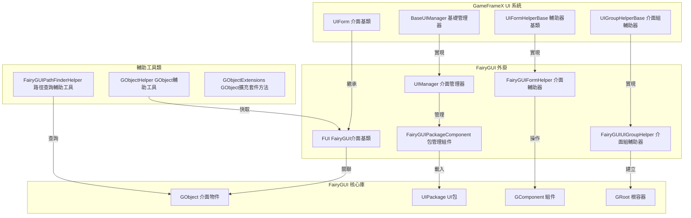

# 外掛介紹

GameFrameX 的 UI FairyGUI 組件是 GameFrameX 框架的官方 UI 擴充套件外掛，專門為 Unity 專案提供 FairyGUI 介面系統的整合支援。該外掛封裝了 FairyGUI 的核心功能，使其能夠無縫接入 GameFrameX 的 UI 管理子系統，實現介面的載入、顯示、隱藏、層級管理等完整生命週期管理。

## 概述

FairyGUI 是一款功能強大的 Unity 跨平臺 UI 編輯器，相比傳統的程式碼編寫 UI 方式，FairyGUI 提供了視覺化的 UI 編輯器，支援多平臺匯出（iOS、Android、Windows、Web 等），並且具有高效能的渲染效率。GameFrameX UI FairyGUI 組件在此基礎上，提供了與 GameFrameX 框架其他模組（如資源管理、事件系統、物件池等）的深度整合，使開發者能夠更高效地開發基於 FairyGUI 的遊戲介面。

該外掛的核心設計理念是將 FairyGUI 的介面物件（GObject）與 GameFrameX 的介面抽象（IUIForm）進行橋接，既保留了 FairyGUI 強大的 UI 編輯能力，又充分利用了 GameFrameX 框架提供的統一介面管理機制。透過本外掛，開發者可以實現介面的非同步載入、物件池複用、自動資源釋放、介面組層級管理等功能。

## 架構設計



如上圖所示，外掛的架構設計遵循了清晰的層次劃分。最上層是 GameFrameX 框架定義的 UI 系統介面層，包括介面基類、介面管理器基類、介面輔助器基類和介面組輔助器基類。這些抽象介面定義了 UI 系統的標準行為和擴充套件點。

中間層是 FairyGUI 外掛的具體實現層。`FUI` 類繼承自 GameFrameX 的 `UIForm` 基類，實現了 FairyGUI 特定的介面功能；`UIManager` 繼承自 `BaseUIManager`，實現了介面的開啟和關閉邏輯；`FairyGUIFormHelper` 繼承自 `UIFormHelperBase`，負責介面的例項化、建立和釋放；`FairyGUIUIGroupHelper` 繼承自 `UIGroupHelperBase`，負責介面組的建立和深度管理。

最底層是 FairyGUI 的核心庫，包括 GObject、UIPackage、GComponent 和 GRoot 等類，這些是 FairyGUI 提供的底層 UI 物件和容器。外掛透過與這些底層類的互動，實現了完整的 UI 功能。

此外，外掛還提供了多個輔助工具類，包括 `GObjectHelper`（用於 FUI 物件的快取和管理）、`FairyGUIPathFinderHelper`（用於 UI 物件路徑的查詢和解析）和 `GObjectExtensions`（GObject 的擴充套件方法）。

## 核心組件

### FUI 介面基類

`FUI` 是所有 FairyGUI 介面的基類，繼承自 GameFrameX 的 `UIForm` 基類。它封裝了 FairyGUI 的 GObject，提供了介面顯示、隱藏、可見性狀態管理等核心功能。

```csharp
public class FUI : UIForm
{
    public GObject GObject { get; private set; }
    public Action<bool> OnVisibleChanged { get; set; }
    
    public override void Show(IUIFormShowHandler handler, Action complete);
    public override void Hide(IUIFormHideHandler handler, Action complete);
    protected override void InternalSetVisible(bool value);
    public override bool Visible { get; protected set; }
    protected override void MakeFullScreen();
    
    public FUI(GObject gObject, bool isRoot = false);
    public void SetGObject(GObject gObject);
}
```

> Source: [FUI.cs](https://github.com/GameFrameX/com.gameframex.unity.ui.fairygui/blob/main/Runtime/FUI.cs#L42-L197)

### UIManager 介面管理器

`UIManager` 負責管理所有介面的生命週期，包括介面的開啟、關閉、載入、解除安裝等操作。它繼承自 `BaseUIManager`，實現了 GameFrameX 定義的 UI 管理介面。

```csharp
internal sealed partial class UIManager : BaseUIManager
{
    private FairyGUIPackageComponent FairyGuiPackage { get; set; }
    
    public override void SetResourceManager(IAssetManager assetManager);
}
```

> Source: [UIManager.cs](https://github.com/GameFrameX/com.gameframex.unity.ui.fairygui/blob/main/Runtime/UIManager.cs#L43-L93)

### FairyGUIPackageComponent 包管理組件

`FairyGUIPackageComponent` 是 FairyGUI 包管理組件，負責管理所有 UI 包的載入、快取和解除安裝。它是一個 Unity 組件，可以掛載到遊戲物件上。

```csharp
public sealed class FairyGUIPackageComponent : GameFrameworkComponent
{
    private readonly Dictionary<string, UIPackageData> m_UILoadedPackages = new Dictionary<string, UIPackageData>(32);
    private readonly Dictionary<string, TaskCompletionSource<UIPackage>> m_UIPackageLoading = new Dictionary<string, TaskCompletionSource<UIPackage>>(32);
    
    public Task<UIPackage> AddPackageAsync(string descFilePath, bool isLoadAsset = true);
    public void AddPackageSync(string descFilePath, bool isLoadAsset = true);
    public void RemovePackage(string packageName);
    public void RemoveAllPackages();
    public bool Has(string uiPackageName);
    public UIPackage Get(string uiPackageName);
}
```

> Source: [FairyGUIPackageComponent.cs](https://github.com/GameFrameX/com.gameframex.unity.ui.fairygui/blob/main/Runtime/FairyGUIPackageComponent.cs#L48-L307)

### FairyGUIFormHelper 介面輔助器

`FairyGUIFormHelper` 繼承自 `UIFormHelperBase`，負責介面的例項化、建立和釋放。它是連線 GameFrameX UI 系統和 FairyGUI 核心庫的橋樑。

```csharp
public class FairyGUIFormHelper : UIFormHelperBase
{
    public override object InstantiateUIForm(object uiFormAsset);
    public override IUIForm CreateUIForm(object uiFormInstance, Type uiFormType, object userData);
    public override void ReleaseUIForm(object uiFormAsset, object uiFormInstance, object assetHandle, string uiFormAssetPath, string uiFormAssetName);
}
```

> Source: [FairyGUIFormHelper.cs](https://github.com/GameFrameX/com.gameframex.unity.ui.fairygui/blob/main/Runtime/FairyGUIFormHelper.cs#L47-L232)

### FairyGUIUIGroupHelper 介面組輔助器

`FairyGUIUIGroupHelper` 繼承自 `UIGroupHelperBase`，負責介面組的建立和深度管理。它使用 FairyGUI 的 GComponent 來實現介面組的容器功能。

```csharp
public sealed class FairyGUIUIGroupHelper : UIGroupHelperBase
{
    public override int Depth { get; protected set; }
    public override void SetDepth(int depth);
    public override IUIGroupHelper Handler(Transform root, string groupName, string uiGroupHelperTypeName, IUIGroupHelper customUIGroupHelper, int depth = 0);
}
```

> Source: [FairyGUIUIGroupHelper.cs](https://github.com/GameFrameX/com.gameframex.unity.ui.fairygui/blob/main/Runtime/FairyGUIUIGroupHelper.cs#L43-L97)

### GObjectHelper 輔助工具類

`GObjectHelper` 是一個靜態輔助類，提供 FUI 物件的快取和管理功能。透過它可以實現 GObject 到 FUI 的對映和查詢。

```csharp
public static class GObjectHelper
{
    private static readonly Dictionary<GObject, FUI> s_GObjectToFuiMap = new Dictionary<GObject, FUI>();
    
    public static void ClearAll();
    public static T Get<T>(this GObject self) where T : FUI;
    public static void Add(this GObject self, FUI fui);
    public static FUI Remove(this GObject self);
}
```

> Source: [GObjectHelper.cs](https://github.com/GameFrameX/com.gameframex.unity.ui.fairygui/blob/main/Runtime/GObjectHelper.cs#L42-L115)

### FairyGUIPathFinderHelper 路徑查詢輔助工具

`FairyGUIPathFinderHelper` 提供 UI 物件路徑的查詢和解析功能，支援透過路徑字串快速定位 UI 元素。

```csharp
public static class FairyGUIPathFinderHelper
{
    public static string GetUIPath(GObject o);
    public static GObject GetUIFromPath(string path);
    public static bool SearchPathInclude(string path, GObject gObject);
}

public static class GObjectExtensions
{
    public static string GetUIPath(this GObject self);
}
```

> Source: [FairyGUIPathFinderHelper.cs](https://github.com/GameFrameX/com.gameframex.unity.ui.fairygui/blob/main/Runtime/FairyGUIPathFinderHelper.cs#L43-L278)

## 介面開啟流程

```mermaid
sequenceDiagram
    participant Client as 客戶端程式碼
    participant UIMgr as UIManager
    party Package as FairyGUIPackageComponent
    party FormHelper as FairyGUIFormHelper
    party FUI as FUI介面
    party GComp as GComponent

    Client->>UIMgr: OpenUIFormAsync()
    UIMgr->>UIMgr: InnerOpenUIFormAsync()
    
    alt 物件池存在
        UIMgr->>UIMgr: 從物件池獲取
    else 物件池不存在
        UIMgr->>Package: 檢查UI包是否已載入
        alt 包未載入
            alt 同步載入
                Package->>Package: AddPackageSync()
            else 非同步載入
                Package->>Package: AddPackageAsync()
            end
        end
        
        UIMgr->>FormHelper: InstantiateUIForm()
        FormHelper->>GComp: UIPackage.CreateObject()
        GComp-->>FormHelper: 返回GComponent例項
    end
    
    FormHelper->>FUI: CreateUIForm()
    
    alt 介面型別標記
        FUI->>FUI: 應用ShowAnimation屬性
        FUI->>FUI: 應用HideAnimation屬性
    end
    
    FUI->>GComp: AddChild()
    FUI->>FUI: OnOpen()
    FUI->>FUI: BindEvent()
    FUI->>FUI: LoadData()
    
    alt 啟用顯示動畫
        FUI->>FUI: Show()
    end
    
    UIMgr-->>Client: 返回IUIForm例項
```

如上圖所示，介面的開啟流程涉及多個組件的協作。當客戶端呼叫 `OpenUIFormAsync` 方法開啟介面時，UIManager 首先檢查物件池中是否存在可複用的介面例項。如果存在，直接從物件池獲取；如果不存在，則進入載入流程。

在載入流程中，UIManager 會先檢查 FairyGUI 包是否已經載入。如果沒有載入，根據配置選擇同步或非同步方式載入 UI 包。包載入完成後，透過 FairyGUIFormHelper 建立介面例項。

介面例項建立完成後，會進行一系列初始化操作，包括應用介面組、應用動畫屬性、繫結事件、載入資料等。最後，如果啟用了顯示動畫，會執行動畫效果。

## 資源管理策略

外掛採用多種資源管理策略來最佳化記憶體使用和載入效能：

1. **包快取機制**：FairyGUIPackageComponent 維護已載入包的快取，避免重複載入相同的 UI 包。

2. **物件池複用**：UIManager 使用物件池管理介面例項，關閉的介面不會立即銷燬，而是回收到物件池中供下次開啟時複用。

3. **非同步資源載入**：支援非同步載入 UI 包和介面資源，避免阻塞主執行緒。

4. **自動資源釋放**：當介面關閉且不再需要時，輔助器會自動釋放相關的資源控制代碼。

## 與 GameFrameX 框架的整合

外掛深度整合了 GameFrameX 框架的多個核心模組：

- **資源管理**：透過 IAssetManager 介面載入介面資源，支援 YooAsset 資源系統
- **事件系統**：透過 EventSubscriber 釋出介面可見性變化事件
- **引用池**：使用 ReferencePool 管理臨時物件，減少 GC 壓力
- **路徑助手**：使用 PathHelper 處理資源路徑

## 相關連結

- [功能特性](./1-overview.2-features)
- [系統要求](./1-overview.3-requirements)
- [安裝指南](../2-installation.1-install-methods)
- [依賴配置](../2-installation.2-dependencies)
- [FUI 介面基類](../4-core-concepts.1-fui-base-class)
- [介面管理器](../4-core-concepts.2-ui-manager)
- [包管理器](../4-core-concepts.3-package-manager)
- [介面輔助器](../4-core-concepts.4-form-helper)
- [介面組輔助器](../4-core-concepts.5-ui-group-helper)
