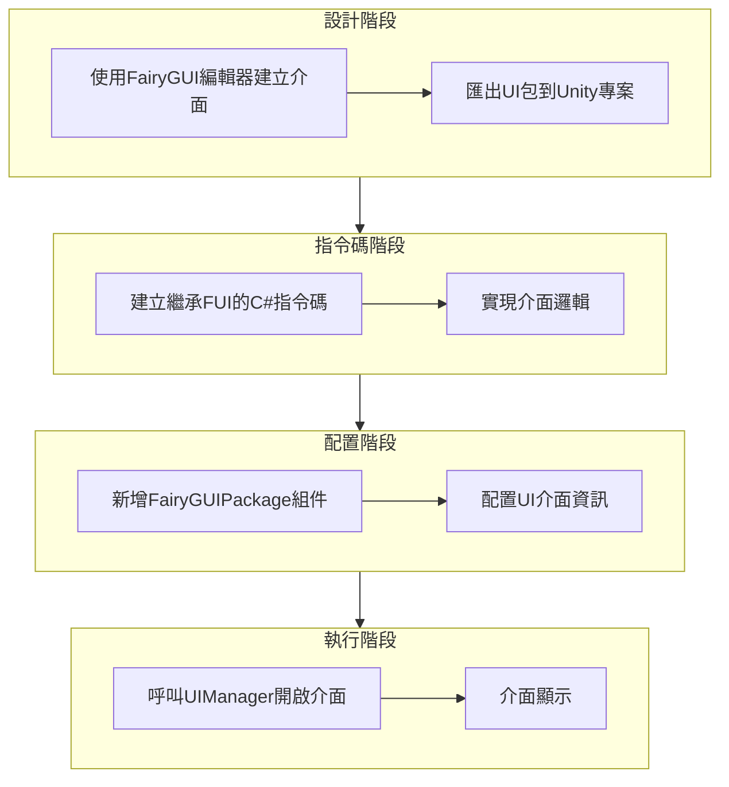
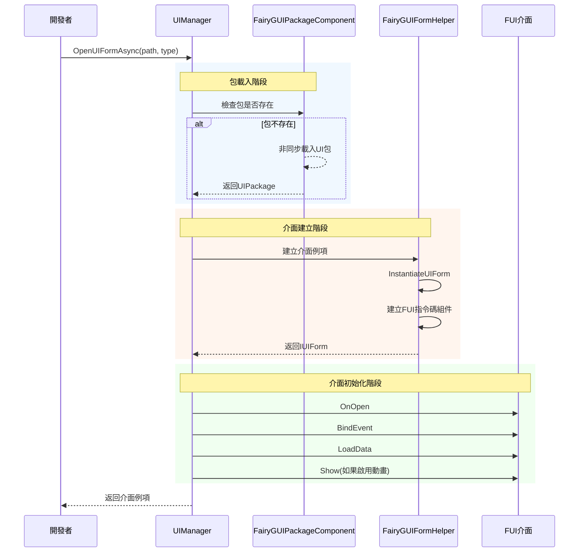
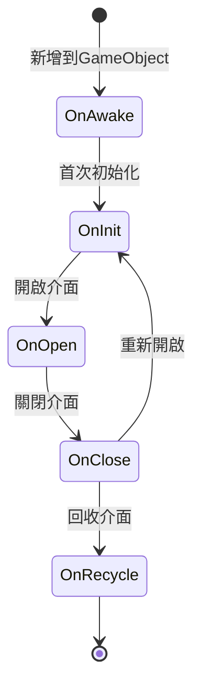

# 建立第一個介面

本指南將幫助你使用 GameFrameX 的 FairyGUI 外掛建立第一個 UI 介面。透過本指南，你將瞭解從 FairyGUI 編輯器設計介面到在程式碼中開啟介面的完整流程。

## 概述

在使用 FairyGUI 外掛建立 UI 介面之前，需要理解整個 UI 系統的架構。GameFrameX 的 FairyGUI 外掛基於以下核心組件構建：

- **FUI**：FairyGUI 介面的基類，繼承自 UIForm，提供介面顯示/隱藏、GObject 管理等功能
- **FairyGUIPackageComponent**：UI 包管理器，負責載入、快取和解除安裝 UI 資源包
- **UIManager**：介面管理器，負責介面的開啟、關閉和生命週期管理
- **FairyGUIFormHelper**：介面輔助器，負責建立、例項化和釋放介面例項

整個 UI 系統的設計遵循了依賴注入和組件化的設計模式，使得介面建立和管理變得簡單可控。

## 建立流程

建立第一個 FairyGUI 介面的完整流程如下：



## 步驟一：使用 FairyGUI 編輯器建立介面

首先需要使用 FairyGUI 編輯器設計和建立 UI 介面。FairyGUI 提供了一個強大的視覺化編輯器，可以幫助你快速構建 UI。

### 1.1 安裝 FairyGUI 編輯器

從 [FairyGUI 官網](https://www.fairygui.com/) 下載並安裝 FairyGUI 編輯器。

### 1.2 建立新專案

在 FairyGUI 編輯器中建立新專案，選擇合適的解析度和設定。

### 1.3 設計介面

使用編輯器提供的各種組件（按鈕、文字、圖片、列表等）設計你的介面。完成設計後，儲存專案。

### 1.4 匯出 UI 包

將設計好的介面匯出為 Unity 可用的資源包：

1. 點選選單「釋出」→「釋出設定」
2. 選擇釋出平臺為 Unity
3. 設定輸出路徑（通常設定為 Unity 專案的 `Assets/Res/FairyGUI` 目錄）
4. 點選發布按鈕

匯出後，會在輸出目錄生成 `.bytes` 描述檔案和相關的圖片資源。

## 步驟二：建立 FUI 介面指令碼

在 Unity 專案中建立繼承自 `FUI` 的 C# 指令碼。FUI 是 FairyGUI 介面的基類，提供了與 FairyGUI GObject 互動的核心功能。

### 2.1 建立介面類

```csharp
using GameFrameX.UI.FairyGUI.Runtime;
using FairyGUI;
using GameFrameX.UI.Runtime;

/// <summary>
/// 主選單介面
/// </summary>
public class MainMenuForm : FUI
{
    /// <summary>
    /// 初始化介面
    /// </summary>
    protected override void OnInit()
    {
        base.OnInit();
        
        // 獲取介面中的按鈕並新增點選事件
        var startButton = GObject.asCom.GetChild("btn_start");
        startButton.onClick.Add(OnStartButtonClick);
    }

    /// <summary>
    /// 開始按鈕點選事件
    /// </summary>
    private void OnStartButtonClick()
    {
        // 處理點選邏輯
    }

    /// <summary>
    /// 介面開啟時的回呼，可以在這裡接收傳入的資料
    /// </summary>
    /// <param name="userData">開啟介面時傳入的資料</param>
    protected override void OnOpen(object userData)
    {
        base.OnOpen(userData);
        // 介面開啟時的初始化邏輯
    }

    /// <summary>
    /// 介面關閉時的回呼
    /// </summary>
    protected override void OnClose(bool isShutdown, bool isVisible)
    {
        // 介面關閉時的清理邏輯
        base.OnClose(isShutdown, isVisible);
    }
}
```
> Source: [FUI.cs](https://github.com/GameFrameX/com.gameframex.unity.ui.fairygui/blob/main/Runtime/FUI.cs#L43-L197)

### 2.2 FUI 類提供的核心功能

FUI 類繼承自 UIForm，是所有 FairyGUI 介面的基類。它提供了以下核心功能：

| 功能 | 說明 |
|------|------|
| GObject | 獲取關聯的 FairyGUI GObject 物件 |
| Visible | 獲取或設定介面可見性 |
| Show | 顯示介面，支援動畫 |
| Hide | 隱藏介面，支援動畫 |
| OnVisibleChanged | 可見性變更回呼 |

## 步驟三：配置 FairyGUIPackageComponent

FairyGUIPackageComponent 是 UI 包管理器組件，需要新增到場景中才能載入 UI 包。

### 3.1 新增包管理組件

在 Unity 編輯器中，按照以下步驟操作：

1. 建立一個空 GameObject，命名為 `FairyGUIPackage`
2. 點選 Add Component 按鈕
3. 搜尋並新增 `FairyGUIPackage` 組件（實際上是 FairyGUIPackageComponent）
4. 確保該組件作為 GameFrameworkComponent 的子類被正確初始化

### 3.2 包管理器的核心方法

```csharp
// 非同步載入 UI 包
public Task<UIPackage> AddPackageAsync(string descFilePath, bool isLoadAsset = true)

// 同步載入 UI 包
public void AddPackageSync(string descFilePath, bool isLoadAsset = true)

// 移除指定名稱的 UI 包
public void RemovePackage(string packageName)

// 檢查 UI 包是否存在
public bool Has(string uiPackageName)
```
> Source: [FairyGUIPackageComponent.cs](https://github.com/GameFrameX/com.gameframex.unity.ui.fairygui/blob/main/Runtime/FairyGUIPackageComponent.cs#L138-L290)

## 步驟四：開啟介面

使用 UIManager 開啟介面是最後一步。UIManager 會自動處理包的載入、介面的建立和顯示。

### 4.1 開啟介面的基本方法

```csharp
// 非同步開啟介面
await GameEntry.UI.OpenUIFormAsync("UI/MainMenu", typeof(MainMenuForm));

// 帶使用者資料開啟介面
var userData = new StartGameData { LevelId = 1 };
await GameEntry.UI.OpenUIFormAsync("UI/MainMenu", typeof(MainMenuForm), userData);
```

### 4.2 開啟介面的完整流程



### 4.3 介面引數說明

| 引數 | 說明 |
|------|------|
| uiFormAssetPath | 介面資源路徑，如 "UI/MainMenu" |
| uiFormType | 介面型別，傳入介面類的 Type |
| pauseCoveredUIForm | 是否暫停被覆蓋的介面 |
| userData | 使用者自定義資料，會傳遞給介面的 OnOpen 方法 |
| isFullScreen | 是否全屏顯示 |

## 介面生命週期

理解介面的生命週期對於正確管理 UI 非常重要。FUI 介面有以下生命週期方法：



| 生命週期方法 | 呼叫時機 | 用途 |
|-------------|----------|------|
| OnAwake | 指令碼新增到 GameObject 時 | 一次性初始化 |
| OnInit | 介面首次建立時 | 初始化介面組件和事件 |
| OnOpen | 每次開啟介面時 | 接收資料、重新整理介面 |
| OnClose | 介面關閉時 | 清理資源、儲存狀態 |
| OnRecycle | 介面回收時 | 徹底清理記憶體 |

## 介面關閉

使用 UIManager 關閉介面：

```csharp
// 關閉指定介面
GameEntry.UI.CloseUIForm(mainMenuForm);

// 關閉所有介面
GameEntry.UI.CloseAllUIForms();
```
> Source: [UIManager.Close.cs](https://github.com/GameFrameX/com.gameframex.unity.ui.fairygui/blob/main/Runtime/UIManager.Close.cs)

## 常見問題

### Q1: 介面開啟後顯示空白

請檢查以下事項：
1. UI 包是否正確匯出並放置在 Unity 專案的正確目錄
2. FairyGUIPackageComponent 是否已新增到場景
3. 介面資源路徑是否正確

### Q2: 點選事件沒有響應

確保在 OnInit 方法中正確繫結了事件，並且 GObject 名稱與 FairyGUI 編輯器中的名稱完全一致。

### Q3: 介面無法關閉

檢查是否在 OnClose 方法中正確呼叫了基類的 OnClose 方法，確保資源被正確釋放。

## 相關連結

- [FUI 介面基類](./4-core-concepts.1-fui-base-class) - 詳細瞭解 FUI 基類的所有功能
- [介面管理器](./4-core-concepts.2-ui-manager) - 深入瞭解 UIManager 的功能
- [包管理器](./4-core-concepts.3-package-manager) - 瞭解 UI 包的管理機制
- [介面輔助器](./4-core-concepts.4-form-helper) - 瞭解介面建立和釋放的機制
- [開啟和關閉介面](./3-getting-started.2-open-close-ui) - 繼續學習介面的開啟和關閉操作
