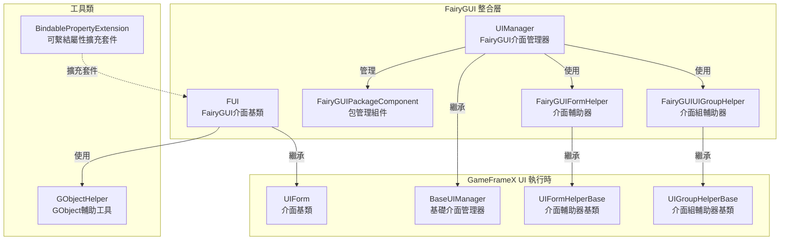
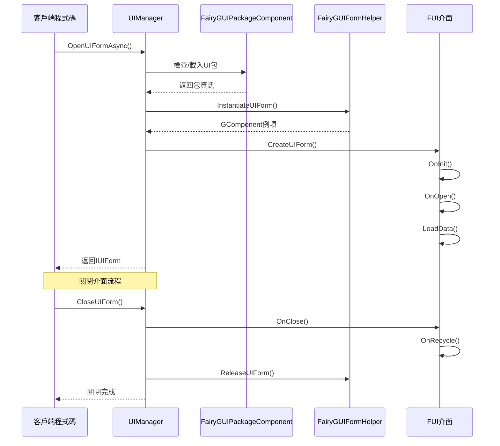

# 功能特性

GameFrameX UI FairyGUI 外掛是一款專為 Unity 遊戲引擎設計的 FairyGUI UI 組件整合方案，提供完整的介面管理、介面生命週期控制、包資源管理等功能。

## 概述

本外掛將 GameFrameX 核心框架的 UI 系統與 FairyGUI 完美整合，提供以下核心能力：

- **介面生命週期管理**：完整的介面開啟、關閉、顯示、隱藏機制
- **資源包管理**：支援 UI 包的非同步/同步載入、快取和解除安裝
- **介面組系統**：支援多層級的介面分組和深度控制
- **物件池**：支援介面例項的複用，減少記憶體開銷
- **動畫系統**：支援顯示/隱藏動畫的靈活配置
- **擴充套件支援**：提供 FairyGUI 特定的資料繫結擴充套件

## 核心架構



### 架構說明

| 組件 | 職責 | 繼承/實現 |
|------|------|----------|
| **FUI** | FairyGUI 介面基類，處理 GObject 關聯和可見性 | 繼承 UIForm |
| **UIManager** | 介面管理器，處理介面開啟/關閉/生命週期 | 繼承 BaseUIManager |
| **FairyGUIPackageComponent** | 包管理組件，非同步/同步載入 UI 包 | 繼承 GameFrameworkComponent |
| **FairyGUIFormHelper** | 介面輔助器，例項化/建立/釋放介面 | 實現 UIFormHelperBase |
| **FairyGUIUIGroupHelper** | 介面組輔助器，管理介面層級深度 | 繼承 UIGroupHelperBase |
| **GObjectHelper** | GObject 工具類，FUI 物件快取管理 | 靜態類 |

## 核心功能特性

### 1. 介面基類 (FUI)

FUI 是 FairyGUI 特定的介面基類，提供以下功能：

- **GObject 關聯**：與 FairyGUI 的 GObject 無縫關聯
- **可見性管理**：透過 `Visible` 屬性控制介面顯示/隱藏
- **動畫支援**：支援顯示/隱藏動畫配置
- **全屏顯示**：支援全屏模式設定
- **事件系統**：提供可見性改變事件回呼

```csharp
// FUI 使用示例
public class MainMenuForm : FUI
{
    protected override void OnInit(object userData)
    {
        base.OnInit(userData);
        // 設定 GObject 關聯
        GObject.onClick.Add(() => { /* 點選處理 */ });
    }
}
```
> Source: [FUI.cs](https://github.com/GameFrameX/com.gameframex.unity.ui.fairygui/blob/main/Runtime/FUI.cs#L36-L197)

### 2. 包管理系統

FairyGUIPackageComponent 負責管理 FairyGUI UI 資源包：

- **非同步載入**：`AddPackageAsync()` 支援非同步載入 UI 包
- **同步載入**：`AddPackageSync()` 支援同步載入 UI 包
- **包快取**：已載入的包會被快取，避免重複載入
- **資源預載入**：支援 `LoadAllAssets()` 預載入所有資源
- **包移除**：`RemovePackage()` / `RemoveAllPackages()` 支援包的解除安裝

```csharp
// 包管理示例
var package = await FairyGuiPackage.AddPackageAsync("UI/MainMenu");
var package = FairyGuiPackage.AddPackageSync("UI/Settings");
```
> Source: [FairyGUIPackageComponent.cs](https://github.com/GameFrameX/com.gameframex.unity.ui.fairygui/blob/main/Runtime/FairyGUIPackageComponent.cs#L138-L254)

### 3. 介面生命週期

UIManager 提供完整的介面生命週期管理：



### 4. 介面輔助器

FairyGUIFormHelper 負責介面的例項化和釋放：

- **例項化**：透過 `InstantiateUIForm()` 建立 GComponent 例項
- **建立介面**：透過 `CreateUIForm()` 將例項包裝為 IUIForm
- **釋放資源**：透過 `ReleaseUIForm()` 釋放介面和關聯資源
- **動畫配置**：自動讀取介面型別的特性配置動畫

> Source: [FairyGUIFormHelper.cs](https://github.com/GameFrameX/com.gameframex.unity.ui.fairygui/blob/main/Runtime/FairyGUIFormHelper.cs#L46-L232)

### 5. 介面組系統

FairyGUIUIGroupHelper 提供介面層級管理：

- **深度控制**：透過 `SetDepth()` 設定介面顯示層級
- **全屏適配**：自動設定全屏大小適配
- **關係繫結**：與 GRoot 自動建立寬高關係

```csharp
// 介面組深度管理
public override void SetDepth(int depth)
{
    Depth = depth;
    transform.localPosition = new Vector3(0, 0, depth * 100);
}
```
> Source: [FairyGUIUIGroupHelper.cs](https://github.com/GameFrameX/com.gameframex.unity.ui.fairygui/blob/main/Runtime/FairyGUIUIGroupHelper.cs#L62-L96)

### 6. GObject 輔助工具

GObjectHelper 提供 FUI 物件的快取和管理：

- **獲取關聯 FUI**：`Get<T>()` 從 GObject 獲取關聯的 FUI
- **新增對映**：`Add()` 將 GObject 與 FUI 關聯
- **移除對映**：`Remove()` 移除 GObject 與 FUI 的關聯
- **清理快取**：`ClearAll()` 清理所有快取

```csharp
// GObject 與 FUI 對映示例
GObject obj = package.CreateObject("MainMenu", "MainMenuForm");
MainMenuForm fui = new MainMenuForm(obj);
obj.Add(fui);  // 建立對映

// 後續獲取
MainMenuForm cached = obj.Get<MainMenuForm>();
```
> Source: [GObjectHelper.cs](https://github.com/GameFrameX/com.gameframex.unity.ui.fairygui/blob/main/Runtime/GObjectHelper.cs#L42-L114)

### 7. 資料繫結擴充套件

BindablePropertyExtension 提供 FairyGUI 環境下的屬性繫結：

- **自動登出**：GObject 銷燬時自動清除繫結事件
- **生命週期聯動**：將屬性變化與介面生命週期關聯

```csharp
// 可繫結屬性在 FairyGUI 中的使用
BindableProperty<int> score = new BindableProperty<int>(0);
score.Register(newValue => { textField.text = newValue.ToString(); });
score.ClearWithGObjectDestroyed(textField);
```
> Source: [BindablePropertyExtension.cs](https://github.com/GameFrameX/com.gameframex.unity.ui.fairygui/blob/main/Runtime/BindablePropertyExtension.cs#L41-L57)

## 功能特性對比

| 功能 | 說明 | 相關組件 |
|------|------|----------|
| 介面基類 | FairyGUI 特定的介面基類 | FUI |
| 介面管理 | 開啟/關閉/生命週期管理 | UIManager |
| 包管理 | UI資源包非同步/同步載入 | FairyGUIPackageComponent |
| 介面例項化 | 介面建立/例項化/釋放 | FairyGUIFormHelper |
| 介面組管理 | 介面層級/深度控制 | FairyGUIUIGroupHelper |
| 物件快取 | GObject與FUI對映管理 | GObjectHelper |
| 屬性繫結 | 可繫結屬性擴充套件支援 | BindablePropertyExtension |

## 設計優勢

1. **分層設計**：清晰的分層架構，易於擴充套件和維護
2. **面向介面**：大量使用介面，便於替換實現
3. **物件池複用**：介面例項複用，減少記憶體分配
4. **非同步支援**：完整的非同步載入支援，提高效能
5. **特性配置**：使用特性配置動畫和介面組，簡化程式碼
6. **事件驅動**：基於事件系統，解耦組件間依賴

## 相關連結

- [外掛介紹](./1-overview.1-introduction) - 瞭解外掛概述和設計理念
- [系統要求](./1-overview.3-requirements) - 檢視執行環境要求
- [安裝指南](./2-installation.1-install-methods) - 快速安裝外掛
- [FUI 類詳解](./5-api-reference.1-fui-class) - FUI 完整 API 參考
- [介面管理器](./4-core-concepts.2-ui-manager) - 介面管理核心概念
- [包管理器](./4-core-concepts.3-package-manager) - 包管理核心概念
