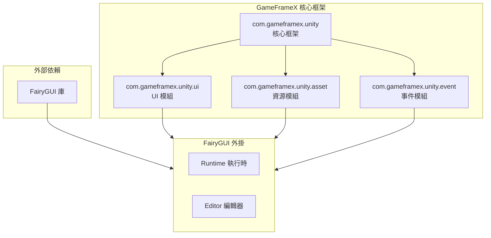
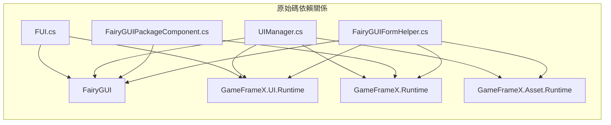

# 依賴配置

本文件介紹 GameFrameX UI FairyGUI 組件的依賴配置要求，包括必需的核心框架依賴和外部庫依賴。

## 概述

GameFrameX UI FairyGUI 組件是一個基於 FairyGUI 的 Unity UI 功能包，它依賴於 GameFrameX 核心框架和 FairyGUI 第三方庫。正確配置這些依賴是確保外掛正常工作的前提條件。

## 依賴架構



## 核心依賴

### GameFrameX 框架依賴

| 依賴包 | 最低版本 | 說明 |
|--------|----------|------|
| com.gameframex.unity | 1.1.1 | GameFrameX 核心框架，提供基礎架構和組件系統 |
| com.gameframex.unity.ui | 1.0.0 | UI 基礎模組，定義 UIForm、UIComponent 等核心類 |
| com.gameframex.unity.asset | 1.0.6 | 資源管理模組，負責資源載入和解除安裝 |
| com.gameframex.unity.event | 1.0.0 | 事件系統模組，提供事件訂閱和釋出功能 |

### package.json 中的依賴配置

```json
{
  "dependencies": {
    "com.gameframex.unity": "1.1.1",
    "com.gameframex.unity.ui": "1.0.0",
    "com.gameframex.unity.asset": "1.0.6",
    "com.gameframex.unity.event": "1.0.0"
  }
}
```
> Source: [package.json](https://github.com/GameFrameX/com.gameframex.unity.ui.fairygui/blob/main/package.json#L21-L26)

## 外部依賴

### FairyGUI 庫

FairyGUI 是外掛的核心依賴，提供了完整的 UI 框架功能。

| 組件 | 說明 |
|------|------|
| FairyGUI.Runtime | FairyGUI 執行時庫，提供 GObject、GComponent、UIPackage 等核心類 |
| FairyGUI.Editor | FairyGUI 編輯器擴充套件，用於在 Unity Editor 中編輯 UI |

**獲取方式：**
- 從 [FairyGUI 官網](https://www.fairygui.com/) 下載官方 Unity 整合包
- 透過 Unity Package Manager 匯入 FairyGUI

### FairyGUI 與 GameFrameX 的整合

FairyGUI 外掛透過以下名稱空間整合到 GameFrameX 框架中：

```csharp
using FairyGUI;                           // FairyGUI 核心庫
using GameFrameX.Runtime;                 // GameFrameX 核心執行時
using GameFrameX.Asset.Runtime;           // 資源管理
using GameFrameX.UI.Runtime;              // UI 基礎模組
using GameFrameX.UI.FairyGUI.Runtime;     // FairyGUI 外掛執行時
```
> Source: [FairyGUIPackageComponent.cs](https://github.com/GameFrameX/com.gameframex.unity.ui.fairygui/blob/main/Runtime/FairyGUIPackageComponent.cs#L30-L35)

## 系統要求

### Unity 版本要求

| 要求 | 規格 |
|------|------|
| 最低版本 | Unity 2019.4 |
| 推薦版本 | Unity 2021.3 LTS 或更高 |

### 依賴關係詳解



### 核心類依賴對照表

| 外掛類 | 依賴的 GameFrameX 類 | 依賴的 FairyGUI 類 |
|--------|---------------------|-------------------|
| FUI | UIForm | GObject |
| UIManager | BaseUIManager | UIPackage |
| FairyGUIPackageComponent | GameFrameworkComponent | UIPackage |
| FairyGUIFormHelper | UIFormHelperBase | GComponent |
| GObjectHelper | - | GObject, FUI |

## Unity 專案配置

### 1. 安裝 GameFrameX 核心框架

在 Unity 專案中安裝 GameFrameX 核心框架及其依賴：

```json
// manifest.json 示例
{
  "dependencies": {
    "com.gameframex.unity": "1.1.1",
    "com.gameframex.unity.ui": "1.0.0",
    "com.gameframex.unity.asset": "1.0.6",
    "com.gameframex.unity.event": "1.0.0"
  }
}
```

### 2. 安裝 FairyGUI

從 FairyGUI 官網下載並匯入 Unity 包，確保包含：
- Runtime 目錄（核心執行時）
- Editor 目錄（編輯器擴充套件）

### 3. 安裝 FairyGUI 外掛

將 GameFrameX UI FairyGUI 組件新增到專案中：

```json
{
  "dependencies": {
    "com.gameframex.unity.ui.fairygui": "https://github.com/gameframex/com.gameframex.unity.ui.fairygui.git"
  }
}
```

> 詳細安裝步驟請參閱 [安裝方式](./2-installation.1-install-methods) 文件。

## 依賴驗證

安裝完成後，以下類應該可以正常訪問：

```csharp
// GameFrameX 核心類
using GameFrameX.Runtime;
using GameFrameX.Asset.Runtime;
using GameFrameX.UI.Runtime;

// FairyGUI 類
using FairyGUI;

// FairyGUI 外掛類
using GameFrameX.UI.FairyGUI.Runtime;
```

## 版本相容性

| 外掛版本 | Unity 版本 | GameFrameX 版本 | FairyGUI 版本 |
|----------|-----------|-----------------|---------------|
| 3.2.x | 2019.4+ | 1.1.x | 官方最新版本 |
| 3.1.x | 2019.4+ | 1.0.x | 官方最新版本 |

## 常見問題

### Q1: 安裝後出現名稱空間找不到錯誤

**解決方案：** 確保已正確安裝所有 GameFrameX 依賴包。檢查 manifest.json 中是否包含所有必需的依賴。

### Q2: FairyGUI 類提示找不到

**解決方案：** 確保已安裝 FairyGUI 官方包，並且 FairyGUI.dll 已正確放置在專案中。

### Q3: 版本不相容警告

**解決方案：** 檢查 Unity 版本是否滿足最低要求（2019.4），並確保所有 GameFrameX 依賴包版本符合要求。

## 相關連結

- [安裝方式](./2-installation.1-install-methods) - 詳細安裝步驟
- [外掛介紹](./1-overview.1-introduction) - 外掛功能概述
- [系統要求](./1-overview.3-requirements) - 系統要求詳情
- [GitHub 倉庫](https://github.com/GameFrameX/com.gameframex.unity.ui.fairygui.git) - 官方倉庫
- [官方文件](https://gameframex.doc.alianblank.com/) - GameFrameX 文件中心
