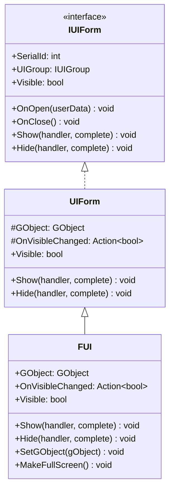
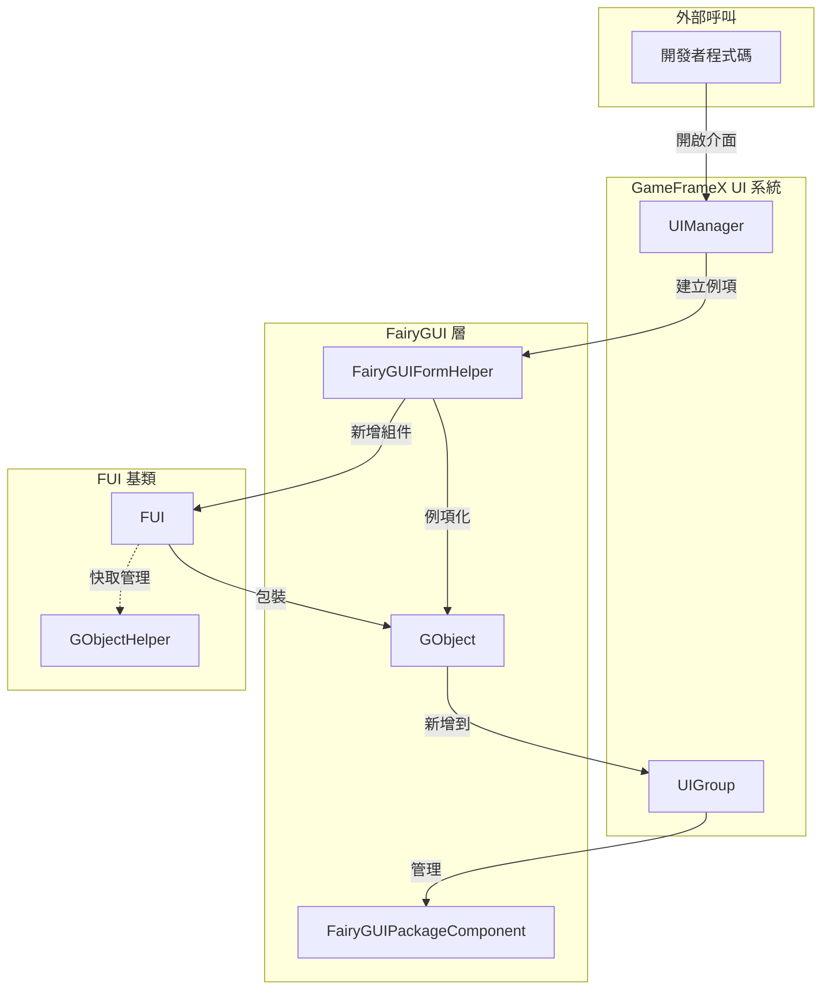
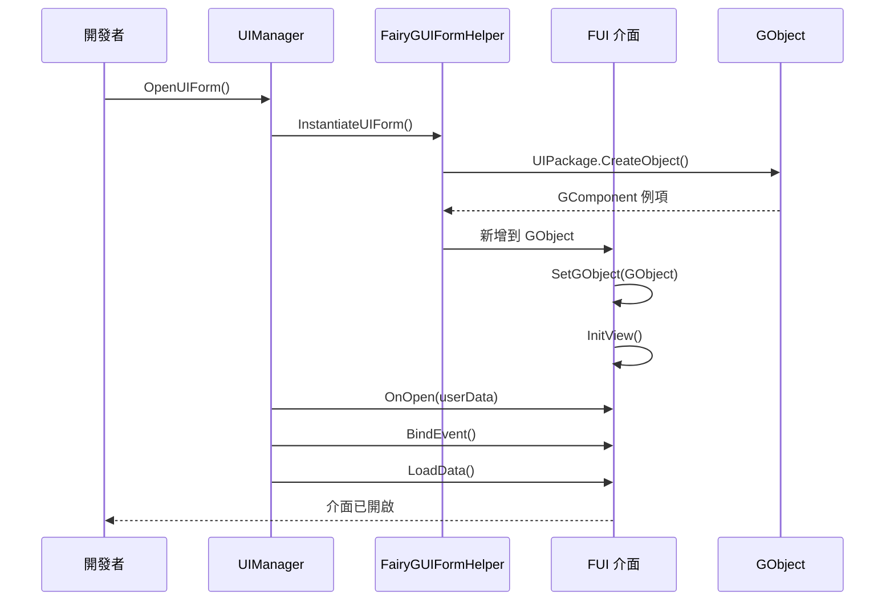

# FUI 介面基類

FUI 是 GameFrameX 外掛中 FairyGUI 介面的基類，繼承自 UIForm，提供 FairyGUI 特定的介面功能實現。

## 概述

`FUI` 類是 FairyGUI 介面系統的核心基類，它將 FairyGUI 的 `GObject` 與 GameFrameX 的 UI 系統進行橋接。透過繼承 `FUI`，開發者可以建立遵循統一架構的 FairyGUI 介面，並自動獲得以下功能：

- 與 GameFrameX UI 系統的無縫整合
- 統一的顯示/隱藏動畫支援
- 可見性狀態管理和事件回呼
- 全屏顯示模式支援
- GObject 生命週期管理

### 繼承關係



## 架構設計

### 核心組件互動



### 介面生命週期



## 核心功能

### 1. GObject 關聯

FUI 透過 `GObject` 屬性關聯 FairyGUI 的介面物件，這是與 FairyGUI 系統互動的核心入口。

```csharp
// 原始碼路徑: Runtime/FUI.cs#L45-L53
[UnityEngine.Scripting.Preserve]
public class FUI : UIForm
{
    /// <summary>
    /// 獲取關聯的 FairyGUI GObject 物件。
    /// </summary>
    [UnityEngine.Scripting.Preserve]
    public GObject GObject { get; private set; }
```
> Source: [FUI.cs](https://github.com/GameFrameX/com.gameframex.unity.ui.fairygui/blob/main/Runtime/FUI.cs#L45-L53)

### 2. 可見性管理

FUI 提供了完善的可見性管理機制，包括內部設定和屬性訪問。

```csharp
// 原始碼路徑: Runtime/FUI.cs#L115-L155
/// <summary>
/// 內部設定介面的顯示狀態，不發出事件。
/// </summary>
[UnityEngine.Scripting.Preserve]
protected override void InternalSetVisible(bool value)
{
    if (GObject.visible == value)
    {
        return;
    }

    GObject.visible = value;
    OnVisibleChanged?.Invoke(value);
    EventSubscriber?.Fire(UIFormVisibleChangedEventArgs.EventId, UIFormVisibleChangedEventArgs.Create(this, value));
}

/// <summary>
/// 獲取或設定介面是否可見。
/// </summary>
[UnityEngine.Scripting.Preserve]
public override bool Visible
{
    get
    {
        if (GObject == null)
        {
            return false;
        }

        return GObject.visible;
    }
    protected set
    {
        if (GObject == null)
        {
            return;
        }

        InternalSetVisible(value);
    }
}
```
> Source: [FUI.cs](https://github.com/GameFrameX/com.gameframex.unity.ui.fairygui/blob/main/Runtime/FUI.cs#L115-L155)

### 3. 顯示/隱藏動畫

FUI 繼承自 UIForm 的動畫配置，支援顯示和隱藏動畫。

```csharp
// 原始碼路徑: Runtime/FUI.cs#L74-L105
/// <summary>
/// 顯示介面。
/// </summary>
[UnityEngine.Scripting.Preserve]
public override void Show(IUIFormShowHandler handler, Action complete)
{
    if (handler != null)
    {
        handler.Handler(GObject, EnableShowAnimation, ShowAnimationName, complete);
    }
    else
    {
        complete?.Invoke();
    }
}

/// <summary>
/// 隱藏介面。
/// </summary>
[UnityEngine.Scripting.Preserve]
public override void Hide(IUIFormHideHandler handler, Action complete)
{
    if (handler != null)
    {
        handler.Handler(GObject, EnableHideAnimation, HideAnimationName, complete);
    }
    else
    {
        complete?.Invoke();
    }
}
```
> Source: [FUI.cs](https://github.com/GameFrameX/com.gameframex.unity.ui.fairygui/blob/main/Runtime/FUI.cs#L74-L105)

### 4. 全屏顯示

`MakeFullScreen()` 方法將介面設定為全屏顯示模式。

```csharp
// 原始碼路徑: Runtime/FUI.cs#L165-L168
/// <summary>
/// 將當前 UI 物件設定為全屏顯示。
/// </summary>
[UnityEngine.Scripting.Preserve]
protected override void MakeFullScreen()
{
    GObject?.asCom?.MakeFullScreen();
}
```
> Source: [FUI.cs](https://github.com/GameFrameX/com.gameframex.unity.ui.fairygui/blob/main/Runtime/FUI.cs#L165-L168)

## 建立自定義介面

### 基本步驟

1. 建立一個繼承自 `FUI` 的類
2. 實現 `InitView()` 方法初始化介面
3. 重寫生命週期方法如 `OnOpen`、`OnClose` 等

### 示例程式碼

```csharp
using FairyGUI;
using GameFrameX.UI.FairyGUI.Runtime;

public class MainMenuForm : FUI
{
    private GButton _startButton;
    private GTextField _titleText;

    public MainMenuForm(GObject gObject, bool isRoot = false) : base(gObject, isRoot)
    {
    }

    protected override void InitView()
    {
        base.InitView();
        
        // 獲取介面組件
        _startButton = GObject.GetChild("btn_start");
        _titleText = GObject.GetChild("txt_title");
        
        // 繫結事件
        _startButton.onClick.Add(OnStartButtonClick);
    }

    private void OnStartButtonClick()
    {
        // 處理開始按鈕點選
    }

    protected override void OnOpen(object userData)
    {
        base.OnOpen(userData);
        // 介面開啟時的邏輯
    }

    protected override void OnClose()
    {
        // 介面關閉時的清理邏輯
        _startButton.onClick.Remove(OnStartButtonClick);
        base.OnClose();
    }
}
```
> Source: [FUI.cs](https://github.com/GameFrameX/com.gameframex.unity.ui.fairygui/blob/main/Runtime/FUI.cs#L179-L197)

## GObjectHelper 工具類

`GObjectHelper` 提供 FUI 物件的快取和管理功能，方便在 GObject 和 FUI 之間建立對映關係。

```csharp
// 原始碼路徑: Runtime/GObjectHelper.cs#L42-L115
namespace GameFrameX.UI.FairyGUI.Runtime
{
    /// <summary>
    /// GObject 輔助類，提供 FUI 物件的快取和管理功能。
    /// </summary>
    [UnityEngine.Scripting.Preserve]
    public static class GObjectHelper
    {
        private static readonly Dictionary<GObject, FUI> s_GObjectToFuiMap = new Dictionary<GObject, FUI>();

        /// <summary>
        /// 從組件池中獲取關聯的 FUI 物件。
        /// </summary>
        [UnityEngine.Scripting.Preserve]
        public static T Get<T>(this GObject self) where T : FUI
        {
            if (self != null && s_GObjectToFuiMap.TryGetValue(self, out var pair))
            {
                return pair as T;
            }

            return default(T);
        }

        /// <summary>
        /// 將 FUI 物件新增到組件池。
        /// </summary>
        [UnityEngine.Scripting.Preserve]
        public static void Add(this GObject self, FUI fui)
        {
            if (self != null && fui != null)
            {
                s_GObjectToFuiMap[self] = fui;
            }
        }

        /// <summary>
        /// 從組件池中刪除 FUI 物件。
        /// </summary>
        [UnityEngine.Scripting.Preserve]
        public static FUI Remove(this GObject self)
        {
            if (self != null && s_GObjectToFuiMap.TryGetValue(self, out var value))
            {
                s_GObjectToFuiMap.Remove(self);
                return value;
            }

            return default;
        }

        /// <summary>
        /// 清理所有快取的 FUI 物件。
        /// </summary>
        [UnityEngine.Scripting.Preserve]
        public static void ClearAll()
        {
            s_GObjectToFuiMap.Clear();
        }
    }
}
```
> Source: [GObjectHelper.cs](https://github.com/GameFrameX/com.gameframex.unity.ui.fairygui/blob/main/Runtime/GObjectHelper.cs#L42-L115)

## 可繫結屬性擴充套件

`BindablePropertyExtension` 提供了在 FairyGUI 環境下使用可繫結屬性的便捷方法，自動處理 GObject 銷燬時的屬性清理。

```csharp
// 原始碼路徑: Runtime/BindablePropertyExtension.cs#L42-L57
namespace GameFrameX.UI.FairyGUI.Runtime
{
    public static class BindablePropertyExtension
    {
        /// <summary>
        /// 在 FairyGUI 環境下使用此方法，當 GObject 銷燬時自動登出繫結屬性的事件。
        /// </summary>
        [UnityEngine.Scripting.Preserve]
        public static void ClearWithGObjectDestroyed<T>(this BindableProperty<T> bindableProperty, GObject gObject)
        {
            gObject.onRemovedFromStage.Add(bindableProperty.Clear);
        }
    }
}
```
> Source: [BindablePropertyExtension.cs](https://github.com/GameFrameX/com.gameframex.unity.ui.fairygui/blob/main/Runtime/BindablePropertyExtension.cs#L42-L57)

## API 參考

### FUI 類

#### 屬性

| 屬性名 | 型別 | 可讀 | 可寫 | 描述 |
|--------|------|------|------|------|
| `GObject` | `GObject` | ✅ | ❌ | 獲取關聯的 FairyGUI GObject 物件 |
| `OnVisibleChanged` | `Action<bool>` | ✅ | ✅ | 獲取或設定可見性改變事件的回呼 |
| `Visible` | `bool` | ✅ | ✅ | 獲取或設定介面可見性 |
| `EnableShowAnimation` | `bool` | ✅ | ✅ | 是否啟用顯示動畫（繼承自 UIForm） |
| `ShowAnimationName` | `string` | ✅ | ✅ | 顯示動畫名稱（繼承自 UIForm） |
| `EnableHideAnimation` | `bool` | ✅ | ✅ | 是否啟用隱藏動畫（繼承自 UIForm） |
| `HideAnimationName` | `string` | ✅ | ✅ | 隱藏動畫名稱（繼承自 UIForm） |

#### 方法

| 方法名 | 返回型別 | 描述 |
|--------|----------|------|
| `Show(handler, complete)` | `void` | 顯示介面 |
| `Hide(handler, complete)` | `void` | 隱藏介面 |
| `InternalSetVisible(value)` | `void` | 內部設定可見性 |
| `MakeFullScreen()` | `void` | 設定為全屏顯示 |
| `SetGObject(gObject)` | `void` | 設定關聯的 GObject 物件 |
| `InitView()` | `void` | 初始化檢視（可重寫） |
| `OnOpen(userData)` | `void` | 介面開啟回呼（可重寫） |
| `OnClose()` | `void` | 介面關閉回呼（可重寫） |
| `OnPause()` | `void` | 介面暫停回呼（可重寫） |
| `OnResume()` | `void` | 介面恢復回呼（可重寫） |

### GObjectHelper 靜態類

| 方法名 | 返回型別 | 描述 |
|--------|----------|------|
| `Get<T>(GObject)` | `T` | 從快取中獲取關聯的 FUI 物件 |
| `Add(GObject, FUI)` | `void` | 將 FUI 物件新增到快取 |
| `Remove(GObject)` | `FUI` | 從快取中移除 FUI 物件 |
| `ClearAll()` | `void` | 清空所有快取 |

## 相關連結

- [介面管理器](./4-core-concepts.2-ui-manager)
- [包管理器](./4-core-concepts.3-package-manager)
- [介面輔助器](./4-core-concepts.4-form-helper)
- [介面組輔助器](./4-core-concepts.5-ui-group-helper)
- [FUI 類 API 參考](./5-api-reference.1-fui-class)
- [FairyGUIPackageComponent 類 API 參考](./5-api-reference.2-package-component)
- [建立第一個介面](./3-getting-started.1-first-ui-form)
