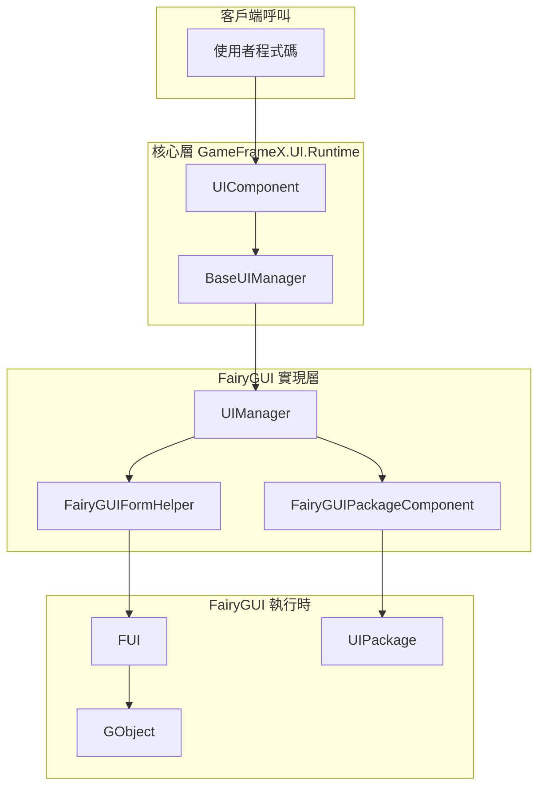
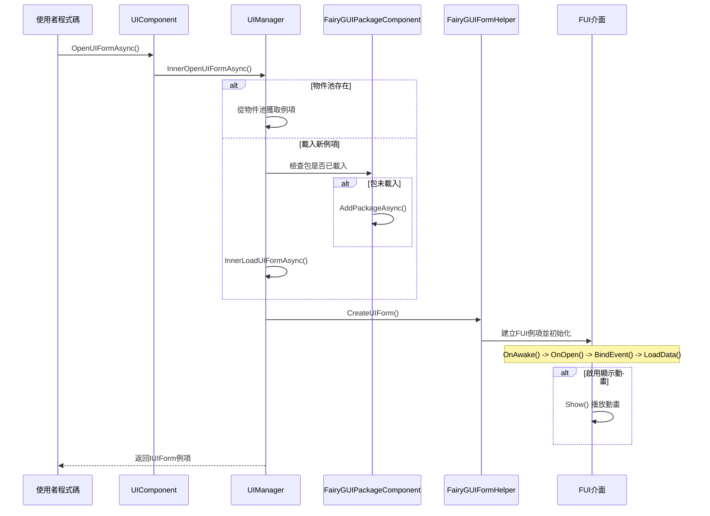
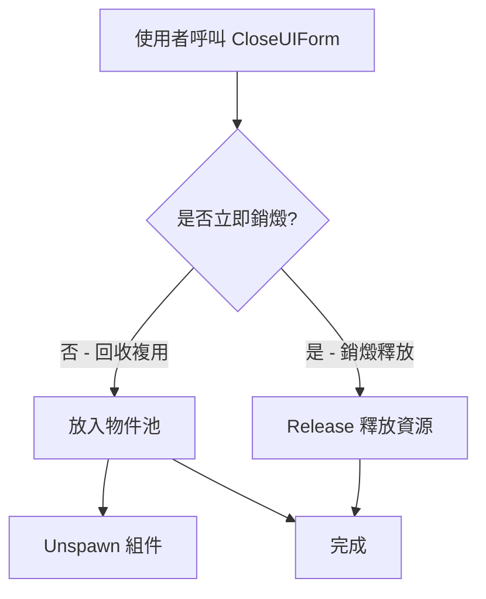
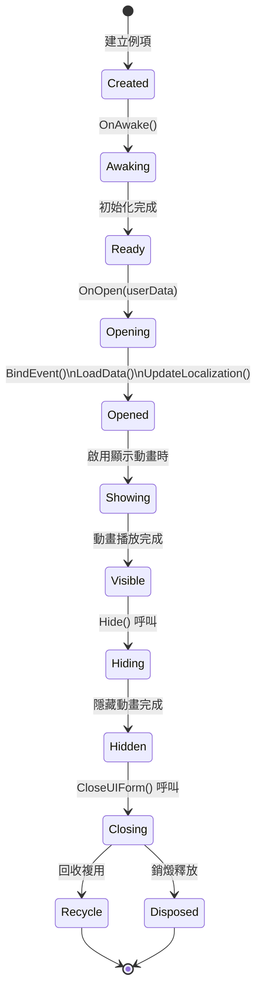

# 開啟和關閉介面

本文件介紹如何在 GameFrameX 框架中使用 FairyGUI 外掛開啟和關閉介面。

## 概述

在 GameFrameX 框架中，介面的開啟和關閉操作由核心的 UIComponent 統一管理，FairyGUI 外掛透過 `UIManager` 實現具體的功能。瞭解介面生命週期管理對於構建流暢的 UI 系統至關重要。

介面管理採用非同步載入機制，支援：
- 物件池複用，提高效能
- 包按需載入，減少初始載入時間
- 顯示/隱藏動畫，提升使用者體驗
- 介面組管理，支援層級控制

## 架構

介面開啟和關閉涉及以下核心組件的協作：



### 組件職責

| 組件 | 職責 |
|------|------|
| UIComponent | 提供公開的 Open/Close 介面 |
| UIManager | 實現介面開啟關閉的具體邏輯 |
| FairyGUIFormHelper | 建立和釋放 UI 介面例項 |
| FairyGUIPackageComponent | 管理 UI 包的載入和快取 |
| FUI | 介面基類，包裝 GObject 並提供生命週期方法 |

## 開啟介面流程

介面開啟是一個非同步過程，涉及資源載入、包管理、例項建立和介面初始化等多個步驟。

### 核心流程



### 開啟介面示例

```csharp
using GameFrameX.UI.Runtime;
using GameFrameX.UI.FairyGUI.Runtime;

// 非同步開啟介面
var uiForm = await GameEntry.UI.OpenUIFormAsync(
    "UI/TestUI",           // 介面資源路徑
    typeof(TestUIForm),    // 介面邏輯型別
    "MainUI"               // 介面組名稱
);

// 或者帶有使用者資料的開啟方式
var userData = new OpenFormData { Id = 1001, Name = "Player" };
var uiFormWithData = await GameEntry.UI.OpenUIFormAsync(
    "UI/PlayerInfo",
    typeof(PlayerInfoForm),
    "MainUI",
    false,                 // 是否暫停被遮擋的介面
    userData               // 傳遞給介面的資料
);
```

> Source: [UIManager.Open.cs](https://github.com/GameFrameX/com.gameframex.unity.ui.fairygui/blob/main/Runtime/UIManager.Open.cs#L66-L107)

### 開啟引數說明

| 引數 | 型別 | 說明 |
|------|------|------|
| uiFormAssetPath | string | 介面資源路徑，如 "UI/TestUI" |
| uiFormType | Type | 介面邏輯類的型別 |
| uiGroupName | string | 介面組名稱，用於控制層級 |
| pauseCoveredUIForm | bool | 是否暫停被遮擋的介面 |
| userData | object | 傳遞給介面的自定義資料 |
| isFullScreen | bool | 是否全屏顯示 |

## 關閉介面流程

介面關閉支援兩種模式：回收複用和銷燬釋放。

### 核心流程



### 關閉介面示例

```csharp
// 根據介面例項關閉
var uiForm = GameEntry.UI.GetUIForm(serialId);
GameEntry.UI.CloseUIForm(uiForm);

// 根據介面型別關閉（關閉所有該型別的介面）
GameEntry.UI.CloseUIForm(typeof(TestUIForm));

// 關閉所有介面
GameEntry.UI.CloseAllUIForms();

// 關閉指定介面的同時傳遞資料
GameEntry.UI.CloseUIForm(uiForm, closeFormData);
```

> Source: [UIManager.Close.cs](https://github.com/GameFrameX/com.gameframex.unity.ui.fairygui/blob/main/Runtime/UIManager.Close.cs#L50-L79)

## 介面生命週期

FUI 介面具有完整的生命週期，各個階段都會觸發相應的回呼方法。

### 生命週期階段



### 各階段說明

| 階段 | 方法 | 說明 |
|------|------|------|
| 建立 | 建構函式 | 介面物件例項化 |
| 喚醒 | OnAwake() | 介面邏輯首次執行時呼叫 |
| 開啟 | OnOpen(userData) | 介面開啟時呼叫，可獲取開啟時傳入的資料 |
| 事件繫結 | BindEvent() | 繫結介面事件監聽器 |
| 資料載入 | LoadData() | 載入介面所需的資料 |
| 本地化 | UpdateLocalization() | 更新介面文字的本地化 |
| 顯示 | Show() | 播放顯示動畫（如果啟用） |
| 隱藏 | Hide() | 播放隱藏動畫（如果啟用） |
| 回收 | OnRecycle() | 介面回收到物件池時呼叫 |
| 銷燬 | OnClose() | 介面真正銷燬時呼叫 |

### 生命週期方法示例

```csharp
using FairyGUI;
using GameFrameX.UI.FairyGUI.Runtime;

public class TestUIForm : FUI
{
    // 介面首次建立時呼叫
    protected override void OnAwake()
    {
        base.OnAwake();
        // 初始化介面組件引用
    }
    
    // 介面開啟時呼叫
    protected override void OnOpen(object userData)
    {
        base.OnOpen(userData);
        
        // 接收開啟時傳遞的資料
        if (userData is OpenFormData data)
        {
            // 處理傳入的資料
        }
    }
    
    // 介面關閉時呼叫
    protected override void OnClose()
    {
        base.OnClose();
        // 清理資料、取消事件訂閱等
    }
    
    // 介面回收時呼叫
    protected override void OnRecycle()
    {
        base.OnRecycle();
        // 重置介面狀態，準備複用
    }
}
```

> Source: [FUI.cs](https://github.com/GameFrameX/com.gameframex.unity.ui.fairygui/blob/main/Runtime/FUI.cs#L43-L197)

## 介面組管理

介面組用於管理不同層級和型別的介面，實現介面的顯示優先順序控制。

### 介面組配置

介面組透過 `[OptionUIGroup]` 特性在介面類上指定：

```csharp
using GameFrameX.UI.Runtime;

[OptionUIGroup("MainUI")]
public class MainMenuForm : FUI
{
    // 介面實現
}
```

> See [介面組配置](./6-configuration.2-ui-group-config) for full details on configuring UI groups.

### 介面組使用示例

```csharp
// 開啟介面時指定組
await GameEntry.UI.OpenUIFormAsync(
    "UI/MainMenu", 
    typeof(MainMenuForm), 
    "MainUI"  // 介面組名稱
);

// 獲取介面組
var uiGroup = GameEntry.UI.GetUIGroup("MainUI");

// 獲取組內所有介面
var allForms = uiGroup.GetAllUIForms();
```

## 高階用法

### 自定義顯示動畫

可以透過特性配置介面的顯示和隱藏動畫：

```csharp
using GameFrameX.UI.Runtime;

[OptionUIGroup("DialogUI")]
[OptionUIShowAnimation(true, "DialogOpen")]
[OptionUIHideAnimation(true, "DialogClose")]
public class DialogForm : FUI
{
    // 介面實現
}
```

### 獲取 FUI 物件

使用 GObjectHelper 工具類可以方便地獲取 GObject 對應的 FUI 物件：

```csharp
using GameFrameX.UI.FairyGUI.Runtime;

// 透過 GObject 擴充套件方法獲取 FUI
TestUIForm fui = GObject.Get<TestUIForm>();

// 將 FUI 關聯到 GObject
GObject.Add(fui);

// 移除 FUI 關聯
GObject.Remove();
```

> Source: [GObjectHelper.cs](https://github.com/GameFrameX/com.gameframex.unity.ui.fairygui/blob/main/Runtime/GObjectHelper.cs#L42-L114)

### 介面可見性變化監聽

```csharp
public class TestUIForm : FUI
{
    protected override void OnAwake()
    {
        base.OnAwake();
        
        // 訂閱可見性變化事件
        OnVisibleChanged = OnVisibleChangedHandler;
    }
    
    private void OnVisibleChangedHandler(bool visible)
    {
        if (visible)
        {
            // 介面顯示
        }
        else
        {
            // 介面隱藏
        }
    }
}
```

> Source: [FUI.cs](https://github.com/GameFrameX/com.gameframex.unity.ui.fairygui/blob/main/Runtime/FUI.cs#L62-L63)

## 常見問題

### 介面開啟失敗

如果介面開啟失敗，請檢查：
1. 介面資源路徑是否正確
2. FairyGUI 包是否已正確新增到專案
3. 介面類是否繼承自 FUI
4. 介面組名稱是否已配置

### 介面關閉後資料未重置

確保在 `OnRecycle()` 方法中重置介面狀態：

```csharp
protected override void OnRecycle()
{
    base.OnRecycle();
    // 重置輸入框、列表等控制組件狀態
    // 清除快取資料
}
```

### 介面動畫不播放

檢查是否滿足以下條件：
1. 介面類上配置了 `[OptionUIShowAnimation]`
2. FairyGUI 編輯器中建立了對應的動畫
3. 介面管理器中啟用了動畫功能

## 相關連結

- [建立第一個介面](./3-getting-started.1-first-ui-form) - 學習如何建立新的介面
- [FUI 介面基類](./4-core-concepts.1-fui-base-class) - 深入瞭解 FUI 基類
- [介面管理器](./4-core-concepts.2-ui-manager) - UIManager 詳細文件
- [介面輔助器](./4-core-concepts.4-form-helper) - FairyGUIFormHelper 文件
- [包管理器](./4-core-concepts.3-package-manager) - FairyGUIPackageComponent 文件
- [介面組配置](./6-configuration.2-ui-group-config) - 介面組配置指南
