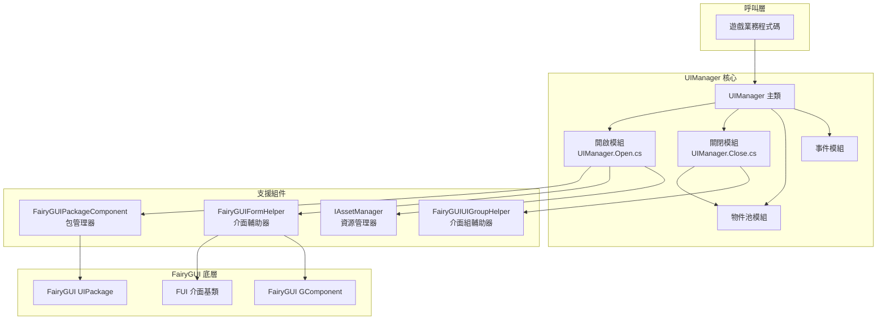
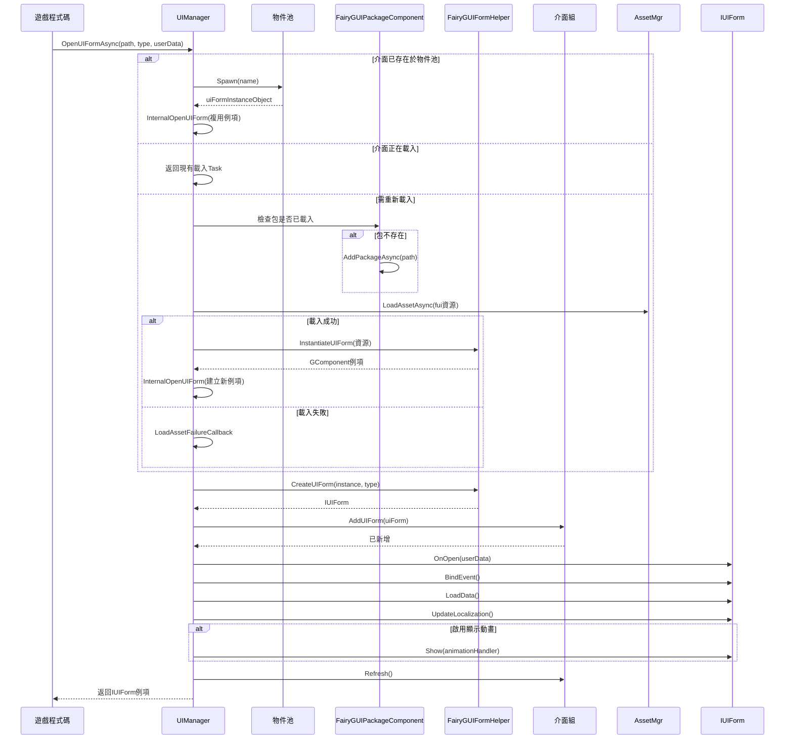

# 介面管理器

UIManager 是 FairyGUI 外掛的核心組件，負責介面的開啟、關閉和生命週期管理。它繼承自 `BaseUIManager`，提供了 FairyGUI 特定的介面管理實現，支援非同步載入、物件池複用、介面組管理等功能。

## 概述

UIManager 是 GameFrameX UI 系統中 FairyGUI 的具體實現，負責管理所有 FairyGUI 介面的完整生命週期。開發者透過 UIManager 可以方便地開啟、關閉、顯示和隱藏介面，同時系統自動處理資源的載入、快取和回收。

### 核心職責

- **介面載入與例項化**：支援從 Resources 目錄或 AssetBundle 非同步載入 UI 資源
- **物件池管理**：透過物件池實現介面例項的複用，減少記憶體分配和 GC 開銷
- **介面組管理**：支援將介面分配到不同的組，實現分組顯示和隱藏
- **生命週期管理**：管理介面的初始化、開啟、關閉、回收等狀態轉換

### 設計意圖

UIManager 採用部分類（Partial Class）的方式組織程式碼，將不同功能模組分離到獨立檔案中：
- `UIManager.cs`：基礎初始化和資源管理器設定
- `UIManager.Open.cs`：介面開啟和非同步載入邏輯
- `UIManager.Close.cs`：介面關閉和資源回收邏輯
- `UIManager.OpenUIFormInfoData.cs`：介面開啟資訊的資料結構

這種設計使得程式碼更易於維護和擴充套件，每個檔案專注於單一職責。

## 架構設計



### 組件關係說明

| 組件 | 職責 | 依賴方 |
|------|------|--------|
| UIManager | 介面管理核心 | 遊戲業務程式碼 |
| FairyGUIPackageComponent | FairyGUI 包載入和管理 | UIManager |
| FairyGUIFormHelper | 介面例項化和釋放 | UIManager |
| FairyGUIUIGroupHelper | 介面組管理 | UIManager |
| IAssetManager | 資源載入 | UIManager.Open.cs |

## 核心流程

### 介面開啟流程

當呼叫 `OpenUIFormAsync` 開啟一個介面時，系統會經歷以下流程：



### 介面關閉與回收流程

```mermaid
flowchart TD
    Start([呼叫 CloseUIForm]) --> Check{是否需要立即銷燬?}
    
    Check -->|否| Recycle[呼叫 RecycleUIForm]
    Check -->|是| Dispose[呼叫 RecycleUIForm(isDispose=true)]
    
    Recycle --> OnRecycle[uiForm.OnRecycle()]
    OnRecycle --> GetHandle[獲取 Handle]
    GetHandle --> GetDisplayInfo[獲取 DisplayObjectInfo]
    GetDisplayInfo --> Unspawn[物件池 Unspawn]
    
    Dispose --> OnRecycle2[uiForm.OnRecycle()]
    OnRecycle2 --> Unspawn2[物件池 Unspawn]
    Unspawn2 --> Release[物件池 Release]
    
    Unspawn --> End([完成])
    Release --> End
```

## 核心功能詳解

### 非同步介面載入

UIManager 支援完全非同步的介面載入機制，這對於大型 UI 資源的載入尤為重要，可以避免阻塞主執行緒：

```csharp
// 非同步開啟介面
var uiForm = await UIManager.Instance.OpenUIFormAsync("UI/MainMenu", typeof(MainMenuForm), userData);
```

> Source: [UIManager.Open.cs](https://github.com/GameFrameX/com.gameframex.unity.ui.fairygui/blob/main/Runtime/UIManager.Open.cs#L66-L107)

系統會首先檢查物件池中是否存在可複用的介面例項，如果存在則直接複用，避免重複建立。如果不存在，則進入非同步載入流程。

### 物件池管理

UIManager 內建了物件池來管理介面例項，這帶來了以下優勢：

- **減少記憶體分配**：避免頻繁建立和銷燬介面物件
- **提高載入速度**：複用例項可以實現秒開介面
- **降低 GC 壓力**：減少垃圾物件的產生

物件池的初始化在建構函式中完成：

```csharp
public UIManager()
{
    m_InstancePool = null;  // 物件池例項
    m_RecycleTime = 0;
    if (m_RecycleInterval < 10)
    {
        m_RecycleInterval = 10;  // 預設回收間隔10秒
    }
}
```

> Source: [UIManager.cs](https://github.com/GameFrameX/com.gameframex.unity.ui.fairygui/blob/main/Runtime/UIManager.cs#L62-L77)

### 介面資源路徑解析

系統支援兩種資源載入方式：

1. **從 Resources 載入**：路徑不包含 "Bundles" 目錄時，從 Resources 目錄載入
2. **從 AssetBundle 載入**：路徑包含 "Bundles" 目錄時，使用 YooAsset 非同步載入

```csharp
// 判斷資源載入方式
if (assetPath.IndexOf(Utility.Asset.Path.BundlesDirectoryName, StringComparison.OrdinalIgnoreCase) < 0)
{
    // 從 Resources 中載入
    if (!hasUIPackage)
    {
        FairyGuiPackage.AddPackageSync(assetPath);
    }
    return LoadAssetSuccessCallback(...);
}
```

> Source: [UIManager.Open.cs](https://github.com/GameFrameX/com.gameframex.unity.ui.fairygui/blob/main/Runtime/UIManager.Open.cs#L137-L146)

### 介面組支援

每個介面都屬於一個介面組（UIGroup），介面組決定了介面的顯示層級和顯示策略：

```csharp
var uiGroup = uiForm.UIGroup;
if (!uiGroup.InternalHasInstanceUIForm(uiFormAssetName, uiForm))
{
    uiGroup.AddUIForm(uiForm);
}
uiGroup.Refresh();
```

> Source: [UIManager.Open.cs](https://github.com/GameFrameX/com.gameframex.unity.ui.fairygui/blob/main/Runtime/UIManager.Open.cs#L236-L250)

### 介面回收機制

當關閉介面時，系統會根據配置決定是回收還是銷燬：

```csharp
protected override void RecycleUIForm(IUIForm uiForm, bool isDispose = false)
{
    uiForm.OnRecycle();
    var formHandle = uiForm.Handle as GameObject;
    if (!formHandle) return;

    var displayObjectInfo = formHandle.GetComponent<DisplayObjectInfo>();
    if (!displayObjectInfo) return;

    var component = displayObjectInfo.displayObject.gOwner as GComponent;
    if (component == null) return;

    m_InstancePool.Unspawn(component);
    if (isDispose)
    {
        m_InstancePool.ReleaseObject(component);
    }
}
```

> Source: [UIManager.Close.cs](https://github.com/GameFrameX/com.gameframex.unity.ui.fairygui/blob/main/Runtime/UIManager.Close.cs#L52-L79)

## 開啟介面資訊資料

OpenUIFormInfoData 是一個引用型別的資料類，用於在介面載入過程中傳遞資訊：

```csharp
internal sealed class OpenUIFormInfoData : IReference
{
    private int m_SerialId = 0;
    private bool m_PauseCoveredUIForm = false;
    private object m_UserData = null;
    private string m_PackageName;
    private string m_UIName;
    private Type m_FormType;
    
    public static OpenUIFormInfoData Create(int serialId, string packageName, string uiName, 
        Type uiFormType, bool pauseCoveredUIForm, object userData)
    {
        // 從引用池獲取例項
        OpenUIFormInfoData openUIFormInfo = ReferencePool.Acquire<OpenUIFormInfoData>();
        // ... 初始化欄位
        return openUIFormInfo;
    }
    
    public void Clear()
    {
        // 重置所有欄位
    }
}
```

> Source: [UIManager.OpenUIFormInfoData.cs](https://github.com/GameFrameX/com.gameframex.unity.ui.fairygui/blob/main/Runtime/UIManager.OpenUIFormInfoData.cs#L41-L177)

## 事件系統

UIManager 提供了完善的事件系統，用於通知介面開啟成功或失敗：

```csharp
// 介面開啟成功事件
m_OpenUIFormSuccessEventHandler = null;

// 介面開啟失敗事件  
m_OpenUIFormFailureEventHandler = null;
```

在介面成功開啟時，會觸發成功事件：

```csharp
if (m_OpenUIFormSuccessEventHandler != null)
{
    OpenUIFormSuccessEventArgs openUIFormSuccessEventArgs = 
        OpenUIFormSuccessEventArgs.Create(uiForm, duration, userData);
    m_OpenUIFormSuccessEventHandler(this, openUIFormSuccessEventArgs);
}
```

> Source: [UIManager.Open.cs](https://github.com/GameFrameX/com.gameframex.unity.ui.fairygui/blob/main/Runtime/UIManager.Open.cs#L252-L258)

## 初始化配置

UIManager 需要在執行時正確初始化，通常在遊戲啟動時透過依賴注入完成：

```csharp
public override void SetResourceManager(IAssetManager assetManager)
{
    base.SetResourceManager(assetManager);
    // 獲取 FairyGUI 包管理組件
    FairyGuiPackage = GameEntry.GetComponent<FairyGUIPackageComponent>();
    GameFrameworkGuard.NotNull(FairyGuiPackage, nameof(FairyGuiPackage));
}
```

> Source: [UIManager.cs](https://github.com/GameFrameX/com.gameframex.unity.ui.fairygui/blob/main/Runtime/UIManager.cs#L87-L92)

## 相關連結

- [FUI 介面基類](./4-core-concepts.1-fui-base-class) - 瞭解所有 FairyGUI 介面的基類實現
- [包管理器](./4-core-concepts.3-package-manager) - 瞭解 FairyGUI 包的載入和管理
- [介面輔助器](./4-core-concepts.4-form-helper) - 瞭解介面例項化和釋放機制
- [介面組輔助器](./4-core-concepts.5-ui-group-helper) - 瞭解介面組管理機制
- [快速開始：開啟和關閉介面](./3-getting-started.2-open-close-ui) - 實踐教程
