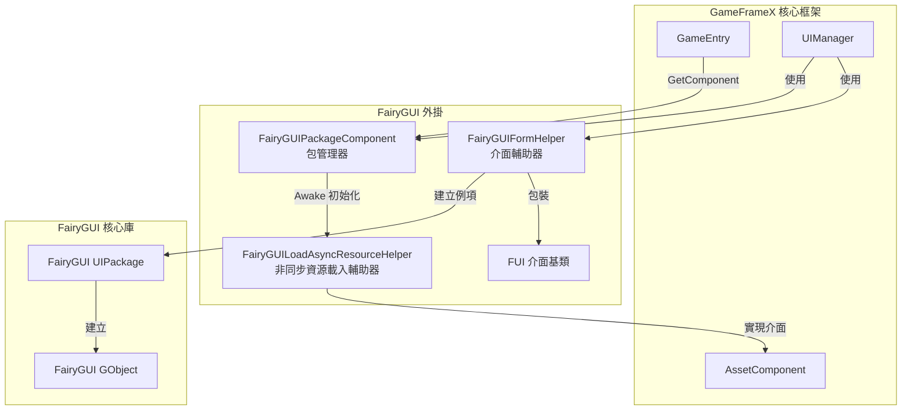
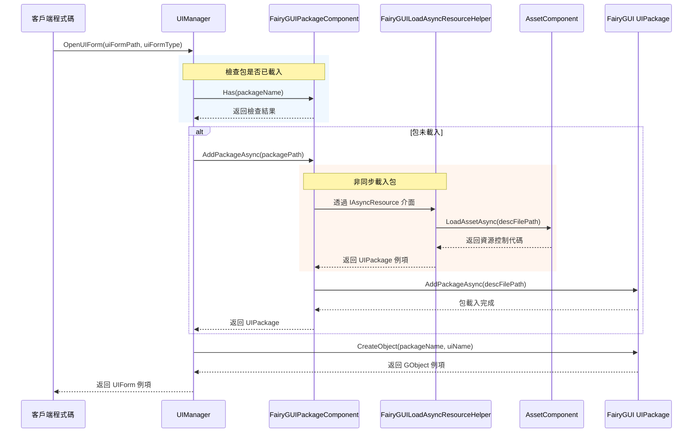

# 包管理器

包管理器是 FairyGUI 外掛的核心組件，負責管理所有 UI 包的載入、快取和解除安裝操作。它提供了同步和非同步兩種載入方式，並深度整合了 GameFrameX 的資源管理系統。

## 概述

`FairyGUIPackageComponent` 是繼承自 `GameFrameworkComponent` 的 Unity 組件，充當 FairyGUI 與 GameFrameX 資源系統之間的橋樑。它的主要職責包括：

- **包載入管理**：支援同步和非同步載入 UI 包
- **包快取機制**：已載入的包會被快取，避免重複載入
- **資源清理**：提供包的解除安裝功能，釋放記憶體資源
- **非同步資源載入**：透過實現 `IAsyncResource` 介面，支援 FairyGUI 的非同步資源載入需求

### 核心職責

包管理器的設計目標是簡化 UI 包的管理流程，讓開發者專注於介面邏輯而不是資源載入細節。當需要顯示一個 UI 介面時，包管理器會自動檢查目標包是否已載入：

- 如果包已載入 → 直接使用快取的包建立介面例項
- 如果包未載入 → 自動載入包後再建立介面例項

這種設計大大簡化了 UI 開發流程，提升了開發效率。

## 架構設計

包管理器在系統中的位置和互動關係如下：



### 核心類說明

| 類名 | 職責 | 訪問級別 |
|------|------|----------|
| `FairyGUIPackageComponent` | UI 包管理核心組件 | `public` |
| `FairyGUILoadAsyncResourceHelper` | 實現 IAsyncResource 介面，處理非同步資源載入 | `internal` |
| `UIPackageData` | 儲存已載入包的資訊 | `public` (巢狀類) |

## 核心功能

### 包載入機制

包管理器採用雙重載入策略，同時支援同步和非同步載入方式：

#### 非同步載入 (推薦)

```csharp
/// <summary>
/// 非同步新增 UI 包。
/// </summary>
/// <param name="descFilePath">描述檔案路徑</param>
/// <param name="isLoadAsset">是否載入資源</param>
/// <returns>表示 UI 包的非同步任務</returns>
public Task<UIPackage> AddPackageAsync(string descFilePath, bool isLoadAsset = true)
```

非同步載入是推薦使用的方式，特別適用於需要動態載入大量 UI 資源的場景。載入過程中不會阻塞主執行緒，能夠保持流暢的使用者體驗。

> Source: [FairyGUIPackageComponent.cs#L148-L179](https://github.com/GameFrameX/com.gameframex.unity.ui.fairygui/blob/main/Runtime/FairyGUIPackageComponent.cs#L148-L179)

#### 同步載入

```csharp
/// <summary>
/// 同步新增 UI 包。
/// </summary>
/// <param name="descFilePath">描述檔案路徑</param>
/// <param name="isLoadAsset">是否載入資源</param>
public void AddPackageSync(string descFilePath, bool isLoadAsset = true)
```

同步載入適用於編輯器環境或遊戲啟動時的預載入場景。

> Source: [FairyGUIPackageComponent.cs#L190-L203](https://github.com/GameFrameX/com.gameframex.unity.ui.fairygui/blob/main/Runtime/FairyGUIPackageComponent.cs#L190-L203)

### 包查詢操作

```csharp
/// <summary>
/// 檢查是否存在指定名稱的 UI 包。
/// </summary>
public bool Has(string uiPackageName)

/// <summary>
/// 獲取指定名稱的 UI 包。
/// </summary>
public UIPackage Get(string uiPackageName)
```

> Source: [FairyGUIPackageComponent.cs#L265-L290](https://github.com/GameFrameX/com.gameframex.unity.ui.fairygui/blob/main/Runtime/FairyGUIPackageComponent.cs#L265-L290)

### 包解除安裝機制

包管理器提供了精細的解除安裝控制：

```csharp
/// <summary>
/// 移除指定名稱的 UI 包。
/// </summary>
public void RemovePackage(string packageName)

/// <summary>
/// 移除所有 UI 包。
/// </summary>
public void RemoveAllPackages()
```

解除安裝操作會執行以下步驟：
1. 呼叫 `Package.UnloadAssets()` 解除安裝資源
2. 從 FairyGUI 移除包
3. 透過資源輔助器釋放底層資源
4. 從快取字典中移除記錄

> Source: [FairyGUIPackageComponent.cs#L213-L254](https://github.com/GameFrameX/com.gameframex.unity.ui.fairygui/blob/main/Runtime/FairyGUIPackageComponent.cs#L213-L254)

## 載入流程

當介面管理器 (UIManager) 開啟一個 UI 介面時，包管理器的呼叫流程如下：



### 關鍵設計要點

1. **自動包載入**：介面管理器會自動檢查並載入所需的 UI 包，開發者無需手動管理
2. **併發載入控制**：透過 `m_UIPackageLoading` 字典防止同一包的重複載入請求
3. **資源型別區分**：根據資源型別（圖片、音訊、字型等）使用不同的載入策略

## 非同步資源載入輔助器

`FairyGUILoadAsyncResourceHelper` 是包管理器的內部組件，實現了 FairyGUI 的 `IAsyncResource` 介面。它的主要功能是：

- 封裝 GameFrameX 的 `AssetComponent` 供 FairyGUI 使用
- 管理 UI 包資源的非同步載入
- 處理不同型別資源的載入邏輯（圖片、圖集、字型、音訊等）

### 支援的資源型別

| 資源型別 | FairyGUI 型別 | 載入方式 |
|----------|---------------|----------|
| 圖片 | `PackageItemType.Image` | Texture |
| 圖集 | `PackageItemType.Atlas` | Texture |
| 音訊 | `PackageItemType.Sound` | AudioClip |
| 字型 | `PackageItemType.Font` | Font |
| Spine 動畫 | `PackageItemType.Spine` | TextAsset |
| 龍骨動畫 | `PackageItemType.DragoneBones` | DragonBonesData |

> Source: [FairyGUILoadAsyncResourceHelper.cs#L124-L252](https://github.com/GameFrameX/com.gameframex.unity.ui.fairygui/blob/main/Runtime/FairyGUILoadAsyncResourceHelper.cs#L124-L252)

## 使用示例

### 獲取包管理器例項

```csharp
var packageComponent = GameEntry.GetComponent<FairyGUIPackageComponent>();
```

### 檢查包是否存在

```csharp
bool exists = packageComponent.Has("MyUIPackage");
```

### 手動載入包

```csharp
// 非同步載入
var package = await packageComponent.AddPackageAsync("UIPackages/MyUIPackage");

// 同步載入
packageComponent.AddPackageSync("UIPackages/MyUIPackage");
```

### 獲取已載入的包

```csharp
var package = packageComponent.Get("MyUIPackage");
if (package != null)
{
    // 使用包建立物件
    var obj = package.CreateObject("MainPanel");
}
```

### 解除安裝包

```csharp
// 解除安裝指定包
packageComponent.RemovePackage("MyUIPackage");

// 解除安裝所有包
packageComponent.RemoveAllPackages();
```

## 內部實現細節

### 包資料儲存

每個載入的包都會建立 `UIPackageData` 例項進行儲存：

```csharp
[Serializable]
public sealed class UIPackageData
{
    public string DescFilePath { get; }      // 描述檔案路徑
    public bool IsLoadAsset { get; }          // 是否載入資源
    public UIPackage Package { get; }         // 包例項
    public string Name { get; }               // 包名稱
}
```

> Source: [FairyGUIPackageComponent.cs#L64-L136](https://github.com/GameFrameX/com.gameframex.unity.ui.fairygui/blob/main/Runtime/FairyGUIPackageComponent.cs#L64-L136)

### 組件初始化

包管理器在 `Awake` 階段進行初始化：

```csharp
protected override void Awake()
{
    IsAutoRegister = false;
    base.Awake();
    m_ResourceHelper = new FairyGUILoadAsyncResourceHelper();
    UIPackage.SetAsyncLoadResource(m_ResourceHelper);
}
```

這裡設定了 `IsAutoRegister = false`，表示不會自動註冊到 GameEntry，這是為了手動控制初始化順序。

> Source: [FairyGUIPackageComponent.cs#L300-L306](https://github.com/GameFrameX/com.gameframex.unity.ui.fairygui/blob/main/Runtime/FairyGUIPackageComponent.cs#L300-L306)

## API 參考

### `FairyGUIPackageComponent` 類

#### 方法

| 方法 | 返回型別 | 描述 |
|------|----------|------|
| `AddPackageAsync(string, bool)` | `Task<UIPackage>` | 非同步新增 UI 包 |
| `AddPackageSync(string, bool)` | `void` | 同步新增 UI 包 |
| `RemovePackage(string)` | `void` | 移除指定名稱的 UI 包 |
| `RemoveAllPackages()` | `void` | 移除所有 UI 包 |
| `Has(string)` | `bool` | 檢查是否存在指定名稱的 UI 包 |
| `Get(string)` | `UIPackage` | 獲取指定名稱的 UI 包 |

#### 屬性

| 屬性 | 型別 | 描述 |
|------|------|------|
| `m_UILoadedPackages` | `Dictionary<string, UIPackageData>` | 已載入包的快取字典 |
| `m_UIPackageLoading` | `Dictionary<string, TaskCompletionSource<UIPackage>>` | 正在載入的包字典 |

### `UIPackageData` 巢狀類

| 屬性 | 型別 | 描述 |
|------|------|------|
| `DescFilePath` | `string` | 獲取描述檔案路徑 |
| `IsLoadAsset` | `bool` | 獲取是否載入資源 |
| `Package` | `UIPackage` | 獲取 UI 包例項 |
| `Name` | `string` | 獲取 UI 包名稱 |

## 常見問題

### 包載入失敗

如果包載入失敗，請檢查：
1. 描述檔案路徑是否正確
2. 包資源是否存在於指定路徑
3. 資源系統是否正確初始化

### 記憶體洩漏

確保在不需要使用 UI 包時呼叫 `RemovePackage` 或 `RemoveAllPackages` 進行釋放，避免記憶體洩漏。

### 資源型別不支援

當前版本支援圖片、圖集、音訊、字型、Spine 和龍骨動畫。如需支援其他型別，請參考 `FairyGUILoadAsyncResourceHelper` 中的載入邏輯進行擴充套件。

## 相關連結

- [FUI 介面基類](./4-core-concepts.1-fui-base-class) - 瞭解如何建立 FairyGUI 介面
- [介面管理器](./4-core-concepts.2-ui-manager) - 瞭解介面開啟和關閉的流程
- [介面輔助器](./4-core-concepts.4-form-helper) - 瞭解介面例項化和釋放機制
- [FairyGUIPackageComponent API 參考](./5-api-reference.2-package-component) - 完整的 API 文件
